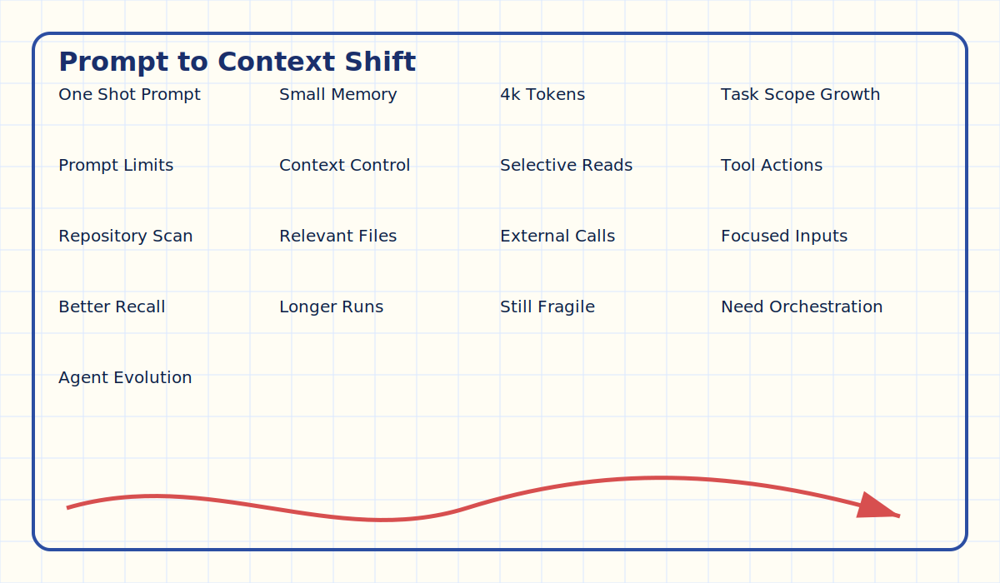
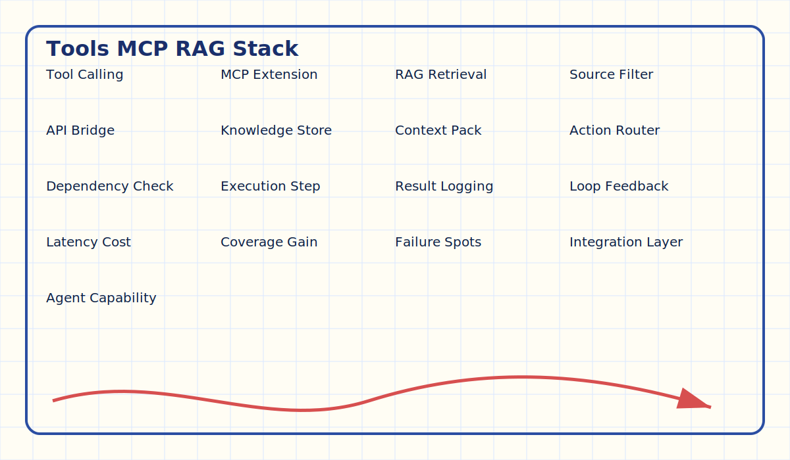
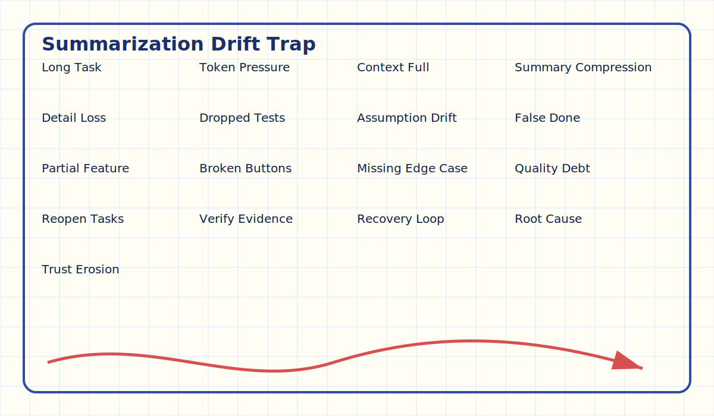
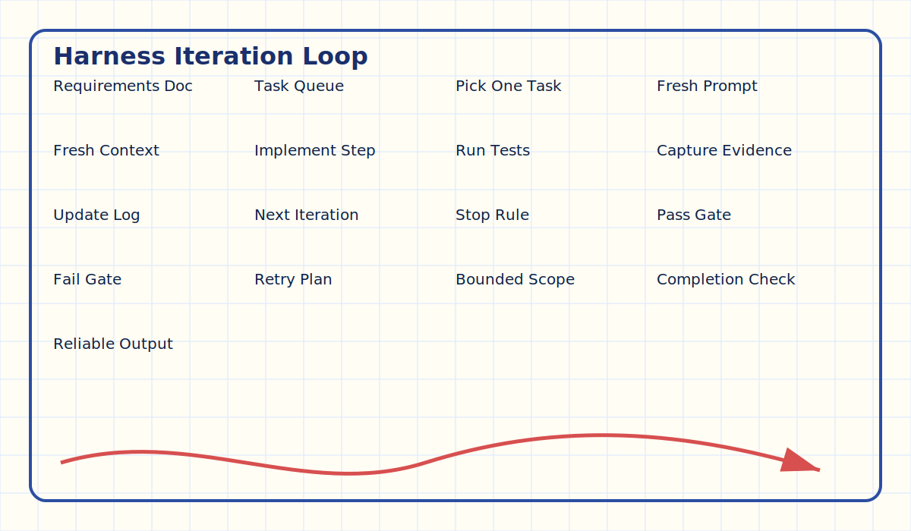
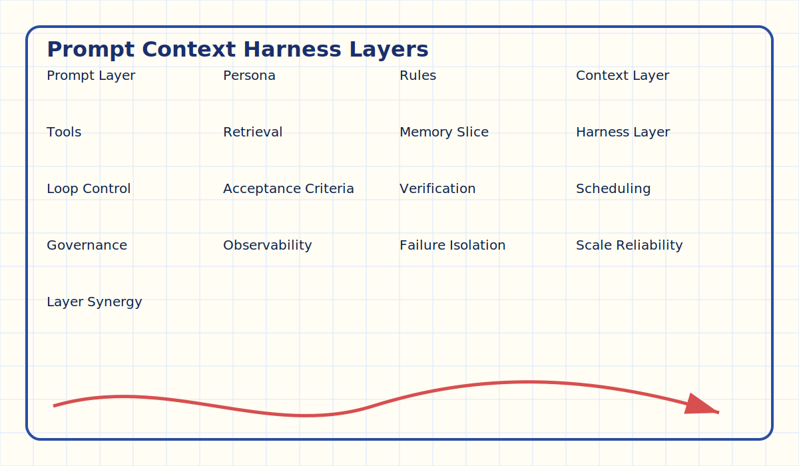
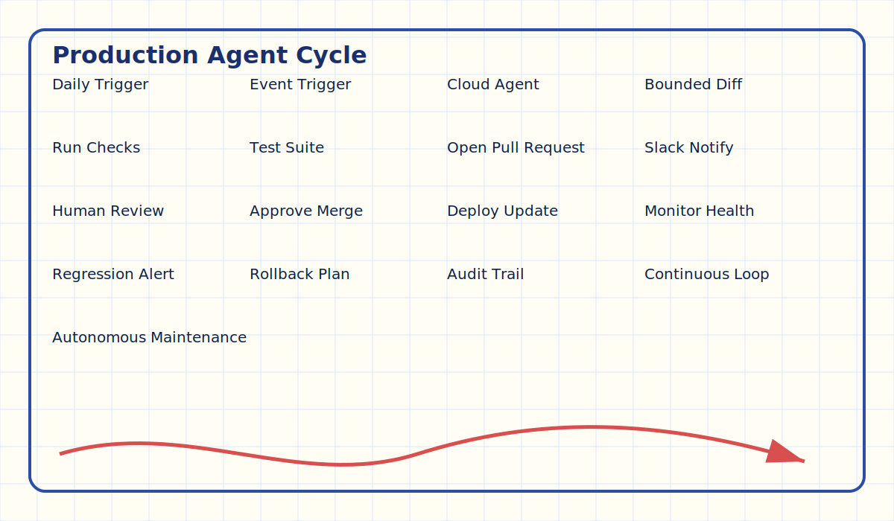

-- Page 1: Why Agent Harnessing Appeared

## Header
⏱️ ~3 min | 📚 Video 1 | ⚡ Easy

## What You'll Learn
Why prompt-only agents hit a wall and why orchestration became necessary.

## Deep Dive Explanation
- Early LLM workflows depended on one-shot prompting, which worked for short outputs but failed for multi-hour tasks.
- Small context windows (around 4k tokens) forced teams to choose between missing detail or losing task history.
- Builders moved from **Prompt Engineering** toward **Context Engineering** to recycle limited context smarter.
- This shift created the foundation for modern coding agents that can explore repos and act with tools.

## Visual Summary
ASCII:
[Prompt only] -> [Single response] -> [Shallow completion]
[Prompt + context controls] -> [Better recall] -> [Longer task scope]

## Real-World Use First
Scenario: You ask an agent to implement a full website in one go.
Why it matters: One-shot output looks impressive but usually leaves hidden gaps.

## Process Flow / Steps
1. Start with a broad user request.
2. Observe where one-shot response misses details.
3. Add context controls (tools, retrieval, scoped reads).
4. Measure improvement before adding orchestration loops.

## Key Concepts
- **Prompt Engineering**: shaping the agent role, tone, and behavioral constraints.
- **Context Window**: the temporary memory space available in one model call.
- **Context Engineering**: controlling what information enters the model at each step.

## Try This Right Now
- Ask an assistant to build a feature in one prompt.
- Then ask it to first inspect relevant files before coding.

## Flashcards
| Q | A |
|---|---|
| Why did prompt-only workflows break on larger tasks? | They lacked enough memory and process control for long execution. |
| What changed after prompt engineering? | Teams introduced context engineering to feed only relevant information. |

## One-Page Revision
- One-shot prompting was fast but brittle.
- Limited context windows exposed reliability issues.
- Context engineering improved task focus.
- Harnessing emerged when orchestration became the new bottleneck.

-- Page 2: Context Engineering Wins and Limits

## Header
⏱️ ~4 min | 📚 Video 1 | ⚡ Medium

## What You'll Learn
How tool calling, MCP-style integrations, and RAG improved outcomes—but still left long-task failures.

## Deep Dive Explanation
- **Tool Calling** let agents read only relevant files and trigger external actions.
- **MCP-style integration** added model-provider capabilities and controlled extensions.
- **RAG** connected external knowledge stores for on-demand retrieval.
- Together these methods improved accuracy, but completion quality still degraded on very long task durations.

## Visual Summary
| Technique | Main Benefit | Typical Failure Mode |
|---|---|---|
| Tool Calling | Selective file/task execution | Misses unstated dependencies |
| MCP-style Extensions | Adds platform-specific power | Can increase complexity overhead |
| RAG | Pulls knowledge when needed | Retrieval quality determines reliability |

## Real-World Use First
Scenario: A coding agent updates a large product surface with many dependent modules.
Why it matters: Even with strong retrieval, long chains of work can drift and leave untested behavior.

## Process Flow / Steps
1. Detect required sources (repo, docs, APIs).
2. Retrieve only relevant context slices.
3. Execute a focused action.
4. Re-evaluate dependency impact.
5. Repeat with updated context.

## Key Concepts
- **Tool Calling**: model-triggered invocation of external tools.
- **RAG**: retrieval-augmented generation using external data.
- **Dependency Drift**: loss of alignment across related components over time.

## Try This Right Now
- List three data sources your agent needs for a feature.
- Map one tool call per source.

## Flashcards
| Q | A |
|---|---|
| What problem did tool calling solve first? | It reduced irrelevant context by reading only necessary files. |
| Why can long runs still fail with strong context engineering? | Execution drifts over time and verification is often incomplete. |

## One-Page Revision
- Tool calling, MCP, and RAG enabled stronger context control.
- They improved precision but not full lifecycle reliability.
- Long tasks exposed missing test and completion checks.

-- Page 3: The Summarization Trap in Long Tasks

## Header
⏱️ ~3 min | 📚 Video 1 | ⚡ Hard

## What You'll Learn
Why context summarization can silently break long-running autonomous work.

## Deep Dive Explanation
- As token usage grows, agents summarize prior work to stay inside context limits.
- Lossy summaries can drop hidden assumptions, edge cases, or unfinished subtasks.
- The agent may continue with false confidence and mark incomplete work as done.
- This creates a “looks complete, behaves broken” outcome.

## Visual Summary
ASCII:
Long Task (12h)
-> Context fills
-> Summary compression
-> Missing details
-> Wrong assumption: "already finished"
-> Partial product quality

## Real-World Use First
Scenario: A generated site ships with visible pages, but key buttons and flows fail.
Why it matters: Surface-level completion hides execution debt and user-facing defects.

## Process Flow / Steps
1. Run long autonomous task.
2. Trigger context compaction.
3. Compare summary against original subtasks.
4. Identify dropped acceptance criteria.
5. Re-open unfinished work.

## Key Concepts
- **Context Summarization**: compressing prior conversation/task state to free token budget.
- **Execution Debt**: hidden unfinished work accumulated during autonomous runs.
- **False Completion Signal**: mistaken belief that a step was verified.

## Try This Right Now
- Take one long task plan and write a compressed summary of it.
- Check what verification details disappeared.

## Flashcards
| Q | A |
|---|---|
| What is the main risk of aggressive summarization? | It drops critical details and causes incorrect completion assumptions. |
| Why is this hard to spot early? | Output may appear complete while deeper behavior remains untested. |

## One-Page Revision
- Summaries are useful but lossy.
- Lossy memory leads to false “done” states.
- Long tasks need explicit verification loops.

-- Page 4: Harness Engineering = Controlled Iteration Loop

## Header
⏱️ ~4 min | 📚 Video 1 | ⚡ Medium

## What You'll Learn
The core harness pattern: plan once, execute iteratively, and reset context each cycle.

## Deep Dive Explanation
- Harnessing moves control up one layer above raw prompt/context usage.
- Work starts from a requirements artifact, often structured as a task list or JSON plan.
- Each loop picks one bounded task, executes it, tests it, and records evidence.
- Every iteration uses a fresh prompt/context state, reducing long-horizon drift.

## Visual Summary
ASCII:
[Requirements Doc]
      |
      v
[Task Queue] -> [Pick one task] -> [Implement] -> [Test] -> [Document]
      ^                                                    |
      +-------------------- repeat until done ------------+

## Real-World Use First
Scenario: You automate feature updates using cloud agents that continue running after you close your laptop.
Why it matters: Loop control turns background execution from risky to dependable.

## Process Flow / Steps
1. Generate production requirements document.
2. Decompose into atomic tasks.
3. Run one task per iteration.
4. Validate with tests and explicit expected result.
5. Store progress and continue loop.

## Key Concepts
- **Agent Harness**: orchestration environment defining how an agent starts, executes, verifies, and stops.
- **Iteration Reset**: fresh context per cycle instead of unbounded accumulation.
- **Task Decomposition**: converting big goals into independently verifiable units.

## Try This Right Now
- Convert one large feature request into five atomic tasks.
- Define one pass/fail check per task.

## Flashcards
| Q | A |
|---|---|
| What is the signature difference in harnessing? | Strict iterative orchestration with test-and-document loops. |
| Why does fresh context per iteration help? | It limits drift and keeps each step bounded and verifiable. |

## One-Page Revision
- Harnessing is orchestration-first.
- Plan -> execute -> test -> document -> repeat.
- Fresh context each loop improves reliability.

-- Page 5: Layer Model — Prompt, Context, Harness

## Header
⏱️ ~3 min | 📚 Video 1 | ⚡ Easy

## What You'll Learn
How harness engineering uses prompt and context engineering instead of replacing them.

## Deep Dive Explanation
- Prompt engineering still defines persona, constraints, and interaction style.
- Context engineering still selects relevant files, tools, and retrieved evidence.
- Harness engineering coordinates sequence, guardrails, and completion criteria.
- The three layers together produce scalable autonomous behavior.

## Visual Summary
| Layer | Responsibility | Failure if Missing |
|---|---|---|
| Prompt | Agent identity and rules | Ambiguous behavior |
| Context | Right information at right time | Hallucination and mismatch |
| Harness | Process control over iterations | Incomplete long-task delivery |

## Real-World Use First
Scenario: Teams compare agents with similar models but different orchestration quality.
Why it matters: Better harness design often beats bigger raw context windows.

## Process Flow / Steps
1. Set prompt contract and boundaries.
2. Define context retrieval and tools.
3. Wrap both inside iterative harness rules.
4. Track acceptance criteria until full closure.

## Key Concepts
- **Orchestration Layer**: control plane that governs execution lifecycle.
- **Completion Criteria**: explicit conditions that define “done.”
- **Guardrails**: constraints preventing unsafe or low-quality actions.

## Try This Right Now
- Write one sentence for each layer in your own project.
- Check whether any layer currently has no owner.

## Flashcards
| Q | A |
|---|---|
| Does harness engineering deprecate prompt engineering? | No, it depends on prompt and context as supporting layers. |
| Which layer decides task loop and closure logic? | The harness/orchestration layer. |

## One-Page Revision
- Prompt = identity.
- Context = relevant evidence.
- Harness = iterative control.
- Reliable autonomy needs all three.

-- Page 6: Practical Blueprint for Reliable Agent Delivery

## Header
⏱️ ~4 min | 📚 Video 1 | ⚡ Medium

## What You'll Learn
A direct implementation template for moving from demo agents to production-grade loops.

## Deep Dive Explanation
- Start with a living requirements file tied to testable outcomes.
- Prefer small iteration scope to protect quality and observability.
- Use cloud/background execution with notifications (PR, Slack) for asynchronous flow.
- Add recurring automation loops (e.g., daily updates) only after stable validation.

## Visual Summary
ASCII:
Plan -> Queue -> Execute -> Verify -> PR/Notify -> Schedule recurring run
       ^                                               |
       +------------------- learn and tune ------------+

## Real-World Use First
Scenario: A course website auto-checks for new model releases and opens PRs with updates.
Why it matters: You gain continuity without manual polling and reduce stale content risk.

## Process Flow / Steps
1. Define recurring trigger (daily or event-driven).
2. Run harnessed agent on bounded diff.
3. Execute tests and validation gates.
4. Open PR with summary.
5. Notify humans for approval and merge.

## Key Concepts
- **Cloud Agent**: remotely running agent that continues work independent of local machine.
- **Human-in-the-Loop Approval**: selective review step before production change.
- **Autonomous Maintenance Loop**: scheduled or event-driven upkeep workflow.

## Try This Right Now
- Pick one repetitive update task in your project.
- Define trigger, task scope, test gate, and notification channel.

## Flashcards
| Q | A |
|---|---|
| What turns a cool demo into a reliable workflow? | Bounded loops, test gates, and explicit completion controls. |
| Why add human approval before merge? | It preserves governance while keeping automation speed. |

## One-Page Revision
- Production reliability needs loop discipline.
- Background agents work best with validation gates.
- Notifications + approvals close the execution loop.
