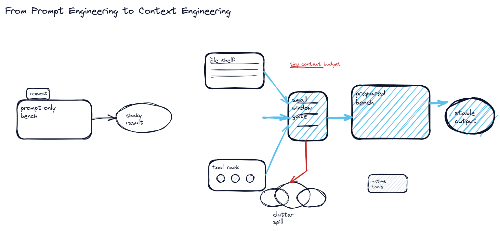
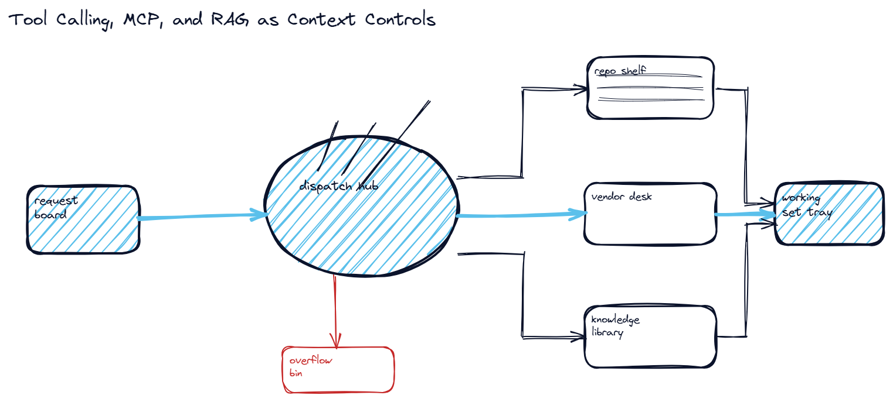
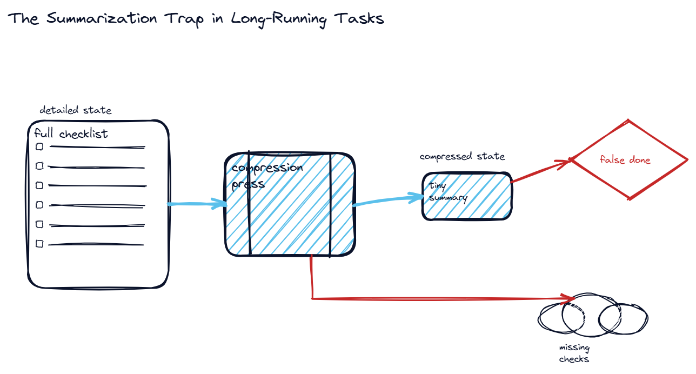
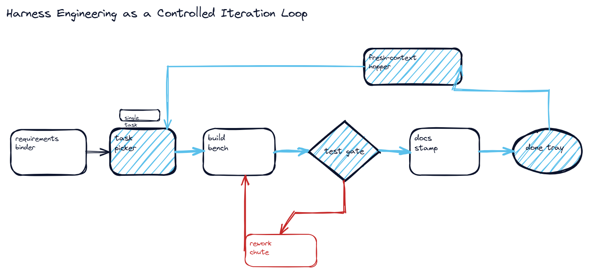
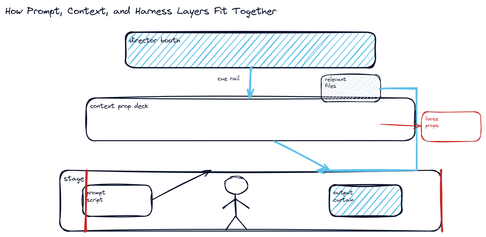
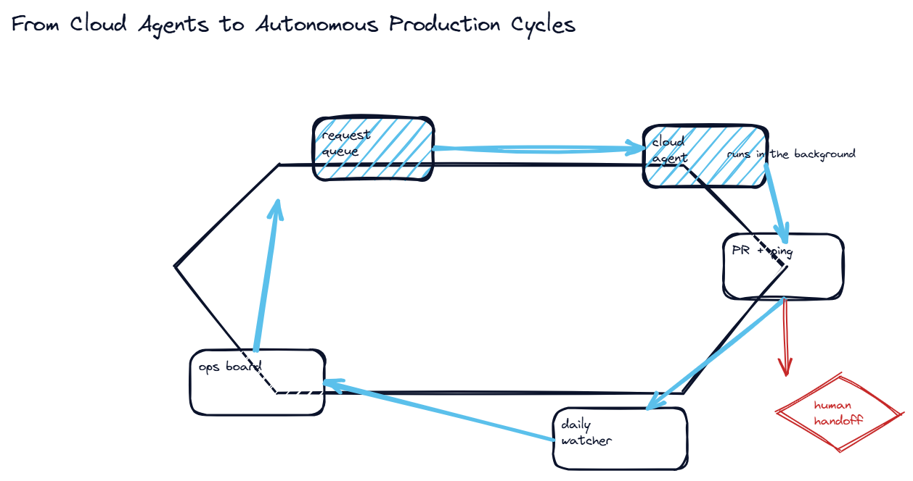

-- Page 1: Course Index

## Course Map
| Page | Lesson | Core Focus |
|---|---|---|
| 2 | From Prompt Engineering to Context Engineering | Prompt engineering |
| 3 | Tool Calling, MCP, and RAG as Context Controls | Tool calling |
| 4 | The Summarization Trap in Long-Running Tasks | Context summarization |
| 5 | Harness Engineering as a Controlled Iteration Loop | Agent harness |
| 6 | How Prompt, Context, and Harness Layers Fit Together | Prompt layer |
| 7 | From Cloud Agents to Autonomous Production Cycles | Cloud agent |

## How to Use This Notebook
- Start with the lesson that matches your current agent-design pain point.
- Use the sketch first, then the deep dive, then the try-this block.
- Use `AgentHarness101_INDEX.md` for the full glossary and cross-reference.

## Fast Lanes
- Foundations: Prompt to Context, Tools/MCP/RAG
- Reliability: Summarization Trap, Controlled Iteration Loop
- Systems View: Layer Model, Production Cycle

-- Page 2: From Prompt Engineering to Context Engineering

## Real-World Anchor
Scenario: A repo-scale coding request fails when the model tries to solve everything from one prompt and one memory window.

## What You'll Learn
Why agents needed to move beyond one-shot prompting before larger tasks became reliable.

## Deep Dive Explanation
- One-shot prompting can give a polished answer for a small question, but it struggles when the task requires many dependent implementation decisions.
- Tiny context windows forced builders to choose between preserving detail and staying within the token budget.
- Context engineering emerged to load only the relevant files, docs, and actions at the moment they were needed.
- The result was not a replacement for prompting but a more reliable wrapper around it.

## Mental Model / Analogy
Think of this like: a tiny workshop that first relies on spoken instructions only, then learns to place the right tools on the bench before each step.

## Visual Summary
```
One-shot prompt -> shallow answer
Scoped context -> stronger execution
Small memory forced selective loading
Prompt rules still remain part of the stack
```

## Visual Sketch


## Real-World Use First
Scenario: A repo-scale coding request fails when the model tries to solve everything from one prompt and one memory window.
Why it matters: Why agents needed to move beyond one-shot prompting before larger tasks became reliable.

## Process Flow / Steps
1. Start with the broad request.
2. Observe where the one-shot response loses detail.
3. Introduce selective file and knowledge loading.
4. Keep the prompt, but shrink irrelevant context.

## Key Concepts
- **Prompt engineering**: Instruction design for the model role and behavior.
- **Context engineering**: Selection of the right working set for the current step.
- **Context window**: The bounded memory budget available to one model call.

## Try This Right Now
- Ask for a one-shot feature plan.
- Then ask for the same plan after file inspection.
- Compare the missing assumptions in the first answer.

-- Page 3: Tool Calling, MCP, and RAG as Context Controls

## Real-World Anchor
Scenario: A coding agent needs repo reads, provider-specific actions, and external documentation without loading every source at once.

## What You'll Learn
How external capability routing made context engineering practical for real coding agents.

## Deep Dive Explanation
- Tool calling lets the model inspect only the files or actions relevant to the current task.
- MCP-style integrations expose structured provider or platform capabilities instead of forcing everything through plain text.
- RAG supplies external knowledge on demand so the prompt does not need to carry every fact continuously.
- These techniques improved quality, but they still did not guarantee reliable completion on very long tasks.

## Mental Model / Analogy
Think of this like: a control room dispatching runners to the archive, vendor desk, or knowledge library only when one of those stations is actually needed.

## Visual Summary
```
Tool calling -> relevant files/actions
MCP -> platform extensions
RAG -> on-demand knowledge
Selective loading beats prompt stuffing
```

## Visual Sketch


## Real-World Use First
Scenario: A coding agent needs repo reads, provider-specific actions, and external documentation without loading every source at once.
Why it matters: How external capability routing made context engineering practical for real coding agents.

## Process Flow / Steps
1. Identify the source needed for the current step.
2. Route to the right external capability.
3. Return only the relevant subset.
4. Continue with a cleaner working context.

## Key Concepts
- **Tool calling**: Model-triggered use of external actions or repo inspection commands.
- **MCP-style integration**: Structured external capability surface added around the model.
- **RAG**: Retrieval-augmented generation from external knowledge stores.

## Try This Right Now
- List three knowledge sources for one feature.
- Assign one tool or retrieval path to each source.
- Explain why each source should stay out of the base prompt.

-- Page 4: The Summarization Trap in Long-Running Tasks

## Real-World Anchor
Scenario: An agent spends hours implementing a feature, summarizes midway, and later assumes a half-tested workflow was already done.

## What You'll Learn
Why long autonomous runs can drift into false completion when summaries replace detailed state.

## Deep Dive Explanation
- When long tasks fill the context window, many systems summarize previous work so execution can continue.
- If that summary drops acceptance criteria, edge cases, or partial implementation details, the agent keeps working with a distorted state picture.
- That distortion creates false completion signals where the agent believes a step was verified when it was only partially attempted.
- The visible output may look complete, but hidden defects remain because compression replaced verification.

## Mental Model / Analogy
Think of this like: a project manager who rewrites a giant checklist into shorter notes until the unchecked items quietly disappear.

## Visual Summary
```
Long task -> context fills
Summary compression -> lost detail
Lost detail -> false done state
False done -> broken product quality
```

## Visual Sketch


## Real-World Use First
Scenario: An agent spends hours implementing a feature, summarizes midway, and later assumes a half-tested workflow was already done.
Why it matters: Why long autonomous runs can drift into false completion when summaries replace detailed state.

## Process Flow / Steps
1. Run a long task until context fills.
2. Compress previous state into a summary.
3. Compare the summary with the original checklist.
4. Re-open work that was assumed complete.

## Key Concepts
- **Context summarization**: Compression of prior task state to fit within a limited window.
- **False completion signal**: Mistaken belief that a step was fully done or verified.
- **Execution drift**: Loss of alignment between current behavior and original task intent.

## Try This Right Now
- Take a detailed feature plan.
- Compress it into five bullets.
- Check which test and verification details vanished.

-- Page 5: Harness Engineering as a Controlled Iteration Loop

## Real-World Anchor
Scenario: Instead of asking for an entire product in one go, the system works through requirement cards one by one and validates each card before moving on.

## What You'll Learn
The core harness pattern: plan once, execute iteratively, reset context, and verify continuously.

## Deep Dive Explanation
- Harnessing shifts control one level above raw prompt and context management and focuses on the execution environment around the agent.
- Work begins with a requirements artifact that is decomposed into structured, bounded tasks.
- Each loop selects one task, executes it, tests it, documents the result, and then resets before the next iteration.
- Fresh context per loop reduces long-horizon drift because the agent no longer carries an ever-growing memory burden.

## Mental Model / Analogy
Think of this like: an assembly line that pulls one task card at a time, completes it, quality-checks it, stamps it, and only then moves to the next card.

## Visual Summary
```
Requirements doc -> task queue
Pick one task -> implement
Test + document -> close loop
Fresh context each iteration
```

## Visual Sketch


## Real-World Use First
Scenario: Instead of asking for an entire product in one go, the system works through requirement cards one by one and validates each card before moving on.
Why it matters: The core harness pattern: plan once, execute iteratively, reset context, and verify continuously.

## Process Flow / Steps
1. Generate the requirements artifact.
2. Break work into atomic tasks.
3. Run one task inside a bounded loop.
4. Test and document the result.
5. Reset context and continue.

## Key Concepts
- **Agent harness**: The orchestration environment controlling how an agent starts, works, verifies, and stops.
- **Iteration reset**: A fresh prompt and context at the start of each bounded loop.
- **Task decomposition**: Breaking a large goal into independently verifiable units.

## Try This Right Now
- Take one feature request.
- Split it into five independently testable tasks.
- Add one pass/fail check per task.

-- Page 6: How Prompt, Context, and Harness Layers Fit Together

## Real-World Anchor
Scenario: A team assumes harnessing makes prompts irrelevant, but the real system still depends on a prompt layer and a context layer underneath the loop.

## What You'll Learn
Harnessing does not replace prompting or context engineering; it composes them into a higher-level control stack.

## Deep Dive Explanation
- Prompt engineering still matters because the system prompt defines the role, tone, and behavioral guardrails of the coding agent.
- Context engineering still matters because the model needs the right files, tools, and retrieved knowledge at each decision point.
- Harness engineering sits above both and controls planning, selection, execution, verification, and completion over many iterations.
- That layered design is why strong harnesses are often lightweight: they orchestrate rather than overstuff the prompt.

## Mental Model / Analogy
Think of this like: a stage production where the script shapes the actor, the prop crew supplies the scene, and the director controls scene order.

## Visual Summary
```
Prompt -> identity/rules
Context -> working set/tools
Harness -> loop + lifecycle
Top layer composes the lower two
```

## Visual Sketch


## Real-World Use First
Scenario: A team assumes harnessing makes prompts irrelevant, but the real system still depends on a prompt layer and a context layer underneath the loop.
Why it matters: Harnessing does not replace prompting or context engineering; it composes them into a higher-level control stack.

## Process Flow / Steps
1. Define the agent persona and rules.
2. Load the minimal working context.
3. Wrap both inside a bounded execution loop.
4. Evaluate behavior at the orchestration layer.

## Key Concepts
- **Prompt layer**: Instructional layer that tells the model who it is and how it should behave.
- **Context layer**: Operational layer that provides the current working information and tools.
- **Harness layer**: Lifecycle layer that sequences planning, execution, testing, and stopping.

## Try This Right Now
- Describe one behavior that belongs to the prompt layer.
- Describe one behavior that belongs to the context layer.
- Describe one control that belongs only to the harness layer.

-- Page 7: From Cloud Agents to Autonomous Production Cycles

## Real-World Anchor
Scenario: A website needs daily model updates, so the cloud agent should detect changes, run the work, and open a pull request without a developer babysitting the process.

## What You'll Learn
How harnessing turns agent demos into production-oriented loops with triggers, cloud runs, and recurring maintenance.

## Deep Dive Explanation
- The production loop can start from local editing, a cloud run, a Slack request, or a scheduled trigger without changing the core harness design.
- Once the loop is reliable, each cycle emits an artifact such as a pull request, status message, or refreshed knowledge base instead of just a chat response.
- This shifts the system from assistant-style interaction toward operational automation with explicit output handoff points.
- That production orientation is what separates a clever demo from a dependable autonomous workflow.

## Mental Model / Analogy
Think of this like: a night-shift operations center that keeps dispatching work, checking changes, and issuing tickets even after the day team logs off.

## Visual Summary
```
Request trigger -> cloud run
Looped execution -> PR output
Slack/status signal -> human review
Scheduled rerun -> autonomous upkeep
```

## Visual Sketch


## Real-World Use First
Scenario: A website needs daily model updates, so the cloud agent should detect changes, run the work, and open a pull request without a developer babysitting the process.
Why it matters: How harnessing turns agent demos into production-oriented loops with triggers, cloud runs, and recurring maintenance.

## Process Flow / Steps
1. Accept a request from a user, integration, or schedule.
2. Run the bounded harness loop in the cloud.
3. Emit a concrete artifact such as a PR or status update.
4. Repeat on a recurring cadence when the task is periodic.

## Key Concepts
- **Cloud agent**: Agent run that continues outside the local developer machine.
- **Artifact output**: Deliverable result such as a pull request or status message.
- **Recurring automation**: Scheduled reruns that keep a system updated without manual prompting.

## Try This Right Now
- Name one task in your workflow that should run on a schedule.
- Define the artifact that proves completion.
- State one human approval gate before deployment.
