-- Page 1: Notebook Index

## Course Map
| Page | Chapter | Core Focus |
|---|---|---|
| 2 | Foundation Models Changed the Build Sequence | Foundation models |
| 3 | Canvas Planning Shows the Demo-to-Production Gap | POC canvas |
| 4 | What the Agent Harness Actually Is | Agent harness |
| 5 | Prompt, Context, and Harness Engineering | Prompt engineering |
| 6 | The Orchestration Loop | The Orchestration Loop |
| 7 | Tools | Tools |
| 8 | Memory | Memory |
| 9 | Context Management | Context Management |
| 10 | Prompt Construction | Prompt Construction |
| 11 | Output Parsing | Output Parsing |
| 12 | State Management | State Management |
| 13 | Error Handling | Error Handling |
| 14 | Guardrails and Safety | Guardrails and Safety |
| 15 | Verification Loops | Verification Loops |
| 16 | Subagent Orchestration | Subagent Orchestration |
| 17 | Step-by-Step Walkthrough and the Ralph Loop | Termination condition |
| 18 | How Frameworks Implement the Pattern | Code-first runner |
| 19 | Scaffolding, Co-Evolution, and the Future-Proofing Test | Scaffolding metaphor |
| 20 | Seven Architectural Decisions and the Final Takeaway | Harness thickness |

## How to Use This Notebook
- Start with the chapter that matches the harness problem you are trying to understand.
- Use the sketch first, then the deep dive, then the try-this block.
- Use `AnatomyOfAgentHarness_INDEX.md` for the full glossary and cross-reference.

## Fast Lanes
- Foundations and definitions: chapters 2–5
- Production harness components: chapters 6–16
- Synthesis and trade-offs: final chapters

-- Page 2: Foundation Models Changed the Build Sequence

## Real-World Anchor
Scenario: A team can test an AI product in days with GPT or Claude, so the hard question becomes what the agent should do and remember, not how to train the first model.

## What You'll Learn
Foundation Models Changed the Build Sequence explains foundation-model APIs removing model-training bottlenecks so agent design moves earlier in the product lifecycle.

## Deep Dive Explanation
- This chapter is centered on foundation-model APIs removing model-training bottlenecks so agent design moves earlier in the product lifecycle.
- It uses the analogy of a factory that no longer needs to build its own engine before testing a new vehicle design to make the mechanism visible instead of leaving it as an abstract label.
- This matters because weak handling here degrades production reliability, observability, or safety.

## Mental Model / Analogy
Think of this like: a factory that no longer needs to build its own engine before testing a new vehicle design

## Visual Summary
```
Hot path: define the layer role -> show the runtime interaction -> surface the pressure point -> show the trade-off
Primary entities: Foundation models, Agent design, Product-first validation
Main constraint: Keep the runtime high-signal, bounded, and inspectable under longer task durations.
Trade-off: More structure and control improve reliability, but add orchestration overhead and implementation complexity.
```

## Visual Sketch
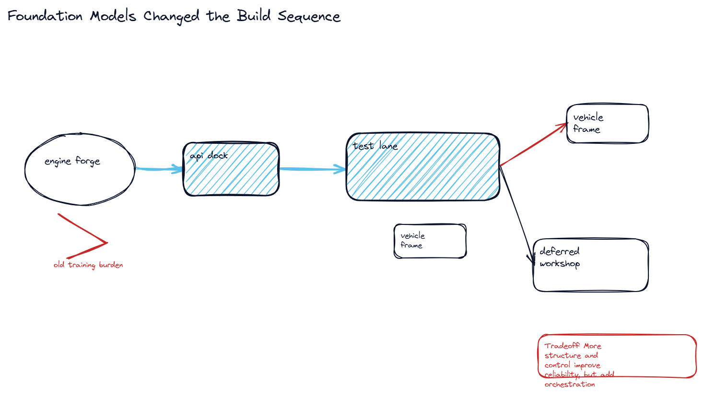

## Real-World Use First
Scenario: A team can test an AI product in days with GPT or Claude, so the hard question becomes what the agent should do and remember, not how to train the first model.
Why it matters: This matters because weak handling here degrades production reliability, observability, or safety.

## Process Flow / Steps
1. define the layer role
2. show the runtime interaction
3. surface the pressure point
4. show the trade-off

## Key Concepts
- **Foundation models**: key anchor concept for this chapter in the anatomy of a production harness.
- **Agent design**: key anchor concept for this chapter in the anatomy of a production harness.
- **Product-first validation**: key anchor concept for this chapter in the anatomy of a production harness.

## Try This Right Now
- Explain Foundation models without mentioning the model weights.
- Name one failure mode that appears if Foundation models is weak.
- State one runtime check or artifact that would strengthen this layer.

-- Page 3: Canvas Planning Shows the Demo-to-Production Gap

## Real-World Anchor
Scenario: A ReAct loop and a few tools can look great in a demo, but break when the task stretches past ten steps or touches security and recovery concerns.

## What You'll Learn
Canvas Planning Shows the Demo-to-Production Gap explains separate planning canvases exposing the difference between a proof-of-concept agent and a production-ready one.

## Deep Dive Explanation
- This chapter is centered on separate planning canvases exposing the difference between a proof-of-concept agent and a production-ready one.
- It uses the analogy of an architect using one blueprint to prove the concept and another to carry real-world load, faults, and regulations to make the mechanism visible instead of leaving it as an abstract label.
- This matters because weak handling here degrades production reliability, observability, or safety.

## Mental Model / Analogy
Think of this like: an architect using one blueprint to prove the concept and another to carry real-world load, faults, and regulations

## Visual Summary
```
Hot path: define the layer role -> show the runtime interaction -> surface the pressure point -> show the trade-off
Primary entities: POC canvas, Production canvas, Demo reliability gap
Main constraint: Keep the runtime high-signal, bounded, and inspectable under longer task durations.
Trade-off: More structure and control improve reliability, but add orchestration overhead and implementation complexity.
```

## Visual Sketch
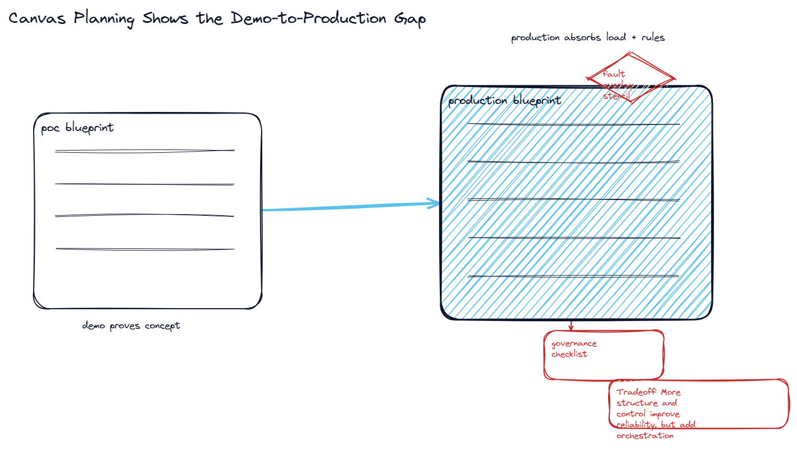

## Real-World Use First
Scenario: A ReAct loop and a few tools can look great in a demo, but break when the task stretches past ten steps or touches security and recovery concerns.
Why it matters: This matters because weak handling here degrades production reliability, observability, or safety.

## Process Flow / Steps
1. define the layer role
2. show the runtime interaction
3. surface the pressure point
4. show the trade-off

## Key Concepts
- **POC canvas**: key anchor concept for this chapter in the anatomy of a production harness.
- **Production canvas**: key anchor concept for this chapter in the anatomy of a production harness.
- **Demo reliability gap**: key anchor concept for this chapter in the anatomy of a production harness.

## Try This Right Now
- Explain POC canvas without mentioning the model weights.
- Name one failure mode that appears if POC canvas is weak.
- State one runtime check or artifact that would strengthen this layer.

-- Page 4: What the Agent Harness Actually Is

## Real-World Anchor
Scenario: Two products use the same model weights but behave very differently because one has a stronger loop, memory, safety, and verification system around it.

## What You'll Learn
What the Agent Harness Actually Is explains the complete software infrastructure around the model producing agent behavior.

## Deep Dive Explanation
- This chapter is centered on the complete software infrastructure around the model producing agent behavior.
- It uses the analogy of a machine room around a processor with memory racks, I/O ports, switches, and safety relays to make the mechanism visible instead of leaving it as an abstract label.
- This matters because weak handling here degrades production reliability, observability, or safety.

## Mental Model / Analogy
Think of this like: a machine room around a processor with memory racks, I/O ports, switches, and safety relays

## Visual Summary
```
Hot path: define the layer role -> show the runtime interaction -> surface the pressure point -> show the trade-off
Primary entities: Agent harness, Emergent behavior, Infrastructure delta
Main constraint: Keep the runtime high-signal, bounded, and inspectable under longer task durations.
Trade-off: More structure and control improve reliability, but add orchestration overhead and implementation complexity.
```

## Visual Sketch
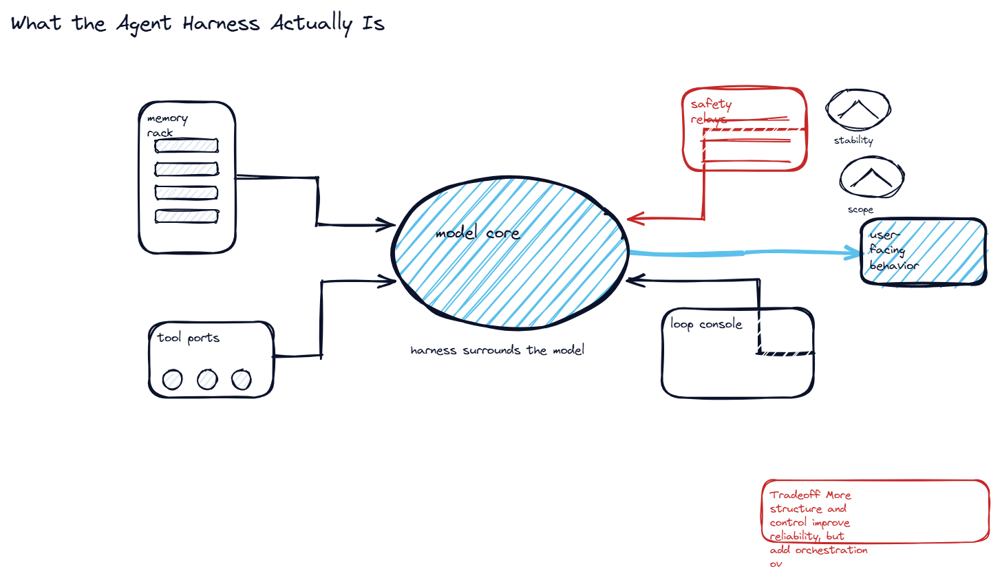

## Real-World Use First
Scenario: Two products use the same model weights but behave very differently because one has a stronger loop, memory, safety, and verification system around it.
Why it matters: This matters because weak handling here degrades production reliability, observability, or safety.

## Process Flow / Steps
1. define the layer role
2. show the runtime interaction
3. surface the pressure point
4. show the trade-off

## Key Concepts
- **Agent harness**: key anchor concept for this chapter in the anatomy of a production harness.
- **Emergent behavior**: key anchor concept for this chapter in the anatomy of a production harness.
- **Infrastructure delta**: key anchor concept for this chapter in the anatomy of a production harness.

## Try This Right Now
- Explain Agent harness without mentioning the model weights.
- Name one failure mode that appears if Agent harness is weak.
- State one runtime check or artifact that would strengthen this layer.

-- Page 5: Prompt, Context, and Harness Engineering

## Real-World Anchor
Scenario: Teams often argue over prompts versus context, but production autonomy fails because the real problem is in the larger orchestration layer above both.

## What You'll Learn
Prompt, Context, and Harness Engineering explains three concentric engineering layers around the model with increasing scope and control.

## Deep Dive Explanation
- This chapter is centered on three concentric engineering layers around the model with increasing scope and control.
- It uses the analogy of a theater stack where the script guides the actor, props support the scene, and a director controls the whole sequence to make the mechanism visible instead of leaving it as an abstract label.
- This matters because weak handling here degrades production reliability, observability, or safety.

## Mental Model / Analogy
Think of this like: a theater stack where the script guides the actor, props support the scene, and a director controls the whole sequence

## Visual Summary
```
Hot path: define the layer role -> show the runtime interaction -> surface the pressure point -> show the trade-off
Primary entities: Prompt engineering, Context engineering, Harness engineering
Main constraint: Keep the runtime high-signal, bounded, and inspectable under longer task durations.
Trade-off: More structure and control improve reliability, but add orchestration overhead and implementation complexity.
```

## Visual Sketch
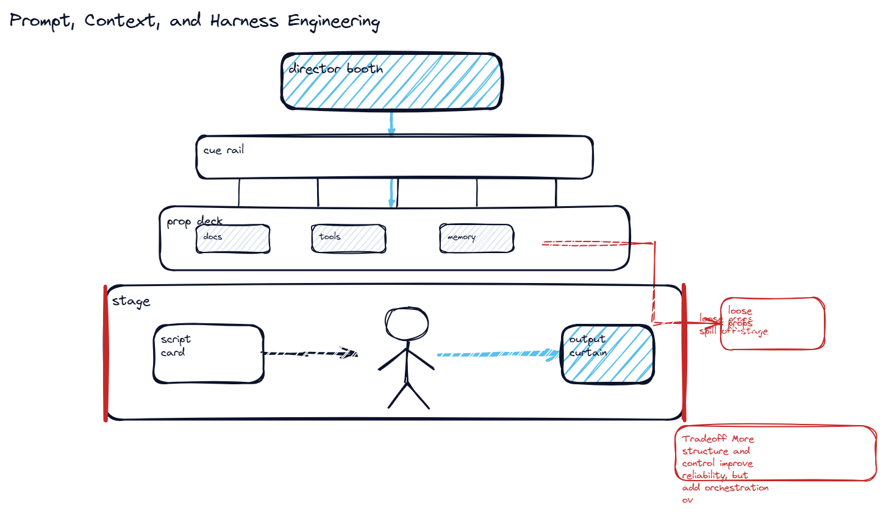

## Real-World Use First
Scenario: Teams often argue over prompts versus context, but production autonomy fails because the real problem is in the larger orchestration layer above both.
Why it matters: This matters because weak handling here degrades production reliability, observability, or safety.

## Process Flow / Steps
1. define the layer role
2. show the runtime interaction
3. surface the pressure point
4. show the trade-off

## Key Concepts
- **Prompt engineering**: key anchor concept for this chapter in the anatomy of a production harness.
- **Context engineering**: key anchor concept for this chapter in the anatomy of a production harness.
- **Harness engineering**: key anchor concept for this chapter in the anatomy of a production harness.

## Try This Right Now
- Explain Prompt engineering without mentioning the model weights.
- Name one failure mode that appears if Prompt engineering is weak.
- State one runtime check or artifact that would strengthen this layer.

-- Page 6: The Orchestration Loop

## Real-World Anchor
Scenario: A coding task requires multiple rounds of model calls and tool execution before it can be considered complete.

## What You'll Learn
The Orchestration Loop explains the ReAct or TAO loop that repeatedly assembles prompts, calls the model, executes tools, and repeats until done.

## Deep Dive Explanation
- This chapter is centered on the ReAct or TAO loop that repeatedly assembles prompts, calls the model, executes tools, and repeats until done.
- It uses the analogy of a conveyor belt passing one work card through think, act, observe, and repeat checkpoints to make the mechanism visible instead of leaving it as an abstract label.
- This matters because weak handling here degrades production reliability, observability, or safety.

## Mental Model / Analogy
Think of this like: a conveyor belt passing one work card through think, act, observe, and repeat checkpoints

## Visual Summary
```
Hot path: trigger the cycle -> execute the bounded step -> package evidence -> loop or terminate
Primary entities: The Orchestration Loop, Harness component, Runtime responsibility
Main constraint: Keep the runtime high-signal, bounded, and inspectable under longer task durations.
Trade-off: More structure and control improve reliability, but add orchestration overhead and implementation complexity.
```

## Visual Sketch
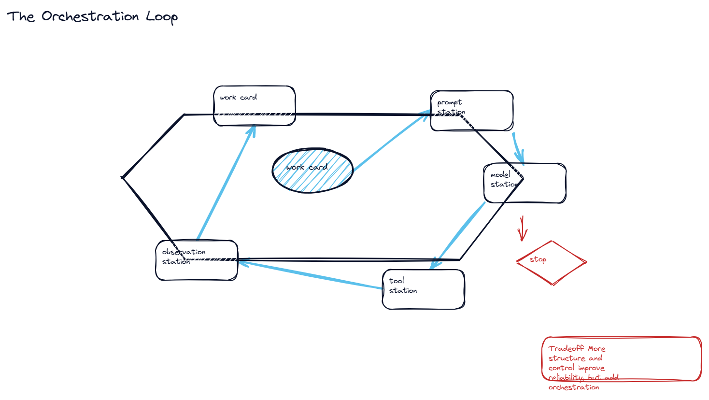

## Real-World Use First
Scenario: A coding task requires multiple rounds of model calls and tool execution before it can be considered complete.
Why it matters: This matters because weak handling here degrades production reliability, observability, or safety.

## Process Flow / Steps
1. trigger the cycle
2. execute the bounded step
3. package evidence
4. loop or terminate

## Key Concepts
- **The Orchestration Loop**: key anchor concept for this chapter in the anatomy of a production harness.
- **Harness component**: key anchor concept for this chapter in the anatomy of a production harness.
- **Runtime responsibility**: key anchor concept for this chapter in the anatomy of a production harness.

## Try This Right Now
- Explain The Orchestration Loop without mentioning the model weights.
- Name one failure mode that appears if The Orchestration Loop is weak.
- State one runtime check or artifact that would strengthen this layer.

-- Page 7: Tools

## Real-World Anchor
Scenario: An agent cannot read files, search the web, or run code safely unless those capabilities are exposed through a structured tool layer.

## What You'll Learn
Tools explains schema-driven external actions that give the agent hands and interfaces.

## Deep Dive Explanation
- This chapter is centered on schema-driven external actions that give the agent hands and interfaces.
- It uses the analogy of a tool wall where each instrument can only be picked through a labeled catalog card with validated inputs to make the mechanism visible instead of leaving it as an abstract label.
- This matters because weak handling here degrades production reliability, observability, or safety.

## Mental Model / Analogy
Think of this like: a tool wall where each instrument can only be picked through a labeled catalog card with validated inputs

## Visual Summary
```
Hot path: declare the interface -> validate the request -> execute safely -> return structured output
Primary entities: Tools, Harness component, Runtime responsibility
Main constraint: Keep the runtime high-signal, bounded, and inspectable under longer task durations.
Trade-off: More structure and control improve reliability, but add orchestration overhead and implementation complexity.
```

## Visual Sketch
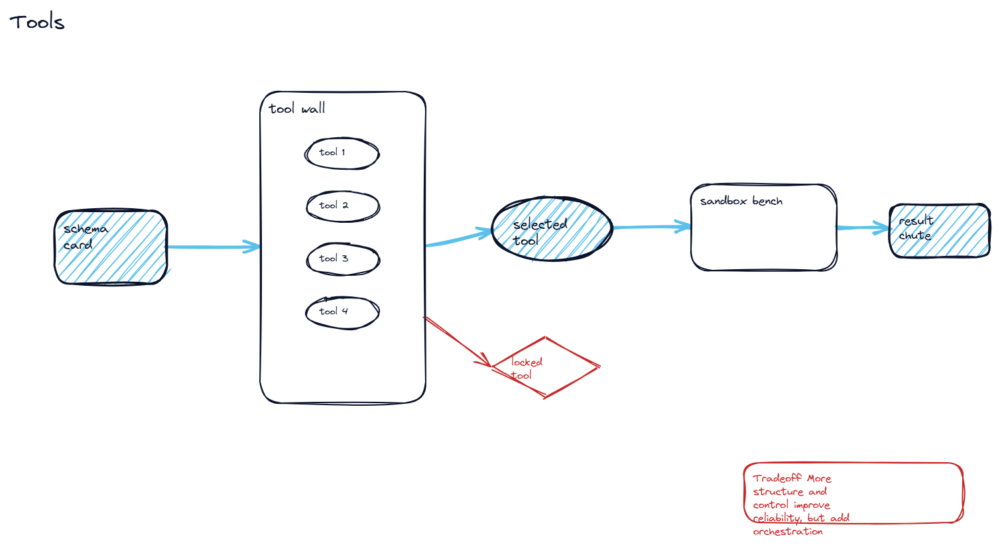

## Real-World Use First
Scenario: An agent cannot read files, search the web, or run code safely unless those capabilities are exposed through a structured tool layer.
Why it matters: This matters because weak handling here degrades production reliability, observability, or safety.

## Process Flow / Steps
1. declare the interface
2. validate the request
3. execute safely
4. return structured output

## Key Concepts
- **Tools**: key anchor concept for this chapter in the anatomy of a production harness.
- **Harness component**: key anchor concept for this chapter in the anatomy of a production harness.
- **Runtime responsibility**: key anchor concept for this chapter in the anatomy of a production harness.

## Try This Right Now
- Explain Tools without mentioning the model weights.
- Name one failure mode that appears if Tools is weak.
- State one runtime check or artifact that would strengthen this layer.

-- Page 8: Memory

## Real-World Anchor
Scenario: A developer wants the agent to remember project rules across sessions without dragging every historical detail into every prompt.

## What You'll Learn
Memory explains multi-timescale storage hierarchy separating short-term conversation state from persistent long-term knowledge.

## Deep Dive Explanation
- This chapter is centered on multi-timescale storage hierarchy separating short-term conversation state from persistent long-term knowledge.
- It uses the analogy of a library with a desk notepad, index cards, and archive boxes for different memory timescales to make the mechanism visible instead of leaving it as an abstract label.
- This matters because weak handling here degrades production reliability, observability, or safety.

## Mental Model / Analogy
Think of this like: a library with a desk notepad, index cards, and archive boxes for different memory timescales

## Visual Summary
```
Hot path: define the layer role -> show the runtime interaction -> surface the pressure point -> show the trade-off
Primary entities: Memory, Harness component, Runtime responsibility
Main constraint: Keep the runtime high-signal, bounded, and inspectable under longer task durations.
Trade-off: More structure and control improve reliability, but add orchestration overhead and implementation complexity.
```

## Visual Sketch
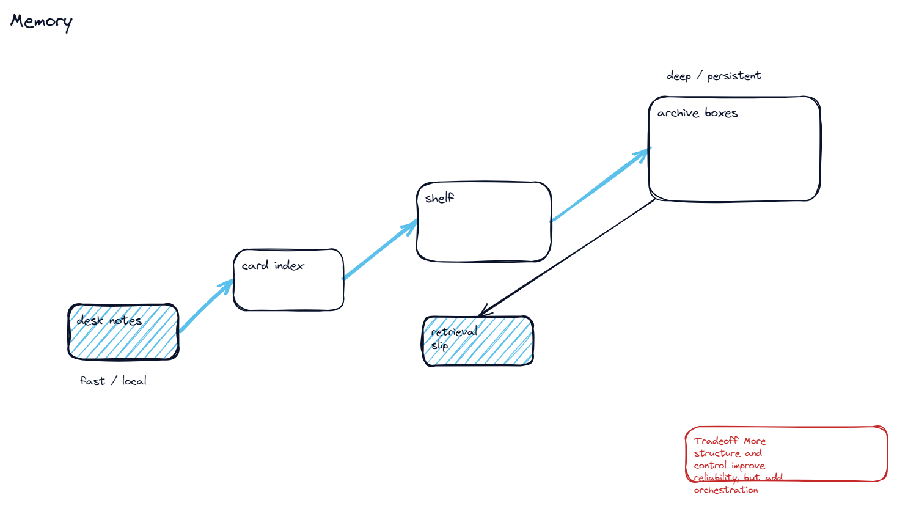

## Real-World Use First
Scenario: A developer wants the agent to remember project rules across sessions without dragging every historical detail into every prompt.
Why it matters: This matters because weak handling here degrades production reliability, observability, or safety.

## Process Flow / Steps
1. define the layer role
2. show the runtime interaction
3. surface the pressure point
4. show the trade-off

## Key Concepts
- **Memory**: key anchor concept for this chapter in the anatomy of a production harness.
- **Harness component**: key anchor concept for this chapter in the anatomy of a production harness.
- **Runtime responsibility**: key anchor concept for this chapter in the anatomy of a production harness.

## Try This Right Now
- Explain Memory without mentioning the model weights.
- Name one failure mode that appears if Memory is weak.
- State one runtime check or artifact that would strengthen this layer.

-- Page 9: Context Management

## Real-World Anchor
Scenario: A million-token model still loses quality when too much low-signal material accumulates in the window.

## What You'll Learn
Context Management explains smallest-possible high-signal token selection to avoid context rot and prompt degradation.

## Deep Dive Explanation
- This chapter is centered on smallest-possible high-signal token selection to avoid context rot and prompt degradation.
- It uses the analogy of a cargo loader throwing out low-value boxes so only mission-critical crates fit on the truck to make the mechanism visible instead of leaving it as an abstract label.
- This matters because weak handling here degrades production reliability, observability, or safety.

## Mental Model / Analogy
Think of this like: a cargo loader throwing out low-value boxes so only mission-critical crates fit on the truck

## Visual Summary
```
Hot path: trigger the cycle -> execute the bounded step -> package evidence -> loop or terminate
Primary entities: Context Management, Harness component, Runtime responsibility
Main constraint: Keep the runtime high-signal, bounded, and inspectable under longer task durations.
Trade-off: More structure and control improve reliability, but add orchestration overhead and implementation complexity.
```

## Visual Sketch
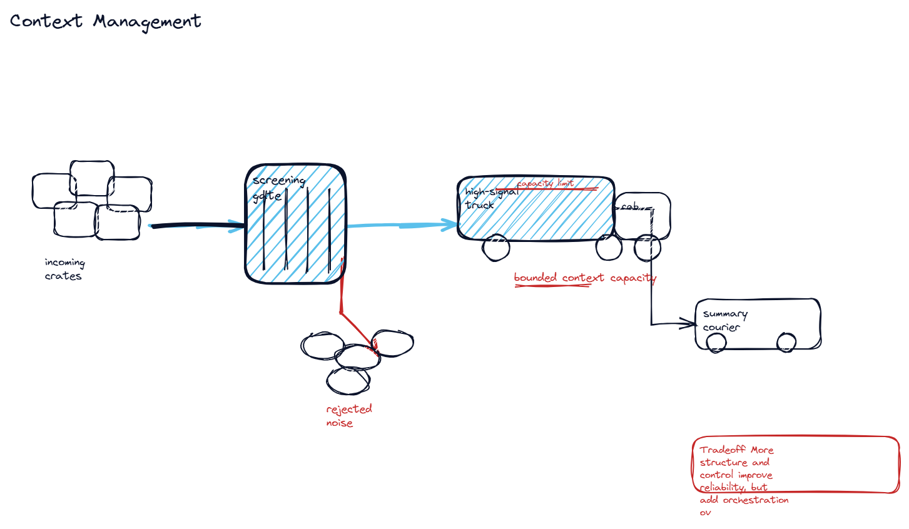

## Real-World Use First
Scenario: A million-token model still loses quality when too much low-signal material accumulates in the window.
Why it matters: This matters because weak handling here degrades production reliability, observability, or safety.

## Process Flow / Steps
1. trigger the cycle
2. execute the bounded step
3. package evidence
4. loop or terminate

## Key Concepts
- **Context Management**: key anchor concept for this chapter in the anatomy of a production harness.
- **Harness component**: key anchor concept for this chapter in the anatomy of a production harness.
- **Runtime responsibility**: key anchor concept for this chapter in the anatomy of a production harness.

## Try This Right Now
- Explain Context Management without mentioning the model weights.
- Name one failure mode that appears if Context Management is weak.
- State one runtime check or artifact that would strengthen this layer.

-- Page 10: Prompt Construction

## Real-World Anchor
Scenario: A system needs to decide not only what information to include, but where to place it in the final prompt payload.

## What You'll Learn
Prompt Construction explains hierarchical assembly of system prompt, tool definitions, memory, history, and user message into the next model input.

## Deep Dive Explanation
- This chapter is centered on hierarchical assembly of system prompt, tool definitions, memory, history, and user message into the next model input.
- It uses the analogy of a layered sandwich where the most important ingredients belong near the edges because the middle gets ignored first to make the mechanism visible instead of leaving it as an abstract label.
- This matters because weak handling here degrades production reliability, observability, or safety.

## Mental Model / Analogy
Think of this like: a layered sandwich where the most important ingredients belong near the edges because the middle gets ignored first

## Visual Summary
```
Hot path: trigger the cycle -> execute the bounded step -> package evidence -> loop or terminate
Primary entities: Prompt Construction, Harness component, Runtime responsibility
Main constraint: Keep the runtime high-signal, bounded, and inspectable under longer task durations.
Trade-off: More structure and control improve reliability, but add orchestration overhead and implementation complexity.
```

## Visual Sketch
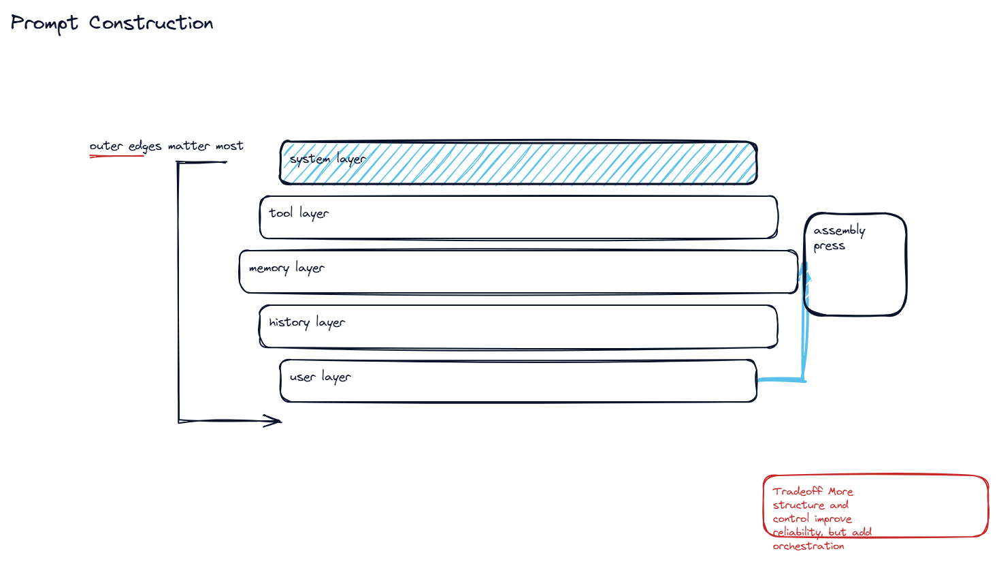

## Real-World Use First
Scenario: A system needs to decide not only what information to include, but where to place it in the final prompt payload.
Why it matters: This matters because weak handling here degrades production reliability, observability, or safety.

## Process Flow / Steps
1. trigger the cycle
2. execute the bounded step
3. package evidence
4. loop or terminate

## Key Concepts
- **Prompt Construction**: key anchor concept for this chapter in the anatomy of a production harness.
- **Harness component**: key anchor concept for this chapter in the anatomy of a production harness.
- **Runtime responsibility**: key anchor concept for this chapter in the anatomy of a production harness.

## Try This Right Now
- Explain Prompt Construction without mentioning the model weights.
- Name one failure mode that appears if Prompt Construction is weak.
- State one runtime check or artifact that would strengthen this layer.

-- Page 11: Output Parsing

## Real-World Anchor
Scenario: A model reply may contain text, tool requests, or both, and the harness must know which branch to take next.

## What You'll Learn
Output Parsing explains classification of model output into final answer, structured tool call, or handoff.

## Deep Dive Explanation
- This chapter is centered on classification of model output into final answer, structured tool call, or handoff.
- It uses the analogy of a sorting desk that separates letters into answer, action-request, and escalation trays to make the mechanism visible instead of leaving it as an abstract label.
- This matters because weak handling here degrades production reliability, observability, or safety.

## Mental Model / Analogy
Think of this like: a sorting desk that separates letters into answer, action-request, and escalation trays

## Visual Summary
```
Hot path: declare the interface -> validate the request -> execute safely -> return structured output
Primary entities: Output Parsing, Harness component, Runtime responsibility
Main constraint: Keep the runtime high-signal, bounded, and inspectable under longer task durations.
Trade-off: More structure and control improve reliability, but add orchestration overhead and implementation complexity.
```

## Visual Sketch
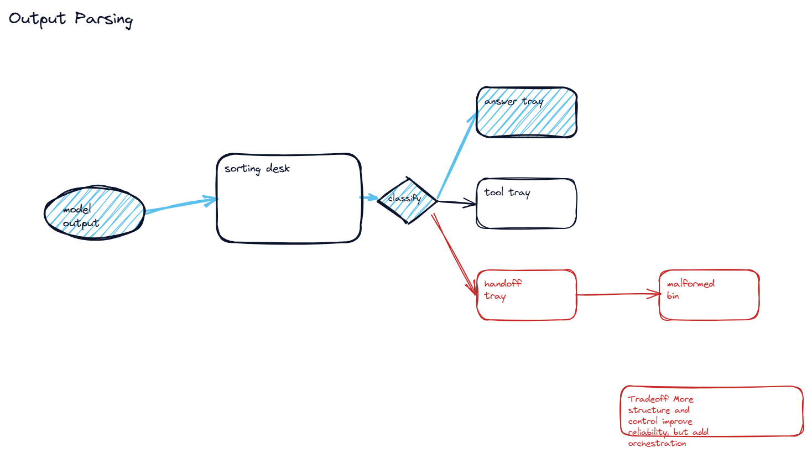

## Real-World Use First
Scenario: A model reply may contain text, tool requests, or both, and the harness must know which branch to take next.
Why it matters: This matters because weak handling here degrades production reliability, observability, or safety.

## Process Flow / Steps
1. declare the interface
2. validate the request
3. execute safely
4. return structured output

## Key Concepts
- **Output Parsing**: key anchor concept for this chapter in the anatomy of a production harness.
- **Harness component**: key anchor concept for this chapter in the anatomy of a production harness.
- **Runtime responsibility**: key anchor concept for this chapter in the anatomy of a production harness.

## Try This Right Now
- Explain Output Parsing without mentioning the model weights.
- Name one failure mode that appears if Output Parsing is weak.
- State one runtime check or artifact that would strengthen this layer.

-- Page 12: State Management

## Real-World Anchor
Scenario: A long-running agent must survive interruption, resume accurately, and support debugging without replaying everything blindly.

## What You'll Learn
State Management explains typed persistent state flowing through checkpoints so work can resume after interruptions.

## Deep Dive Explanation
- This chapter is centered on typed persistent state flowing through checkpoints so work can resume after interruptions.
- It uses the analogy of a mission control board where every update lands in tracked boxes and each checkpoint snapshots the whole board to make the mechanism visible instead of leaving it as an abstract label.
- This matters because weak handling here degrades production reliability, observability, or safety.

## Mental Model / Analogy
Think of this like: a mission control board where every update lands in tracked boxes and each checkpoint snapshots the whole board

## Visual Summary
```
Hot path: define the layer role -> show the runtime interaction -> surface the pressure point -> show the trade-off
Primary entities: State Management, Harness component, Runtime responsibility
Main constraint: Keep the runtime high-signal, bounded, and inspectable under longer task durations.
Trade-off: More structure and control improve reliability, but add orchestration overhead and implementation complexity.
```

## Visual Sketch
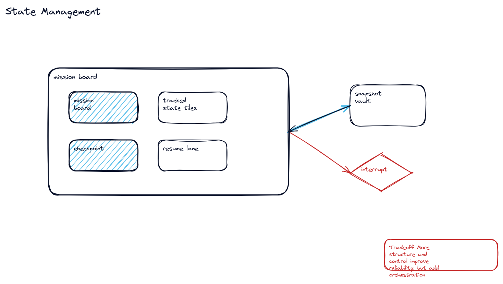

## Real-World Use First
Scenario: A long-running agent must survive interruption, resume accurately, and support debugging without replaying everything blindly.
Why it matters: This matters because weak handling here degrades production reliability, observability, or safety.

## Process Flow / Steps
1. define the layer role
2. show the runtime interaction
3. surface the pressure point
4. show the trade-off

## Key Concepts
- **State Management**: key anchor concept for this chapter in the anatomy of a production harness.
- **Harness component**: key anchor concept for this chapter in the anatomy of a production harness.
- **Runtime responsibility**: key anchor concept for this chapter in the anatomy of a production harness.

## Try This Right Now
- Explain State Management without mentioning the model weights.
- Name one failure mode that appears if State Management is weak.
- State one runtime check or artifact that would strengthen this layer.

-- Page 13: Error Handling

## Real-World Anchor
Scenario: A ten-step process with high per-step reliability still fails often enough end-to-end that unrecovered errors become a product problem.

## What You'll Learn
Error Handling explains failure classification so the harness retries, self-corrects, asks the user, or escalates appropriately.

## Deep Dive Explanation
- This chapter is centered on failure classification so the harness retries, self-corrects, asks the user, or escalates appropriately.
- It uses the analogy of a repair workshop that routes broken parts into retry bins, self-fix benches, approval desks, or engineer inspection tables to make the mechanism visible instead of leaving it as an abstract label.
- This matters because weak handling here degrades production reliability, observability, or safety.

## Mental Model / Analogy
Think of this like: a repair workshop that routes broken parts into retry bins, self-fix benches, approval desks, or engineer inspection tables

## Visual Summary
```
Hot path: trigger the cycle -> execute the bounded step -> package evidence -> loop or terminate
Primary entities: Error Handling, Harness component, Runtime responsibility
Main constraint: Keep the runtime high-signal, bounded, and inspectable under longer task durations.
Trade-off: More structure and control improve reliability, but add orchestration overhead and implementation complexity.
```

## Visual Sketch
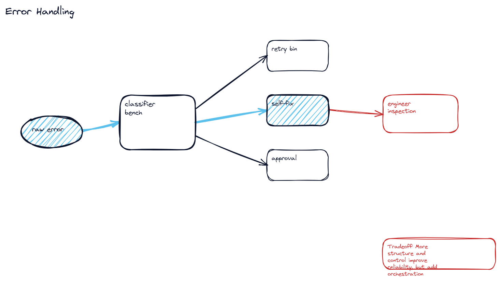

## Real-World Use First
Scenario: A ten-step process with high per-step reliability still fails often enough end-to-end that unrecovered errors become a product problem.
Why it matters: This matters because weak handling here degrades production reliability, observability, or safety.

## Process Flow / Steps
1. trigger the cycle
2. execute the bounded step
3. package evidence
4. loop or terminate

## Key Concepts
- **Error Handling**: key anchor concept for this chapter in the anatomy of a production harness.
- **Harness component**: key anchor concept for this chapter in the anatomy of a production harness.
- **Runtime responsibility**: key anchor concept for this chapter in the anatomy of a production harness.

## Try This Right Now
- Explain Error Handling without mentioning the model weights.
- Name one failure mode that appears if Error Handling is weak.
- State one runtime check or artifact that would strengthen this layer.

-- Page 14: Guardrails and Safety

## Real-World Anchor
Scenario: The model may decide what it wants to do, but the runtime still has to decide what it is actually allowed to attempt.

## What You'll Learn
Guardrails and Safety explains separation of model intent from permission enforcement with tripwires and policy checks.

## Deep Dive Explanation
- This chapter is centered on separation of model intent from permission enforcement with tripwires and policy checks.
- It uses the analogy of a security checkpoint where the traveler proposes a route but the gates decide which doors actually open to make the mechanism visible instead of leaving it as an abstract label.
- This matters because weak handling here degrades production reliability, observability, or safety.

## Mental Model / Analogy
Think of this like: a security checkpoint where the traveler proposes a route but the gates decide which doors actually open

## Visual Summary
```
Hot path: define the layer role -> show the runtime interaction -> surface the pressure point -> show the trade-off
Primary entities: Guardrails and Safety, Harness component, Runtime responsibility
Main constraint: Keep the runtime high-signal, bounded, and inspectable under longer task durations.
Trade-off: More structure and control improve reliability, but add orchestration overhead and implementation complexity.
```

## Visual Sketch
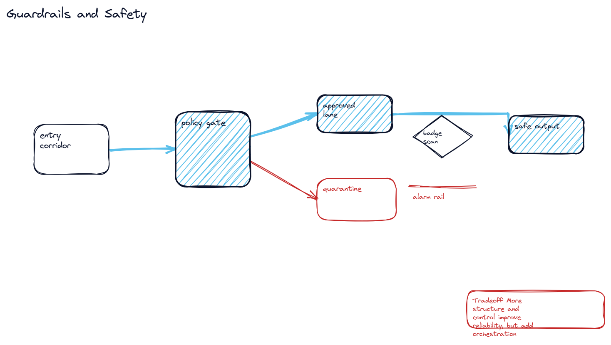

## Real-World Use First
Scenario: The model may decide what it wants to do, but the runtime still has to decide what it is actually allowed to attempt.
Why it matters: This matters because weak handling here degrades production reliability, observability, or safety.

## Process Flow / Steps
1. define the layer role
2. show the runtime interaction
3. surface the pressure point
4. show the trade-off

## Key Concepts
- **Guardrails and Safety**: key anchor concept for this chapter in the anatomy of a production harness.
- **Harness component**: key anchor concept for this chapter in the anatomy of a production harness.
- **Runtime responsibility**: key anchor concept for this chapter in the anatomy of a production harness.

## Try This Right Now
- Explain Guardrails and Safety without mentioning the model weights.
- Name one failure mode that appears if Guardrails and Safety is weak.
- State one runtime check or artifact that would strengthen this layer.

-- Page 15: Verification Loops

## Real-World Anchor
Scenario: A demo looks fine until tests, screenshots, or an independent reviewer prove that the behavior is actually broken.

## What You'll Learn
Verification Loops explains post-action quality confirmation through tests, visual checks, and separate evaluation passes.

## Deep Dive Explanation
- This chapter is centered on post-action quality confirmation through tests, visual checks, and separate evaluation passes.
- It uses the analogy of a quality-assurance lane that stamps nothing as complete until the part passes mechanical, visual, and inspector review to make the mechanism visible instead of leaving it as an abstract label.
- This matters because weak handling here degrades production reliability, observability, or safety.

## Mental Model / Analogy
Think of this like: a quality-assurance lane that stamps nothing as complete until the part passes mechanical, visual, and inspector review

## Visual Summary
```
Hot path: trigger the cycle -> execute the bounded step -> package evidence -> loop or terminate
Primary entities: Verification Loops, Harness component, Runtime responsibility
Main constraint: Keep the runtime high-signal, bounded, and inspectable under longer task durations.
Trade-off: More structure and control improve reliability, but add orchestration overhead and implementation complexity.
```

## Visual Sketch
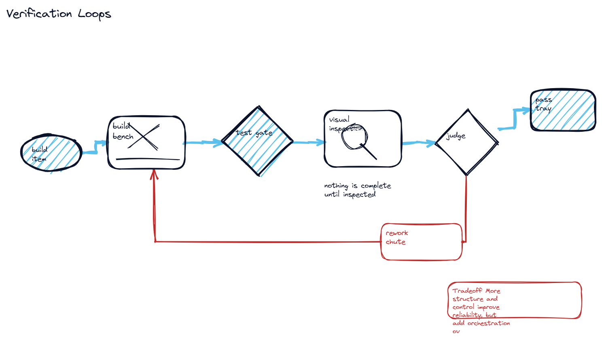

## Real-World Use First
Scenario: A demo looks fine until tests, screenshots, or an independent reviewer prove that the behavior is actually broken.
Why it matters: This matters because weak handling here degrades production reliability, observability, or safety.

## Process Flow / Steps
1. trigger the cycle
2. execute the bounded step
3. package evidence
4. loop or terminate

## Key Concepts
- **Verification Loops**: key anchor concept for this chapter in the anatomy of a production harness.
- **Harness component**: key anchor concept for this chapter in the anatomy of a production harness.
- **Runtime responsibility**: key anchor concept for this chapter in the anatomy of a production harness.

## Try This Right Now
- Explain Verification Loops without mentioning the model weights.
- Name one failure mode that appears if Verification Loops is weak.
- State one runtime check or artifact that would strengthen this layer.

-- Page 16: Subagent Orchestration

## Real-World Anchor
Scenario: One agent should not load every tool and every subproblem if specialist branches can explore in parallel and return tighter summaries.

## What You'll Learn
Subagent Orchestration explains bounded delegation of subtasks to specialized or isolated agents without losing parent control.

## Deep Dive Explanation
- This chapter is centered on bounded delegation of subtasks to specialized or isolated agents without losing parent control.
- It uses the analogy of a project office that can fork workers, open separate workrooms, or hand a dossier to a specialist team to make the mechanism visible instead of leaving it as an abstract label.
- This matters because weak handling here degrades production reliability, observability, or safety.

## Mental Model / Analogy
Think of this like: a project office that can fork workers, open separate workrooms, or hand a dossier to a specialist team

## Visual Summary
```
Hot path: define the layer role -> show the runtime interaction -> surface the pressure point -> show the trade-off
Primary entities: Subagent Orchestration, Harness component, Runtime responsibility
Main constraint: Keep the runtime high-signal, bounded, and inspectable under longer task durations.
Trade-off: More structure and control improve reliability, but add orchestration overhead and implementation complexity.
```

## Visual Sketch
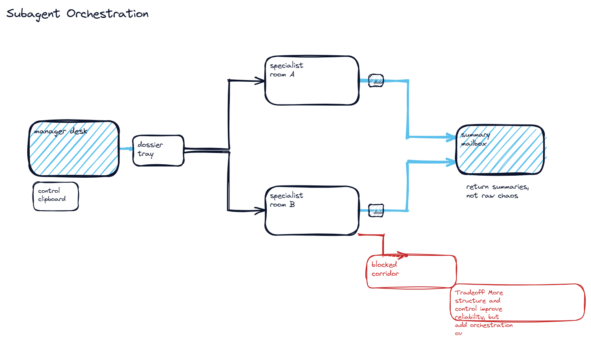

## Real-World Use First
Scenario: One agent should not load every tool and every subproblem if specialist branches can explore in parallel and return tighter summaries.
Why it matters: This matters because weak handling here degrades production reliability, observability, or safety.

## Process Flow / Steps
1. define the layer role
2. show the runtime interaction
3. surface the pressure point
4. show the trade-off

## Key Concepts
- **Subagent Orchestration**: key anchor concept for this chapter in the anatomy of a production harness.
- **Harness component**: key anchor concept for this chapter in the anatomy of a production harness.
- **Runtime responsibility**: key anchor concept for this chapter in the anatomy of a production harness.

## Try This Right Now
- Explain Subagent Orchestration without mentioning the model weights.
- Name one failure mode that appears if Subagent Orchestration is weak.
- State one runtime check or artifact that would strengthen this layer.

-- Page 17: Step-by-Step Walkthrough and the Ralph Loop

## Real-World Anchor
Scenario: A long-running coding task crosses multiple context windows, so the system needs a way to reorient the next session without replaying the whole conversation.

## What You'll Learn
Step-by-Step Walkthrough and the Ralph Loop explains end-to-end harness cycle with layered termination conditions and filesystem-backed continuity across context windows.

## Deep Dive Explanation
- This chapter is centered on end-to-end harness cycle with layered termination conditions and filesystem-backed continuity across context windows.
- It uses the analogy of a relay course where each lap hands a baton and a clipboard to the next runner to make the mechanism visible instead of leaving it as an abstract label.
- This matters because weak handling here degrades production reliability, observability, or safety.

## Mental Model / Analogy
Think of this like: a relay course where each lap hands a baton and a clipboard to the next runner

## Visual Summary
```
Hot path: trigger the cycle -> execute the bounded step -> package evidence -> loop or terminate
Primary entities: Termination condition, Ralph Loop, Filesystem continuity
Main constraint: Keep the runtime high-signal, bounded, and inspectable under longer task durations.
Trade-off: More structure and control improve reliability, but add orchestration overhead and implementation complexity.
```

## Visual Sketch
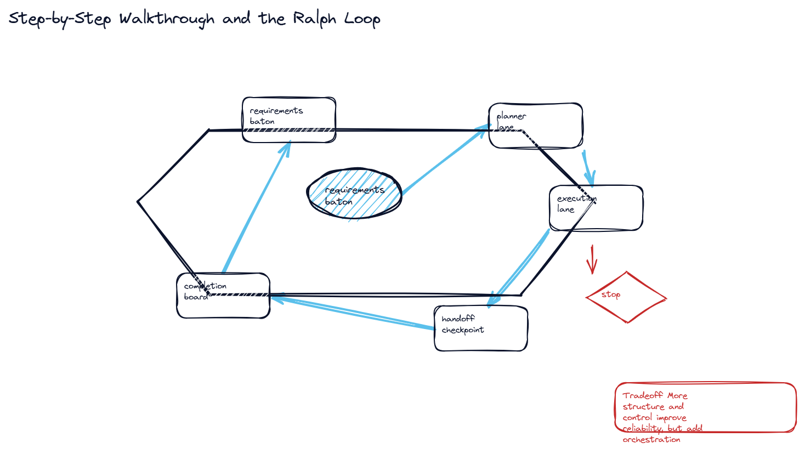

## Real-World Use First
Scenario: A long-running coding task crosses multiple context windows, so the system needs a way to reorient the next session without replaying the whole conversation.
Why it matters: This matters because weak handling here degrades production reliability, observability, or safety.

## Process Flow / Steps
1. trigger the cycle
2. execute the bounded step
3. package evidence
4. loop or terminate

## Key Concepts
- **Termination condition**: key anchor concept for this chapter in the anatomy of a production harness.
- **Ralph Loop**: key anchor concept for this chapter in the anatomy of a production harness.
- **Filesystem continuity**: key anchor concept for this chapter in the anatomy of a production harness.

## Try This Right Now
- Explain Termination condition without mentioning the model weights.
- Name one failure mode that appears if Termination condition is weak.
- State one runtime check or artifact that would strengthen this layer.

-- Page 18: How Frameworks Implement the Pattern

## Real-World Anchor
Scenario: Anthropic, OpenAI, LangGraph, and CrewAI feel different from the outside, yet each still needs loops, tools, state, and verification under the hood.

## What You'll Learn
How Frameworks Implement the Pattern explains framework-specific surfaces exposing the same underlying harness pattern through different abstractions.

## Deep Dive Explanation
- This chapter is centered on framework-specific surfaces exposing the same underlying harness pattern through different abstractions.
- It uses the analogy of multiple builders using different toolkits to erect the same structural frame to make the mechanism visible instead of leaving it as an abstract label.
- This matters because weak handling here degrades production reliability, observability, or safety.

## Mental Model / Analogy
Think of this like: multiple builders using different toolkits to erect the same structural frame

## Visual Summary
```
Hot path: define the layer role -> show the runtime interaction -> surface the pressure point -> show the trade-off
Primary entities: Code-first runner, State graph, Role-based crew
Main constraint: Keep the runtime high-signal, bounded, and inspectable under longer task durations.
Trade-off: More structure and control improve reliability, but add orchestration overhead and implementation complexity.
```

## Visual Sketch
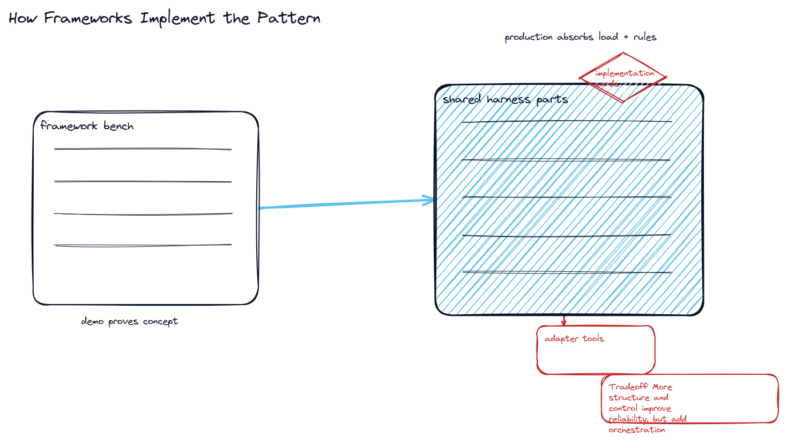

## Real-World Use First
Scenario: Anthropic, OpenAI, LangGraph, and CrewAI feel different from the outside, yet each still needs loops, tools, state, and verification under the hood.
Why it matters: This matters because weak handling here degrades production reliability, observability, or safety.

## Process Flow / Steps
1. define the layer role
2. show the runtime interaction
3. surface the pressure point
4. show the trade-off

## Key Concepts
- **Code-first runner**: key anchor concept for this chapter in the anatomy of a production harness.
- **State graph**: key anchor concept for this chapter in the anatomy of a production harness.
- **Role-based crew**: key anchor concept for this chapter in the anatomy of a production harness.

## Try This Right Now
- Explain Code-first runner without mentioning the model weights.
- Name one failure mode that appears if Code-first runner is weak.
- State one runtime check or artifact that would strengthen this layer.

-- Page 19: Scaffolding, Co-Evolution, and the Future-Proofing Test

## Real-World Anchor
Scenario: A team keeps rewriting its harness to delete logic as new model generations absorb more capability directly.

## What You'll Learn
Scaffolding, Co-Evolution, and the Future-Proofing Test explains temporary-but-necessary harness complexity that should shrink as models internalize more behavior.

## Deep Dive Explanation
- This chapter is centered on temporary-but-necessary harness complexity that should shrink as models internalize more behavior.
- It uses the analogy of construction scaffolding that should be removed floor by floor as the building can stand on its own to make the mechanism visible instead of leaving it as an abstract label.
- This matters because weak handling here degrades production reliability, observability, or safety.

## Mental Model / Analogy
Think of this like: construction scaffolding that should be removed floor by floor as the building can stand on its own

## Visual Summary
```
Hot path: define the layer role -> show the runtime interaction -> surface the pressure point -> show the trade-off
Primary entities: Scaffolding metaphor, Co-evolution principle, Future-proofing test
Main constraint: Keep the runtime high-signal, bounded, and inspectable under longer task durations.
Trade-off: More structure and control improve reliability, but add orchestration overhead and implementation complexity.
```

## Visual Sketch
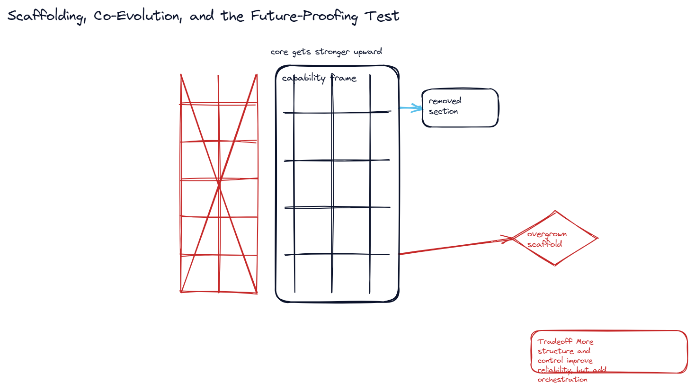

## Real-World Use First
Scenario: A team keeps rewriting its harness to delete logic as new model generations absorb more capability directly.
Why it matters: This matters because weak handling here degrades production reliability, observability, or safety.

## Process Flow / Steps
1. define the layer role
2. show the runtime interaction
3. surface the pressure point
4. show the trade-off

## Key Concepts
- **Scaffolding metaphor**: key anchor concept for this chapter in the anatomy of a production harness.
- **Co-evolution principle**: key anchor concept for this chapter in the anatomy of a production harness.
- **Future-proofing test**: key anchor concept for this chapter in the anatomy of a production harness.

## Try This Right Now
- Explain Scaffolding metaphor without mentioning the model weights.
- Name one failure mode that appears if Scaffolding metaphor is weak.
- State one runtime check or artifact that would strengthen this layer.

-- Page 20: Seven Architectural Decisions and the Final Takeaway

## Real-World Anchor
Scenario: Two teams use the same model but make opposite harness-definition choices, leading to different reliability, speed, and safety profiles.

## What You'll Learn
Seven Architectural Decisions and the Final Takeaway explains explicit harness-definition choices around agent count, execution style, context strategy, verification, safety, tool scope, and thickness.

## Deep Dive Explanation
- This chapter is centered on explicit harness-definition choices around agent count, execution style, context strategy, verification, safety, tool scope, and thickness.
- It uses the analogy of a strategy board with seven levers that change the whole machine even though the engine underneath stays the same to make the mechanism visible instead of leaving it as an abstract label.
- This matters because weak handling here degrades production reliability, observability, or safety.

## Mental Model / Analogy
Think of this like: a strategy board with seven levers that change the whole machine even though the engine underneath stays the same

## Visual Summary
```
Hot path: define the layer role -> show the runtime interaction -> surface the pressure point -> show the trade-off
Primary entities: Harness thickness, Tool scoping strategy, Verification design
Main constraint: Keep the runtime high-signal, bounded, and inspectable under longer task durations.
Trade-off: More structure and control improve reliability, but add orchestration overhead and implementation complexity.
```

## Visual Sketch
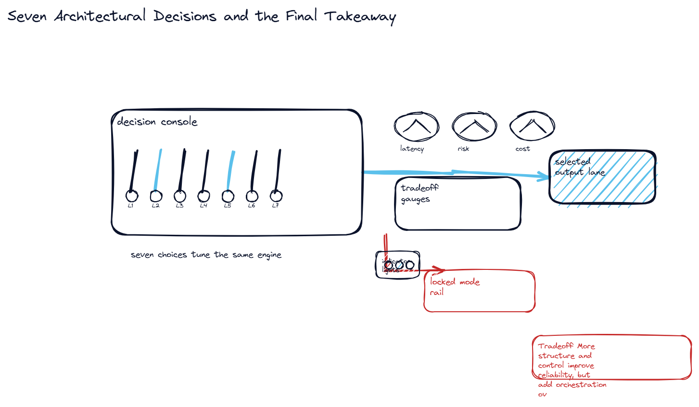

## Real-World Use First
Scenario: Two teams use the same model but make opposite harness-definition choices, leading to different reliability, speed, and safety profiles.
Why it matters: This matters because weak handling here degrades production reliability, observability, or safety.

## Process Flow / Steps
1. define the layer role
2. show the runtime interaction
3. surface the pressure point
4. show the trade-off

## Key Concepts
- **Harness thickness**: key anchor concept for this chapter in the anatomy of a production harness.
- **Tool scoping strategy**: key anchor concept for this chapter in the anatomy of a production harness.
- **Verification design**: key anchor concept for this chapter in the anatomy of a production harness.

## Try This Right Now
- Explain Harness thickness without mentioning the model weights.
- Name one failure mode that appears if Harness thickness is weak.
- State one runtime check or artifact that would strengthen this layer.
