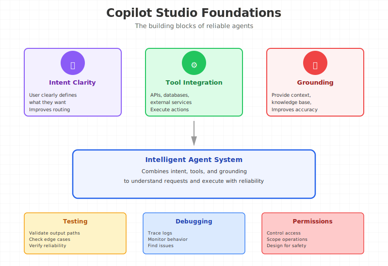
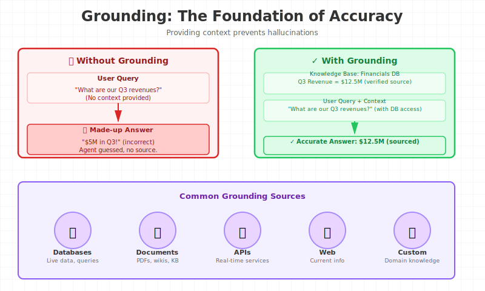
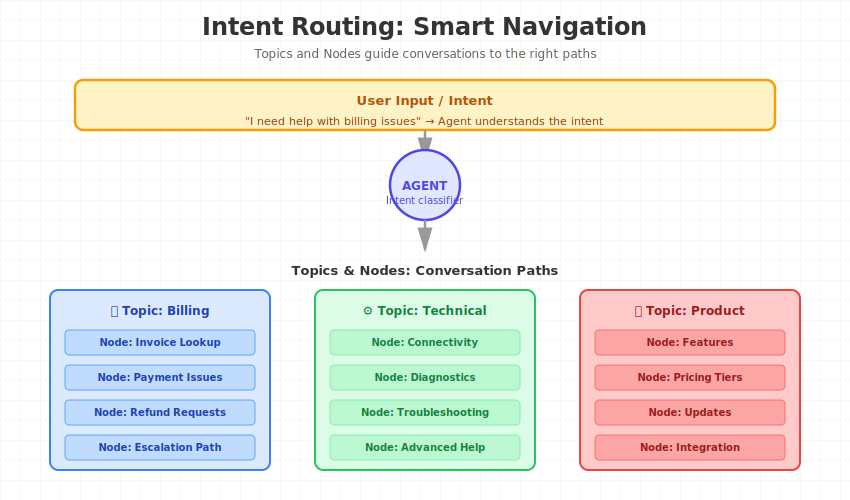
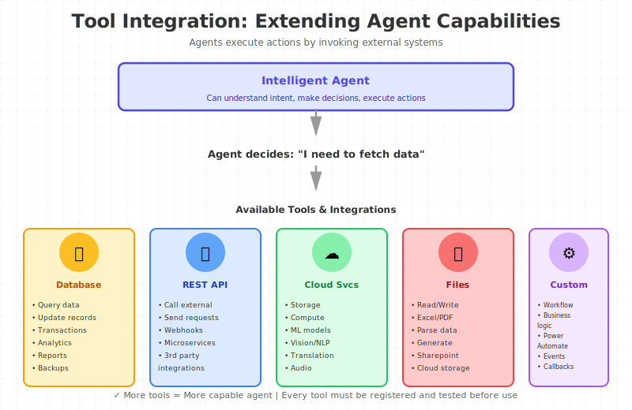
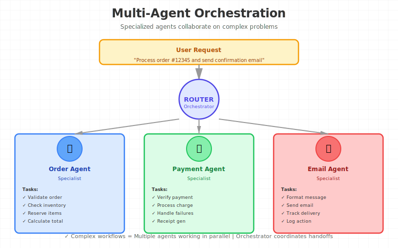

-- Page 1: Introduction

## Big Picture
Lesson focus: Introduction in Intro to the Course.
Builds practical Copilot Studio implementation confidence.

## Key Concepts
- **Copilot Studio**: Main concept.
- **Practical setup**: Practical angle.

## Process Flow / Steps
1. Define task.
2. Configure artifact.
3. Test and refine.

## Visual Memory Hook (ASCII)
A -> Intent -> Agent -> Tool/Data -> Answer

## Worked Example
Scenario: Apply Introduction.
Steps: Configure, run, verify.
Result: Repeatable workflow.

## Common Mistakes
- Skipping settings checks.
- Ignoring test evidence.

## Exam Tips / Practice Questions
Q: What to validate first?  A: Scope, settings, output.
Q: What proves success?  A: Correct response path.

## Flashcards
| Q | A |
|---|---|
| Lesson core? | Copilot Studio via hands-on execution. |

## One-Page Revision
- Introduction extends Intro to the Course.
- Configure, test, improve.
- Keep reliability in scope.

## 30-Day Memory Bullets
- Introduction is a build step.
- Intent clarity improves routing.
- Tools execute; topics steer.
- Grounding improves factuality.

- Trace logs support debugging.
- Permissions shape rollout.
- Design for safe failure.
- Iterate with measurable tests.

-- Page 2: Slidedeck for the Course

## Big Picture
Lesson focus: Slidedeck for the Course in Intro to the Course.
Builds practical Copilot Studio implementation confidence.

## Key Concepts
- **Copilot Studio**: Main concept.
- **Practical setup**: Practical angle.

## Process Flow / Steps
1. Define task.
2. Configure artifact.
3. Test and refine.

## Visual Memory Hook (ASCII)
A -> Intent -> Agent -> Tool/Data -> Answer

## Worked Example
Scenario: Apply Slidedeck for the Course.
Steps: Configure, run, verify.
Result: Repeatable workflow.

## Common Mistakes
- Skipping settings checks.
- Ignoring test evidence.

## Exam Tips / Practice Questions
Q: What to validate first?  A: Scope, settings, output.
Q: What proves success?  A: Correct response path.

## Flashcards
| Q | A |
|---|---|
| Lesson core? | Copilot Studio via hands-on execution. |

## One-Page Revision
- Slidedeck for the Course extends Intro to the Course.
- Configure, test, improve.
- Keep reliability in scope.

## 30-Day Memory Bullets
- Slidedeck for the Course is a build step.
- Intent clarity improves routing.
- Tools execute; topics steer.
- Grounding improves factuality.
- Trace logs support debugging.
- Permissions shape rollout.
- Design for safe failure.
- Iterate with measurable tests.

-- Page 3: Title - Intro to Copilot Studio

## Big Picture
Lesson focus: Title - Intro to Copilot Studio in Copilot Studio.
Builds practical Copilot Studio implementation confidence.

## Key Concepts
- **Copilot Studio**: Main concept.
- **Practical setup**: Practical angle.

## Process Flow / Steps
1. Define task.
2. Configure artifact.
3. Test and refine.

## Visual Memory Hook (ASCII)
A -> Intent -> Agent -> Tool/Data -> Answer

## Worked Example
Scenario: Apply Title - Intro to Copilot Studio.
Steps: Configure, run, verify.
Result: Repeatable workflow.

## Common Mistakes
- Skipping settings checks.
- Ignoring test evidence.

## Exam Tips / Practice Questions
Q: What to validate first?  A: Scope, settings, output.
Q: What proves success?  A: Correct response path.

## Flashcards
| Q | A |
|---|---|
| Lesson core? | Copilot Studio via hands-on execution. |

## One-Page Revision
- Title - Intro to Copilot Studio extends Copilot Studio.
- Configure, test, improve.
- Keep reliability in scope.

## 30-Day Memory Bullets
- Title - Intro to Copilot Studio is a build step.
- Intent clarity improves routing.
- Tools execute; topics steer.
- Grounding improves factuality.
- Trace logs support debugging.
- Permissions shape rollout.
- Design for safe failure.
- Iterate with measurable tests.

-- Page 4: What is Copilot Studio ?

## Big Picture
Lesson focus: What is Copilot Studio ? in Creating your First Agent.
Builds practical Copilot Studio implementation confidence.

## Key Concepts
- **Copilot Studio**: Main concept.
- **Practical setup**: Practical angle.

## Process Flow / Steps
1. Define task.
2. Configure artifact.
3. Test and refine.

## Visual Memory Hook (ASCII)
A -> Intent -> Agent -> Tool/Data -> Answer

## Worked Example
Scenario: Apply What is Copilot Studio ?.
Steps: Configure, run, verify.
Result: Repeatable workflow.

## Common Mistakes
- Skipping settings checks.
- Ignoring test evidence.

## Exam Tips / Practice Questions
Q: What to validate first?  A: Scope, settings, output.
Q: What proves success?  A: Correct response path.

## Flashcards
| Q | A |
|---|---|
| Lesson core? | Copilot Studio via hands-on execution. |

## One-Page Revision
- What is Copilot Studio ? extends Creating your First Agent.
- Configure, test, improve.
- Keep reliability in scope.

## 30-Day Memory Bullets
- What is Copilot Studio ? is a build step.
- Intent clarity improves routing.
- Tools execute; topics steer.
- Grounding improves factuality.
- Trace logs support debugging.
- Permissions shape rollout.
- Design for safe failure.
- Iterate with measurable tests.

-- Page 5: History Behind Copilot Studio

## Big Picture
Lesson focus: History Behind Copilot Studio in Knowledge Source.
Builds practical Copilot Studio implementation confidence.

## Key Concepts
- **Grounding**: Main concept.
- **Source-controlled answers**: Practical angle.

## Process Flow / Steps
1. Define task.
2. Configure artifact.
3. Test and refine.

## Visual Memory Hook (ASCII)
A -> Intent -> Agent -> Tool/Data -> Answer

## Worked Example
Scenario: Apply History Behind Copilot Studio.
Steps: Configure, run, verify.
Result: Repeatable workflow.

## Common Mistakes
- Skipping settings checks.
- Ignoring test evidence.

## Exam Tips / Practice Questions
Q: What to validate first?  A: Scope, settings, output.
Q: What proves success?  A: Correct response path.

## Flashcards
| Q | A |
|---|---|
| Lesson core? | Grounding via hands-on execution. |

## One-Page Revision
- History Behind Copilot Studio extends Knowledge Source.
- Configure, test, improve.
- Keep reliability in scope.

## 30-Day Memory Bullets
- History Behind Copilot Studio is a build step.
- Intent clarity improves routing.
- Tools execute; topics steer.
- Grounding improves factuality.
- Trace logs support debugging.
- Permissions shape rollout.
- Design for safe failure.
- Iterate with measurable tests.

-- Page 6: What are access mechanisms ?

## Big Picture
Lesson focus: What are access mechanisms ? in Topics & Nodes.
Builds practical Copilot Studio implementation confidence.

## Key Concepts
- **Intent routing**: Main concept.
- **Topic/node design**: Practical angle.

## Process Flow / Steps
1. Define task.
2. Configure artifact.
3. Test and refine.

## Visual Memory Hook (ASCII)
A -> Intent -> Agent -> Tool/Data -> Answer

## Worked Example
Scenario: Apply What are access mechanisms ?.
Steps: Configure, run, verify.
Result: Repeatable workflow.

## Common Mistakes
- Skipping settings checks.
- Ignoring test evidence.

## Exam Tips / Practice Questions
Q: What to validate first?  A: Scope, settings, output.
Q: What proves success?  A: Correct response path.

## Flashcards
| Q | A |
|---|---|
| Lesson core? | Intent routing via hands-on execution. |

## One-Page Revision
- What are access mechanisms ? extends Topics & Nodes.
- Configure, test, improve.
- Keep reliability in scope.

## 30-Day Memory Bullets
- What are access mechanisms ? is a build step.
- Intent clarity improves routing.
- Tools execute; topics steer.
- Grounding improves factuality.
- Trace logs support debugging.
- Permissions shape rollout.
- Design for safe failure.
- Iterate with measurable tests.

-- Page 7: Let's Visit the Copilot Studio Website

## Big Picture
Lesson focus: Let's Visit the Copilot Studio Website in Tools.
Builds practical Copilot Studio implementation confidence.

## Key Concepts
- **External actions**: Main concept.
- **Tool invocation**: Practical angle.

## Process Flow / Steps
1. Define task.
2. Configure artifact.
3. Test and refine.

## Visual Memory Hook (ASCII)
A -> Intent -> Agent -> Tool/Data -> Answer

## Worked Example
Scenario: Apply Let's Visit the Copilot Studio Website.
Steps: Configure, run, verify.
Result: Repeatable workflow.

## Common Mistakes
- Skipping settings checks.
- Ignoring test evidence.

## Exam Tips / Practice Questions
Q: What to validate first?  A: Scope, settings, output.
Q: What proves success?  A: Correct response path.

## Flashcards
| Q | A |
|---|---|
| Lesson core? | External actions via hands-on execution. |

## One-Page Revision
- Let's Visit the Copilot Studio Website extends Tools.
- Configure, test, improve.
- Keep reliability in scope.

## 30-Day Memory Bullets
- Let's Visit the Copilot Studio Website is a build step.
- Intent clarity improves routing.
- Tools execute; topics steer.
- Grounding improves factuality.
- Trace logs support debugging.
- Permissions shape rollout.
- Design for safe failure.
- Iterate with measurable tests.

-- Page 8: Pricing Model for Copilot Studio

## Big Picture
Lesson focus: Pricing Model for Copilot Studio in Agents - Multi Agents.
Builds practical Copilot Studio implementation confidence.

## Key Concepts
- **Orchestration**: Main concept.
- **Agent handoff**: Practical angle.

## Process Flow / Steps
1. Define task.
2. Configure artifact.
3. Test and refine.

## Visual Memory Hook (ASCII)
A -> Intent -> Agent -> Tool/Data -> Answer

## Worked Example
Scenario: Apply Pricing Model for Copilot Studio.
Steps: Configure, run, verify.
Result: Repeatable workflow.

## Common Mistakes
- Skipping settings checks.
- Ignoring test evidence.

## Exam Tips / Practice Questions
Q: What to validate first?  A: Scope, settings, output.
Q: What proves success?  A: Correct response path.

## Flashcards
| Q | A |
|---|---|
| Lesson core? | Orchestration via hands-on execution. |

## One-Page Revision
- Pricing Model for Copilot Studio extends Agents - Multi Agents.
- Configure, test, improve.
- Keep reliability in scope.

## 30-Day Memory Bullets
- Pricing Model for Copilot Studio is a build step.
- Intent clarity improves routing.
- Tools execute; topics steer.
- Grounding improves factuality.
- Trace logs support debugging.
- Permissions shape rollout.
- Design for safe failure.
- Iterate with measurable tests.

-- Page 9: Title - Creating Your First Agent

## Big Picture
Lesson focus: Title - Creating Your First Agent in Publishing Agent.
Builds practical Copilot Studio implementation confidence.

## Key Concepts
- **Deployment**: Main concept.
- **Channel security**: Practical angle.

## Process Flow / Steps
1. Define task.
2. Configure artifact.
3. Test and refine.

## Visual Memory Hook (ASCII)
A -> Intent -> Agent -> Tool/Data -> Answer

## Worked Example
Scenario: Apply Title - Creating Your First Agent.
Steps: Configure, run, verify.
Result: Repeatable workflow.

## Common Mistakes
- Skipping settings checks.
- Ignoring test evidence.

## Exam Tips / Practice Questions
Q: What to validate first?  A: Scope, settings, output.
Q: What proves success?  A: Correct response path.

## Flashcards
| Q | A |
|---|---|
| Lesson core? | Deployment via hands-on execution. |

## One-Page Revision
- Title - Creating Your First Agent extends Publishing Agent.
- Configure, test, improve.
- Keep reliability in scope.

## 30-Day Memory Bullets
- Title - Creating Your First Agent is a build step.
- Intent clarity improves routing.
- Tools execute; topics steer.
- Grounding improves factuality.
- Trace logs support debugging.
- Permissions shape rollout.
- Design for safe failure.
- Iterate with measurable tests.

-- Page 10: Register for Copilot Studio - Steps

## Big Picture
Lesson focus: Register for Copilot Studio - Steps in Real World AI Agents.
Builds practical Copilot Studio implementation confidence.

## Key Concepts
- **Copilot Studio**: Main concept.
- **Practical setup**: Practical angle.

## Process Flow / Steps
1. Define task.
2. Configure artifact.
3. Test and refine.

## Visual Memory Hook (ASCII)
A -> Intent -> Agent -> Tool/Data -> Answer

## Worked Example
Scenario: Apply Register for Copilot Studio - Steps.
Steps: Configure, run, verify.
Result: Repeatable workflow.

## Common Mistakes
- Skipping settings checks.
- Ignoring test evidence.

## Exam Tips / Practice Questions
Q: What to validate first?  A: Scope, settings, output.
Q: What proves success?  A: Correct response path.

## Flashcards
| Q | A |
|---|---|
| Lesson core? | Copilot Studio via hands-on execution. |

## One-Page Revision
- Register for Copilot Studio - Steps extends Real World AI Agents.
- Configure, test, improve.
- Keep reliability in scope.

## 30-Day Memory Bullets
- Register for Copilot Studio - Steps is a build step.
- Intent clarity improves routing.
- Tools execute; topics steer.
- Grounding improves factuality.
- Trace logs support debugging.
- Permissions shape rollout.
- Design for safe failure.
- Iterate with measurable tests.

-- Page 11: Register for Copilot Studio - Lecture

## Big Picture
Lesson focus: Register for Copilot Studio - Lecture in Study Scheduler Agent.
Builds practical Copilot Studio implementation confidence.

## Key Concepts
- **Copilot Studio**: Main concept.
- **Practical setup**: Practical angle.

## Process Flow / Steps
1. Define task.
2. Configure artifact.
3. Test and refine.

## Visual Memory Hook (ASCII)
A -> Intent -> Agent -> Tool/Data -> Answer

## Worked Example
Scenario: Apply Register for Copilot Studio - Lecture.
Steps: Configure, run, verify.
Result: Repeatable workflow.

## Common Mistakes
- Skipping settings checks.
- Ignoring test evidence.

## Exam Tips / Practice Questions
Q: What to validate first?  A: Scope, settings, output.
Q: What proves success?  A: Correct response path.

## Flashcards
| Q | A |
|---|---|
| Lesson core? | Copilot Studio via hands-on execution. |

## One-Page Revision
- Register for Copilot Studio - Lecture extends Study Scheduler Agent.
- Configure, test, improve.
- Keep reliability in scope.

## 30-Day Memory Bullets
- Register for Copilot Studio - Lecture is a build step.
- Intent clarity improves routing.
- Tools execute; topics steer.
- Grounding improves factuality.
- Trace logs support debugging.
- Permissions shape rollout.
- Design for safe failure.
- Iterate with measurable tests.

-- Page 12: Navigating through Copilot Studio

## Big Picture
Lesson focus: Navigating through Copilot Studio in Study Scheduler & DB Agent.
Builds practical Copilot Studio implementation confidence.

## Key Concepts
- **Copilot Studio**: Main concept.
- **Practical setup**: Practical angle.

## Process Flow / Steps
1. Define task.
2. Configure artifact.
3. Test and refine.

## Visual Memory Hook (ASCII)
A -> Intent -> Agent -> Tool/Data -> Answer

## Worked Example
Scenario: Apply Navigating through Copilot Studio.
Steps: Configure, run, verify.
Result: Repeatable workflow.

## Common Mistakes
- Skipping settings checks.
- Ignoring test evidence.

## Exam Tips / Practice Questions
Q: What to validate first?  A: Scope, settings, output.
Q: What proves success?  A: Correct response path.

## Flashcards
| Q | A |
|---|---|
| Lesson core? | Copilot Studio via hands-on execution. |

## One-Page Revision
- Navigating through Copilot Studio extends Study Scheduler & DB Agent.
- Configure, test, improve.
- Keep reliability in scope.

## 30-Day Memory Bullets
- Navigating through Copilot Studio is a build step.
- Intent clarity improves routing.
- Tools execute; topics steer.
- Grounding improves factuality.
- Trace logs support debugging.
- Permissions shape rollout.
- Design for safe failure.
- Iterate with measurable tests.

-- Page 13: Demo: Understand Important Settings

## Big Picture
Lesson focus: Demo: Understand Important Settings in Document Insights Agent.
Builds practical Copilot Studio implementation confidence.

## Key Concepts
- **Copilot Studio**: Main concept.
- **Practical setup**: Practical angle.

## Process Flow / Steps
1. Define task.
2. Configure artifact.
3. Test and refine.

## Visual Memory Hook (ASCII)
A -> Intent -> Agent -> Tool/Data -> Answer

## Worked Example
Scenario: Apply Demo: Understand Important Settings.
Steps: Configure, run, verify.
Result: Repeatable workflow.

## Common Mistakes
- Skipping settings checks.
- Ignoring test evidence.

## Exam Tips / Practice Questions
Q: What to validate first?  A: Scope, settings, output.
Q: What proves success?  A: Correct response path.

## Flashcards
| Q | A |
|---|---|
| Lesson core? | Copilot Studio via hands-on execution. |

## One-Page Revision
- Demo: Understand Important Settings extends Document Insights Agent.
- Configure, test, improve.
- Keep reliability in scope.

## 30-Day Memory Bullets
- Demo: Understand Important Settings is a build step.
- Intent clarity improves routing.
- Tools execute; topics steer.
- Grounding improves factuality.
- Trace logs support debugging.
- Permissions shape rollout.
- Design for safe failure.
- Iterate with measurable tests.

-- Page 14: Creating your First Agent - Copilot Method

## Big Picture
Lesson focus: Creating your First Agent - Copilot Method in BossMail Notifier Agent.
Builds practical Copilot Studio implementation confidence.

## Key Concepts
- **Copilot Studio**: Main concept.
- **Practical setup**: Practical angle.

## Process Flow / Steps
1. Define task.
2. Configure artifact.
3. Test and refine.

## Visual Memory Hook (ASCII)
A -> Intent -> Agent -> Tool/Data -> Answer

## Worked Example
Scenario: Apply Creating your First Agent - Copilot Method.
Steps: Configure, run, verify.
Result: Repeatable workflow.

## Common Mistakes
- Skipping settings checks.
- Ignoring test evidence.

## Exam Tips / Practice Questions
Q: What to validate first?  A: Scope, settings, output.
Q: What proves success?  A: Correct response path.

## Flashcards
| Q | A |
|---|---|
| Lesson core? | Copilot Studio via hands-on execution. |

## One-Page Revision
- Creating your First Agent - Copilot Method extends BossMail Notifier Agent.
- Configure, test, improve.
- Keep reliability in scope.

## 30-Day Memory Bullets
- Creating your First Agent - Copilot Method is a build step.
- Intent clarity improves routing.
- Tools execute; topics steer.
- Grounding improves factuality.
- Trace logs support debugging.
- Permissions shape rollout.
- Design for safe failure.
- Iterate with measurable tests.

-- Page 15: Go through the Overview of the First Agent

## Big Picture
Lesson focus: Go through the Overview of the First Agent in Movie Match Agent.
Builds practical Copilot Studio implementation confidence.

## Key Concepts
- **Copilot Studio**: Main concept.
- **Practical setup**: Practical angle.

## Process Flow / Steps
1. Define task.
2. Configure artifact.
3. Test and refine.

## Visual Memory Hook (ASCII)
A -> Intent -> Agent -> Tool/Data -> Answer

## Worked Example
Scenario: Apply Go through the Overview of the First Agent.
Steps: Configure, run, verify.
Result: Repeatable workflow.

## Common Mistakes
- Skipping settings checks.
- Ignoring test evidence.

## Exam Tips / Practice Questions
Q: What to validate first?  A: Scope, settings, output.
Q: What proves success?  A: Correct response path.

## Flashcards
| Q | A |
|---|---|
| Lesson core? | Copilot Studio via hands-on execution. |

## One-Page Revision
- Go through the Overview of the First Agent extends Movie Match Agent.
- Configure, test, improve.
- Keep reliability in scope.

## 30-Day Memory Bullets
- Go through the Overview of the First Agent is a build step.
- Intent clarity improves routing.
- Tools execute; topics steer.
- Grounding improves factuality.
- Trace logs support debugging.
- Permissions shape rollout.
- Design for safe failure.
- Iterate with measurable tests.

-- Page 16: Execute Queries Against the Agent

## Big Picture
Lesson focus: Execute Queries Against the Agent in Invoice Scanner & Data Entry Agent.
Builds practical Copilot Studio implementation confidence.

## Key Concepts
- **Copilot Studio**: Main concept.
- **Practical setup**: Practical angle.

## Process Flow / Steps
1. Define task.
2. Configure artifact.
3. Test and refine.

## Visual Memory Hook (ASCII)
A -> Intent -> Agent -> Tool/Data -> Answer

## Worked Example
Scenario: Apply Execute Queries Against the Agent.
Steps: Configure, run, verify.
Result: Repeatable workflow.

## Common Mistakes
- Skipping settings checks.
- Ignoring test evidence.

## Exam Tips / Practice Questions
Q: What to validate first?  A: Scope, settings, output.
Q: What proves success?  A: Correct response path.

## Flashcards
| Q | A |
|---|---|
| Lesson core? | Copilot Studio via hands-on execution. |

## One-Page Revision
- Execute Queries Against the Agent extends Invoice Scanner & Data Entry Agent.
- Configure, test, improve.
- Keep reliability in scope.

## 30-Day Memory Bullets
- Execute Queries Against the Agent is a build step.
- Intent clarity improves routing.
- Tools execute; topics steer.
- Grounding improves factuality.
- Trace logs support debugging.
- Permissions shape rollout.
- Design for safe failure.
- Iterate with measurable tests.

-- Page 17: Creating your Second Agent - Configure Method

## Big Picture
Lesson focus: Creating your Second Agent - Configure Method in HR Assistant using Dataverse MCP.
Builds practical Copilot Studio implementation confidence.

## Key Concepts
- **Data integration**: Main concept.
- **Query workflow**: Practical angle.

## Process Flow / Steps
1. Define task.
2. Configure artifact.
3. Test and refine.

## Visual Memory Hook (ASCII)
A -> Intent -> Agent -> Tool/Data -> Answer

## Worked Example
Scenario: Apply Creating your Second Agent - Configure Method.
Steps: Configure, run, verify.
Result: Repeatable workflow.

## Common Mistakes
- Skipping settings checks.
- Ignoring test evidence.

## Exam Tips / Practice Questions
Q: What to validate first?  A: Scope, settings, output.
Q: What proves success?  A: Correct response path.

## Flashcards
| Q | A |
|---|---|
| Lesson core? | Data integration via hands-on execution. |

## One-Page Revision
- Creating your Second Agent - Configure Method extends HR Assistant using Dataverse MCP.
- Configure, test, improve.
- Keep reliability in scope.

## 30-Day Memory Bullets
- Creating your Second Agent - Configure Method is a build step.
- Intent clarity improves routing.
- Tools execute; topics steer.
- Grounding improves factuality.
- Trace logs support debugging.
- Permissions shape rollout.
- Design for safe failure.
- Iterate with measurable tests.

-- Page 18: Go through the Overview of the Second Agent & Test it

## Big Picture
Lesson focus: Go through the Overview of the Second Agent & Test it in Servicenow Incident Management Agent.
Builds practical Copilot Studio implementation confidence.

## Key Concepts
- **Copilot Studio**: Main concept.
- **Practical setup**: Practical angle.

## Process Flow / Steps
1. Define task.
2. Configure artifact.
3. Test and refine.

## Visual Memory Hook (ASCII)
A -> Intent -> Agent -> Tool/Data -> Answer

## Worked Example
Scenario: Apply Go through the Overview of the Second Agent & Test it.
Steps: Configure, run, verify.
Result: Repeatable workflow.

## Common Mistakes
- Skipping settings checks.
- Ignoring test evidence.

## Exam Tips / Practice Questions
Q: What to validate first?  A: Scope, settings, output.
Q: What proves success?  A: Correct response path.

## Flashcards
| Q | A |
|---|---|
| Lesson core? | Copilot Studio via hands-on execution. |

## One-Page Revision
- Go through the Overview of the Second Agent & Test it extends Servicenow Incident Management Agent.
- Configure, test, improve.
- Keep reliability in scope.

## 30-Day Memory Bullets
- Go through the Overview of the Second Agent & Test it is a build step.
- Intent clarity improves routing.
- Tools execute; topics steer.
- Grounding improves factuality.
- Trace logs support debugging.
- Permissions shape rollout.
- Design for safe failure.
- Iterate with measurable tests.

-- Page 19: Important : Walkthrough of the Settings of the Agent

## Big Picture
Lesson focus: Important : Walkthrough of the Settings of the Agent in My Other Courses !!.
Builds practical Copilot Studio implementation confidence.

## Key Concepts
- **Copilot Studio**: Main concept.
- **Practical setup**: Practical angle.

## Process Flow / Steps
1. Define task.
2. Configure artifact.
3. Test and refine.

## Visual Memory Hook (ASCII)
A -> Intent -> Agent -> Tool/Data -> Answer

## Worked Example
Scenario: Apply Important : Walkthrough of the Settings of the Agent.
Steps: Configure, run, verify.
Result: Repeatable workflow.

## Common Mistakes
- Skipping settings checks.
- Ignoring test evidence.

## Exam Tips / Practice Questions
Q: What to validate first?  A: Scope, settings, output.
Q: What proves success?  A: Correct response path.

## Flashcards
| Q | A |
|---|---|
| Lesson core? | Copilot Studio via hands-on execution. |

## One-Page Revision
- Important : Walkthrough of the Settings of the Agent extends My Other Courses !!.
- Configure, test, improve.
- Keep reliability in scope.

## 30-Day Memory Bullets
- Important : Walkthrough of the Settings of the Agent is a build step.
- Intent clarity improves routing.
- Tools execute; topics steer.
- Grounding improves factuality.
- Trace logs support debugging.
- Permissions shape rollout.
- Design for safe failure.
- Iterate with measurable tests.

-- Page 20: Title - Knowledge Source

## Big Picture
Lesson focus: Title - Knowledge Source in My Other Courses !!.
Builds practical Copilot Studio implementation confidence.

## Key Concepts
- **Grounding**: Main concept.
- **Source-controlled answers**: Practical angle.

## Process Flow / Steps
1. Define task.
2. Configure artifact.
3. Test and refine.

## Visual Memory Hook (ASCII)
A -> Intent -> Agent -> Tool/Data -> Answer

## Worked Example
Scenario: Apply Title - Knowledge Source.
Steps: Configure, run, verify.
Result: Repeatable workflow.

## Common Mistakes
- Skipping settings checks.
- Ignoring test evidence.

## Exam Tips / Practice Questions
Q: What to validate first?  A: Scope, settings, output.
Q: What proves success?  A: Correct response path.

## Flashcards
| Q | A |
|---|---|
| Lesson core? | Grounding via hands-on execution. |

## One-Page Revision
- Title - Knowledge Source extends My Other Courses !!.
- Configure, test, improve.
- Keep reliability in scope.

## 30-Day Memory Bullets
- Title - Knowledge Source is a build step.
- Intent clarity improves routing.
- Tools execute; topics steer.
- Grounding improves factuality.
- Trace logs support debugging.
- Permissions shape rollout.
- Design for safe failure.
- Iterate with measurable tests.

-- Page 21: What have we done so far and what comes next

## Big Picture
Lesson focus: What have we done so far and what comes next in My Other Courses !!.
Builds practical Copilot Studio implementation confidence.

## Key Concepts
- **Copilot Studio**: Main concept.
- **Practical setup**: Practical angle.

## Process Flow / Steps
1. Define task.
2. Configure artifact.
3. Test and refine.

## Visual Memory Hook (ASCII)
A -> Intent -> Agent -> Tool/Data -> Answer

## Worked Example
Scenario: Apply What have we done so far and what comes next.
Steps: Configure, run, verify.
Result: Repeatable workflow.

## Common Mistakes
- Skipping settings checks.
- Ignoring test evidence.

## Exam Tips / Practice Questions
Q: What to validate first?  A: Scope, settings, output.
Q: What proves success?  A: Correct response path.

## Flashcards
| Q | A |
|---|---|
| Lesson core? | Copilot Studio via hands-on execution. |

## One-Page Revision
- What have we done so far and what comes next extends My Other Courses !!.
- Configure, test, improve.
- Keep reliability in scope.

## 30-Day Memory Bullets
- What have we done so far and what comes next is a build step.
- Intent clarity improves routing.
- Tools execute; topics steer.
- Grounding improves factuality.
- Trace logs support debugging.
- Permissions shape rollout.
- Design for safe failure.
- Iterate with measurable tests.

-- Page 22: Generative Answers & Knowledge Sources

## Big Picture
Lesson focus: Generative Answers & Knowledge Sources in My Other Courses !!.
Builds practical Copilot Studio implementation confidence.

## Key Concepts
- **Grounding**: Main concept.
- **Source-controlled answers**: Practical angle.

## Process Flow / Steps
1. Define task.
2. Configure artifact.
3. Test and refine.

## Visual Memory Hook (ASCII)
A -> Intent -> Agent -> Tool/Data -> Answer

## Worked Example
Scenario: Apply Generative Answers & Knowledge Sources.
Steps: Configure, run, verify.
Result: Repeatable workflow.

## Common Mistakes
- Skipping settings checks.
- Ignoring test evidence.

## Exam Tips / Practice Questions
Q: What to validate first?  A: Scope, settings, output.
Q: What proves success?  A: Correct response path.

## Flashcards
| Q | A |
|---|---|
| Lesson core? | Grounding via hands-on execution. |

## One-Page Revision
- Generative Answers & Knowledge Sources extends My Other Courses !!.
- Configure, test, improve.
- Keep reliability in scope.

## 30-Day Memory Bullets
- Generative Answers & Knowledge Sources is a build step.
- Intent clarity improves routing.
- Tools execute; topics steer.
- Grounding improves factuality.
- Trace logs support debugging.
- Permissions shape rollout.
- Design for safe failure.
- Iterate with measurable tests.

-- Page 23: Introduction to Knowledge Sources

## Big Picture
Lesson focus: Introduction to Knowledge Sources in My Other Courses !!.
Builds practical Copilot Studio implementation confidence.

## Key Concepts
- **Grounding**: Main concept.
- **Source-controlled answers**: Practical angle.

## Process Flow / Steps
1. Define task.
2. Configure artifact.
3. Test and refine.

## Visual Memory Hook (ASCII)
A -> Intent -> Agent -> Tool/Data -> Answer

## Worked Example
Scenario: Apply Introduction to Knowledge Sources.
Steps: Configure, run, verify.
Result: Repeatable workflow.

## Common Mistakes
- Skipping settings checks.
- Ignoring test evidence.

## Exam Tips / Practice Questions
Q: What to validate first?  A: Scope, settings, output.
Q: What proves success?  A: Correct response path.

## Flashcards
| Q | A |
|---|---|
| Lesson core? | Grounding via hands-on execution. |

## One-Page Revision
- Introduction to Knowledge Sources extends My Other Courses !!.
- Configure, test, improve.
- Keep reliability in scope.

## 30-Day Memory Bullets
- Introduction to Knowledge Sources is a build step.
- Intent clarity improves routing.
- Tools execute; topics steer.
- Grounding improves factuality.
- Trace logs support debugging.
- Permissions shape rollout.
- Design for safe failure.
- Iterate with measurable tests.

-- Page 24: Demo: Add a Knowledge Source to Agent as Website

## Big Picture
Lesson focus: Demo: Add a Knowledge Source to Agent as Website in My Other Courses !!.
Builds practical Copilot Studio implementation confidence.

## Key Concepts
- **Grounding**: Main concept.
- **Source-controlled answers**: Practical angle.

## Process Flow / Steps
1. Define task.
2. Configure artifact.
3. Test and refine.

## Visual Memory Hook (ASCII)
A -> Intent -> Agent -> Tool/Data -> Answer

## Worked Example
Scenario: Apply Demo: Add a Knowledge Source to Agent as Website.
Steps: Configure, run, verify.
Result: Repeatable workflow.

## Common Mistakes
- Skipping settings checks.
- Ignoring test evidence.

## Exam Tips / Practice Questions
Q: What to validate first?  A: Scope, settings, output.
Q: What proves success?  A: Correct response path.

## Flashcards
| Q | A |
|---|---|
| Lesson core? | Grounding via hands-on execution. |

## One-Page Revision
- Demo: Add a Knowledge Source to Agent as Website extends My Other Courses !!.
- Configure, test, improve.
- Keep reliability in scope.

## 30-Day Memory Bullets
- Demo: Add a Knowledge Source to Agent as Website is a build step.
- Intent clarity improves routing.
- Tools execute; topics steer.
- Grounding improves factuality.
- Trace logs support debugging.
- Permissions shape rollout.
- Design for safe failure.
- Iterate with measurable tests.

-- Page 25: Demo: Test the Agent with Knowledge Source

## Big Picture
Lesson focus: Demo: Test the Agent with Knowledge Source in My Other Courses !!.
Builds practical Copilot Studio implementation confidence.

## Key Concepts
- **Grounding**: Main concept.
- **Source-controlled answers**: Practical angle.

## Process Flow / Steps
1. Define task.
2. Configure artifact.
3. Test and refine.

## Visual Memory Hook (ASCII)
A -> Intent -> Agent -> Tool/Data -> Answer

## Worked Example
Scenario: Apply Demo: Test the Agent with Knowledge Source.
Steps: Configure, run, verify.
Result: Repeatable workflow.

## Common Mistakes
- Skipping settings checks.
- Ignoring test evidence.

## Exam Tips / Practice Questions
Q: What to validate first?  A: Scope, settings, output.
Q: What proves success?  A: Correct response path.

## Flashcards
| Q | A |
|---|---|
| Lesson core? | Grounding via hands-on execution. |

## One-Page Revision
- Demo: Test the Agent with Knowledge Source extends My Other Courses !!.
- Configure, test, improve.
- Keep reliability in scope.

## 30-Day Memory Bullets
- Demo: Test the Agent with Knowledge Source is a build step.
- Intent clarity improves routing.
- Tools execute; topics steer.
- Grounding improves factuality.
- Trace logs support debugging.
- Permissions shape rollout.
- Design for safe failure.
- Iterate with measurable tests.

-- Page 26: Title - Topics & Nodes

## Big Picture
Lesson focus: Title - Topics & Nodes in My Other Courses !!.
Builds practical Copilot Studio implementation confidence.

## Key Concepts
- **Intent routing**: Main concept.
- **Topic/node design**: Practical angle.

## Process Flow / Steps
1. Define task.
2. Configure artifact.
3. Test and refine.

## Visual Memory Hook (ASCII)
A -> Intent -> Agent -> Tool/Data -> Answer

## Worked Example
Scenario: Apply Title - Topics & Nodes.
Steps: Configure, run, verify.
Result: Repeatable workflow.

## Common Mistakes
- Skipping settings checks.
- Ignoring test evidence.

## Exam Tips / Practice Questions
Q: What to validate first?  A: Scope, settings, output.
Q: What proves success?  A: Correct response path.

## Flashcards
| Q | A |
|---|---|
| Lesson core? | Intent routing via hands-on execution. |

## One-Page Revision
- Title - Topics & Nodes extends My Other Courses !!.
- Configure, test, improve.
- Keep reliability in scope.

## 30-Day Memory Bullets
- Title - Topics & Nodes is a build step.
- Intent clarity improves routing.
- Tools execute; topics steer.
- Grounding improves factuality.
- Trace logs support debugging.
- Permissions shape rollout.
- Design for safe failure.
- Iterate with measurable tests.

-- Page 27: What are Topics ?

## Big Picture
Lesson focus: What are Topics ? in My Other Courses !!.
Builds practical Copilot Studio implementation confidence.

## Key Concepts
- **Intent routing**: Main concept.
- **Topic/node design**: Practical angle.

## Process Flow / Steps
1. Define task.
2. Configure artifact.
3. Test and refine.

## Visual Memory Hook (ASCII)
A -> Intent -> Agent -> Tool/Data -> Answer

## Worked Example
Scenario: Apply What are Topics ?.
Steps: Configure, run, verify.
Result: Repeatable workflow.

## Common Mistakes
- Skipping settings checks.
- Ignoring test evidence.

## Exam Tips / Practice Questions
Q: What to validate first?  A: Scope, settings, output.
Q: What proves success?  A: Correct response path.

## Flashcards
| Q | A |
|---|---|
| Lesson core? | Intent routing via hands-on execution. |

## One-Page Revision
- What are Topics ? extends My Other Courses !!.
- Configure, test, improve.
- Keep reliability in scope.

## 30-Day Memory Bullets
- What are Topics ? is a build step.
- Intent clarity improves routing.
- Tools execute; topics steer.
- Grounding improves factuality.
- Trace logs support debugging.
- Permissions shape rollout.
- Design for safe failure.
- Iterate with measurable tests.

-- Page 28: What are System & Custom Topics

## Big Picture
Lesson focus: What are System & Custom Topics in My Other Courses !!.
Builds practical Copilot Studio implementation confidence.

## Key Concepts
- **Intent routing**: Main concept.
- **Topic/node design**: Practical angle.

## Process Flow / Steps
1. Define task.
2. Configure artifact.
3. Test and refine.

## Visual Memory Hook (ASCII)
A -> Intent -> Agent -> Tool/Data -> Answer

## Worked Example
Scenario: Apply What are System & Custom Topics.
Steps: Configure, run, verify.
Result: Repeatable workflow.

## Common Mistakes
- Skipping settings checks.
- Ignoring test evidence.

## Exam Tips / Practice Questions
Q: What to validate first?  A: Scope, settings, output.
Q: What proves success?  A: Correct response path.

## Flashcards
| Q | A |
|---|---|
| Lesson core? | Intent routing via hands-on execution. |

## One-Page Revision
- What are System & Custom Topics extends My Other Courses !!.
- Configure, test, improve.
- Keep reliability in scope.

## 30-Day Memory Bullets
- What are System & Custom Topics is a build step.
- Intent clarity improves routing.
- Tools execute; topics steer.
- Grounding improves factuality.
- Trace logs support debugging.
- Permissions shape rollout.
- Design for safe failure.
- Iterate with measurable tests.

-- Page 29: Demo: Showcase the System Topics & Custom Topics

## Big Picture
Lesson focus: Demo: Showcase the System Topics & Custom Topics in My Other Courses !!.
Builds practical Copilot Studio implementation confidence.

## Key Concepts
- **Intent routing**: Main concept.
- **Topic/node design**: Practical angle.

## Process Flow / Steps
1. Define task.
2. Configure artifact.
3. Test and refine.

## Visual Memory Hook (ASCII)
A -> Intent -> Agent -> Tool/Data -> Answer

## Worked Example
Scenario: Apply Demo: Showcase the System Topics & Custom Topics.
Steps: Configure, run, verify.
Result: Repeatable workflow.

## Common Mistakes
- Skipping settings checks.
- Ignoring test evidence.

## Exam Tips / Practice Questions
Q: What to validate first?  A: Scope, settings, output.
Q: What proves success?  A: Correct response path.

## Flashcards
| Q | A |
|---|---|
| Lesson core? | Intent routing via hands-on execution. |

## One-Page Revision
- Demo: Showcase the System Topics & Custom Topics extends My Other Courses !!.
- Configure, test, improve.
- Keep reliability in scope.

## 30-Day Memory Bullets
- Demo: Showcase the System Topics & Custom Topics is a build step.
- Intent clarity improves routing.
- Tools execute; topics steer.
- Grounding improves factuality.
- Trace logs support debugging.
- Permissions shape rollout.
- Design for safe failure.
- Iterate with measurable tests.

-- Page 30: What are Node Types ?

## Big Picture
Lesson focus: What are Node Types ? in My Other Courses !!.
Builds practical Copilot Studio implementation confidence.

## Key Concepts
- **Copilot Studio**: Main concept.
- **Practical setup**: Practical angle.

## Process Flow / Steps
1. Define task.
2. Configure artifact.
3. Test and refine.

## Visual Memory Hook (ASCII)
A -> Intent -> Agent -> Tool/Data -> Answer

## Worked Example
Scenario: Apply What are Node Types ?.
Steps: Configure, run, verify.
Result: Repeatable workflow.

## Common Mistakes
- Skipping settings checks.
- Ignoring test evidence.

## Exam Tips / Practice Questions
Q: What to validate first?  A: Scope, settings, output.
Q: What proves success?  A: Correct response path.

## Flashcards
| Q | A |
|---|---|
| Lesson core? | Copilot Studio via hands-on execution. |

## One-Page Revision
- What are Node Types ? extends My Other Courses !!.
- Configure, test, improve.
- Keep reliability in scope.

## 30-Day Memory Bullets
- What are Node Types ? is a build step.
- Intent clarity improves routing.
- Tools execute; topics steer.
- Grounding improves factuality.
- Trace logs support debugging.
- Permissions shape rollout.
- Design for safe failure.
- Iterate with measurable tests.

-- Page 31: How Topics and Nodes work together

## Big Picture
Lesson focus: How Topics and Nodes work together in My Other Courses !!.
Builds practical Copilot Studio implementation confidence.

## Key Concepts
- **Intent routing**: Main concept.
- **Topic/node design**: Practical angle.

## Process Flow / Steps
1. Define task.
2. Configure artifact.
3. Test and refine.

## Visual Memory Hook (ASCII)
A -> Intent -> Agent -> Tool/Data -> Answer

## Worked Example
Scenario: Apply How Topics and Nodes work together.
Steps: Configure, run, verify.
Result: Repeatable workflow.

## Common Mistakes
- Skipping settings checks.
- Ignoring test evidence.

## Exam Tips / Practice Questions
Q: What to validate first?  A: Scope, settings, output.
Q: What proves success?  A: Correct response path.

## Flashcards
| Q | A |
|---|---|
| Lesson core? | Intent routing via hands-on execution. |

## One-Page Revision
- How Topics and Nodes work together extends My Other Courses !!.
- Configure, test, improve.
- Keep reliability in scope.

## 30-Day Memory Bullets
- How Topics and Nodes work together is a build step.
- Intent clarity improves routing.
- Tools execute; topics steer.
- Grounding improves factuality.
- Trace logs support debugging.
- Permissions shape rollout.
- Design for safe failure.
- Iterate with measurable tests.

-- Page 32: Demo: Create a Custom Topic for Course Comparison

## Big Picture
Lesson focus: Demo: Create a Custom Topic for Course Comparison in My Other Courses !!.
Builds practical Copilot Studio implementation confidence.

## Key Concepts
- **Intent routing**: Main concept.
- **Topic/node design**: Practical angle.

## Process Flow / Steps
1. Define task.
2. Configure artifact.
3. Test and refine.

## Visual Memory Hook (ASCII)
A -> Intent -> Agent -> Tool/Data -> Answer

## Worked Example
Scenario: Apply Demo: Create a Custom Topic for Course Comparison.
Steps: Configure, run, verify.
Result: Repeatable workflow.

## Common Mistakes
- Skipping settings checks.
- Ignoring test evidence.

## Exam Tips / Practice Questions
Q: What to validate first?  A: Scope, settings, output.
Q: What proves success?  A: Correct response path.

## Flashcards
| Q | A |
|---|---|
| Lesson core? | Intent routing via hands-on execution. |

## One-Page Revision
- Demo: Create a Custom Topic for Course Comparison extends My Other Courses !!.
- Configure, test, improve.
- Keep reliability in scope.

## 30-Day Memory Bullets
- Demo: Create a Custom Topic for Course Comparison is a build step.
- Intent clarity improves routing.
- Tools execute; topics steer.
- Grounding improves factuality.
- Trace logs support debugging.
- Permissions shape rollout.
- Design for safe failure.
- Iterate with measurable tests.

-- Page 33: Demo: Test the Copilot Agent based on the topics added

## Big Picture
Lesson focus: Demo: Test the Copilot Agent based on the topics added in My Other Courses !!.
Builds practical Copilot Studio implementation confidence.

## Key Concepts
- **Intent routing**: Main concept.
- **Topic/node design**: Practical angle.

## Process Flow / Steps
1. Define task.
2. Configure artifact.
3. Test and refine.

## Visual Memory Hook (ASCII)
A -> Intent -> Agent -> Tool/Data -> Answer

## Worked Example
Scenario: Apply Demo: Test the Copilot Agent based on the topics added.
Steps: Configure, run, verify.
Result: Repeatable workflow.

## Common Mistakes
- Skipping settings checks.
- Ignoring test evidence.

## Exam Tips / Practice Questions
Q: What to validate first?  A: Scope, settings, output.
Q: What proves success?  A: Correct response path.

## Flashcards
| Q | A |
|---|---|
| Lesson core? | Intent routing via hands-on execution. |

## One-Page Revision
- Demo: Test the Copilot Agent based on the topics added extends My Other Courses !!.
- Configure, test, improve.
- Keep reliability in scope.

## 30-Day Memory Bullets
- Demo: Test the Copilot Agent based on the topics added is a build step.
- Intent clarity improves routing.
- Tools execute; topics steer.
- Grounding improves factuality.
- Trace logs support debugging.
- Permissions shape rollout.
- Design for safe failure.
- Iterate with measurable tests.

-- Page 34: Demo: Create a Topic from Blank

## Big Picture
Lesson focus: Demo: Create a Topic from Blank in My Other Courses !!.
Builds practical Copilot Studio implementation confidence.

## Key Concepts
- **Intent routing**: Main concept.
- **Topic/node design**: Practical angle.

## Process Flow / Steps
1. Define task.
2. Configure artifact.
3. Test and refine.

## Visual Memory Hook (ASCII)
A -> Intent -> Agent -> Tool/Data -> Answer

## Worked Example
Scenario: Apply Demo: Create a Topic from Blank.
Steps: Configure, run, verify.
Result: Repeatable workflow.

## Common Mistakes
- Skipping settings checks.
- Ignoring test evidence.

## Exam Tips / Practice Questions
Q: What to validate first?  A: Scope, settings, output.
Q: What proves success?  A: Correct response path.

## Flashcards
| Q | A |
|---|---|
| Lesson core? | Intent routing via hands-on execution. |

## One-Page Revision
- Demo: Create a Topic from Blank extends My Other Courses !!.
- Configure, test, improve.
- Keep reliability in scope.

## 30-Day Memory Bullets
- Demo: Create a Topic from Blank is a build step.
- Intent clarity improves routing.
- Tools execute; topics steer.
- Grounding improves factuality.
- Trace logs support debugging.
- Permissions shape rollout.
- Design for safe failure.
- Iterate with measurable tests.

-- Page 35: Demo: Test the Copilot Agent

## Big Picture
Lesson focus: Demo: Test the Copilot Agent in My Other Courses !!.
Builds practical Copilot Studio implementation confidence.

## Key Concepts
- **Copilot Studio**: Main concept.
- **Practical setup**: Practical angle.

## Process Flow / Steps
1. Define task.
2. Configure artifact.
3. Test and refine.

## Visual Memory Hook (ASCII)
A -> Intent -> Agent -> Tool/Data -> Answer

## Worked Example
Scenario: Apply Demo: Test the Copilot Agent.
Steps: Configure, run, verify.
Result: Repeatable workflow.

## Common Mistakes
- Skipping settings checks.
- Ignoring test evidence.

## Exam Tips / Practice Questions
Q: What to validate first?  A: Scope, settings, output.
Q: What proves success?  A: Correct response path.

## Flashcards
| Q | A |
|---|---|
| Lesson core? | Copilot Studio via hands-on execution. |

## One-Page Revision
- Demo: Test the Copilot Agent extends My Other Courses !!.
- Configure, test, improve.
- Keep reliability in scope.

## 30-Day Memory Bullets
- Demo: Test the Copilot Agent is a build step.
- Intent clarity improves routing.
- Tools execute; topics steer.
- Grounding improves factuality.
- Trace logs support debugging.
- Permissions shape rollout.
- Design for safe failure.
- Iterate with measurable tests.

-- Page 36: Title - Tools

## Big Picture
Lesson focus: Title - Tools in My Other Courses !!.
Builds practical Copilot Studio implementation confidence.

## Key Concepts
- **External actions**: Main concept.
- **Tool invocation**: Practical angle.

## Process Flow / Steps
1. Define task.
2. Configure artifact.
3. Test and refine.

## Visual Memory Hook (ASCII)
A -> Intent -> Agent -> Tool/Data -> Answer

## Worked Example
Scenario: Apply Title - Tools.
Steps: Configure, run, verify.
Result: Repeatable workflow.

## Common Mistakes
- Skipping settings checks.
- Ignoring test evidence.

## Exam Tips / Practice Questions
Q: What to validate first?  A: Scope, settings, output.
Q: What proves success?  A: Correct response path.

## Flashcards
| Q | A |
|---|---|
| Lesson core? | External actions via hands-on execution. |

## One-Page Revision
- Title - Tools extends My Other Courses !!.
- Configure, test, improve.
- Keep reliability in scope.

## 30-Day Memory Bullets
- Title - Tools is a build step.
- Intent clarity improves routing.
- Tools execute; topics steer.
- Grounding improves factuality.
- Trace logs support debugging.
- Permissions shape rollout.
- Design for safe failure.
- Iterate with measurable tests.

-- Page 37: What are Tools in Copilot Studio ?

## Big Picture
Lesson focus: What are Tools in Copilot Studio ? in My Other Courses !!.
Builds practical Copilot Studio implementation confidence.

## Key Concepts
- **External actions**: Main concept.
- **Tool invocation**: Practical angle.

## Process Flow / Steps
1. Define task.
2. Configure artifact.
3. Test and refine.

## Visual Memory Hook (ASCII)
A -> Intent -> Agent -> Tool/Data -> Answer

## Worked Example
Scenario: Apply What are Tools in Copilot Studio ?.
Steps: Configure, run, verify.
Result: Repeatable workflow.

## Common Mistakes
- Skipping settings checks.
- Ignoring test evidence.

## Exam Tips / Practice Questions
Q: What to validate first?  A: Scope, settings, output.
Q: What proves success?  A: Correct response path.

## Flashcards
| Q | A |
|---|---|
| Lesson core? | External actions via hands-on execution. |

## One-Page Revision
- What are Tools in Copilot Studio ? extends My Other Courses !!.
- Configure, test, improve.
- Keep reliability in scope.

## 30-Day Memory Bullets
- What are Tools in Copilot Studio ? is a build step.
- Intent clarity improves routing.
- Tools execute; topics steer.
- Grounding improves factuality.
- Trace logs support debugging.
- Permissions shape rollout.
- Design for safe failure.
- Iterate with measurable tests.

-- Page 38: Tools Currently Supported

## Big Picture
Lesson focus: Tools Currently Supported in My Other Courses !!.
Builds practical Copilot Studio implementation confidence.

## Key Concepts
- **External actions**: Main concept.
- **Tool invocation**: Practical angle.

## Process Flow / Steps
1. Define task.
2. Configure artifact.
3. Test and refine.

## Visual Memory Hook (ASCII)
A -> Intent -> Agent -> Tool/Data -> Answer

## Worked Example
Scenario: Apply Tools Currently Supported.
Steps: Configure, run, verify.
Result: Repeatable workflow.

## Common Mistakes
- Skipping settings checks.
- Ignoring test evidence.

## Exam Tips / Practice Questions
Q: What to validate first?  A: Scope, settings, output.
Q: What proves success?  A: Correct response path.

## Flashcards
| Q | A |
|---|---|
| Lesson core? | External actions via hands-on execution. |

## One-Page Revision
- Tools Currently Supported extends My Other Courses !!.
- Configure, test, improve.
- Keep reliability in scope.

## 30-Day Memory Bullets
- Tools Currently Supported is a build step.
- Intent clarity improves routing.
- Tools execute; topics steer.
- Grounding improves factuality.
- Trace logs support debugging.
- Permissions shape rollout.
- Design for safe failure.
- Iterate with measurable tests.

-- Page 39: Demo: Create a New Custom Prompt

## Big Picture
Lesson focus: Demo: Create a New Custom Prompt in My Other Courses !!.
Builds practical Copilot Studio implementation confidence.

## Key Concepts
- **Copilot Studio**: Main concept.
- **Practical setup**: Practical angle.

## Process Flow / Steps
1. Define task.
2. Configure artifact.
3. Test and refine.

## Visual Memory Hook (ASCII)
A -> Intent -> Agent -> Tool/Data -> Answer

## Worked Example
Scenario: Apply Demo: Create a New Custom Prompt.
Steps: Configure, run, verify.
Result: Repeatable workflow.

## Common Mistakes
- Skipping settings checks.
- Ignoring test evidence.

## Exam Tips / Practice Questions
Q: What to validate first?  A: Scope, settings, output.
Q: What proves success?  A: Correct response path.

## Flashcards
| Q | A |
|---|---|
| Lesson core? | Copilot Studio via hands-on execution. |

## One-Page Revision
- Demo: Create a New Custom Prompt extends My Other Courses !!.
- Configure, test, improve.
- Keep reliability in scope.

## 30-Day Memory Bullets
- Demo: Create a New Custom Prompt is a build step.
- Intent clarity improves routing.
- Tools execute; topics steer.
- Grounding improves factuality.
- Trace logs support debugging.
- Permissions shape rollout.
- Design for safe failure.
- Iterate with measurable tests.

-- Page 40: Demo: Test the Custom Prompt

## Big Picture
Lesson focus: Demo: Test the Custom Prompt in My Other Courses !!.
Builds practical Copilot Studio implementation confidence.

## Key Concepts
- **Copilot Studio**: Main concept.
- **Practical setup**: Practical angle.

## Process Flow / Steps
1. Define task.
2. Configure artifact.
3. Test and refine.

## Visual Memory Hook (ASCII)
A -> Intent -> Agent -> Tool/Data -> Answer

## Worked Example
Scenario: Apply Demo: Test the Custom Prompt.
Steps: Configure, run, verify.
Result: Repeatable workflow.

## Common Mistakes
- Skipping settings checks.
- Ignoring test evidence.

## Exam Tips / Practice Questions
Q: What to validate first?  A: Scope, settings, output.
Q: What proves success?  A: Correct response path.

## Flashcards
| Q | A |
|---|---|
| Lesson core? | Copilot Studio via hands-on execution. |

## One-Page Revision
- Demo: Test the Custom Prompt extends My Other Courses !!.
- Configure, test, improve.
- Keep reliability in scope.

## 30-Day Memory Bullets
- Demo: Test the Custom Prompt is a build step.
- Intent clarity improves routing.
- Tools execute; topics steer.
- Grounding improves factuality.
- Trace logs support debugging.
- Permissions shape rollout.
- Design for safe failure.
- Iterate with measurable tests.

-- Page 41: Quick Intro - Adding Rest API Tool

## Big Picture
Lesson focus: Quick Intro - Adding Rest API Tool in My Other Courses !!.
Builds practical Copilot Studio implementation confidence.

## Key Concepts
- **External actions**: Main concept.
- **Tool invocation**: Practical angle.

## Process Flow / Steps
1. Define task.
2. Configure artifact.
3. Test and refine.

## Visual Memory Hook (ASCII)
A -> Intent -> Agent -> Tool/Data -> Answer

## Worked Example
Scenario: Apply Quick Intro - Adding Rest API Tool.
Steps: Configure, run, verify.
Result: Repeatable workflow.

## Common Mistakes
- Skipping settings checks.
- Ignoring test evidence.

## Exam Tips / Practice Questions
Q: What to validate first?  A: Scope, settings, output.
Q: What proves success?  A: Correct response path.

## Flashcards
| Q | A |
|---|---|
| Lesson core? | External actions via hands-on execution. |

## One-Page Revision
- Quick Intro - Adding Rest API Tool extends My Other Courses !!.
- Configure, test, improve.
- Keep reliability in scope.

## 30-Day Memory Bullets
- Quick Intro - Adding Rest API Tool is a build step.
- Intent clarity improves routing.
- Tools execute; topics steer.
- Grounding improves factuality.
- Trace logs support debugging.
- Permissions shape rollout.
- Design for safe failure.
- Iterate with measurable tests.

-- Page 42: Intro to unidbapi.com

## Big Picture
Lesson focus: Intro to unidbapi.com in My Other Courses !!.
Builds practical Copilot Studio implementation confidence.

## Key Concepts
- **External actions**: Main concept.
- **Tool invocation**: Practical angle.

## Process Flow / Steps
1. Define task.
2. Configure artifact.
3. Test and refine.

## Visual Memory Hook (ASCII)
A -> Intent -> Agent -> Tool/Data -> Answer

## Worked Example
Scenario: Apply Intro to unidbapi.com.
Steps: Configure, run, verify.
Result: Repeatable workflow.

## Common Mistakes
- Skipping settings checks.
- Ignoring test evidence.

## Exam Tips / Practice Questions
Q: What to validate first?  A: Scope, settings, output.
Q: What proves success?  A: Correct response path.

## Flashcards
| Q | A |
|---|---|
| Lesson core? | External actions via hands-on execution. |

## One-Page Revision
- Intro to unidbapi.com extends My Other Courses !!.
- Configure, test, improve.
- Keep reliability in scope.

## 30-Day Memory Bullets
- Intro to unidbapi.com is a build step.
- Intent clarity improves routing.
- Tools execute; topics steer.
- Grounding improves factuality.
- Trace logs support debugging.
- Permissions shape rollout.
- Design for safe failure.
- Iterate with measurable tests.

-- Page 43: Demo: How to Add a Custom Connector using REST API

## Big Picture
Lesson focus: Demo: How to Add a Custom Connector using REST API in My Other Courses !!.
Builds practical Copilot Studio implementation confidence.

## Key Concepts
- **External actions**: Main concept.
- **Tool invocation**: Practical angle.

## Process Flow / Steps
1. Define task.
2. Configure artifact.
3. Test and refine.

## Visual Memory Hook (ASCII)
A -> Intent -> Agent -> Tool/Data -> Answer

## Worked Example
Scenario: Apply Demo: How to Add a Custom Connector using REST API.
Steps: Configure, run, verify.
Result: Repeatable workflow.

## Common Mistakes
- Skipping settings checks.
- Ignoring test evidence.

## Exam Tips / Practice Questions
Q: What to validate first?  A: Scope, settings, output.
Q: What proves success?  A: Correct response path.

## Flashcards
| Q | A |
|---|---|
| Lesson core? | External actions via hands-on execution. |

## One-Page Revision
- Demo: How to Add a Custom Connector using REST API extends My Other Courses !!.
- Configure, test, improve.
- Keep reliability in scope.

## 30-Day Memory Bullets
- Demo: How to Add a Custom Connector using REST API is a build step.
- Intent clarity improves routing.
- Tools execute; topics steer.
- Grounding improves factuality.
- Trace logs support debugging.
- Permissions shape rollout.
- Design for safe failure.
- Iterate with measurable tests.

-- Page 44: Demo: Add a connector to an Agent

## Big Picture
Lesson focus: Demo: Add a connector to an Agent in My Other Courses !!.
Builds practical Copilot Studio implementation confidence.

## Key Concepts
- **External actions**: Main concept.
- **Tool invocation**: Practical angle.

## Process Flow / Steps
1. Define task.
2. Configure artifact.
3. Test and refine.

## Visual Memory Hook (ASCII)
A -> Intent -> Agent -> Tool/Data -> Answer

## Worked Example
Scenario: Apply Demo: Add a connector to an Agent.
Steps: Configure, run, verify.
Result: Repeatable workflow.

## Common Mistakes
- Skipping settings checks.
- Ignoring test evidence.

## Exam Tips / Practice Questions
Q: What to validate first?  A: Scope, settings, output.
Q: What proves success?  A: Correct response path.

## Flashcards
| Q | A |
|---|---|
| Lesson core? | External actions via hands-on execution. |

## One-Page Revision
- Demo: Add a connector to an Agent extends My Other Courses !!.
- Configure, test, improve.
- Keep reliability in scope.

## 30-Day Memory Bullets
- Demo: Add a connector to an Agent is a build step.
- Intent clarity improves routing.
- Tools execute; topics steer.
- Grounding improves factuality.
- Trace logs support debugging.
- Permissions shape rollout.
- Design for safe failure.
- Iterate with measurable tests.

-- Page 45: Demo: Create an Agent Flow for Send Email

## Big Picture
Lesson focus: Demo: Create an Agent Flow for Send Email in My Other Courses !!.
Builds practical Copilot Studio implementation confidence.

## Key Concepts
- **Copilot Studio**: Main concept.
- **Practical setup**: Practical angle.

## Process Flow / Steps
1. Define task.
2. Configure artifact.
3. Test and refine.

## Visual Memory Hook (ASCII)
A -> Intent -> Agent -> Tool/Data -> Answer

## Worked Example
Scenario: Apply Demo: Create an Agent Flow for Send Email.
Steps: Configure, run, verify.
Result: Repeatable workflow.

## Common Mistakes
- Skipping settings checks.
- Ignoring test evidence.

## Exam Tips / Practice Questions
Q: What to validate first?  A: Scope, settings, output.
Q: What proves success?  A: Correct response path.

## Flashcards
| Q | A |
|---|---|
| Lesson core? | Copilot Studio via hands-on execution. |

## One-Page Revision
- Demo: Create an Agent Flow for Send Email extends My Other Courses !!.
- Configure, test, improve.
- Keep reliability in scope.

## 30-Day Memory Bullets
- Demo: Create an Agent Flow for Send Email is a build step.
- Intent clarity improves routing.
- Tools execute; topics steer.
- Grounding improves factuality.
- Trace logs support debugging.
- Permissions shape rollout.
- Design for safe failure.
- Iterate with measurable tests.

-- Page 46: Demo: Test the Agent Flow through ChatBot

## Big Picture
Lesson focus: Demo: Test the Agent Flow through ChatBot in My Other Courses !!.
Builds practical Copilot Studio implementation confidence.

## Key Concepts
- **Copilot Studio**: Main concept.
- **Practical setup**: Practical angle.

## Process Flow / Steps
1. Define task.
2. Configure artifact.
3. Test and refine.

## Visual Memory Hook (ASCII)
A -> Intent -> Agent -> Tool/Data -> Answer

## Worked Example
Scenario: Apply Demo: Test the Agent Flow through ChatBot.
Steps: Configure, run, verify.
Result: Repeatable workflow.

## Common Mistakes
- Skipping settings checks.
- Ignoring test evidence.

## Exam Tips / Practice Questions
Q: What to validate first?  A: Scope, settings, output.
Q: What proves success?  A: Correct response path.

## Flashcards
| Q | A |
|---|---|
| Lesson core? | Copilot Studio via hands-on execution. |

## One-Page Revision
- Demo: Test the Agent Flow through ChatBot extends My Other Courses !!.
- Configure, test, improve.
- Keep reliability in scope.

## 30-Day Memory Bullets
- Demo: Test the Agent Flow through ChatBot is a build step.
- Intent clarity improves routing.
- Tools execute; topics steer.
- Grounding improves factuality.
- Trace logs support debugging.
- Permissions shape rollout.
- Design for safe failure.
- Iterate with measurable tests.

-- Page 47: Title - Multi Agents

## Big Picture
Lesson focus: Title - Multi Agents in My Other Courses !!.
Builds practical Copilot Studio implementation confidence.

## Key Concepts
- **Orchestration**: Main concept.
- **Agent handoff**: Practical angle.

## Process Flow / Steps
1. Define task.
2. Configure artifact.
3. Test and refine.

## Visual Memory Hook (ASCII)
A -> Intent -> Agent -> Tool/Data -> Answer

## Worked Example
Scenario: Apply Title - Multi Agents.
Steps: Configure, run, verify.
Result: Repeatable workflow.

## Common Mistakes
- Skipping settings checks.
- Ignoring test evidence.

## Exam Tips / Practice Questions
Q: What to validate first?  A: Scope, settings, output.
Q: What proves success?  A: Correct response path.

## Flashcards
| Q | A |
|---|---|
| Lesson core? | Orchestration via hands-on execution. |

## One-Page Revision
- Title - Multi Agents extends My Other Courses !!.
- Configure, test, improve.
- Keep reliability in scope.

## 30-Day Memory Bullets
- Title - Multi Agents is a build step.
- Intent clarity improves routing.
- Tools execute; topics steer.
- Grounding improves factuality.
- Trace logs support debugging.
- Permissions shape rollout.
- Design for safe failure.
- Iterate with measurable tests.

-- Page 48: Introduction to Multi Agents

## Big Picture
Lesson focus: Introduction to Multi Agents in My Other Courses !!.
Builds practical Copilot Studio implementation confidence.

## Key Concepts
- **Orchestration**: Main concept.
- **Agent handoff**: Practical angle.

## Process Flow / Steps
1. Define task.
2. Configure artifact.
3. Test and refine.

## Visual Memory Hook (ASCII)
A -> Intent -> Agent -> Tool/Data -> Answer

## Worked Example
Scenario: Apply Introduction to Multi Agents.
Steps: Configure, run, verify.
Result: Repeatable workflow.

## Common Mistakes
- Skipping settings checks.
- Ignoring test evidence.

## Exam Tips / Practice Questions
Q: What to validate first?  A: Scope, settings, output.
Q: What proves success?  A: Correct response path.

## Flashcards
| Q | A |
|---|---|
| Lesson core? | Orchestration via hands-on execution. |

## One-Page Revision
- Introduction to Multi Agents extends My Other Courses !!.
- Configure, test, improve.
- Keep reliability in scope.

## 30-Day Memory Bullets
- Introduction to Multi Agents is a build step.
- Intent clarity improves routing.
- Tools execute; topics steer.
- Grounding improves factuality.
- Trace logs support debugging.
- Permissions shape rollout.
- Design for safe failure.
- Iterate with measurable tests.

-- Page 49: Connected Agents vs Child Agents

## Big Picture
Lesson focus: Connected Agents vs Child Agents in My Other Courses !!.
Builds practical Copilot Studio implementation confidence.

## Key Concepts
- **Orchestration**: Main concept.
- **Agent handoff**: Practical angle.

## Process Flow / Steps
1. Define task.
2. Configure artifact.
3. Test and refine.

## Visual Memory Hook (ASCII)
A -> Intent -> Agent -> Tool/Data -> Answer

## Worked Example
Scenario: Apply Connected Agents vs Child Agents.
Steps: Configure, run, verify.
Result: Repeatable workflow.

## Common Mistakes
- Skipping settings checks.
- Ignoring test evidence.

## Exam Tips / Practice Questions
Q: What to validate first?  A: Scope, settings, output.
Q: What proves success?  A: Correct response path.

## Flashcards
| Q | A |
|---|---|
| Lesson core? | Orchestration via hands-on execution. |

## One-Page Revision
- Connected Agents vs Child Agents extends My Other Courses !!.
- Configure, test, improve.
- Keep reliability in scope.

## 30-Day Memory Bullets
- Connected Agents vs Child Agents is a build step.
- Intent clarity improves routing.
- Tools execute; topics steer.
- Grounding improves factuality.
- Trace logs support debugging.
- Permissions shape rollout.
- Design for safe failure.
- Iterate with measurable tests.

-- Page 50: Demo: Create an Admissions Agent as Child Agent

## Big Picture
Lesson focus: Demo: Create an Admissions Agent as Child Agent in My Other Courses !!.
Builds practical Copilot Studio implementation confidence.

## Key Concepts
- **Orchestration**: Main concept.
- **Agent handoff**: Practical angle.

## Process Flow / Steps
1. Define task.
2. Configure artifact.
3. Test and refine.

## Visual Memory Hook (ASCII)
A -> Intent -> Agent -> Tool/Data -> Answer

## Worked Example
Scenario: Apply Demo: Create an Admissions Agent as Child Agent.
Steps: Configure, run, verify.
Result: Repeatable workflow.

## Common Mistakes
- Skipping settings checks.
- Ignoring test evidence.

## Exam Tips / Practice Questions
Q: What to validate first?  A: Scope, settings, output.
Q: What proves success?  A: Correct response path.

## Flashcards
| Q | A |
|---|---|
| Lesson core? | Orchestration via hands-on execution. |

## One-Page Revision
- Demo: Create an Admissions Agent as Child Agent extends My Other Courses !!.
- Configure, test, improve.
- Keep reliability in scope.

## 30-Day Memory Bullets
- Demo: Create an Admissions Agent as Child Agent is a build step.
- Intent clarity improves routing.
- Tools execute; topics steer.
- Grounding improves factuality.
- Trace logs support debugging.
- Permissions shape rollout.
- Design for safe failure.
- Iterate with measurable tests.

-- Page 51: Demo: Test the Multi Agent Setup

## Big Picture
Lesson focus: Demo: Test the Multi Agent Setup in My Other Courses !!.
Builds practical Copilot Studio implementation confidence.

## Key Concepts
- **Orchestration**: Main concept.
- **Agent handoff**: Practical angle.

## Process Flow / Steps
1. Define task.
2. Configure artifact.
3. Test and refine.

## Visual Memory Hook (ASCII)
A -> Intent -> Agent -> Tool/Data -> Answer

## Worked Example
Scenario: Apply Demo: Test the Multi Agent Setup.
Steps: Configure, run, verify.
Result: Repeatable workflow.

## Common Mistakes
- Skipping settings checks.
- Ignoring test evidence.

## Exam Tips / Practice Questions
Q: What to validate first?  A: Scope, settings, output.
Q: What proves success?  A: Correct response path.

## Flashcards
| Q | A |
|---|---|
| Lesson core? | Orchestration via hands-on execution. |

## One-Page Revision
- Demo: Test the Multi Agent Setup extends My Other Courses !!.
- Configure, test, improve.
- Keep reliability in scope.

## 30-Day Memory Bullets
- Demo: Test the Multi Agent Setup is a build step.
- Intent clarity improves routing.
- Tools execute; topics steer.
- Grounding improves factuality.
- Trace logs support debugging.
- Permissions shape rollout.
- Design for safe failure.
- Iterate with measurable tests.

-- Page 52: Title - Publishing Agents

## Big Picture
Lesson focus: Title - Publishing Agents in My Other Courses !!.
Builds practical Copilot Studio implementation confidence.

## Key Concepts
- **Deployment**: Main concept.
- **Channel security**: Practical angle.

## Process Flow / Steps
1. Define task.
2. Configure artifact.
3. Test and refine.

## Visual Memory Hook (ASCII)
A -> Intent -> Agent -> Tool/Data -> Answer

## Worked Example
Scenario: Apply Title - Publishing Agents.
Steps: Configure, run, verify.
Result: Repeatable workflow.

## Common Mistakes
- Skipping settings checks.
- Ignoring test evidence.

## Exam Tips / Practice Questions
Q: What to validate first?  A: Scope, settings, output.
Q: What proves success?  A: Correct response path.

## Flashcards
| Q | A |
|---|---|
| Lesson core? | Deployment via hands-on execution. |

## One-Page Revision
- Title - Publishing Agents extends My Other Courses !!.
- Configure, test, improve.
- Keep reliability in scope.

## 30-Day Memory Bullets
- Title - Publishing Agents is a build step.
- Intent clarity improves routing.
- Tools execute; topics steer.
- Grounding improves factuality.
- Trace logs support debugging.
- Permissions shape rollout.
- Design for safe failure.
- Iterate with measurable tests.

-- Page 53: What is Publishing an Agent ?

## Big Picture
Lesson focus: What is Publishing an Agent ? in My Other Courses !!.
Builds practical Copilot Studio implementation confidence.

## Key Concepts
- **Deployment**: Main concept.
- **Channel security**: Practical angle.

## Process Flow / Steps
1. Define task.
2. Configure artifact.
3. Test and refine.

## Visual Memory Hook (ASCII)
A -> Intent -> Agent -> Tool/Data -> Answer

## Worked Example
Scenario: Apply What is Publishing an Agent ?.
Steps: Configure, run, verify.
Result: Repeatable workflow.

## Common Mistakes
- Skipping settings checks.
- Ignoring test evidence.

## Exam Tips / Practice Questions
Q: What to validate first?  A: Scope, settings, output.
Q: What proves success?  A: Correct response path.

## Flashcards
| Q | A |
|---|---|
| Lesson core? | Deployment via hands-on execution. |

## One-Page Revision
- What is Publishing an Agent ? extends My Other Courses !!.
- Configure, test, improve.
- Keep reliability in scope.

## 30-Day Memory Bullets
- What is Publishing an Agent ? is a build step.
- Intent clarity improves routing.
- Tools execute; topics steer.
- Grounding improves factuality.
- Trace logs support debugging.
- Permissions shape rollout.
- Design for safe failure.
- Iterate with measurable tests.

-- Page 54: What are multiple Channels Available ?

## Big Picture
Lesson focus: What are multiple Channels Available ? in My Other Courses !!.
Builds practical Copilot Studio implementation confidence.

## Key Concepts
- **Deployment**: Main concept.
- **Channel security**: Practical angle.

## Process Flow / Steps
1. Define task.
2. Configure artifact.
3. Test and refine.

## Visual Memory Hook (ASCII)
A -> Intent -> Agent -> Tool/Data -> Answer

## Worked Example
Scenario: Apply What are multiple Channels Available ?.
Steps: Configure, run, verify.
Result: Repeatable workflow.

## Common Mistakes
- Skipping settings checks.
- Ignoring test evidence.

## Exam Tips / Practice Questions
Q: What to validate first?  A: Scope, settings, output.
Q: What proves success?  A: Correct response path.

## Flashcards
| Q | A |
|---|---|
| Lesson core? | Deployment via hands-on execution. |

## One-Page Revision
- What are multiple Channels Available ? extends My Other Courses !!.
- Configure, test, improve.
- Keep reliability in scope.

## 30-Day Memory Bullets
- What are multiple Channels Available ? is a build step.
- Intent clarity improves routing.
- Tools execute; topics steer.
- Grounding improves factuality.
- Trace logs support debugging.
- Permissions shape rollout.
- Design for safe failure.
- Iterate with measurable tests.

-- Page 55: Types of Security for Publishing Agents

## Big Picture
Lesson focus: Types of Security for Publishing Agents in My Other Courses !!.
Builds practical Copilot Studio implementation confidence.

## Key Concepts
- **Deployment**: Main concept.
- **Channel security**: Practical angle.

## Process Flow / Steps
1. Define task.
2. Configure artifact.
3. Test and refine.

## Visual Memory Hook (ASCII)
A -> Intent -> Agent -> Tool/Data -> Answer

## Worked Example
Scenario: Apply Types of Security for Publishing Agents.
Steps: Configure, run, verify.
Result: Repeatable workflow.

## Common Mistakes
- Skipping settings checks.
- Ignoring test evidence.

## Exam Tips / Practice Questions
Q: What to validate first?  A: Scope, settings, output.
Q: What proves success?  A: Correct response path.

## Flashcards
| Q | A |
|---|---|
| Lesson core? | Deployment via hands-on execution. |

## One-Page Revision
- Types of Security for Publishing Agents extends My Other Courses !!.
- Configure, test, improve.
- Keep reliability in scope.

## 30-Day Memory Bullets
- Types of Security for Publishing Agents is a build step.
- Intent clarity improves routing.
- Tools execute; topics steer.
- Grounding improves factuality.
- Trace logs support debugging.
- Permissions shape rollout.
- Design for safe failure.
- Iterate with measurable tests.

-- Page 56: Demo: Check the Channels & Try Publishing in a Free Account

## Big Picture
Lesson focus: Demo: Check the Channels & Try Publishing in a Free Account in My Other Courses !!.
Builds practical Copilot Studio implementation confidence.

## Key Concepts
- **Deployment**: Main concept.
- **Channel security**: Practical angle.

## Process Flow / Steps
1. Define task.
2. Configure artifact.
3. Test and refine.

## Visual Memory Hook (ASCII)
A -> Intent -> Agent -> Tool/Data -> Answer

## Worked Example
Scenario: Apply Demo: Check the Channels & Try Publishing in a Free Account.
Steps: Configure, run, verify.
Result: Repeatable workflow.

## Common Mistakes
- Skipping settings checks.
- Ignoring test evidence.

## Exam Tips / Practice Questions
Q: What to validate first?  A: Scope, settings, output.
Q: What proves success?  A: Correct response path.

## Flashcards
| Q | A |
|---|---|
| Lesson core? | Deployment via hands-on execution. |

## One-Page Revision
- Demo: Check the Channels & Try Publishing in a Free Account extends My Other Courses !!.
- Configure, test, improve.
- Keep reliability in scope.

## 30-Day Memory Bullets
- Demo: Check the Channels & Try Publishing in a Free Account is a build step.
- Intent clarity improves routing.
- Tools execute; topics steer.
- Grounding improves factuality.
- Trace logs support debugging.
- Permissions shape rollout.
- Design for safe failure.
- Iterate with measurable tests.

-- Page 57: Demo: Assign the User Licenses

## Big Picture
Lesson focus: Demo: Assign the User Licenses in My Other Courses !!.
Builds practical Copilot Studio implementation confidence.

## Key Concepts
- **Copilot Studio**: Main concept.
- **Practical setup**: Practical angle.

## Process Flow / Steps
1. Define task.
2. Configure artifact.
3. Test and refine.

## Visual Memory Hook (ASCII)
A -> Intent -> Agent -> Tool/Data -> Answer

## Worked Example
Scenario: Apply Demo: Assign the User Licenses.
Steps: Configure, run, verify.
Result: Repeatable workflow.

## Common Mistakes
- Skipping settings checks.
- Ignoring test evidence.

## Exam Tips / Practice Questions
Q: What to validate first?  A: Scope, settings, output.
Q: What proves success?  A: Correct response path.

## Flashcards
| Q | A |
|---|---|
| Lesson core? | Copilot Studio via hands-on execution. |

## One-Page Revision
- Demo: Assign the User Licenses extends My Other Courses !!.
- Configure, test, improve.
- Keep reliability in scope.

## 30-Day Memory Bullets
- Demo: Assign the User Licenses is a build step.
- Intent clarity improves routing.
- Tools execute; topics steer.
- Grounding improves factuality.
- Trace logs support debugging.
- Permissions shape rollout.
- Design for safe failure.
- Iterate with measurable tests.

-- Page 58: Demo: Create a New Environment

## Big Picture
Lesson focus: Demo: Create a New Environment in My Other Courses !!.
Builds practical Copilot Studio implementation confidence.

## Key Concepts
- **Copilot Studio**: Main concept.
- **Practical setup**: Practical angle.

## Process Flow / Steps
1. Define task.
2. Configure artifact.
3. Test and refine.

## Visual Memory Hook (ASCII)
A -> Intent -> Agent -> Tool/Data -> Answer

## Worked Example
Scenario: Apply Demo: Create a New Environment.
Steps: Configure, run, verify.
Result: Repeatable workflow.

## Common Mistakes
- Skipping settings checks.
- Ignoring test evidence.

## Exam Tips / Practice Questions
Q: What to validate first?  A: Scope, settings, output.
Q: What proves success?  A: Correct response path.

## Flashcards
| Q | A |
|---|---|
| Lesson core? | Copilot Studio via hands-on execution. |

## One-Page Revision
- Demo: Create a New Environment extends My Other Courses !!.
- Configure, test, improve.
- Keep reliability in scope.

## 30-Day Memory Bullets
- Demo: Create a New Environment is a build step.
- Intent clarity improves routing.
- Tools execute; topics steer.
- Grounding improves factuality.
- Trace logs support debugging.
- Permissions shape rollout.
- Design for safe failure.
- Iterate with measurable tests.

-- Page 59: Demo: Publish and Test Agent

## Big Picture
Lesson focus: Demo: Publish and Test Agent in My Other Courses !!.
Builds practical Copilot Studio implementation confidence.

## Key Concepts
- **Deployment**: Main concept.
- **Channel security**: Practical angle.

## Process Flow / Steps
1. Define task.
2. Configure artifact.
3. Test and refine.

## Visual Memory Hook (ASCII)
A -> Intent -> Agent -> Tool/Data -> Answer

## Worked Example
Scenario: Apply Demo: Publish and Test Agent.
Steps: Configure, run, verify.
Result: Repeatable workflow.

## Common Mistakes
- Skipping settings checks.
- Ignoring test evidence.

## Exam Tips / Practice Questions
Q: What to validate first?  A: Scope, settings, output.
Q: What proves success?  A: Correct response path.

## Flashcards
| Q | A |
|---|---|
| Lesson core? | Deployment via hands-on execution. |

## One-Page Revision
- Demo: Publish and Test Agent extends My Other Courses !!.
- Configure, test, improve.
- Keep reliability in scope.

## 30-Day Memory Bullets
- Demo: Publish and Test Agent is a build step.
- Intent clarity improves routing.
- Tools execute; topics steer.
- Grounding improves factuality.
- Trace logs support debugging.
- Permissions shape rollout.
- Design for safe failure.
- Iterate with measurable tests.

-- Page 60: Demo: Publish to Teams and test it

## Big Picture
Lesson focus: Demo: Publish to Teams and test it in My Other Courses !!.
Builds practical Copilot Studio implementation confidence.

## Key Concepts
- **Deployment**: Main concept.
- **Channel security**: Practical angle.

## Process Flow / Steps
1. Define task.
2. Configure artifact.
3. Test and refine.

## Visual Memory Hook (ASCII)
A -> Intent -> Agent -> Tool/Data -> Answer

## Worked Example
Scenario: Apply Demo: Publish to Teams and test it.
Steps: Configure, run, verify.
Result: Repeatable workflow.

## Common Mistakes
- Skipping settings checks.
- Ignoring test evidence.

## Exam Tips / Practice Questions
Q: What to validate first?  A: Scope, settings, output.
Q: What proves success?  A: Correct response path.

## Flashcards
| Q | A |
|---|---|
| Lesson core? | Deployment via hands-on execution. |

## One-Page Revision
- Demo: Publish to Teams and test it extends My Other Courses !!.
- Configure, test, improve.
- Keep reliability in scope.

## 30-Day Memory Bullets
- Demo: Publish to Teams and test it is a build step.
- Intent clarity improves routing.
- Tools execute; topics steer.
- Grounding improves factuality.
- Trace logs support debugging.
- Permissions shape rollout.
- Design for safe failure.
- Iterate with measurable tests.

-- Page 61: Title - Real World AI Agents

## Big Picture
Lesson focus: Title - Real World AI Agents in My Other Courses !!.
Builds practical Copilot Studio implementation confidence.

## Key Concepts
- **Copilot Studio**: Main concept.
- **Practical setup**: Practical angle.

## Process Flow / Steps
1. Define task.
2. Configure artifact.
3. Test and refine.

## Visual Memory Hook (ASCII)
A -> Intent -> Agent -> Tool/Data -> Answer

## Worked Example
Scenario: Apply Title - Real World AI Agents.
Steps: Configure, run, verify.
Result: Repeatable workflow.

## Common Mistakes
- Skipping settings checks.
- Ignoring test evidence.

## Exam Tips / Practice Questions
Q: What to validate first?  A: Scope, settings, output.
Q: What proves success?  A: Correct response path.

## Flashcards
| Q | A |
|---|---|
| Lesson core? | Copilot Studio via hands-on execution. |

## One-Page Revision
- Title - Real World AI Agents extends My Other Courses !!.
- Configure, test, improve.
- Keep reliability in scope.

## 30-Day Memory Bullets
- Title - Real World AI Agents is a build step.
- Intent clarity improves routing.
- Tools execute; topics steer.
- Grounding improves factuality.
- Trace logs support debugging.
- Permissions shape rollout.
- Design for safe failure.
- Iterate with measurable tests.

-- Page 62: Title- Study Scheduler Agent

## Big Picture
Lesson focus: Title- Study Scheduler Agent in My Other Courses !!.
Builds practical Copilot Studio implementation confidence.

## Key Concepts
- **Copilot Studio**: Main concept.
- **Practical setup**: Practical angle.

## Process Flow / Steps
1. Define task.
2. Configure artifact.
3. Test and refine.

## Visual Memory Hook (ASCII)
A -> Intent -> Agent -> Tool/Data -> Answer

## Worked Example
Scenario: Apply Title- Study Scheduler Agent.
Steps: Configure, run, verify.
Result: Repeatable workflow.

## Common Mistakes
- Skipping settings checks.
- Ignoring test evidence.

## Exam Tips / Practice Questions
Q: What to validate first?  A: Scope, settings, output.
Q: What proves success?  A: Correct response path.

## Flashcards
| Q | A |
|---|---|
| Lesson core? | Copilot Studio via hands-on execution. |

## One-Page Revision
- Title- Study Scheduler Agent extends My Other Courses !!.
- Configure, test, improve.
- Keep reliability in scope.

## 30-Day Memory Bullets
- Title- Study Scheduler Agent is a build step.
- Intent clarity improves routing.
- Tools execute; topics steer.
- Grounding improves factuality.
- Trace logs support debugging.
- Permissions shape rollout.
- Design for safe failure.
- Iterate with measurable tests.

-- Page 63: Create Study Scheduler Agent & Change Settings

## Big Picture
Lesson focus: Create Study Scheduler Agent & Change Settings in My Other Courses !!.
Builds practical Copilot Studio implementation confidence.

## Key Concepts
- **Copilot Studio**: Main concept.
- **Practical setup**: Practical angle.

## Process Flow / Steps
1. Define task.
2. Configure artifact.
3. Test and refine.

## Visual Memory Hook (ASCII)
A -> Intent -> Agent -> Tool/Data -> Answer

## Worked Example
Scenario: Apply Create Study Scheduler Agent & Change Settings.
Steps: Configure, run, verify.
Result: Repeatable workflow.

## Common Mistakes
- Skipping settings checks.
- Ignoring test evidence.

## Exam Tips / Practice Questions
Q: What to validate first?  A: Scope, settings, output.
Q: What proves success?  A: Correct response path.

## Flashcards
| Q | A |
|---|---|
| Lesson core? | Copilot Studio via hands-on execution. |

## One-Page Revision
- Create Study Scheduler Agent & Change Settings extends My Other Courses !!.
- Configure, test, improve.
- Keep reliability in scope.

## 30-Day Memory Bullets
- Create Study Scheduler Agent & Change Settings is a build step.
- Intent clarity improves routing.
- Tools execute; topics steer.
- Grounding improves factuality.
- Trace logs support debugging.
- Permissions shape rollout.
- Design for safe failure.
- Iterate with measurable tests.

-- Page 64: Demo: Create Topic & Add Prompt to Convert Input to List

## Big Picture
Lesson focus: Demo: Create Topic & Add Prompt to Convert Input to List in My Other Courses !!.
Builds practical Copilot Studio implementation confidence.

## Key Concepts
- **Intent routing**: Main concept.
- **Topic/node design**: Practical angle.

## Process Flow / Steps
1. Define task.
2. Configure artifact.
3. Test and refine.

## Visual Memory Hook (ASCII)
A -> Intent -> Agent -> Tool/Data -> Answer

## Worked Example
Scenario: Apply Demo: Create Topic & Add Prompt to Convert Input to List.
Steps: Configure, run, verify.
Result: Repeatable workflow.

## Common Mistakes
- Skipping settings checks.
- Ignoring test evidence.

## Exam Tips / Practice Questions
Q: What to validate first?  A: Scope, settings, output.
Q: What proves success?  A: Correct response path.

## Flashcards
| Q | A |
|---|---|
| Lesson core? | Intent routing via hands-on execution. |

## One-Page Revision
- Demo: Create Topic & Add Prompt to Convert Input to List extends My Other Courses !!.
- Configure, test, improve.
- Keep reliability in scope.

## 30-Day Memory Bullets
- Demo: Create Topic & Add Prompt to Convert Input to List is a build step.
- Intent clarity improves routing.
- Tools execute; topics steer.
- Grounding improves factuality.
- Trace logs support debugging.
- Permissions shape rollout.
- Design for safe failure.
- Iterate with measurable tests.

-- Page 65: Create a Topic --> Add Adaptive Card

## Big Picture
Lesson focus: Create a Topic --> Add Adaptive Card in My Other Courses !!.
Builds practical Copilot Studio implementation confidence.

## Key Concepts
- **Intent routing**: Main concept.
- **Topic/node design**: Practical angle.

## Process Flow / Steps
1. Define task.
2. Configure artifact.
3. Test and refine.

## Visual Memory Hook (ASCII)
A -> Intent -> Agent -> Tool/Data -> Answer

## Worked Example
Scenario: Apply Create a Topic --> Add Adaptive Card.
Steps: Configure, run, verify.
Result: Repeatable workflow.

## Common Mistakes
- Skipping settings checks.
- Ignoring test evidence.

## Exam Tips / Practice Questions
Q: What to validate first?  A: Scope, settings, output.
Q: What proves success?  A: Correct response path.

## Flashcards
| Q | A |
|---|---|
| Lesson core? | Intent routing via hands-on execution. |

## One-Page Revision
- Create a Topic --> Add Adaptive Card extends My Other Courses !!.
- Configure, test, improve.
- Keep reliability in scope.

## 30-Day Memory Bullets
- Create a Topic --> Add Adaptive Card is a build step.
- Intent clarity improves routing.
- Tools execute; topics steer.
- Grounding improves factuality.
- Trace logs support debugging.
- Permissions shape rollout.
- Design for safe failure.
- Iterate with measurable tests.

-- Page 66: Continue & Add Custom Prompt to convert JSON into a Table

## Big Picture
Lesson focus: Continue & Add Custom Prompt to convert JSON into a Table in My Other Courses !!.
Builds practical Copilot Studio implementation confidence.

## Key Concepts
- **Copilot Studio**: Main concept.
- **Practical setup**: Practical angle.

## Process Flow / Steps
1. Define task.
2. Configure artifact.
3. Test and refine.

## Visual Memory Hook (ASCII)
A -> Intent -> Agent -> Tool/Data -> Answer

## Worked Example
Scenario: Apply Continue & Add Custom Prompt to convert JSON into a Table.
Steps: Configure, run, verify.
Result: Repeatable workflow.

## Common Mistakes
- Skipping settings checks.
- Ignoring test evidence.

## Exam Tips / Practice Questions
Q: What to validate first?  A: Scope, settings, output.
Q: What proves success?  A: Correct response path.

## Flashcards
| Q | A |
|---|---|
| Lesson core? | Copilot Studio via hands-on execution. |

## One-Page Revision
- Continue & Add Custom Prompt to convert JSON into a Table extends My Other Courses !!.
- Configure, test, improve.
- Keep reliability in scope.

## 30-Day Memory Bullets
- Continue & Add Custom Prompt to convert JSON into a Table is a build step.
- Intent clarity improves routing.
- Tools execute; topics steer.
- Grounding improves factuality.
- Trace logs support debugging.
- Permissions shape rollout.
- Design for safe failure.
- Iterate with measurable tests.

-- Page 67: Demo: Amend the Inputs for the Prompt & Add Final Message

## Big Picture
Lesson focus: Demo: Amend the Inputs for the Prompt & Add Final Message in My Other Courses !!.
Builds practical Copilot Studio implementation confidence.

## Key Concepts
- **Copilot Studio**: Main concept.
- **Practical setup**: Practical angle.

## Process Flow / Steps
1. Define task.
2. Configure artifact.
3. Test and refine.

## Visual Memory Hook (ASCII)
A -> Intent -> Agent -> Tool/Data -> Answer

## Worked Example
Scenario: Apply Demo: Amend the Inputs for the Prompt & Add Final Message.
Steps: Configure, run, verify.
Result: Repeatable workflow.

## Common Mistakes
- Skipping settings checks.
- Ignoring test evidence.

## Exam Tips / Practice Questions
Q: What to validate first?  A: Scope, settings, output.
Q: What proves success?  A: Correct response path.

## Flashcards
| Q | A |
|---|---|
| Lesson core? | Copilot Studio via hands-on execution. |

## One-Page Revision
- Demo: Amend the Inputs for the Prompt & Add Final Message extends My Other Courses !!.
- Configure, test, improve.
- Keep reliability in scope.

## 30-Day Memory Bullets
- Demo: Amend the Inputs for the Prompt & Add Final Message is a build step.
- Intent clarity improves routing.
- Tools execute; topics steer.
- Grounding improves factuality.
- Trace logs support debugging.
- Permissions shape rollout.
- Design for safe failure.
- Iterate with measurable tests.

-- Page 68: Put the Agent to test

## Big Picture
Lesson focus: Put the Agent to test in My Other Courses !!.
Builds practical Copilot Studio implementation confidence.

## Key Concepts
- **Copilot Studio**: Main concept.
- **Practical setup**: Practical angle.

## Process Flow / Steps
1. Define task.
2. Configure artifact.
3. Test and refine.

## Visual Memory Hook (ASCII)
A -> Intent -> Agent -> Tool/Data -> Answer

## Worked Example
Scenario: Apply Put the Agent to test.
Steps: Configure, run, verify.
Result: Repeatable workflow.

## Common Mistakes
- Skipping settings checks.
- Ignoring test evidence.

## Exam Tips / Practice Questions
Q: What to validate first?  A: Scope, settings, output.
Q: What proves success?  A: Correct response path.

## Flashcards
| Q | A |
|---|---|
| Lesson core? | Copilot Studio via hands-on execution. |

## One-Page Revision
- Put the Agent to test extends My Other Courses !!.
- Configure, test, improve.
- Keep reliability in scope.

## 30-Day Memory Bullets
- Put the Agent to test is a build step.
- Intent clarity improves routing.
- Tools execute; topics steer.
- Grounding improves factuality.
- Trace logs support debugging.
- Permissions shape rollout.
- Design for safe failure.
- Iterate with measurable tests.

-- Page 69: Title - Study Scheduler & DB Agent

## Big Picture
Lesson focus: Title - Study Scheduler & DB Agent in My Other Courses !!.
Builds practical Copilot Studio implementation confidence.

## Key Concepts
- **Copilot Studio**: Main concept.
- **Practical setup**: Practical angle.

## Process Flow / Steps
1. Define task.
2. Configure artifact.
3. Test and refine.

## Visual Memory Hook (ASCII)
A -> Intent -> Agent -> Tool/Data -> Answer

## Worked Example
Scenario: Apply Title - Study Scheduler & DB Agent.
Steps: Configure, run, verify.
Result: Repeatable workflow.

## Common Mistakes
- Skipping settings checks.
- Ignoring test evidence.

## Exam Tips / Practice Questions
Q: What to validate first?  A: Scope, settings, output.
Q: What proves success?  A: Correct response path.

## Flashcards
| Q | A |
|---|---|
| Lesson core? | Copilot Studio via hands-on execution. |

## One-Page Revision
- Title - Study Scheduler & DB Agent extends My Other Courses !!.
- Configure, test, improve.
- Keep reliability in scope.

## 30-Day Memory Bullets
- Title - Study Scheduler & DB Agent is a build step.
- Intent clarity improves routing.
- Tools execute; topics steer.
- Grounding improves factuality.
- Trace logs support debugging.
- Permissions shape rollout.
- Design for safe failure.
- Iterate with measurable tests.

-- Page 70: What we will be building ?

## Big Picture
Lesson focus: What we will be building ? in My Other Courses !!.
Builds practical Copilot Studio implementation confidence.

## Key Concepts
- **Copilot Studio**: Main concept.
- **Practical setup**: Practical angle.

## Process Flow / Steps
1. Define task.
2. Configure artifact.
3. Test and refine.

## Visual Memory Hook (ASCII)
A -> Intent -> Agent -> Tool/Data -> Answer

## Worked Example
Scenario: Apply What we will be building ?.
Steps: Configure, run, verify.
Result: Repeatable workflow.

## Common Mistakes
- Skipping settings checks.
- Ignoring test evidence.

## Exam Tips / Practice Questions
Q: What to validate first?  A: Scope, settings, output.
Q: What proves success?  A: Correct response path.

## Flashcards
| Q | A |
|---|---|
| Lesson core? | Copilot Studio via hands-on execution. |

## One-Page Revision
- What we will be building ? extends My Other Courses !!.
- Configure, test, improve.
- Keep reliability in scope.

## 30-Day Memory Bullets
- What we will be building ? is a build step.
- Intent clarity improves routing.
- Tools execute; topics steer.
- Grounding improves factuality.
- Trace logs support debugging.
- Permissions shape rollout.
- Design for safe failure.
- Iterate with measurable tests.

-- Page 71: Demo : Provision Sql Server & Sql Database

## Big Picture
Lesson focus: Demo : Provision Sql Server & Sql Database in My Other Courses !!.
Builds practical Copilot Studio implementation confidence.

## Key Concepts
- **Data integration**: Main concept.
- **Query workflow**: Practical angle.

## Process Flow / Steps
1. Define task.
2. Configure artifact.
3. Test and refine.

## Visual Memory Hook (ASCII)
A -> Intent -> Agent -> Tool/Data -> Answer

## Worked Example
Scenario: Apply Demo : Provision Sql Server & Sql Database.
Steps: Configure, run, verify.
Result: Repeatable workflow.

## Common Mistakes
- Skipping settings checks.
- Ignoring test evidence.

## Exam Tips / Practice Questions
Q: What to validate first?  A: Scope, settings, output.
Q: What proves success?  A: Correct response path.

## Flashcards
| Q | A |
|---|---|
| Lesson core? | Data integration via hands-on execution. |

## One-Page Revision
- Demo : Provision Sql Server & Sql Database extends My Other Courses !!.
- Configure, test, improve.
- Keep reliability in scope.

## 30-Day Memory Bullets
- Demo : Provision Sql Server & Sql Database is a build step.
- Intent clarity improves routing.
- Tools execute; topics steer.
- Grounding improves factuality.
- Trace logs support debugging.
- Permissions shape rollout.
- Design for safe failure.
- Iterate with measurable tests.

-- Page 72: Demo: Test Connectivity & Create a Table

## Big Picture
Lesson focus: Demo: Test Connectivity & Create a Table in My Other Courses !!.
Builds practical Copilot Studio implementation confidence.

## Key Concepts
- **Copilot Studio**: Main concept.
- **Practical setup**: Practical angle.

## Process Flow / Steps
1. Define task.
2. Configure artifact.
3. Test and refine.

## Visual Memory Hook (ASCII)
A -> Intent -> Agent -> Tool/Data -> Answer

## Worked Example
Scenario: Apply Demo: Test Connectivity & Create a Table.
Steps: Configure, run, verify.
Result: Repeatable workflow.

## Common Mistakes
- Skipping settings checks.
- Ignoring test evidence.

## Exam Tips / Practice Questions
Q: What to validate first?  A: Scope, settings, output.
Q: What proves success?  A: Correct response path.

## Flashcards
| Q | A |
|---|---|
| Lesson core? | Copilot Studio via hands-on execution. |

## One-Page Revision
- Demo: Test Connectivity & Create a Table extends My Other Courses !!.
- Configure, test, improve.
- Keep reliability in scope.

## 30-Day Memory Bullets
- Demo: Test Connectivity & Create a Table is a build step.
- Intent clarity improves routing.
- Tools execute; topics steer.
- Grounding improves factuality.
- Trace logs support debugging.
- Permissions shape rollout.
- Design for safe failure.
- Iterate with measurable tests.

-- Page 73: Demo: Extend the Topic & Add a New Prompt

## Big Picture
Lesson focus: Demo: Extend the Topic & Add a New Prompt in My Other Courses !!.
Builds practical Copilot Studio implementation confidence.

## Key Concepts
- **Intent routing**: Main concept.
- **Topic/node design**: Practical angle.

## Process Flow / Steps
1. Define task.
2. Configure artifact.
3. Test and refine.

## Visual Memory Hook (ASCII)
A -> Intent -> Agent -> Tool/Data -> Answer

## Worked Example
Scenario: Apply Demo: Extend the Topic & Add a New Prompt.
Steps: Configure, run, verify.
Result: Repeatable workflow.

## Common Mistakes
- Skipping settings checks.
- Ignoring test evidence.

## Exam Tips / Practice Questions
Q: What to validate first?  A: Scope, settings, output.
Q: What proves success?  A: Correct response path.

## Flashcards
| Q | A |
|---|---|
| Lesson core? | Intent routing via hands-on execution. |

## One-Page Revision
- Demo: Extend the Topic & Add a New Prompt extends My Other Courses !!.
- Configure, test, improve.
- Keep reliability in scope.

## 30-Day Memory Bullets
- Demo: Extend the Topic & Add a New Prompt is a build step.
- Intent clarity improves routing.
- Tools execute; topics steer.
- Grounding improves factuality.
- Trace logs support debugging.
- Permissions shape rollout.
- Design for safe failure.
- Iterate with measurable tests.

-- Page 74: Demo: Add a Tool to Execute Sql Query

## Big Picture
Lesson focus: Demo: Add a Tool to Execute Sql Query in My Other Courses !!.
Builds practical Copilot Studio implementation confidence.

## Key Concepts
- **External actions**: Main concept.
- **Tool invocation**: Practical angle.

## Process Flow / Steps
1. Define task.
2. Configure artifact.
3. Test and refine.

## Visual Memory Hook (ASCII)
A -> Intent -> Agent -> Tool/Data -> Answer

## Worked Example
Scenario: Apply Demo: Add a Tool to Execute Sql Query.
Steps: Configure, run, verify.
Result: Repeatable workflow.

## Common Mistakes
- Skipping settings checks.
- Ignoring test evidence.

## Exam Tips / Practice Questions
Q: What to validate first?  A: Scope, settings, output.
Q: What proves success?  A: Correct response path.

## Flashcards
| Q | A |
|---|---|
| Lesson core? | External actions via hands-on execution. |

## One-Page Revision
- Demo: Add a Tool to Execute Sql Query extends My Other Courses !!.
- Configure, test, improve.
- Keep reliability in scope.

## 30-Day Memory Bullets
- Demo: Add a Tool to Execute Sql Query is a build step.
- Intent clarity improves routing.
- Tools execute; topics steer.
- Grounding improves factuality.
- Trace logs support debugging.
- Permissions shape rollout.
- Design for safe failure.
- Iterate with measurable tests.

-- Page 75: Title - Document Insights Agent

## Big Picture
Lesson focus: Title - Document Insights Agent in My Other Courses !!.
Builds practical Copilot Studio implementation confidence.

## Key Concepts
- **Copilot Studio**: Main concept.
- **Practical setup**: Practical angle.

## Process Flow / Steps
1. Define task.
2. Configure artifact.
3. Test and refine.

## Visual Memory Hook (ASCII)
A -> Intent -> Agent -> Tool/Data -> Answer

## Worked Example
Scenario: Apply Title - Document Insights Agent.
Steps: Configure, run, verify.
Result: Repeatable workflow.

## Common Mistakes
- Skipping settings checks.
- Ignoring test evidence.

## Exam Tips / Practice Questions
Q: What to validate first?  A: Scope, settings, output.
Q: What proves success?  A: Correct response path.

## Flashcards
| Q | A |
|---|---|
| Lesson core? | Copilot Studio via hands-on execution. |

## One-Page Revision
- Title - Document Insights Agent extends My Other Courses !!.
- Configure, test, improve.
- Keep reliability in scope.

## 30-Day Memory Bullets
- Title - Document Insights Agent is a build step.
- Intent clarity improves routing.
- Tools execute; topics steer.
- Grounding improves factuality.
- Trace logs support debugging.
- Permissions shape rollout.
- Design for safe failure.
- Iterate with measurable tests.

-- Page 76: What is RAG ?

## Big Picture
Lesson focus: What is RAG ? in My Other Courses !!.
Builds practical Copilot Studio implementation confidence.

## Key Concepts
- **Copilot Studio**: Main concept.
- **Practical setup**: Practical angle.

## Process Flow / Steps
1. Define task.
2. Configure artifact.
3. Test and refine.

## Visual Memory Hook (ASCII)
A -> Intent -> Agent -> Tool/Data -> Answer

## Worked Example
Scenario: Apply What is RAG ?.
Steps: Configure, run, verify.
Result: Repeatable workflow.

## Common Mistakes
- Skipping settings checks.
- Ignoring test evidence.

## Exam Tips / Practice Questions
Q: What to validate first?  A: Scope, settings, output.
Q: What proves success?  A: Correct response path.

## Flashcards
| Q | A |
|---|---|
| Lesson core? | Copilot Studio via hands-on execution. |

## One-Page Revision
- What is RAG ? extends My Other Courses !!.
- Configure, test, improve.
- Keep reliability in scope.

## 30-Day Memory Bullets
- What is RAG ? is a build step.
- Intent clarity improves routing.
- Tools execute; topics steer.
- Grounding improves factuality.
- Trace logs support debugging.
- Permissions shape rollout.
- Design for safe failure.
- Iterate with measurable tests.

-- Page 77: Demo: Create a Document Insights Agent & Change Settings

## Big Picture
Lesson focus: Demo: Create a Document Insights Agent & Change Settings in My Other Courses !!.
Builds practical Copilot Studio implementation confidence.

## Key Concepts
- **Copilot Studio**: Main concept.
- **Practical setup**: Practical angle.

## Process Flow / Steps
1. Define task.
2. Configure artifact.
3. Test and refine.

## Visual Memory Hook (ASCII)
A -> Intent -> Agent -> Tool/Data -> Answer

## Worked Example
Scenario: Apply Demo: Create a Document Insights Agent & Change Settings.
Steps: Configure, run, verify.
Result: Repeatable workflow.

## Common Mistakes
- Skipping settings checks.
- Ignoring test evidence.

## Exam Tips / Practice Questions
Q: What to validate first?  A: Scope, settings, output.
Q: What proves success?  A: Correct response path.

## Flashcards
| Q | A |
|---|---|
| Lesson core? | Copilot Studio via hands-on execution. |

## One-Page Revision
- Demo: Create a Document Insights Agent & Change Settings extends My Other Courses !!.
- Configure, test, improve.
- Keep reliability in scope.

## 30-Day Memory Bullets
- Demo: Create a Document Insights Agent & Change Settings is a build step.
- Intent clarity improves routing.
- Tools execute; topics steer.
- Grounding improves factuality.
- Trace logs support debugging.
- Permissions shape rollout.
- Design for safe failure.
- Iterate with measurable tests.

-- Page 78: Demo: Add a Document as Knowledge Source

## Big Picture
Lesson focus: Demo: Add a Document as Knowledge Source in My Other Courses !!.
Builds practical Copilot Studio implementation confidence.

## Key Concepts
- **Grounding**: Main concept.
- **Source-controlled answers**: Practical angle.

## Process Flow / Steps
1. Define task.
2. Configure artifact.
3. Test and refine.

## Visual Memory Hook (ASCII)
A -> Intent -> Agent -> Tool/Data -> Answer

## Worked Example
Scenario: Apply Demo: Add a Document as Knowledge Source.
Steps: Configure, run, verify.
Result: Repeatable workflow.

## Common Mistakes
- Skipping settings checks.
- Ignoring test evidence.

## Exam Tips / Practice Questions
Q: What to validate first?  A: Scope, settings, output.
Q: What proves success?  A: Correct response path.

## Flashcards
| Q | A |
|---|---|
| Lesson core? | Grounding via hands-on execution. |

## One-Page Revision
- Demo: Add a Document as Knowledge Source extends My Other Courses !!.
- Configure, test, improve.
- Keep reliability in scope.

## 30-Day Memory Bullets
- Demo: Add a Document as Knowledge Source is a build step.
- Intent clarity improves routing.
- Tools execute; topics steer.
- Grounding improves factuality.
- Trace logs support debugging.
- Permissions shape rollout.
- Design for safe failure.
- Iterate with measurable tests.

-- Page 79: Let's Get Connected !!

## Big Picture
Lesson focus: Let's Get Connected !! in My Other Courses !!.
Builds practical Copilot Studio implementation confidence.

## Key Concepts
- **Copilot Studio**: Main concept.
- **Practical setup**: Practical angle.

## Process Flow / Steps
1. Define task.
2. Configure artifact.
3. Test and refine.

## Visual Memory Hook (ASCII)
A -> Intent -> Agent -> Tool/Data -> Answer

## Worked Example
Scenario: Apply Let's Get Connected !!.
Steps: Configure, run, verify.
Result: Repeatable workflow.

## Common Mistakes
- Skipping settings checks.
- Ignoring test evidence.

## Exam Tips / Practice Questions
Q: What to validate first?  A: Scope, settings, output.
Q: What proves success?  A: Correct response path.

## Flashcards
| Q | A |
|---|---|
| Lesson core? | Copilot Studio via hands-on execution. |

## One-Page Revision
- Let's Get Connected !! extends My Other Courses !!.
- Configure, test, improve.
- Keep reliability in scope.

## 30-Day Memory Bullets
- Let's Get Connected !! is a build step.
- Intent clarity improves routing.
- Tools execute; topics steer.
- Grounding improves factuality.
- Trace logs support debugging.
- Permissions shape rollout.
- Design for safe failure.
- Iterate with measurable tests.

-- Page 80: Title- BossMail Notifier Agent

## Big Picture
Lesson focus: Title- BossMail Notifier Agent in My Other Courses !!.
Builds practical Copilot Studio implementation confidence.

## Key Concepts
- **Copilot Studio**: Main concept.
- **Practical setup**: Practical angle.

## Process Flow / Steps
1. Define task.
2. Configure artifact.
3. Test and refine.

## Visual Memory Hook (ASCII)
A -> Intent -> Agent -> Tool/Data -> Answer

## Worked Example
Scenario: Apply Title- BossMail Notifier Agent.
Steps: Configure, run, verify.
Result: Repeatable workflow.

## Common Mistakes
- Skipping settings checks.
- Ignoring test evidence.

## Exam Tips / Practice Questions
Q: What to validate first?  A: Scope, settings, output.
Q: What proves success?  A: Correct response path.

## Flashcards
| Q | A |
|---|---|
| Lesson core? | Copilot Studio via hands-on execution. |

## One-Page Revision
- Title- BossMail Notifier Agent extends My Other Courses !!.
- Configure, test, improve.
- Keep reliability in scope.

## 30-Day Memory Bullets
- Title- BossMail Notifier Agent is a build step.
- Intent clarity improves routing.
- Tools execute; topics steer.
- Grounding improves factuality.
- Trace logs support debugging.
- Permissions shape rollout.
- Design for safe failure.
- Iterate with measurable tests.

-- Page 81: Demo: What we shall build

## Big Picture
Lesson focus: Demo: What we shall build in My Other Courses !!.
Builds practical Copilot Studio implementation confidence.

## Key Concepts
- **Copilot Studio**: Main concept.
- **Practical setup**: Practical angle.

## Process Flow / Steps
1. Define task.
2. Configure artifact.
3. Test and refine.

## Visual Memory Hook (ASCII)
A -> Intent -> Agent -> Tool/Data -> Answer

## Worked Example
Scenario: Apply Demo: What we shall build.
Steps: Configure, run, verify.
Result: Repeatable workflow.

## Common Mistakes
- Skipping settings checks.
- Ignoring test evidence.

## Exam Tips / Practice Questions
Q: What to validate first?  A: Scope, settings, output.
Q: What proves success?  A: Correct response path.

## Flashcards
| Q | A |
|---|---|
| Lesson core? | Copilot Studio via hands-on execution. |

## One-Page Revision
- Demo: What we shall build extends My Other Courses !!.
- Configure, test, improve.
- Keep reliability in scope.

## 30-Day Memory Bullets
- Demo: What we shall build is a build step.
- Intent clarity improves routing.
- Tools execute; topics steer.
- Grounding improves factuality.
- Trace logs support debugging.
- Permissions shape rollout.
- Design for safe failure.
- Iterate with measurable tests.

-- Page 82: Demo: Create an Agent Flow for BossMail Notifier

## Big Picture
Lesson focus: Demo: Create an Agent Flow for BossMail Notifier in My Other Courses !!.
Builds practical Copilot Studio implementation confidence.

## Key Concepts
- **Copilot Studio**: Main concept.
- **Practical setup**: Practical angle.

## Process Flow / Steps
1. Define task.
2. Configure artifact.
3. Test and refine.

## Visual Memory Hook (ASCII)
A -> Intent -> Agent -> Tool/Data -> Answer

## Worked Example
Scenario: Apply Demo: Create an Agent Flow for BossMail Notifier.
Steps: Configure, run, verify.
Result: Repeatable workflow.

## Common Mistakes
- Skipping settings checks.
- Ignoring test evidence.

## Exam Tips / Practice Questions
Q: What to validate first?  A: Scope, settings, output.
Q: What proves success?  A: Correct response path.

## Flashcards
| Q | A |
|---|---|
| Lesson core? | Copilot Studio via hands-on execution. |

## One-Page Revision
- Demo: Create an Agent Flow for BossMail Notifier extends My Other Courses !!.
- Configure, test, improve.
- Keep reliability in scope.

## 30-Day Memory Bullets
- Demo: Create an Agent Flow for BossMail Notifier is a build step.
- Intent clarity improves routing.
- Tools execute; topics steer.
- Grounding improves factuality.
- Trace logs support debugging.
- Permissions shape rollout.
- Design for safe failure.
- Iterate with measurable tests.

-- Page 83: Title - Movie Match Agent

## Big Picture
Lesson focus: Title - Movie Match Agent in My Other Courses !!.
Builds practical Copilot Studio implementation confidence.

## Key Concepts
- **Copilot Studio**: Main concept.
- **Practical setup**: Practical angle.

## Process Flow / Steps
1. Define task.
2. Configure artifact.
3. Test and refine.

## Visual Memory Hook (ASCII)
A -> Intent -> Agent -> Tool/Data -> Answer

## Worked Example
Scenario: Apply Title - Movie Match Agent.
Steps: Configure, run, verify.
Result: Repeatable workflow.

## Common Mistakes
- Skipping settings checks.
- Ignoring test evidence.

## Exam Tips / Practice Questions
Q: What to validate first?  A: Scope, settings, output.
Q: What proves success?  A: Correct response path.

## Flashcards
| Q | A |
|---|---|
| Lesson core? | Copilot Studio via hands-on execution. |

## One-Page Revision
- Title - Movie Match Agent extends My Other Courses !!.
- Configure, test, improve.
- Keep reliability in scope.

## 30-Day Memory Bullets
- Title - Movie Match Agent is a build step.
- Intent clarity improves routing.
- Tools execute; topics steer.
- Grounding improves factuality.
- Trace logs support debugging.
- Permissions shape rollout.
- Design for safe failure.
- Iterate with measurable tests.

-- Page 84: What we shall build ?

## Big Picture
Lesson focus: What we shall build ? in My Other Courses !!.
Builds practical Copilot Studio implementation confidence.

## Key Concepts
- **Copilot Studio**: Main concept.
- **Practical setup**: Practical angle.

## Process Flow / Steps
1. Define task.
2. Configure artifact.
3. Test and refine.

## Visual Memory Hook (ASCII)
A -> Intent -> Agent -> Tool/Data -> Answer

## Worked Example
Scenario: Apply What we shall build ?.
Steps: Configure, run, verify.
Result: Repeatable workflow.

## Common Mistakes
- Skipping settings checks.
- Ignoring test evidence.

## Exam Tips / Practice Questions
Q: What to validate first?  A: Scope, settings, output.
Q: What proves success?  A: Correct response path.

## Flashcards
| Q | A |
|---|---|
| Lesson core? | Copilot Studio via hands-on execution. |

## One-Page Revision
- What we shall build ? extends My Other Courses !!.
- Configure, test, improve.
- Keep reliability in scope.

## 30-Day Memory Bullets
- What we shall build ? is a build step.
- Intent clarity improves routing.
- Tools execute; topics steer.
- Grounding improves factuality.
- Trace logs support debugging.
- Permissions shape rollout.
- Design for safe failure.
- Iterate with measurable tests.

-- Page 85: An Intro to TMDB Portal

## Big Picture
Lesson focus: An Intro to TMDB Portal in My Other Courses !!.
Builds practical Copilot Studio implementation confidence.

## Key Concepts
- **Copilot Studio**: Main concept.
- **Practical setup**: Practical angle.

## Process Flow / Steps
1. Define task.
2. Configure artifact.
3. Test and refine.

## Visual Memory Hook (ASCII)
A -> Intent -> Agent -> Tool/Data -> Answer

## Worked Example
Scenario: Apply An Intro to TMDB Portal.
Steps: Configure, run, verify.
Result: Repeatable workflow.

## Common Mistakes
- Skipping settings checks.
- Ignoring test evidence.

## Exam Tips / Practice Questions
Q: What to validate first?  A: Scope, settings, output.
Q: What proves success?  A: Correct response path.

## Flashcards
| Q | A |
|---|---|
| Lesson core? | Copilot Studio via hands-on execution. |

## One-Page Revision
- An Intro to TMDB Portal extends My Other Courses !!.
- Configure, test, improve.
- Keep reliability in scope.

## 30-Day Memory Bullets
- An Intro to TMDB Portal is a build step.
- Intent clarity improves routing.
- Tools execute; topics steer.
- Grounding improves factuality.
- Trace logs support debugging.
- Permissions shape rollout.
- Design for safe failure.
- Iterate with measurable tests.

-- Page 86: Demo: Understanding the 2 REST API

## Big Picture
Lesson focus: Demo: Understanding the 2 REST API in My Other Courses !!.
Builds practical Copilot Studio implementation confidence.

## Key Concepts
- **External actions**: Main concept.
- **Tool invocation**: Practical angle.

## Process Flow / Steps
1. Define task.
2. Configure artifact.
3. Test and refine.

## Visual Memory Hook (ASCII)
A -> Intent -> Agent -> Tool/Data -> Answer

## Worked Example
Scenario: Apply Demo: Understanding the 2 REST API.
Steps: Configure, run, verify.
Result: Repeatable workflow.

## Common Mistakes
- Skipping settings checks.
- Ignoring test evidence.

## Exam Tips / Practice Questions
Q: What to validate first?  A: Scope, settings, output.
Q: What proves success?  A: Correct response path.

## Flashcards
| Q | A |
|---|---|
| Lesson core? | External actions via hands-on execution. |

## One-Page Revision
- Demo: Understanding the 2 REST API extends My Other Courses !!.
- Configure, test, improve.
- Keep reliability in scope.

## 30-Day Memory Bullets
- Demo: Understanding the 2 REST API is a build step.
- Intent clarity improves routing.
- Tools execute; topics steer.
- Grounding improves factuality.
- Trace logs support debugging.
- Permissions shape rollout.
- Design for safe failure.
- Iterate with measurable tests.

-- Page 87: Demo: Create a Connector for Discover Movies API

## Big Picture
Lesson focus: Demo: Create a Connector for Discover Movies API in My Other Courses !!.
Builds practical Copilot Studio implementation confidence.

## Key Concepts
- **External actions**: Main concept.
- **Tool invocation**: Practical angle.

## Process Flow / Steps
1. Define task.
2. Configure artifact.
3. Test and refine.

## Visual Memory Hook (ASCII)
A -> Intent -> Agent -> Tool/Data -> Answer

## Worked Example
Scenario: Apply Demo: Create a Connector for Discover Movies API.
Steps: Configure, run, verify.
Result: Repeatable workflow.

## Common Mistakes
- Skipping settings checks.
- Ignoring test evidence.

## Exam Tips / Practice Questions
Q: What to validate first?  A: Scope, settings, output.
Q: What proves success?  A: Correct response path.

## Flashcards
| Q | A |
|---|---|
| Lesson core? | External actions via hands-on execution. |

## One-Page Revision
- Demo: Create a Connector for Discover Movies API extends My Other Courses !!.
- Configure, test, improve.
- Keep reliability in scope.

## 30-Day Memory Bullets
- Demo: Create a Connector for Discover Movies API is a build step.
- Intent clarity improves routing.
- Tools execute; topics steer.
- Grounding improves factuality.
- Trace logs support debugging.
- Permissions shape rollout.
- Design for safe failure.
- Iterate with measurable tests.

-- Page 88: Demo: Create a Connector for Search Movies API

## Big Picture
Lesson focus: Demo: Create a Connector for Search Movies API in My Other Courses !!.
Builds practical Copilot Studio implementation confidence.

## Key Concepts
- **External actions**: Main concept.
- **Tool invocation**: Practical angle.

## Process Flow / Steps
1. Define task.
2. Configure artifact.
3. Test and refine.

## Visual Memory Hook (ASCII)
A -> Intent -> Agent -> Tool/Data -> Answer

## Worked Example
Scenario: Apply Demo: Create a Connector for Search Movies API.
Steps: Configure, run, verify.
Result: Repeatable workflow.

## Common Mistakes
- Skipping settings checks.
- Ignoring test evidence.

## Exam Tips / Practice Questions
Q: What to validate first?  A: Scope, settings, output.
Q: What proves success?  A: Correct response path.

## Flashcards
| Q | A |
|---|---|
| Lesson core? | External actions via hands-on execution. |

## One-Page Revision
- Demo: Create a Connector for Search Movies API extends My Other Courses !!.
- Configure, test, improve.
- Keep reliability in scope.

## 30-Day Memory Bullets
- Demo: Create a Connector for Search Movies API is a build step.
- Intent clarity improves routing.
- Tools execute; topics steer.
- Grounding improves factuality.
- Trace logs support debugging.
- Permissions shape rollout.
- Design for safe failure.
- Iterate with measurable tests.

-- Page 89: Demo: Create your MovieMatch Agent

## Big Picture
Lesson focus: Demo: Create your MovieMatch Agent in My Other Courses !!.
Builds practical Copilot Studio implementation confidence.

## Key Concepts
- **Copilot Studio**: Main concept.
- **Practical setup**: Practical angle.

## Process Flow / Steps
1. Define task.
2. Configure artifact.
3. Test and refine.

## Visual Memory Hook (ASCII)
A -> Intent -> Agent -> Tool/Data -> Answer

## Worked Example
Scenario: Apply Demo: Create your MovieMatch Agent.
Steps: Configure, run, verify.
Result: Repeatable workflow.

## Common Mistakes
- Skipping settings checks.
- Ignoring test evidence.

## Exam Tips / Practice Questions
Q: What to validate first?  A: Scope, settings, output.
Q: What proves success?  A: Correct response path.

## Flashcards
| Q | A |
|---|---|
| Lesson core? | Copilot Studio via hands-on execution. |

## One-Page Revision
- Demo: Create your MovieMatch Agent extends My Other Courses !!.
- Configure, test, improve.
- Keep reliability in scope.

## 30-Day Memory Bullets
- Demo: Create your MovieMatch Agent is a build step.
- Intent clarity improves routing.
- Tools execute; topics steer.
- Grounding improves factuality.
- Trace logs support debugging.
- Permissions shape rollout.
- Design for safe failure.
- Iterate with measurable tests.

-- Page 90: Demo: Add Tools to the Agent

## Big Picture
Lesson focus: Demo: Add Tools to the Agent in My Other Courses !!.
Builds practical Copilot Studio implementation confidence.

## Key Concepts
- **External actions**: Main concept.
- **Tool invocation**: Practical angle.

## Process Flow / Steps
1. Define task.
2. Configure artifact.
3. Test and refine.

## Visual Memory Hook (ASCII)
A -> Intent -> Agent -> Tool/Data -> Answer

## Worked Example
Scenario: Apply Demo: Add Tools to the Agent.
Steps: Configure, run, verify.
Result: Repeatable workflow.

## Common Mistakes
- Skipping settings checks.
- Ignoring test evidence.

## Exam Tips / Practice Questions
Q: What to validate first?  A: Scope, settings, output.
Q: What proves success?  A: Correct response path.

## Flashcards
| Q | A |
|---|---|
| Lesson core? | External actions via hands-on execution. |

## One-Page Revision
- Demo: Add Tools to the Agent extends My Other Courses !!.
- Configure, test, improve.
- Keep reliability in scope.

## 30-Day Memory Bullets
- Demo: Add Tools to the Agent is a build step.
- Intent clarity improves routing.
- Tools execute; topics steer.
- Grounding improves factuality.
- Trace logs support debugging.
- Permissions shape rollout.
- Design for safe failure.
- Iterate with measurable tests.

-- Page 91: Demo: Add a Topic (watch-movie) to the Agent

## Big Picture
Lesson focus: Demo: Add a Topic (watch-movie) to the Agent in My Other Courses !!.
Builds practical Copilot Studio implementation confidence.

## Key Concepts
- **Intent routing**: Main concept.
- **Topic/node design**: Practical angle.

## Process Flow / Steps
1. Define task.
2. Configure artifact.
3. Test and refine.

## Visual Memory Hook (ASCII)
A -> Intent -> Agent -> Tool/Data -> Answer

## Worked Example
Scenario: Apply Demo: Add a Topic (watch-movie) to the Agent.
Steps: Configure, run, verify.
Result: Repeatable workflow.

## Common Mistakes
- Skipping settings checks.
- Ignoring test evidence.

## Exam Tips / Practice Questions
Q: What to validate first?  A: Scope, settings, output.
Q: What proves success?  A: Correct response path.

## Flashcards
| Q | A |
|---|---|
| Lesson core? | Intent routing via hands-on execution. |

## One-Page Revision
- Demo: Add a Topic (watch-movie) to the Agent extends My Other Courses !!.
- Configure, test, improve.
- Keep reliability in scope.

## 30-Day Memory Bullets
- Demo: Add a Topic (watch-movie) to the Agent is a build step.
- Intent clarity improves routing.
- Tools execute; topics steer.
- Grounding improves factuality.
- Trace logs support debugging.
- Permissions shape rollout.
- Design for safe failure.
- Iterate with measurable tests.

-- Page 92: Demo: Test the Movie Match Agent

## Big Picture
Lesson focus: Demo: Test the Movie Match Agent in My Other Courses !!.
Builds practical Copilot Studio implementation confidence.

## Key Concepts
- **Copilot Studio**: Main concept.
- **Practical setup**: Practical angle.

## Process Flow / Steps
1. Define task.
2. Configure artifact.
3. Test and refine.

## Visual Memory Hook (ASCII)
A -> Intent -> Agent -> Tool/Data -> Answer

## Worked Example
Scenario: Apply Demo: Test the Movie Match Agent.
Steps: Configure, run, verify.
Result: Repeatable workflow.

## Common Mistakes
- Skipping settings checks.
- Ignoring test evidence.

## Exam Tips / Practice Questions
Q: What to validate first?  A: Scope, settings, output.
Q: What proves success?  A: Correct response path.

## Flashcards
| Q | A |
|---|---|
| Lesson core? | Copilot Studio via hands-on execution. |

## One-Page Revision
- Demo: Test the Movie Match Agent extends My Other Courses !!.
- Configure, test, improve.
- Keep reliability in scope.

## 30-Day Memory Bullets
- Demo: Test the Movie Match Agent is a build step.
- Intent clarity improves routing.
- Tools execute; topics steer.
- Grounding improves factuality.
- Trace logs support debugging.
- Permissions shape rollout.
- Design for safe failure.
- Iterate with measurable tests.

-- Page 93: Title - Invoice Scanner & Data Entry Agent

## Big Picture
Lesson focus: Title - Invoice Scanner & Data Entry Agent in My Other Courses !!.
Builds practical Copilot Studio implementation confidence.

## Key Concepts
- **Copilot Studio**: Main concept.
- **Practical setup**: Practical angle.

## Process Flow / Steps
1. Define task.
2. Configure artifact.
3. Test and refine.

## Visual Memory Hook (ASCII)
A -> Intent -> Agent -> Tool/Data -> Answer

## Worked Example
Scenario: Apply Title - Invoice Scanner & Data Entry Agent.
Steps: Configure, run, verify.
Result: Repeatable workflow.

## Common Mistakes
- Skipping settings checks.
- Ignoring test evidence.

## Exam Tips / Practice Questions
Q: What to validate first?  A: Scope, settings, output.
Q: What proves success?  A: Correct response path.

## Flashcards
| Q | A |
|---|---|
| Lesson core? | Copilot Studio via hands-on execution. |

## One-Page Revision
- Title - Invoice Scanner & Data Entry Agent extends My Other Courses !!.
- Configure, test, improve.
- Keep reliability in scope.

## 30-Day Memory Bullets
- Title - Invoice Scanner & Data Entry Agent is a build step.
- Intent clarity improves routing.
- Tools execute; topics steer.
- Grounding improves factuality.
- Trace logs support debugging.
- Permissions shape rollout.
- Design for safe failure.
- Iterate with measurable tests.

-- Page 94: Demo: Create a new DataVerse Table

## Big Picture
Lesson focus: Demo: Create a new DataVerse Table in My Other Courses !!.
Builds practical Copilot Studio implementation confidence.

## Key Concepts
- **Data integration**: Main concept.
- **Query workflow**: Practical angle.

## Process Flow / Steps
1. Define task.
2. Configure artifact.
3. Test and refine.

## Visual Memory Hook (ASCII)
A -> Intent -> Agent -> Tool/Data -> Answer

## Worked Example
Scenario: Apply Demo: Create a new DataVerse Table.
Steps: Configure, run, verify.
Result: Repeatable workflow.

## Common Mistakes
- Skipping settings checks.
- Ignoring test evidence.

## Exam Tips / Practice Questions
Q: What to validate first?  A: Scope, settings, output.
Q: What proves success?  A: Correct response path.

## Flashcards
| Q | A |
|---|---|
| Lesson core? | Data integration via hands-on execution. |

## One-Page Revision
- Demo: Create a new DataVerse Table extends My Other Courses !!.
- Configure, test, improve.
- Keep reliability in scope.

## 30-Day Memory Bullets
- Demo: Create a new DataVerse Table is a build step.
- Intent clarity improves routing.
- Tools execute; topics steer.
- Grounding improves factuality.
- Trace logs support debugging.
- Permissions shape rollout.
- Design for safe failure.
- Iterate with measurable tests.

-- Page 95: Demo: Create an Invoice Reader Agent

## Big Picture
Lesson focus: Demo: Create an Invoice Reader Agent in My Other Courses !!.
Builds practical Copilot Studio implementation confidence.

## Key Concepts
- **Copilot Studio**: Main concept.
- **Practical setup**: Practical angle.

## Process Flow / Steps
1. Define task.
2. Configure artifact.
3. Test and refine.

## Visual Memory Hook (ASCII)
A -> Intent -> Agent -> Tool/Data -> Answer

## Worked Example
Scenario: Apply Demo: Create an Invoice Reader Agent.
Steps: Configure, run, verify.
Result: Repeatable workflow.

## Common Mistakes
- Skipping settings checks.
- Ignoring test evidence.

## Exam Tips / Practice Questions
Q: What to validate first?  A: Scope, settings, output.
Q: What proves success?  A: Correct response path.

## Flashcards
| Q | A |
|---|---|
| Lesson core? | Copilot Studio via hands-on execution. |

## One-Page Revision
- Demo: Create an Invoice Reader Agent extends My Other Courses !!.
- Configure, test, improve.
- Keep reliability in scope.

## 30-Day Memory Bullets
- Demo: Create an Invoice Reader Agent is a build step.
- Intent clarity improves routing.
- Tools execute; topics steer.
- Grounding improves factuality.
- Trace logs support debugging.
- Permissions shape rollout.
- Design for safe failure.
- Iterate with measurable tests.

-- Page 96: Demo: Create a Topic & Add Prompt

## Big Picture
Lesson focus: Demo: Create a Topic & Add Prompt in My Other Courses !!.
Builds practical Copilot Studio implementation confidence.

## Key Concepts
- **Intent routing**: Main concept.
- **Topic/node design**: Practical angle.

## Process Flow / Steps
1. Define task.
2. Configure artifact.
3. Test and refine.

## Visual Memory Hook (ASCII)
A -> Intent -> Agent -> Tool/Data -> Answer

## Worked Example
Scenario: Apply Demo: Create a Topic & Add Prompt.
Steps: Configure, run, verify.
Result: Repeatable workflow.

## Common Mistakes
- Skipping settings checks.
- Ignoring test evidence.

## Exam Tips / Practice Questions
Q: What to validate first?  A: Scope, settings, output.
Q: What proves success?  A: Correct response path.

## Flashcards
| Q | A |
|---|---|
| Lesson core? | Intent routing via hands-on execution. |

## One-Page Revision
- Demo: Create a Topic & Add Prompt extends My Other Courses !!.
- Configure, test, improve.
- Keep reliability in scope.

## 30-Day Memory Bullets
- Demo: Create a Topic & Add Prompt is a build step.
- Intent clarity improves routing.
- Tools execute; topics steer.
- Grounding improves factuality.
- Trace logs support debugging.
- Permissions shape rollout.
- Design for safe failure.
- Iterate with measurable tests.

-- Page 97: Demo: Add Parse Value & Global Variables

## Big Picture
Lesson focus: Demo: Add Parse Value & Global Variables in My Other Courses !!.
Builds practical Copilot Studio implementation confidence.

## Key Concepts
- **Copilot Studio**: Main concept.
- **Practical setup**: Practical angle.

## Process Flow / Steps
1. Define task.
2. Configure artifact.
3. Test and refine.

## Visual Memory Hook (ASCII)
A -> Intent -> Agent -> Tool/Data -> Answer

## Worked Example
Scenario: Apply Demo: Add Parse Value & Global Variables.
Steps: Configure, run, verify.
Result: Repeatable workflow.

## Common Mistakes
- Skipping settings checks.
- Ignoring test evidence.

## Exam Tips / Practice Questions
Q: What to validate first?  A: Scope, settings, output.
Q: What proves success?  A: Correct response path.

## Flashcards
| Q | A |
|---|---|
| Lesson core? | Copilot Studio via hands-on execution. |

## One-Page Revision
- Demo: Add Parse Value & Global Variables extends My Other Courses !!.
- Configure, test, improve.
- Keep reliability in scope.

## 30-Day Memory Bullets
- Demo: Add Parse Value & Global Variables is a build step.
- Intent clarity improves routing.
- Tools execute; topics steer.
- Grounding improves factuality.
- Trace logs support debugging.
- Permissions shape rollout.
- Design for safe failure.
- Iterate with measurable tests.

-- Page 98: Demo: Add a new Tool to Add Rows to Dataverse

## Big Picture
Lesson focus: Demo: Add a new Tool to Add Rows to Dataverse in My Other Courses !!.
Builds practical Copilot Studio implementation confidence.

## Key Concepts
- **External actions**: Main concept.
- **Tool invocation**: Practical angle.

## Process Flow / Steps
1. Define task.
2. Configure artifact.
3. Test and refine.

## Visual Memory Hook (ASCII)
A -> Intent -> Agent -> Tool/Data -> Answer

## Worked Example
Scenario: Apply Demo: Add a new Tool to Add Rows to Dataverse.
Steps: Configure, run, verify.
Result: Repeatable workflow.

## Common Mistakes
- Skipping settings checks.
- Ignoring test evidence.

## Exam Tips / Practice Questions
Q: What to validate first?  A: Scope, settings, output.
Q: What proves success?  A: Correct response path.

## Flashcards
| Q | A |
|---|---|
| Lesson core? | External actions via hands-on execution. |

## One-Page Revision
- Demo: Add a new Tool to Add Rows to Dataverse extends My Other Courses !!.
- Configure, test, improve.
- Keep reliability in scope.

## 30-Day Memory Bullets
- Demo: Add a new Tool to Add Rows to Dataverse is a build step.
- Intent clarity improves routing.
- Tools execute; topics steer.
- Grounding improves factuality.
- Trace logs support debugging.
- Permissions shape rollout.
- Design for safe failure.
- Iterate with measurable tests.

-- Page 99: Test the Agent

## Big Picture
Lesson focus: Test the Agent in My Other Courses !!.
Builds practical Copilot Studio implementation confidence.

## Key Concepts
- **Copilot Studio**: Main concept.
- **Practical setup**: Practical angle.

## Process Flow / Steps
1. Define task.
2. Configure artifact.
3. Test and refine.

## Visual Memory Hook (ASCII)
A -> Intent -> Agent -> Tool/Data -> Answer

## Worked Example
Scenario: Apply Test the Agent.
Steps: Configure, run, verify.
Result: Repeatable workflow.

## Common Mistakes
- Skipping settings checks.
- Ignoring test evidence.

## Exam Tips / Practice Questions
Q: What to validate first?  A: Scope, settings, output.
Q: What proves success?  A: Correct response path.

## Flashcards
| Q | A |
|---|---|
| Lesson core? | Copilot Studio via hands-on execution. |

## One-Page Revision
- Test the Agent extends My Other Courses !!.
- Configure, test, improve.
- Keep reliability in scope.

## 30-Day Memory Bullets
- Test the Agent is a build step.
- Intent clarity improves routing.
- Tools execute; topics steer.
- Grounding improves factuality.
- Trace logs support debugging.
- Permissions shape rollout.
- Design for safe failure.
- Iterate with measurable tests.

-- Page 100: Title - HR Assistant with Dataverse MCP

## Big Picture
Lesson focus: Title - HR Assistant with Dataverse MCP in My Other Courses !!.
Builds practical Copilot Studio implementation confidence.

## Key Concepts
- **Data integration**: Main concept.
- **Query workflow**: Practical angle.

## Process Flow / Steps
1. Define task.
2. Configure artifact.
3. Test and refine.

## Visual Memory Hook (ASCII)
A -> Intent -> Agent -> Tool/Data -> Answer

## Worked Example
Scenario: Apply Title - HR Assistant with Dataverse MCP.
Steps: Configure, run, verify.
Result: Repeatable workflow.

## Common Mistakes
- Skipping settings checks.
- Ignoring test evidence.

## Exam Tips / Practice Questions
Q: What to validate first?  A: Scope, settings, output.
Q: What proves success?  A: Correct response path.

## Flashcards
| Q | A |
|---|---|
| Lesson core? | Data integration via hands-on execution. |

## One-Page Revision
- Title - HR Assistant with Dataverse MCP extends My Other Courses !!.
- Configure, test, improve.
- Keep reliability in scope.

## 30-Day Memory Bullets
- Title - HR Assistant with Dataverse MCP is a build step.
- Intent clarity improves routing.
- Tools execute; topics steer.
- Grounding improves factuality.
- Trace logs support debugging.
- Permissions shape rollout.
- Design for safe failure.
- Iterate with measurable tests.

-- Page 101: Quick note on MCP

## Big Picture
Lesson focus: Quick note on MCP in My Other Courses !!.
Builds practical Copilot Studio implementation confidence.

## Key Concepts
- **MCP context**: Main concept.
- **Model grounding protocol**: Practical angle.

## Process Flow / Steps
1. Define task.
2. Configure artifact.
3. Test and refine.

## Visual Memory Hook (ASCII)
A -> Intent -> Agent -> Tool/Data -> Answer

## Worked Example
Scenario: Apply Quick note on MCP.
Steps: Configure, run, verify.
Result: Repeatable workflow.

## Common Mistakes
- Skipping settings checks.
- Ignoring test evidence.

## Exam Tips / Practice Questions
Q: What to validate first?  A: Scope, settings, output.
Q: What proves success?  A: Correct response path.

## Flashcards
| Q | A |
|---|---|
| Lesson core? | MCP context via hands-on execution. |

## One-Page Revision
- Quick note on MCP extends My Other Courses !!.
- Configure, test, improve.
- Keep reliability in scope.

## 30-Day Memory Bullets
- Quick note on MCP is a build step.
- Intent clarity improves routing.
- Tools execute; topics steer.
- Grounding improves factuality.
- Trace logs support debugging.
- Permissions shape rollout.
- Design for safe failure.
- Iterate with measurable tests.

-- Page 102: What is MCP ?

## Big Picture
Lesson focus: What is MCP ? in My Other Courses !!.
Builds practical Copilot Studio implementation confidence.

## Key Concepts
- **MCP context**: Main concept.
- **Model grounding protocol**: Practical angle.

## Process Flow / Steps
1. Define task.
2. Configure artifact.
3. Test and refine.

## Visual Memory Hook (ASCII)
A -> Intent -> Agent -> Tool/Data -> Answer

## Worked Example
Scenario: Apply What is MCP ?.
Steps: Configure, run, verify.
Result: Repeatable workflow.

## Common Mistakes
- Skipping settings checks.
- Ignoring test evidence.

## Exam Tips / Practice Questions
Q: What to validate first?  A: Scope, settings, output.
Q: What proves success?  A: Correct response path.

## Flashcards
| Q | A |
|---|---|
| Lesson core? | MCP context via hands-on execution. |

## One-Page Revision
- What is MCP ? extends My Other Courses !!.
- Configure, test, improve.
- Keep reliability in scope.

## 30-Day Memory Bullets
- What is MCP ? is a build step.
- Intent clarity improves routing.
- Tools execute; topics steer.
- Grounding improves factuality.
- Trace logs support debugging.
- Permissions shape rollout.
- Design for safe failure.
- Iterate with measurable tests.

-- Page 103: What are we going to Build ?

## Big Picture
Lesson focus: What are we going to Build ? in My Other Courses !!.
Builds practical Copilot Studio implementation confidence.

## Key Concepts
- **Copilot Studio**: Main concept.
- **Practical setup**: Practical angle.

## Process Flow / Steps
1. Define task.
2. Configure artifact.
3. Test and refine.

## Visual Memory Hook (ASCII)
A -> Intent -> Agent -> Tool/Data -> Answer

## Worked Example
Scenario: Apply What are we going to Build ?.
Steps: Configure, run, verify.
Result: Repeatable workflow.

## Common Mistakes
- Skipping settings checks.
- Ignoring test evidence.

## Exam Tips / Practice Questions
Q: What to validate first?  A: Scope, settings, output.
Q: What proves success?  A: Correct response path.

## Flashcards
| Q | A |
|---|---|
| Lesson core? | Copilot Studio via hands-on execution. |

## One-Page Revision
- What are we going to Build ? extends My Other Courses !!.
- Configure, test, improve.
- Keep reliability in scope.

## 30-Day Memory Bullets
- What are we going to Build ? is a build step.
- Intent clarity improves routing.
- Tools execute; topics steer.
- Grounding improves factuality.
- Trace logs support debugging.
- Permissions shape rollout.
- Design for safe failure.
- Iterate with measurable tests.

-- Page 104: Demo: Work on the Pre-Reqs

## Big Picture
Lesson focus: Demo: Work on the Pre-Reqs in My Other Courses !!.
Builds practical Copilot Studio implementation confidence.

## Key Concepts
- **Copilot Studio**: Main concept.
- **Practical setup**: Practical angle.

## Process Flow / Steps
1. Define task.
2. Configure artifact.
3. Test and refine.

## Visual Memory Hook (ASCII)
A -> Intent -> Agent -> Tool/Data -> Answer

## Worked Example
Scenario: Apply Demo: Work on the Pre-Reqs.
Steps: Configure, run, verify.
Result: Repeatable workflow.

## Common Mistakes
- Skipping settings checks.
- Ignoring test evidence.

## Exam Tips / Practice Questions
Q: What to validate first?  A: Scope, settings, output.
Q: What proves success?  A: Correct response path.

## Flashcards
| Q | A |
|---|---|
| Lesson core? | Copilot Studio via hands-on execution. |

## One-Page Revision
- Demo: Work on the Pre-Reqs extends My Other Courses !!.
- Configure, test, improve.
- Keep reliability in scope.

## 30-Day Memory Bullets
- Demo: Work on the Pre-Reqs is a build step.
- Intent clarity improves routing.
- Tools execute; topics steer.
- Grounding improves factuality.
- Trace logs support debugging.
- Permissions shape rollout.
- Design for safe failure.
- Iterate with measurable tests.

-- Page 105: Demo: Create a Table from Excel

## Big Picture
Lesson focus: Demo: Create a Table from Excel in My Other Courses !!.
Builds practical Copilot Studio implementation confidence.

## Key Concepts
- **Copilot Studio**: Main concept.
- **Practical setup**: Practical angle.

## Process Flow / Steps
1. Define task.
2. Configure artifact.
3. Test and refine.

## Visual Memory Hook (ASCII)
A -> Intent -> Agent -> Tool/Data -> Answer

## Worked Example
Scenario: Apply Demo: Create a Table from Excel.
Steps: Configure, run, verify.
Result: Repeatable workflow.

## Common Mistakes
- Skipping settings checks.
- Ignoring test evidence.

## Exam Tips / Practice Questions
Q: What to validate first?  A: Scope, settings, output.
Q: What proves success?  A: Correct response path.

## Flashcards
| Q | A |
|---|---|
| Lesson core? | Copilot Studio via hands-on execution. |

## One-Page Revision
- Demo: Create a Table from Excel extends My Other Courses !!.
- Configure, test, improve.
- Keep reliability in scope.

## 30-Day Memory Bullets
- Demo: Create a Table from Excel is a build step.
- Intent clarity improves routing.
- Tools execute; topics steer.
- Grounding improves factuality.
- Trace logs support debugging.
- Permissions shape rollout.
- Design for safe failure.
- Iterate with measurable tests.

-- Page 106: Demo: Create HR Assistant Agent

## Big Picture
Lesson focus: Demo: Create HR Assistant Agent in My Other Courses !!.
Builds practical Copilot Studio implementation confidence.

## Key Concepts
- **Copilot Studio**: Main concept.
- **Practical setup**: Practical angle.

## Process Flow / Steps
1. Define task.
2. Configure artifact.
3. Test and refine.

## Visual Memory Hook (ASCII)
A -> Intent -> Agent -> Tool/Data -> Answer

## Worked Example
Scenario: Apply Demo: Create HR Assistant Agent.
Steps: Configure, run, verify.
Result: Repeatable workflow.

## Common Mistakes
- Skipping settings checks.
- Ignoring test evidence.

## Exam Tips / Practice Questions
Q: What to validate first?  A: Scope, settings, output.
Q: What proves success?  A: Correct response path.

## Flashcards
| Q | A |
|---|---|
| Lesson core? | Copilot Studio via hands-on execution. |

## One-Page Revision
- Demo: Create HR Assistant Agent extends My Other Courses !!.
- Configure, test, improve.
- Keep reliability in scope.

## 30-Day Memory Bullets
- Demo: Create HR Assistant Agent is a build step.
- Intent clarity improves routing.
- Tools execute; topics steer.
- Grounding improves factuality.
- Trace logs support debugging.
- Permissions shape rollout.
- Design for safe failure.
- Iterate with measurable tests.

-- Page 107: Demo: Add Dataverse Tool to the Agent

## Big Picture
Lesson focus: Demo: Add Dataverse Tool to the Agent in My Other Courses !!.
Builds practical Copilot Studio implementation confidence.

## Key Concepts
- **External actions**: Main concept.
- **Tool invocation**: Practical angle.

## Process Flow / Steps
1. Define task.
2. Configure artifact.
3. Test and refine.

## Visual Memory Hook (ASCII)
A -> Intent -> Agent -> Tool/Data -> Answer

## Worked Example
Scenario: Apply Demo: Add Dataverse Tool to the Agent.
Steps: Configure, run, verify.
Result: Repeatable workflow.

## Common Mistakes
- Skipping settings checks.
- Ignoring test evidence.

## Exam Tips / Practice Questions
Q: What to validate first?  A: Scope, settings, output.
Q: What proves success?  A: Correct response path.

## Flashcards
| Q | A |
|---|---|
| Lesson core? | External actions via hands-on execution. |

## One-Page Revision
- Demo: Add Dataverse Tool to the Agent extends My Other Courses !!.
- Configure, test, improve.
- Keep reliability in scope.

## 30-Day Memory Bullets
- Demo: Add Dataverse Tool to the Agent is a build step.
- Intent clarity improves routing.
- Tools execute; topics steer.
- Grounding improves factuality.
- Trace logs support debugging.
- Permissions shape rollout.
- Design for safe failure.
- Iterate with measurable tests.

-- Page 108: Demo: Test the Agent

## Big Picture
Lesson focus: Demo: Test the Agent in My Other Courses !!.
Builds practical Copilot Studio implementation confidence.

## Key Concepts
- **Copilot Studio**: Main concept.
- **Practical setup**: Practical angle.

## Process Flow / Steps
1. Define task.
2. Configure artifact.
3. Test and refine.

## Visual Memory Hook (ASCII)
A -> Intent -> Agent -> Tool/Data -> Answer

## Worked Example
Scenario: Apply Demo: Test the Agent.
Steps: Configure, run, verify.
Result: Repeatable workflow.

## Common Mistakes
- Skipping settings checks.
- Ignoring test evidence.

## Exam Tips / Practice Questions
Q: What to validate first?  A: Scope, settings, output.
Q: What proves success?  A: Correct response path.

## Flashcards
| Q | A |
|---|---|
| Lesson core? | Copilot Studio via hands-on execution. |

## One-Page Revision
- Demo: Test the Agent extends My Other Courses !!.
- Configure, test, improve.
- Keep reliability in scope.

## 30-Day Memory Bullets
- Demo: Test the Agent is a build step.
- Intent clarity improves routing.
- Tools execute; topics steer.
- Grounding improves factuality.
- Trace logs support debugging.
- Permissions shape rollout.
- Design for safe failure.
- Iterate with measurable tests.

-- Page 109: Title - Servicenow Agent

## Big Picture
Lesson focus: Title - Servicenow Agent in My Other Courses !!.
Builds practical Copilot Studio implementation confidence.

## Key Concepts
- **Copilot Studio**: Main concept.
- **Practical setup**: Practical angle.

## Process Flow / Steps
1. Define task.
2. Configure artifact.
3. Test and refine.

## Visual Memory Hook (ASCII)
A -> Intent -> Agent -> Tool/Data -> Answer

## Worked Example
Scenario: Apply Title - Servicenow Agent.
Steps: Configure, run, verify.
Result: Repeatable workflow.

## Common Mistakes
- Skipping settings checks.
- Ignoring test evidence.

## Exam Tips / Practice Questions
Q: What to validate first?  A: Scope, settings, output.
Q: What proves success?  A: Correct response path.

## Flashcards
| Q | A |
|---|---|
| Lesson core? | Copilot Studio via hands-on execution. |

## One-Page Revision
- Title - Servicenow Agent extends My Other Courses !!.
- Configure, test, improve.
- Keep reliability in scope.

## 30-Day Memory Bullets
- Title - Servicenow Agent is a build step.
- Intent clarity improves routing.
- Tools execute; topics steer.
- Grounding improves factuality.
- Trace logs support debugging.
- Permissions shape rollout.
- Design for safe failure.
- Iterate with measurable tests.

-- Page 110: What are we going to build ?

## Big Picture
Lesson focus: What are we going to build ? in My Other Courses !!.
Builds practical Copilot Studio implementation confidence.

## Key Concepts
- **Copilot Studio**: Main concept.
- **Practical setup**: Practical angle.

## Process Flow / Steps
1. Define task.
2. Configure artifact.
3. Test and refine.

## Visual Memory Hook (ASCII)
A -> Intent -> Agent -> Tool/Data -> Answer

## Worked Example
Scenario: Apply What are we going to build ?.
Steps: Configure, run, verify.
Result: Repeatable workflow.

## Common Mistakes
- Skipping settings checks.
- Ignoring test evidence.

## Exam Tips / Practice Questions
Q: What to validate first?  A: Scope, settings, output.
Q: What proves success?  A: Correct response path.

## Flashcards
| Q | A |
|---|---|
| Lesson core? | Copilot Studio via hands-on execution. |

## One-Page Revision
- What are we going to build ? extends My Other Courses !!.
- Configure, test, improve.
- Keep reliability in scope.

## 30-Day Memory Bullets
- What are we going to build ? is a build step.
- Intent clarity improves routing.
- Tools execute; topics steer.
- Grounding improves factuality.
- Trace logs support debugging.
- Permissions shape rollout.
- Design for safe failure.
- Iterate with measurable tests.

-- Page 111: Setup ServiceNow Developer Instance Steps

## Big Picture
Lesson focus: Setup ServiceNow Developer Instance Steps in My Other Courses !!.
Builds practical Copilot Studio implementation confidence.

## Key Concepts
- **Copilot Studio**: Main concept.
- **Practical setup**: Practical angle.

## Process Flow / Steps
1. Define task.
2. Configure artifact.
3. Test and refine.

## Visual Memory Hook (ASCII)
A -> Intent -> Agent -> Tool/Data -> Answer

## Worked Example
Scenario: Apply Setup ServiceNow Developer Instance Steps.
Steps: Configure, run, verify.
Result: Repeatable workflow.

## Common Mistakes
- Skipping settings checks.
- Ignoring test evidence.

## Exam Tips / Practice Questions
Q: What to validate first?  A: Scope, settings, output.
Q: What proves success?  A: Correct response path.

## Flashcards
| Q | A |
|---|---|
| Lesson core? | Copilot Studio via hands-on execution. |

## One-Page Revision
- Setup ServiceNow Developer Instance Steps extends My Other Courses !!.
- Configure, test, improve.
- Keep reliability in scope.

## 30-Day Memory Bullets
- Setup ServiceNow Developer Instance Steps is a build step.
- Intent clarity improves routing.
- Tools execute; topics steer.
- Grounding improves factuality.
- Trace logs support debugging.
- Permissions shape rollout.
- Design for safe failure.
- Iterate with measurable tests.

-- Page 112: Demo: Working on ServiceNow Developer Instance

## Big Picture
Lesson focus: Demo: Working on ServiceNow Developer Instance in My Other Courses !!.
Builds practical Copilot Studio implementation confidence.

## Key Concepts
- **Copilot Studio**: Main concept.
- **Practical setup**: Practical angle.

## Process Flow / Steps
1. Define task.
2. Configure artifact.
3. Test and refine.

## Visual Memory Hook (ASCII)
A -> Intent -> Agent -> Tool/Data -> Answer

## Worked Example
Scenario: Apply Demo: Working on ServiceNow Developer Instance.
Steps: Configure, run, verify.
Result: Repeatable workflow.

## Common Mistakes
- Skipping settings checks.
- Ignoring test evidence.

## Exam Tips / Practice Questions
Q: What to validate first?  A: Scope, settings, output.
Q: What proves success?  A: Correct response path.

## Flashcards
| Q | A |
|---|---|
| Lesson core? | Copilot Studio via hands-on execution. |

## One-Page Revision
- Demo: Working on ServiceNow Developer Instance extends My Other Courses !!.
- Configure, test, improve.
- Keep reliability in scope.

## 30-Day Memory Bullets
- Demo: Working on ServiceNow Developer Instance is a build step.
- Intent clarity improves routing.
- Tools execute; topics steer.
- Grounding improves factuality.
- Trace logs support debugging.
- Permissions shape rollout.
- Design for safe failure.
- Iterate with measurable tests.

-- Page 113: Demo: Create an Agent

## Big Picture
Lesson focus: Demo: Create an Agent in My Other Courses !!.
Builds practical Copilot Studio implementation confidence.

## Key Concepts
- **Copilot Studio**: Main concept.
- **Practical setup**: Practical angle.

## Process Flow / Steps
1. Define task.
2. Configure artifact.
3. Test and refine.

## Visual Memory Hook (ASCII)
A -> Intent -> Agent -> Tool/Data -> Answer

## Worked Example
Scenario: Apply Demo: Create an Agent.
Steps: Configure, run, verify.
Result: Repeatable workflow.

## Common Mistakes
- Skipping settings checks.
- Ignoring test evidence.

## Exam Tips / Practice Questions
Q: What to validate first?  A: Scope, settings, output.
Q: What proves success?  A: Correct response path.

## Flashcards
| Q | A |
|---|---|
| Lesson core? | Copilot Studio via hands-on execution. |

## One-Page Revision
- Demo: Create an Agent extends My Other Courses !!.
- Configure, test, improve.
- Keep reliability in scope.

## 30-Day Memory Bullets
- Demo: Create an Agent is a build step.
- Intent clarity improves routing.
- Tools execute; topics steer.
- Grounding improves factuality.
- Trace logs support debugging.
- Permissions shape rollout.
- Design for safe failure.
- Iterate with measurable tests.

-- Page 114: Demo: Adding Servicenow Connectors as Tool

## Big Picture
Lesson focus: Demo: Adding Servicenow Connectors as Tool in My Other Courses !!.
Builds practical Copilot Studio implementation confidence.

## Key Concepts
- **External actions**: Main concept.
- **Tool invocation**: Practical angle.

## Process Flow / Steps
1. Define task.
2. Configure artifact.
3. Test and refine.

## Visual Memory Hook (ASCII)
A -> Intent -> Agent -> Tool/Data -> Answer

## Worked Example
Scenario: Apply Demo: Adding Servicenow Connectors as Tool.
Steps: Configure, run, verify.
Result: Repeatable workflow.

## Common Mistakes
- Skipping settings checks.
- Ignoring test evidence.

## Exam Tips / Practice Questions
Q: What to validate first?  A: Scope, settings, output.
Q: What proves success?  A: Correct response path.

## Flashcards
| Q | A |
|---|---|
| Lesson core? | External actions via hands-on execution. |

## One-Page Revision
- Demo: Adding Servicenow Connectors as Tool extends My Other Courses !!.
- Configure, test, improve.
- Keep reliability in scope.

## 30-Day Memory Bullets
- Demo: Adding Servicenow Connectors as Tool is a build step.
- Intent clarity improves routing.
- Tools execute; topics steer.
- Grounding improves factuality.
- Trace logs support debugging.
- Permissions shape rollout.
- Design for safe failure.
- Iterate with measurable tests.

-- Page 115: Demo: Testing the Agent

## Big Picture
Lesson focus: Demo: Testing the Agent in My Other Courses !!.
Builds practical Copilot Studio implementation confidence.

## Key Concepts
- **Copilot Studio**: Main concept.
- **Practical setup**: Practical angle.

## Process Flow / Steps
1. Define task.
2. Configure artifact.
3. Test and refine.

## Visual Memory Hook (ASCII)
A -> Intent -> Agent -> Tool/Data -> Answer

## Worked Example
Scenario: Apply Demo: Testing the Agent.
Steps: Configure, run, verify.
Result: Repeatable workflow.

## Common Mistakes
- Skipping settings checks.
- Ignoring test evidence.

## Exam Tips / Practice Questions
Q: What to validate first?  A: Scope, settings, output.
Q: What proves success?  A: Correct response path.

## Flashcards
| Q | A |
|---|---|
| Lesson core? | Copilot Studio via hands-on execution. |

## One-Page Revision
- Demo: Testing the Agent extends My Other Courses !!.
- Configure, test, improve.
- Keep reliability in scope.

## 30-Day Memory Bullets
- Demo: Testing the Agent is a build step.
- Intent clarity improves routing.
- Tools execute; topics steer.
- Grounding improves factuality.
- Trace logs support debugging.
- Permissions shape rollout.
- Design for safe failure.
- Iterate with measurable tests.

-- Page 116: New Updates

## Big Picture
Lesson focus: New Updates in My Other Courses !!.
Builds practical Copilot Studio implementation confidence.

## Key Concepts
- **Copilot Studio**: Main concept.
- **Practical setup**: Practical angle.

## Process Flow / Steps
1. Define task.
2. Configure artifact.
3. Test and refine.

## Visual Memory Hook (ASCII)
A -> Intent -> Agent -> Tool/Data -> Answer

## Worked Example
Scenario: Apply New Updates.
Steps: Configure, run, verify.
Result: Repeatable workflow.

## Common Mistakes
- Skipping settings checks.
- Ignoring test evidence.

## Exam Tips / Practice Questions
Q: What to validate first?  A: Scope, settings, output.
Q: What proves success?  A: Correct response path.

## Flashcards
| Q | A |
|---|---|
| Lesson core? | Copilot Studio via hands-on execution. |

## One-Page Revision
- New Updates extends My Other Courses !!.
- Configure, test, improve.
- Keep reliability in scope.

## 30-Day Memory Bullets
- New Updates is a build step.
- Intent clarity improves routing.
- Tools execute; topics steer.
- Grounding improves factuality.
- Trace logs support debugging.
- Permissions shape rollout.
- Design for safe failure.
- Iterate with measurable tests.

-- Page 117: Have a Look at my other Courses

## Big Picture
Lesson focus: Have a Look at my other Courses in My Other Courses !!.
Builds practical Copilot Studio implementation confidence.

## Key Concepts
- **Copilot Studio**: Main concept.
- **Practical setup**: Practical angle.

## Process Flow / Steps
1. Define task.
2. Configure artifact.
3. Test and refine.

## Visual Memory Hook (ASCII)
A -> Intent -> Agent -> Tool/Data -> Answer

## Worked Example
Scenario: Apply Have a Look at my other Courses.
Steps: Configure, run, verify.
Result: Repeatable workflow.

## Common Mistakes
- Skipping settings checks.
- Ignoring test evidence.

## Exam Tips / Practice Questions
Q: What to validate first?  A: Scope, settings, output.
Q: What proves success?  A: Correct response path.

## Flashcards
| Q | A |
|---|---|
| Lesson core? | Copilot Studio via hands-on execution. |

## One-Page Revision
- Have a Look at my other Courses extends My Other Courses !!.
- Configure, test, improve.
- Keep reliability in scope.

## 30-Day Memory Bullets
- Have a Look at my other Courses is a build step.
- Intent clarity improves routing.
- Tools execute; topics steer.
- Grounding improves factuality.
- Trace logs support debugging.
- Permissions shape rollout.
- Design for safe failure.
- Iterate with measurable tests.

-- Page 118: Microsoft Agent Framework-Build Enterprise AI Agents

## Big Picture
Lesson focus: Microsoft Agent Framework-Build Enterprise AI Agents in My Other Courses !!.
Builds practical Copilot Studio implementation confidence.

## Key Concepts
- **Copilot Studio**: Main concept.
- **Practical setup**: Practical angle.

## Process Flow / Steps
1. Define task.
2. Configure artifact.
3. Test and refine.

## Visual Memory Hook (ASCII)
A -> Intent -> Agent -> Tool/Data -> Answer

## Worked Example
Scenario: Apply Microsoft Agent Framework-Build Enterprise AI Agents.
Steps: Configure, run, verify.
Result: Repeatable workflow.

## Common Mistakes
- Skipping settings checks.
- Ignoring test evidence.

## Exam Tips / Practice Questions
Q: What to validate first?  A: Scope, settings, output.
Q: What proves success?  A: Correct response path.

## Flashcards
| Q | A |
|---|---|
| Lesson core? | Copilot Studio via hands-on execution. |

## One-Page Revision
- Microsoft Agent Framework-Build Enterprise AI Agents extends My Other Courses !!.
- Configure, test, improve.
- Keep reliability in scope.

## 30-Day Memory Bullets
- Microsoft Agent Framework-Build Enterprise AI Agents is a build step.
- Intent clarity improves routing.
- Tools execute; topics steer.
- Grounding improves factuality.
- Trace logs support debugging.
- Permissions shape rollout.
- Design for safe failure.
- Iterate with measurable tests.

-- Page 119: Mastering MCP: Beginner to Pro Across the AI Ecosystem

## Big Picture
Lesson focus: Mastering MCP: Beginner to Pro Across the AI Ecosystem in My Other Courses !!.
Builds practical Copilot Studio implementation confidence.

## Key Concepts
- **MCP context**: Main concept.
- **Model grounding protocol**: Practical angle.

## Process Flow / Steps
1. Define task.
2. Configure artifact.
3. Test and refine.

## Visual Memory Hook (ASCII)
A -> Intent -> Agent -> Tool/Data -> Answer

## Worked Example
Scenario: Apply Mastering MCP: Beginner to Pro Across the AI Ecosystem.
Steps: Configure, run, verify.
Result: Repeatable workflow.

## Common Mistakes
- Skipping settings checks.
- Ignoring test evidence.

## Exam Tips / Practice Questions
Q: What to validate first?  A: Scope, settings, output.
Q: What proves success?  A: Correct response path.

## Flashcards
| Q | A |
|---|---|
| Lesson core? | MCP context via hands-on execution. |

## One-Page Revision
- Mastering MCP: Beginner to Pro Across the AI Ecosystem extends My Other Courses !!.
- Configure, test, improve.
- Keep reliability in scope.

## 30-Day Memory Bullets
- Mastering MCP: Beginner to Pro Across the AI Ecosystem is a build step.
- Intent clarity improves routing.
- Tools execute; topics steer.
- Grounding improves factuality.
- Trace logs support debugging.
- Permissions shape rollout.
- Design for safe failure.
- Iterate with measurable tests.

-- Page 120: Azure AI Foundry Agent Service

## Big Picture
Lesson focus: Azure AI Foundry Agent Service in My Other Courses !!.
Builds practical Copilot Studio implementation confidence.

## Key Concepts
- **Copilot Studio**: Main concept.
- **Practical setup**: Practical angle.

## Process Flow / Steps
1. Define task.
2. Configure artifact.
3. Test and refine.

## Visual Memory Hook (ASCII)
A -> Intent -> Agent -> Tool/Data -> Answer

## Worked Example
Scenario: Apply Azure AI Foundry Agent Service.
Steps: Configure, run, verify.
Result: Repeatable workflow.

## Common Mistakes
- Skipping settings checks.
- Ignoring test evidence.

## Exam Tips / Practice Questions
Q: What to validate first?  A: Scope, settings, output.
Q: What proves success?  A: Correct response path.

## Flashcards
| Q | A |
|---|---|
| Lesson core? | Copilot Studio via hands-on execution. |

## One-Page Revision
- Azure AI Foundry Agent Service extends My Other Courses !!.
- Configure, test, improve.
- Keep reliability in scope.

## 30-Day Memory Bullets
- Azure AI Foundry Agent Service is a build step.
- Intent clarity improves routing.
- Tools execute; topics steer.
- Grounding improves factuality.
- Trace logs support debugging.
- Permissions shape rollout.
- Design for safe failure.
- Iterate with measurable tests.

-- Page 121: Ollama Demystified: No-Code & Python Codes for AI Beginners

## Big Picture
Lesson focus: Ollama Demystified: No-Code & Python Codes for AI Beginners in My Other Courses !!.
Builds practical Copilot Studio implementation confidence.

## Key Concepts
- **Copilot Studio**: Main concept.
- **Practical setup**: Practical angle.

## Process Flow / Steps
1. Define task.
2. Configure artifact.
3. Test and refine.

## Visual Memory Hook (ASCII)
A -> Intent -> Agent -> Tool/Data -> Answer

## Worked Example
Scenario: Apply Ollama Demystified: No-Code & Python Codes for AI Beginners.
Steps: Configure, run, verify.
Result: Repeatable workflow.

## Common Mistakes
- Skipping settings checks.
- Ignoring test evidence.

## Exam Tips / Practice Questions
Q: What to validate first?  A: Scope, settings, output.
Q: What proves success?  A: Correct response path.

## Flashcards
| Q | A |
|---|---|
| Lesson core? | Copilot Studio via hands-on execution. |

## One-Page Revision
- Ollama Demystified: No-Code & Python Codes for AI Beginners extends My Other Courses !!.
- Configure, test, improve.
- Keep reliability in scope.

## 30-Day Memory Bullets
- Ollama Demystified: No-Code & Python Codes for AI Beginners is a build step.
- Intent clarity improves routing.
- Tools execute; topics steer.
- Grounding improves factuality.
- Trace logs support debugging.
- Permissions shape rollout.
- Design for safe failure.
- Iterate with measurable tests.
