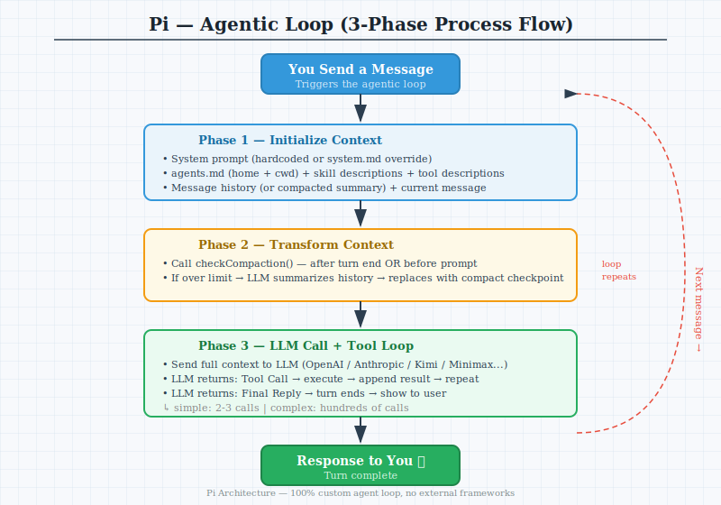
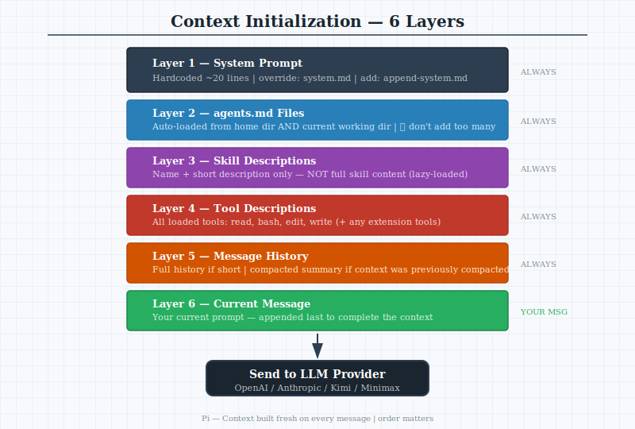
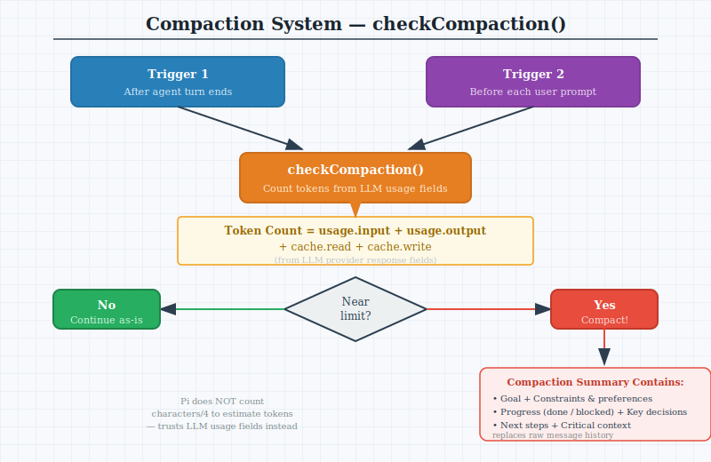
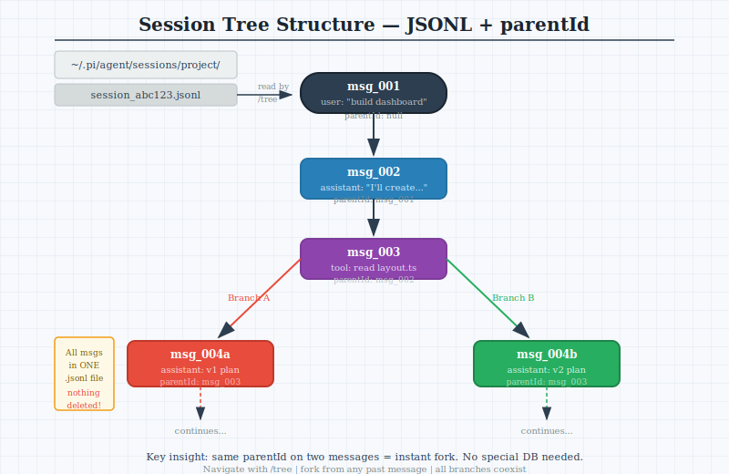
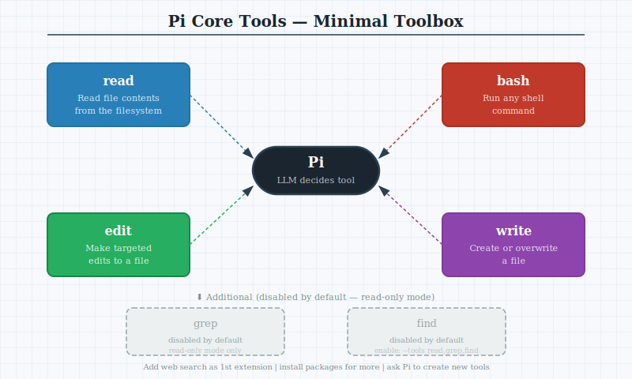
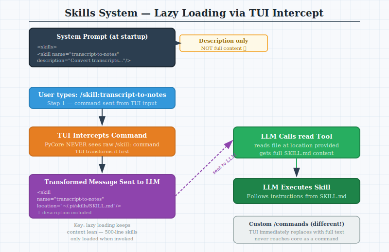

# Pi Architecture — EXPLAINED: Agent Loop, Tools, TUI and More
### GoodNotes-Style Study Notes | ADHD-Friendly Edition
> 📅 2026-06-18 | ⏳ ~65 min total | 📖 13 pages

---

--

-- Page 1: Introduction — What is Pi?

## Header
⏱️ ~3 min | 📚 Intro | ⚡ Easy

## What You'll Learn
Why Pi is a beautifully minimalist AI coding agent and why understanding its architecture helps you build your own.

## Core Idea (60 sec)
- Pi is a minimalist AI coding agent built entirely from scratch
- Two main parts: **PyCore** (the engine) and **PyInteractive** (the interface)

## Visual Summary
```
┌─────────────────────────────────────────────┐
│                    Pi                        │
│  ┌──────────────────┐ ┌─────────────────┐   │
│  │    PyCore         │ │  PyInteractive  │   │
│  │  • Agentic Loop   │ │  • TUI / CLI    │   │
│  │  • Sessions       │ │  • Skills       │   │
│  │  • Tools          │ │  • Extensions   │   │
│  └──────────────────┘ └─────────────────┘   │
└─────────────────────────────────────────────┘
```

## Real-World Use First
Scenario: You open Pi in your terminal and type a message  
Why it matters: Understanding what happens gives you power to debug, customize, and build your own agents

## Key Concepts
- **Pi**: A minimalist AI coding agent, entirely custom-built, no external frameworks
- **PyCore**: The agentic loop — handles conversations, tools, sessions
- **PyInteractive**: The interface layer — TUI, CLI entry, skills, extensions
- **RPC Mode**: Pi can also be called programmatically, not just interactively

## Quick Facts
Q: What are the two main parts of Pi?  A: PyCore (engine) and PyInteractive (TUI/CLI)  
Q: Does Pi use external agent frameworks (e.g. OpenAI Agents SDK)?  A: No — 100% custom-built

## Try This Right Now
- Open Pi in a terminal and notice the bar at the bottom + the message area — that's PyInteractive
- Send a simple message and observe the response — that's PyCore at work

## Common Mistakes
- Thinking Pi is just a wrapper around existing agent frameworks
- Confusing PyCore (the engine) with PyInteractive (the interface)

## Flashcards
| Q | A |
|---|---|
| What is Pi's design philosophy? | Minimalist, custom-built, no external agent libraries |
| What is PyCore? | The agentic loop engine (sessions, tools, LLM calls) |
| What is PyInteractive? | The interactive layer: TUI, CLI, skills, and extensions |
| Can Pi be used programmatically? | Yes — via RPC or STDIO |

## Spaced Repetition
- Day 1: Name the 2 parts of Pi and their responsibilities
- Day 3: Explain what "custom-built" means for Pi's architecture
- Day 7: Draw the two-box Pi architecture diagram from memory
- Day 14: Compare Pi to an agent that uses OpenAI Agents SDK
- Day 30: Teach the two-layer Pi design to someone unfamiliar with agents

## One-Page Revision
- Pi = PyCore (engine) + PyInteractive (interface)
- Completely custom — no external agent loop libraries
- Designed to be studied and recreated
- Can run interactively (TUI) or programmatically (RPC/STDIO)

## Checkpoint
- [ ] I can explain what Pi is and why its two-part design is notable in one sentence

## 30-Day Memory Bullets
- Pi is a minimalist AI coding agent
- Two parts: PyCore (engine) and PyInteractive (UI)
- No external agent framework libraries used
- Core = agent loop + sessions + tools
- Interactive = TUI + CLI + skills + extensions
- Can be called via RPC programmatically
- Architecture is modular and pluggable
- Built from scratch, educational to recreate

--

-- Page 2: The Agentic Loop — Core Engine Overview

## Header
⏱️ ~4 min | 📚 PyCore | ⚡ Medium

## What You'll Learn
The exact sequence of steps Pi executes every time you send a message — the beating heart of any AI agent.

## Core Idea (60 sec)
- Every message you send triggers a fixed 3-phase loop: Initialize → Transform → LLM Call
- This loop is the same whether it's your first message or your hundredth

## Visual Summary
```
You send message
       │
       ▼
┌─────────────┐
│  1. Init     │  ← Build context (system prompt + history + message)
│   Context    │
└──────┬──────┘
       │
       ▼
┌─────────────┐
│  2. Transform│  ← Check if compaction needed; compact if so
│   Context    │
└──────┬──────┘
       │
       ▼
┌─────────────┐
│  3. LLM Call │  ← Send to model; get back tool calls OR final reply
│  + Tool Loop │
└──────┬──────┘
       │
       ▼
   Response ✓
```



## Real-World Use First
Scenario: You ask Pi to "refactor my auth module"  
Why it matters: Pi builds context, checks memory length, calls the LLM, reads/edits files, then replies — all via this loop

## Process Flow / Steps
1. **Initialize Context** — assemble system prompt + skills + tools + history + your message
2. **Transform Context** — check if compaction is needed; compact if so
3. **LLM Call** — send full context to selected model
4. **Tool Loop** — model calls tools (read/edit/bash/write); results fed back; repeat until done
5. **Final Reply** — model decides no more tool calls needed; emits response to you

## Key Concepts
- **Agent Loop**: The repeating cycle that processes every user message
- **Context Window**: The combined token budget holding system prompt + history + tools
- **Tool Call**: A structured request from the LLM to use a tool (e.g. read a file)
- **Turn**: One complete pass through the loop, ending in a final reply

## Quick Facts
Q: How many phases does the agentic loop have?  A: 3 (Init, Transform, LLM Call)  
Q: Can there be multiple tool calls in one turn?  A: Yes — hundreds if needed

## Try This Right Now
- Ask Pi something that requires a file edit — count the tool calls in the response stream

## Common Mistakes
- Thinking the agent loop is complex code — it's really just 3 phases, repeated
- Forgetting that tool call results are fed BACK into the LLM (not just printed)

## Flashcards
| Q | A |
|---|---|
| What are the 3 phases of Pi's agent loop? | Init Context → Transform Context → LLM Call |
| What happens after a tool call? | Result is fed back to LLM; loop continues |
| When does the loop end a turn? | When LLM emits a final reply (no more tool calls) |

## Spaced Repetition
- Day 1: Draw the 3-phase loop from memory
- Day 3: Describe what "Transform Context" does
- Day 7: Trace through a "refactor a file" request using the loop steps
- Day 14: Explain why tool results go back to the LLM
- Day 30: Build a diagram of the loop with edge cases (compaction, multi-tool)

## One-Page Revision
- 3 phases: Init → Transform → LLM Call
- Init builds the full context
- Transform checks/applies compaction
- LLM call feeds results back in a tool loop
- Loop ends when model stops requesting tools

## Checkpoint
- [ ] I can draw the 3-phase agentic loop without referring to notes

## 30-Day Memory Bullets
- Agent loop has 3 phases
- Phase 1: build context (system prompt + history + message)
- Phase 2: check and apply compaction if needed
- Phase 3: call LLM and run tool loop
- Tool results are fed back to LLM
- Loop continues until model replies without tool call
- Pi's loop is 100% custom code
- External alternatives: OpenAI Agents SDK, Vercel AI SDK

--

-- Page 3: Context Initialization — Building the System Prompt

## Header
⏱️ ~4 min | 📚 PyCore — Loop Phase 1 | ⚡ Medium

## What You'll Learn
Exactly what gets assembled into Pi's context before every LLM call, and how to extend it yourself.

## Core Idea (60 sec)
- Context is built in layers: system prompt → agents.md files → skill descriptions → tool descriptions → history → your message
- You can customize almost every layer

## Visual Summary
```
Context = 
  ┌─ System Prompt (hardcoded + override)
  ├─ agents.md files (home dir + cwd)
  ├─ Skill descriptions (short blurbs)
  ├─ Tool descriptions (all available tools)
  ├─ Message History (or compacted summary)
  └─ Your Current Message
```



## Real-World Use First
Scenario: You want Pi to always know your coding preferences  
Why it matters: Add an `agents.md` file in your home or working directory — Pi loads it automatically

## Process Flow / Steps
1. Load **system prompt** (hardcoded; override with `system.md` in `.pi/` or `--system-prompt` flag)
2. Append **agents.md** files from home directory AND current working directory
3. Append **skill descriptions** (name + short description, not full skill content)
4. Append **tool descriptions** for all loaded tools
5. Append **message history** (or compacted summary if previously compacted)
6. Append **your current message**

## Key Concepts
- **system.md**: Place in `.pi/` to override the default system prompt
- **append-system.md**: Place in `.pi/` to ADD to (not replace) the default prompt
- **agents.md**: Markdown file Pi auto-loads — use for persistent project context
- **Skill description**: Short summary loaded into context; full skill content loaded only when invoked

## Quick Facts
Q: Where does Pi look for agents.md files?  A: Home directory AND current working directory  
Q: How do you override the system prompt?  A: Create `system.md` in `.pi/` or use `--system-prompt` flag

## Try This Right Now
- Create an `agents.md` in your current project directory — start with "This is a TypeScript project using Node 20"
- Ask Pi about the project; it should know from context

## Common Mistakes
- Adding too many agents.md files — each one bloats the context window
- Not knowing that skill descriptions (not full content) go into the system prompt

## Flashcards
| Q | A |
|---|---|
| What 6 items make up Pi's context? | System prompt, agents.md, skill descs, tool descs, history, current message |
| How do you extend the system prompt without replacing it? | Create `append-system.md` in `.pi/` |
| What goes into context for skills? | Only the description — full content is loaded when skill is invoked |

## Spaced Repetition
- Day 1: List the 6 layers of Pi's context from memory
- Day 3: Explain the difference between `system.md` and `append-system.md`
- Day 7: Create an `agents.md` file for a real project
- Day 14: Explain why adding too many agents.md files is harmful
- Day 30: Design a context initialization for your own agent

## One-Page Revision
- 6 layers: system prompt → agents.md → skill descs → tool descs → history → current message
- Override system prompt with `system.md` in `.pi/`
- Add to system prompt with `append-system.md`
- Don't bloat with too many agents.md files

## Checkpoint
- [ ] I can list the 6 layers of Pi's context initialization in order

## 30-Day Memory Bullets
- Context has 6 layers assembled in sequence
- Layer 1: hardcoded system prompt (can be overridden)
- Layer 2: agents.md from home + cwd
- Layer 3: skill descriptions only (not full content)
- Layer 4: all tool descriptions
- Layer 5: message history or compacted summary
- Layer 6: current user message
- append-system.md adds to prompt without replacing it
- Too many agents.md = bloated context = worse performance

--

-- Page 4: Context Transformation — When and How Pi Compacts

## Header
⏱️ ~4 min | 📚 PyCore — Loop Phase 2 | ⚡ Medium

## What You'll Learn
How Pi decides when to compress conversation history to stay within the model's context window.

## Core Idea (60 sec)
- Pi calls `checkCompaction` at two moments: after every agent turn AND before every new prompt
- Instead of estimating tokens upfront, Pi trusts the LLM's own usage numbers in its response

## Visual Summary
```
After agent turn ends   Before prompt sent
         │                      │
         └──────────┬───────────┘
                    ▼
           checkCompaction()
                    │
          ┌─────────┴──────────┐
          │  Token count OK?   │
          │                    │
         Yes                  No
          │                    │
          ▼                    ▼
    Continue             Run LLM summarization
    as-is                Replace history with
                         compact summary
```



## Real-World Use First
Scenario: You're in a long debugging session and Pi seems slower  
Why it matters: Pi may be near its context limit; compaction will summarize prior work so the session can continue

## Process Flow / Steps
1. Agent turn ends OR user is about to send a prompt → trigger `checkCompaction`
2. Check token count: use LLM-provided usage if available (input + output + cache read + cache write)
3. If no usage in response → estimate: add `usage.input` + `usage.output` + `cache.read` + `cache.write`
4. If total is near the context limit → run compaction summarization
5. Compaction = send full history to LLM with special summarization prompt → get structured summary
6. Replace message history with this summary for all future turns

## Key Concepts
- **checkCompaction**: Pi's function to decide if history needs to be compressed
- **Compaction trigger**: After agent turn ends OR before next user prompt
- **Token estimation**: Uses LLM response usage fields (input + output + cache)
- **Compacted summary**: Structured checkpoint stored instead of raw message history

## Quick Facts
Q: When does Pi call checkCompaction?  A: After agent turn ends AND before each user prompt  
Q: How does Pi count tokens?  A: From LLM response usage fields (input + output + cache)

## Try This Right Now
- In a long Pi session, type `/compact` to manually trigger compaction and see the structured summary

## Common Mistakes
- Thinking Pi estimates tokens by counting characters/4 — it uses LLM response data instead
- Assuming compaction deletes context — it summarizes it into a structured checkpoint

## Flashcards
| Q | A |
|---|---|
| What triggers checkCompaction? | After agent turn ends + before each user prompt |
| How does Pi estimate tokens? | From LLM usage fields in the response |
| What does compaction output contain? | Goal, constraints, progress, decisions, next steps, critical context |

## Spaced Repetition
- Day 1: Name the 2 moments checkCompaction is called
- Day 3: Describe Pi's token-counting method vs character-counting
- Day 7: List the 6 sections of a compaction summary
- Day 14: Explain why compaction happens at turn end AND before prompt
- Day 30: Design a checkCompaction function for your own agent

## One-Page Revision
- checkCompaction fires at end of turn + before prompt
- Uses LLM response usage fields to count tokens
- If too long → run LLM summarization with special prompt
- Summary format: goal / constraints / progress / decisions / next steps / critical context

## Checkpoint
- [ ] I can explain when and why Pi compacts its context

## 30-Day Memory Bullets
- checkCompaction called twice: after turn ends + before prompt
- Doesn't estimate from character count — uses LLM usage fields
- Adds input + output + cache.read + cache.write for total
- If near limit → run compaction summarization
- Compaction uses a custom LLM prompt to generate structured summary
- Summary has: goal, constraints, progress, blocked, decisions, next steps, critical context
- Summary replaces raw message history
- Pi's approach is minimal — no upfront token counting

--

-- Page 5: The LLM Call & Tool Execution Loop

## Header
⏱️ ~4 min | 📚 PyCore — Loop Phase 3 | ⚡ Medium

## What You'll Learn
What actually happens when Pi calls the LLM — how tool calls work and how results flow back.

## Core Idea (60 sec)
- Pi sends the full assembled context to the LLM → model either makes a tool call OR gives a final reply
- Tool results flow back into the LLM; this repeats until no more tool calls

## Visual Summary
```
Send context to LLM
        │
        ▼
   LLM responds
        │
   ┌────┴────┐
   │         │
Tool Call  Final Reply
   │         │
   ▼         ▼
Execute   Return to user ✓
  tool
   │
   ▼
Append result
to context
   │
   └──► Send to LLM again (repeat)
```

## Real-World Use First
Scenario: Pi needs to refactor auth.ts  
Flow: read auth.ts → analyse → edit auth.ts → run tests → final reply  
Each step above = one tool call → result → next LLM call

## Process Flow / Steps
1. Full context (with assembled prompt + history) sent to configured LLM provider
2. LLM returns either: **(a) tool call** or **(b) final text reply**
3. If tool call: Pi executes the tool, captures output, appends to context
4. LLM is called again with the updated context including tool result
5. Steps 3-4 repeat until LLM returns a final text reply
6. Final reply is shown to the user; turn ends

## Key Concepts
- **Tool call**: Structured JSON returned by LLM specifying which tool to invoke and with what args
- **Tool result**: The output of executing that tool, appended back to context
- **Provider**: Which LLM serves the call — can be OpenAI, Anthropic, Kimi, Minimax, etc.
- **Turn**: Entire tool loop from first LLM call to final reply

## Quick Facts
Q: How many tool calls can happen in one turn?  A: Unlimited — simple queries use 2-3, complex tasks hundreds  
Q: Which LLM providers does Pi support?  A: OpenAI, Anthropic, Kimi, Minimax, and others

## Try This Right Now
- Ask Pi to "read my package.json and summarize it" — watch it execute the read tool and return results

## Common Mistakes
- Thinking each tool call = a separate conversation turn — it's all one turn
- Assuming the LLM picks the tool — Pi executes whatever the LLM specifies

## Flashcards
| Q | A |
|---|---|
| What can the LLM return in Phase 3? | A tool call OR a final text reply |
| What happens after a tool is executed? | Result is appended to context and LLM is called again |
| What ends a turn? | LLM returns a reply without requesting any tool call |

## Spaced Repetition
- Day 1: Draw the tool call loop with 2 iterations
- Day 3: Name 3 LLM providers Pi supports
- Day 7: Trace a "refactor file" request through all tool call steps
- Day 14: Explain why tool results must go back into the LLM
- Day 30: Design the tool execution loop for your own agent

## One-Page Revision
- LLM gets full context → returns tool call or final reply
- If tool call → execute → append result → call LLM again
- Repeat until LLM returns final reply
- Supports multiple providers; simple = few calls, complex = hundreds

## Checkpoint
- [ ] I can trace a multi-step task through the tool execution loop

## 30-Day Memory Bullets
- Phase 3 sends full context to the LLM provider
- LLM can respond with tool call or final reply
- Tool call is structured JSON (tool name + args)
- Pi executes the tool and appends result to context
- LLM is called again with updated context
- Loop repeats until LLM emits final reply
- Supports OpenAI, Anthropic, Kimi, Minimax, and more
- Simple tasks = 2-3 calls; complex tasks = hundreds

--

-- Page 6: Sessions & Memory — JSONL Storage

## Header
⏱️ ~4 min | 📚 Sessions | ⚡ Easy

## What You'll Learn
Where and how Pi stores your conversation sessions — and why JSONL is the ideal format for this.

## Core Idea (60 sec)
- Sessions are stored as JSONL files (one JSON object per line) organized by working directory
- JSONL allows appending new messages without rewriting the entire file

## Visual Summary
```
~/.pi/agent/sessions/
├── users--alejandro--dashboard/
│   └── session_abc123.jsonl
├── users--alejandro--weather-app/
│   └── session_def456.jsonl
└── ...

One line = one message:
{"id":"222","parentId":"111","type":"message","role":"user","content":"...","timestamp":"..."}
{"id":"333","parentId":"222","type":"tool_call","content":"...","timestamp":"..."}
```

## Real-World Use First
Scenario: You worked on a bug last week and want to see what Pi did  
Why it matters: Navigate to the JSONL file in ~/.pi/agent/sessions — every message is there, readable in any editor

## Process Flow / Steps
1. Pi maps sessions to working directories (path encoded as directory name)
2. Each session = one `.jsonl` file with a unique ID
3. Every message (user, assistant, tool call, tool result) is appended as a new JSON line
4. Each line contains: `id`, `parentId`, `type`, `role`, `content`, `timestamp`
5. Compacted summaries replace raw history lines when compaction occurs

## Key Concepts
- **JSONL**: JSON Lines — one JSON object per line; easy to append without parsing the whole file
- **Session file**: `.jsonl` file in `~/.pi/agent/sessions/<directory>/`
- **Working directory mapping**: Sessions are organized by the directory Pi was run in
- **Append-only**: New messages are always appended to end — never overwrites old lines

## Quick Facts
Q: Where are Pi sessions stored?  A: `~/.pi/agent/sessions/<working-directory>/`  
Q: Why JSONL instead of JSON?  A: Appending a new message = adding one line, not rewriting an array

## Try This Right Now
- In a terminal: `ls ~/.pi/agent/sessions/` and explore the directory structure
- Open a `.jsonl` file in VS Code — each line is a message

## Common Mistakes
- Thinking sessions are stored as a JSON array — they're JSONL (one object per line)
- Assuming sessions are lost when you close Pi — they're persisted on disk

## Flashcards
| Q | A |
|---|---|
| What format are sessions stored in? | JSONL (one JSON object per line) |
| How are session directories named? | Based on the working directory path |
| What's the advantage of JSONL for sessions? | Append new messages without rewriting the whole file |

## Spaced Repetition
- Day 1: Locate your Pi session files on disk
- Day 3: Explain why JSONL is better than JSON array for sessions
- Day 7: Open a session file and identify each message type
- Day 14: Describe the 5 fields in each message object
- Day 30: Design a session storage format for your own agent using JSONL

## One-Page Revision
- Sessions stored at `~/.pi/agent/sessions/<working-dir>/`
- JSONL format: one JSON object per line
- Each message: id, parentId, type, role, content, timestamp
- Append-only: no rewrites, just new lines
- Sessions organized by working directory

## Checkpoint
- [ ] I can explain where sessions are stored and why JSONL is used

## 30-Day Memory Bullets
- Sessions stored in ~/.pi/agent/sessions/
- Organized by working directory (path encoded as folder name)
- Format is JSONL — one JSON object per line
- Appending a new message = writing one new line
- Each message has: id, parentId, type, role, content, timestamp
- JSONL avoids full-file rewrite on every new message
- Compaction replaces history lines with summary
- Sessions are fully readable in any text editor

--

-- Page 7: Session Tree Structure — Forking Conversations

## Header
⏱️ ~4 min | 📚 Sessions — Tree Design | ⚡ Medium

## What You'll Learn
Why Pi sessions are a tree (not a list) and how the `parentId` field enables conversation forking.

## Core Idea (60 sec)
- Every message has a `parentId` pointing to the message it branched from — this creates a tree automatically
- You can fork at any point (`/tree` to navigate, select a past node, start fresh from there)

## Visual Summary
```
msg_001 (user: "build a dashboard")
  └── msg_002 (assistant: "I'll create components")
        └── msg_003 (tool: read layout.ts)
              ├── msg_004a (assistant: "Here's v1 plan")   ← Branch A
              │     └── msg_005a (user: "ok go ahead")
              └── msg_004b (assistant: "Here's v2 plan")   ← Branch B
                    └── msg_005b (user: "use this instead")
```



## Real-World Use First
Scenario: Pi suggested a refactor you didn't like — but you're 10 messages in  
Why it matters: Use `/tree` to navigate back to before the suggestion and fork a new conversation from there

## Process Flow / Steps
1. Every message written to JSONL has an `id` field (unique) and a `parentId` (previous message's id)
2. Messages with the SAME `parentId` = forked branches from the same parent
3. Pi reads the tree by following `parentId` chains
4. `/tree` command in TUI shows all branches visually
5. You can select any node to jump back and fork a new branch from that point
6. All branches live in the same `.jsonl` file — nothing is deleted

## Key Concepts
- **parentId**: Reference to the previous message — creates the tree structure
- **Fork**: Start a new branch from any past message; both branches coexist in the file
- **/tree**: TUI command to visualize and navigate all conversation branches
- **Branch**: A path through the conversation tree; multiple can stem from one parent

## Quick Facts
Q: What field creates Pi's tree structure?  A: `parentId` in every message object  
Q: Where do multiple branches live?  A: All in the same `.jsonl` file — co-existing

## Try This Right Now
- In a Pi session with multiple messages: type `/tree` and observe the branching structure
- Select a past node and continue — notice a new branch is created

## Common Mistakes
- Thinking forking deletes the original branch — both branches stay in the same file
- Assuming this requires a separate database — it's just `parentId` references in flat JSONL

## Flashcards
| Q | A |
|---|---|
| How does Pi create a session tree? | Every message has parentId pointing to its parent |
| How do you navigate the tree in Pi? | Use the /tree command |
| Can you have multiple forks in one session? | Yes — unlimited forks, all in the same JSONL file |

## Spaced Repetition
- Day 1: Draw a session tree with 2 branches from memory
- Day 3: Explain how parentId enables tree structure in a flat file
- Day 7: Use /tree in a real session and identify branches
- Day 14: Compare Pi's tree approach to a simple message list
- Day 30: Design parentId-based tree structure for your own agent

## One-Page Revision
- Each message has `id` + `parentId`
- Two messages with same `parentId` = two branches
- `/tree` visualizes all branches in TUI
- All branches in same `.jsonl` — nothing deleted
- This design is becoming standard in modern agents

## Checkpoint
- [ ] I can explain how parentId creates a tree structure from a flat JSONL file

## 30-Day Memory Bullets
- Each message has unique id and parentId
- parentId points to the message it branched from
- Two messages with same parentId = forked branches
- All branches stored in same JSONL file
- /tree command shows branching visually in TUI
- Navigate to any past node and start a new branch
- Original branch is preserved — nothing is deleted
- Tree design is a trend in modern AI agents (replacing simple lists)

--

-- Page 8: Core Tools — The Minimal Toolbox

## Header
⏱️ ~3 min | 📚 Tools | ⚡ Easy

## What You'll Learn
Pi's deliberately minimal tool set — 4 core tools — and why this is enough for most coding tasks.

## Core Idea (60 sec)
- Pi ships with 4 tools: **read**, **bash**, **edit**, **write**
- Grep and find also exist but are disabled by default (read-only mode only)

## Visual Summary
```
┌────────────┬─────────────────────────────────────┐
│  Tool      │  What it does                        │
├────────────┼─────────────────────────────────────┤
│  read      │  Read file contents                  │
│  bash      │  Run any shell command               │
│  edit      │  Make targeted edits to a file       │
│  write     │  Write/create a new file             │
├────────────┼─────────────────────────────────────┤
│  grep*     │  Search file contents (disabled)     │
│  find*     │  Find files by pattern (disabled)    │
└────────────┴─────────────────────────────────────┘
* Enabled only with --tools flag for read-only mode
```



## Real-World Use First
Scenario: You want Pi to refactor a function  
Flow: read tool → analyse → edit tool → bash tool (run tests) → done  
All with just 3 tools!

## Process Flow / Steps
1. LLM decides which tool to call and with what arguments
2. Pi executes the tool (file I/O, shell command, etc.)
3. Result is returned to the LLM as a tool response
4. For read-only mode: run Pi with `--tools read,grep,find` to restrict to safe tools
5. Add extra tools: ask Pi to create a new tool, or install packages

## Key Concepts
- **read**: Read any file from the filesystem
- **bash**: Execute arbitrary shell commands
- **edit**: Apply targeted changes to an existing file
- **write**: Create or overwrite a file
- **Read-only mode**: `--tools read,grep,find` — useful for programmatic/RPC use

## Quick Facts
Q: How many default tools does Pi have?  A: 4 (read, bash, edit, write)  
Q: What tools are disabled by default and why?  A: grep and find — they're for read-only mode only  
Q: What tool would you add for web access?  A: Web search (the author's recommended first addition)

## Try This Right Now
- Ask Pi to "show me all functions in main.ts" — watch it use the read tool
- Run Pi with `--tools read` to test read-only mode

## Common Mistakes
- Thinking Pi needs MCP or browser tools built-in — it doesn't; install as extensions
- Assuming grep/find are always available — they're off by default

## Flashcards
| Q | A |
|---|---|
| What are Pi's 4 default tools? | read, bash, edit, write |
| Why are grep and find disabled? | They're designed for read-only/RPC mode only |
| How do you add web search to Pi? | Install it as an extension |

## Spaced Repetition
- Day 1: List Pi's 4 default tools from memory
- Day 3: Explain the difference between edit and write
- Day 7: Design a 3-tool workflow for a coding task
- Day 14: Explain why a minimal toolset is actually powerful
- Day 30: Compare Pi's tool design to an agent with 20+ tools

## One-Page Revision
- 4 tools: read / bash / edit / write
- grep and find exist but disabled by default (read-only mode)
- Add tools via extensions or install packages
- Author recommends adding web search as first extension
- Use `--tools` flag to restrict to specific tools for safety

## Checkpoint
- [ ] I can name Pi's 4 default tools and explain when to use each

## 30-Day Memory Bullets
- Pi ships with exactly 4 tools: read, bash, edit, write
- read: reads file contents
- bash: runs shell commands
- edit: makes targeted file edits
- write: creates or overwrites files
- grep and find are available but off by default
- Enable grep/find for read-only/RPC mode with --tools flag
- Web search is the recommended first extension to add
- Minimal tools = focused, predictable, auditable agent behaviour

--

-- Page 9: Extensions — Extending Pi's Capabilities

## Header
⏱️ ~4 min | 📚 Extensions | ⚡ Medium

## What You'll Learn
How Pi's extension system lets you add new tools, subscribe to events, and modify the agent without touching core code.

## Core Idea (60 sec)
- Extensions are TypeScript packages that plug into Pi's event system
- They can add tools, commands, keyboard shortcuts, system prompt content, and custom message rendering

## Visual Summary
```
Pi Agent Loop emits events:
  • tool_call
  • agent_response
  • user_message
  • ... (every loop step)

Extension subscribes to event → runs code at that moment

Extension can also:
  → Register new tools
  → Register slash commands
  → Add keyboard shortcuts
  → Add CLI flags
  → Update system prompt
  → Render custom messages
```

## Real-World Use First
Scenario: You want Pi to search the web before answering coding questions  
Why it matters: Install the web-search extension — it registers a new tool and Pi can use it immediately

## Process Flow / Steps
1. Write extension as TypeScript package
2. Package defines which events to subscribe to and what to do
3. When Pi starts, it loads all installed extensions
4. Extension hooks fire at the appropriate points in the agent loop
5. New tools registered by extensions appear in Pi's tool list
6. Custom commands/shortcuts available immediately in TUI

## Key Concepts
- **Extension**: A TypeScript package that plugs into Pi's event system
- **Event subscription**: Register to fire code when specific loop events occur
- **Tool registration**: Add entirely new tools (e.g. web search, browser, API calls)
- **Modular design**: Pi's architecture explicitly supports this — no hacks needed

## Quick Facts
Q: What language are Pi extensions written in?  A: TypeScript  
Q: What can extensions NOT do that only PyCore can?  A: Modify the core agent loop logic itself  
Q: Should you install untrusted third-party extensions?  A: No — they execute code on your system

## Try This Right Now
- Check Pi's packages directory for available extensions
- Install the web-search extension if available and ask Pi a question requiring web lookup

## Common Mistakes
- Installing extensions from untrusted sources — they run code on your machine
- Thinking you need to fork Pi to add new tools — extensions handle this cleanly

## Flashcards
| Q | A |
|---|---|
| What can extensions do? | Add tools, subscribe events, add commands, update prompt, render messages |
| What language are extensions written in? | TypeScript |
| Why be careful with third-party extensions? | They execute code on your system |

## Spaced Repetition
- Day 1: List 5 things an extension can do in Pi
- Day 3: Explain event subscription in Pi's architecture
- Day 7: Design an extension concept for a task you automate regularly
- Day 14: Explain why Pi's modular design makes extensions clean
- Day 30: Build a simple TypeScript extension that subscribes to agent_response

## One-Page Revision
- Extensions = TypeScript packages plugged into Pi's event system
- Can: register tools, subscribe events, add commands/shortcuts/flags, update prompt, render messages
- Pi emits events at every loop step (tool_call, agent_response, user_message, etc.)
- Don't install untrusted packages — they run on your system
- Extensions are the right way to add capabilities; no forking needed

## Checkpoint
- [ ] I can list 5 things extensions can do and explain why they're safe or not

## 30-Day Memory Bullets
- Extensions are TypeScript packages
- Plug into Pi's event emitter system
- Pi emits events at every agent loop step
- Extensions can subscribe to any event
- Can register new tools (e.g. web search)
- Can add slash commands and keyboard shortcuts
- Can add CLI flags
- NEVER install third-party extensions from untrusted sources

--

-- Page 10: System Prompt Deep Dive — What Pi Tells Itself

## Header
⏱️ ~3 min | 📚 System Prompt | ⚡ Easy

## What You'll Learn
What Pi's default system prompt contains and the exact mechanisms to customize it.

## Core Idea (60 sec)
- Pi's system prompt is ~20 lines — extremely minimal
- It tells the agent what it is, lists skills with markup tags, and includes current date + working directory

## Visual Summary
```
System Prompt contents:
  ├─ "You are Pi, a helpful assistant..."   (~3 lines)
  ├─ <skills>                               (skill name + description, markup tags)
  │     <skill name="..." description="...">
  │     </skill>
  │   </skills>
  ├─ Current date
  └─ Current working directory

How to customize:
  system.md      → REPLACE entire prompt
  append-system.md → ADD to end of prompt
  --system-prompt flag → REPLACE via CLI
```

## Real-World Use First
Scenario: You want Pi to always use strict TypeScript style  
Why it matters: Add to `append-system.md`: "Always use strict TypeScript. Prefer interfaces over type aliases."

## Key Concepts
- **System prompt**: The root instruction set passed to the LLM at every turn
- **Skills markup**: Skills are embedded with XML-like tags in the prompt — this allows TUI to parse them
- **append-system.md**: Adds your content after Pi's default prompt without replacing it
- **system.md**: Completely replaces Pi's default prompt — use with caution

## Quick Facts
Q: How long is Pi's default system prompt?  A: ~20 lines  
Q: What's the safest way to extend it?  A: `append-system.md` (add-only, doesn't break defaults)

## Try This Right Now
- Open `~/.pi/system.md` if it exists — or check the default prompt linked in Pi's repo
- Create `append-system.md` with one personal coding preference

## Flashcards
| Q | A |
|---|---|
| How is Pi's system prompt structure notable? | ~20 lines — extremely minimalist |
| What markup wraps skill listings in the prompt? | XML-like skill/skills tags |
| What's the difference between system.md and append-system.md? | system.md replaces; append-system.md adds |

## Spaced Repetition
- Day 1: Describe Pi's 4 system prompt sections from memory
- Day 3: Create your own append-system.md with useful preferences
- Day 7: Explain why skills use markup tags in the prompt
- Day 14: Write a complete custom system.md for a specialized agent
- Day 30: Design system prompt strategy for a new agent you're building

## One-Page Revision
- ~20 lines — "you are Pi, helpful assistant"
- Skills listed with XML markup tags (for TUI parsing)
- Includes current date + working directory
- Override: system.md / --system-prompt flag
- Add: append-system.md (recommended)

## Checkpoint
- [ ] I can describe Pi's system prompt structure and explain how to extend it

## 30-Day Memory Bullets
- Pi's system prompt is ~20 lines — very minimal
- Contains: identity + skills markup + date + cwd
- Skills use XML-like markup tags in the prompt
- TUI parses these tags later for skill invocation
- Override prompt: system.md in .pi/ or --system-prompt flag
- Add to prompt: append-system.md in .pi/
- append-system.md is safer than full override
- Current date and cwd are injected automatically

--

-- Page 11: CLI Entry Point — From Command to Agent Session

## Header
⏱️ ~3 min | 📚 PyInteractive — CLI | ⚡ Medium

## What You'll Learn
How typing `pi` in a terminal becomes a running agent session — the two files that make it work.

## Core Idea (60 sec)
- Two files handle startup: `client.ts` (receives the command) and `main.ts` (orchestrates everything)
- It's not until `main.ts` that the actual agent session is created

## Visual Summary
```
User types: pi

client.ts
  ├─ Receives pi command
  ├─ Sets process title
  └─ Calls main()

main.ts
  ├─ Parses arguments
  ├─ Resolves configuration (working dir, etc.)
  ├─ Loads extensions
  ├─ Creates agent session  ← PyCore initialized HERE
  └─ Runs in selected mode:
       • Interactive (TUI)
       • RPC (programmatic)
       • STDIO (single prompt via CLI)
```

## Real-World Use First
Scenario: You want to call Pi from a CI pipeline non-interactively  
Why it matters: Use STDIO mode — pass your prompt as argument; Pi runs, responds, exits

## Key Concepts
- **client.ts**: Entry point; receives command, delegates to main
- **main.ts**: Parses args, loads config, loads extensions, creates session, runs mode
- **Interactive mode**: Full TUI experience
- **RPC mode**: Programmatic API calls to Pi
- **STDIO mode**: Pass a prompt via CLI arg; Pi runs once and exits

## Quick Facts
Q: Which file calls main()?  A: client.ts  
Q: When is the PyCore agent session actually created?  A: In main.ts, after args, config, and extensions are loaded

## Try This Right Now
- Run `pi "what files are in this directory?"` (STDIO mode) — no TUI, just a direct answer

## Common Mistakes
- Thinking the agent starts immediately on `pi` — it waits until main.ts finishes setup
- Not knowing STDIO mode exists — useful for scripting and automation

## Flashcards
| Q | A |
|---|---|
| What does client.ts do? | Receives pi command, sets process title, calls main() |
| What does main.ts do? | Parse args → resolve config → load extensions → create agent session → run mode |
| What are Pi's 3 run modes? | Interactive (TUI), RPC, STDIO |

## Spaced Repetition
- Day 1: List the steps main.ts performs in order
- Day 3: Explain the difference between RPC and STDIO mode
- Day 7: Write a shell script using Pi in STDIO mode for automation
- Day 14: Map out a custom CLI entry point for your own agent
- Day 30: Design a complete entry point architecture for your agent

## One-Page Revision
- client.ts → receives command → calls main()
- main.ts → parse args → resolve config → load extensions → create session → run mode
- 3 modes: Interactive (TUI), RPC, STDIO
- Agent session (PyCore) created only after all setup in main.ts

## Checkpoint
- [ ] I can describe the startup sequence from `pi` command to running agent session

## 30-Day Memory Bullets
- Two files: client.ts and main.ts
- client.ts: entry point, sets process title, calls main()
- main.ts: parses args, resolves config, loads extensions
- Agent session created in main.ts (not before)
- 3 run modes: interactive TUI, RPC, STDIO
- STDIO: pass prompt as argument; useful for scripting
- RPC: programmatic access to Pi's capabilities
- Extensions loaded before session creation in main.ts

--

-- Page 12: Terminal User Interface — The TUI Design

## Header
⏱️ ~4 min | 📚 PyInteractive — TUI | ⚡ Medium

## What You'll Learn
Why Pi's TUI is notable, how it's built, and the component model that makes it fast and flicker-free.

## Core Idea (60 sec)
- Pi's TUI is completely custom — no Textual, no React Terminal, no third-party UI lib
- It's component-based: each component manages its own rendering, input handling, and dynamic updates

## Visual Summary
```
TUI Layout:
┌─────────────────────────────────────┐
│                                     │
│   Message Area (scrollable)         │  ← Component: MessageView
│   • User messages                   │
│   • Tool calls + results            │
│   • Assistant responses             │
│                                     │
├─────────────────────────────────────┤
│  Input area                         │  ← Component: InputBar
├─────────────────────────────────────┤
│  Status bar [model | tokens | dir]  │  ← Component: StatusBar
└─────────────────────────────────────┘
```

## Real-World Use First
Scenario: You notice Pi doesn't flicker when updating output  
Why it matters: The component-based rendering avoids full screen redraws — each component only updates its own region

## Key Concepts
- **Custom TUI**: Built entirely in TypeScript for Pi — no external TUI libraries
- **Component-based**: Each component = own render logic + input handling + dynamic updates
- **Event subscription**: Components subscribe to agent loop events to update dynamically
- **No flicker**: Each component redraws independently — no full screen clear/redraw

## Quick Facts
Q: What external library does Pi use for its TUI?  A: None — it's 100% custom-built  
Q: How do components stay updated during a Pi response?  A: They subscribe to agent loop events

## Try This Right Now
- Notice the status bar updating in real time during a long response — that's a component event subscription at work

## Common Mistakes
- Assuming Pi uses a TUI framework like Textual or Blessed
- Thinking you must use Pi's TUI — you can replace it with your own interface

## Flashcards
| Q | A |
|---|---|
| Is Pi's TUI based on any framework? | No — completely custom TypeScript |
| What makes Pi's TUI component-based? | Each component owns its own render, input, and update logic |
| How do components react to agent events? | By subscribing to events emitted by the agent loop |

## Spaced Repetition
- Day 1: Name the 3 main regions of Pi's TUI
- Day 3: Explain what "component-based" means for TUI rendering
- Day 7: Describe how components subscribe to agent loop events
- Day 14: Compare Pi's TUI approach to a Textual-based TUI
- Day 30: Sketch a component architecture for a TUI you would build

## One-Page Revision
- Completely custom TUI — no external frameworks
- 3 main regions: message area, input bar, status bar
- Component-based: each component owns render + input + updates
- Components subscribe to agent loop events for dynamic updates
- No flicker: components update independently

## Checkpoint
- [ ] I can explain Pi's TUI design and why it's notable

## 30-Day Memory Bullets
- TUI is completely custom — no Textual or similar libs
- 3 main areas: message view, input bar, status bar
- Component-based architecture
- Each component handles its own rendering and input
- Components can update dynamically via event subscriptions
- No flicker because components don't trigger full screen redraws
- Completely replaceable — you can build your own TUI on top of PyCore
- TypeScript only — modular and extensible

--

-- Page 13: Skills System — How Pi Reads and Uses Skills

## Header
⏱️ ~4 min | 📚 Skills System | ⚡ Hard

## What You'll Learn
The clever two-step process by which Pi makes skill descriptions available to the LLM while keeping full content lazy-loaded.

## Core Idea (60 sec)
- Skills are `.md` files with detailed instructions; only their **description** goes into the system prompt
- When a skill is invoked, the TUI intercepts the command and sends the skill's **location** — Pi reads it on demand

## Visual Summary
```
System Prompt (always present):
  <skills>
    <skill name="transcript-to-notes" description="Convert transcripts to study notes..."/>
  </skills>

User invokes: /skill:transcript-to-notes
                     │
         Intercepted by TUI layer
                     │
                     ▼
  Message transformed to:
  <skill name="transcript-to-notes"
         description="..."
         location="~/.pi/skills/transcript-to-notes/SKILL.md"/>
                     │
                     ▼
      LLM receives this message
      LLM calls read tool on location
      Reads full SKILL.md content
      Executes skill instructions
```



## Real-World Use First
Scenario: You invoke `/skill:transcript-to-notes`  
Why it matters: Pi doesn't embed 500 lines of skill instructions into every prompt — it reads them only when needed, keeping context lean

## Process Flow / Steps
1. Skill descriptions (short) are listed in system prompt at startup
2. User types `/skill:<name>` in TUI
3. TUI intercepts the command (never reaches PyCore raw)
4. TUI transforms it into a structured message with: name, description, and **file location**
5. This transformed message is sent to the LLM
6. LLM calls `read` tool on the provided location to get full skill content
7. LLM then executes the skill's instructions
8. Custom `/commands` (not skills): TUI replaces them with full prompt text directly — never reach PyCore

## Key Concepts
- **Skill**: A `.md` file with detailed instructions — only description in system prompt
- **Skill invocation**: `/skill:<name>` — intercepted by TUI, not passed raw to PyCore
- **Lazy loading**: Full skill content loaded by LLM on demand via read tool
- **Custom commands**: Slash commands that are simple prompt replacements — fully expanded at TUI layer

## Quick Facts
Q: Does the LLM get the full skill content automatically?  A: No — it reads the skill file via the read tool when needed  
Q: What's the difference between a skill and a custom command?  A: Skills are lazy-loaded by the LLM; commands are fully expanded at TUI layer

## Try This Right Now
- Invoke a skill with `/skill:` prefix and watch the tool call that reads the SKILL.md file

## Common Mistakes
- Thinking skill content is always in the system prompt — only descriptions are
- Confusing skills (lazy-loaded) with custom slash commands (fully expanded immediately)

## Flashcards
| Q | A |
|---|---|
| What does the system prompt contain for skills? | Only name and description — not full content |
| How does Pi load full skill content? | LLM uses read tool on the skill's file location |
| How are custom /commands different from skills? | Commands are expanded to full text at TUI layer immediately |

## Spaced Repetition
- Day 1: Describe the 7-step skill invocation flow
- Day 3: Explain why lazy-loading skill content keeps context lean
- Day 7: Compare skills to custom commands — list 3 differences
- Day 14: Design a skill system for your own agent
- Day 30: Implement the TUI intercept logic for skill invocation in pseudocode

## One-Page Revision
- System prompt: skill descriptions only (not content)
- `/skill:name` intercepted by TUI → transformed with file location
- LLM calls read tool on location → gets full content → executes
- Custom commands: expanded fully at TUI layer, never reach core raw
- This keeps context lean — full instructions only loaded when needed

## Checkpoint
- [ ] I can trace the full skill invocation path from user command to LLM execution

## 30-Day Memory Bullets
- Skill descriptions go into system prompt at startup
- Full skill content is NOT in the system prompt
- /skill:name is intercepted by the TUI layer
- TUI adds name, description, and file location to message
- LLM receives location and calls read tool to load full content
- This is lazy loading — content loaded only when skill is invoked
- Custom commands work differently — TUI replaces with full text immediately
- Skill files are .md files in ~/.pi/skills/ or project .pi/skills/


--

## Course Summary — Pi Architecture Quick Reference

```
┌───────────────────────────────────────────────────────────────┐
│                    Pi Architecture at a Glance                │
├───────────────────────────────────────────────────────────────┤
│  PyCore (engine):                                             │
│    Agent Loop: Init → Transform → LLM Call + Tool Loop        │
│    Sessions: JSONL tree structure with parentId               │
│    Tools: read / bash / edit / write (4 default)              │
│    Compaction: checkCompaction after turn + before prompt     │
├───────────────────────────────────────────────────────────────┤
│  PyInteractive (interface):                                   │
│    CLI: client.ts → main.ts → create session → run mode       │
│    TUI: custom component-based, no framework                  │
│    Skills: lazy-loaded — description in prompt, content read  │
│    Extensions: TypeScript packages subscribing to events      │
│    System Prompt: ~20 lines, extend via append-system.md      │
└───────────────────────────────────────────────────────────────┘
```

> 🎯 **Next Steps**: Try recreating a minimal version of Pi's agent loop in your preferred language. Focus on the 3 phases: context init, compaction check, LLM call + tool loop.
