-- Page 1: Course Index

## Course Map
| Page | Lesson | Core Focus |
|---|---|---|
| 2 | Introduction | Functional requirements |
| 3 | Choosing the Right DB | RDBMS |
| 4 | URL Shortner System Design | Base62 keyspace |
| 5 | Airbnb / Booking.com System Design | Reservation hold |
| 6 | Amazon System Design | Catalog service |
| 7 | Whatsapp System Design | Persistent connection |
| 8 | Notification System at scale | Channel handler |
| 9 | Uber System Design | Geo index |
| 10 | Twitter System Design | Follower graph |
| 11 | Facebook / Instagram System Design | Social graph |
| 12 | YouTube / Netflix System Design | Transcoding |
| 13 | Zoom System Design | Signaling plane |
| 14 | Google Maps System Design | Map tile cache |
| 15 | Biggest mistakes to avoid in the interview | Scope control |

## How to Use This Notebook
- Start with the lesson that matches your immediate interview gap.
- Use the visual sketch first, then the deep dive, then the try-this block.
- Use `SystemDesignInterviewGuide_INDEX.md` for the full glossary and cross-reference.

## Fast Lanes
- Architecture-first pages: Introduction, Amazon, Facebook/Instagram, Google Maps
- Process-heavy pages: URL Shortener, Hotel Booking, WhatsApp, Notifications, Uber, YouTube/Netflix, Zoom
- Trade-off review pages: Database Choice, Twitter, Biggest Mistakes

-- Page 2: Introduction to the Interview Series

## Real-World Anchor
Scenario: A candidate gets a vague prompt like “design Instagram” and needs a repeatable opening instead of random brainstorming.

## What You'll Learn
Use one reusable answer structure so every system-design question starts clear and controlled.

## Deep Dive Explanation
- Start by separating functional requirements from non-functional requirements so the rest of the design has a target.
- Translate scale, latency, consistency, and availability into explicit engineering constraints before naming databases or queues.
- Use a stable discussion order: clarify scope, estimate scale, draw core components, then explain trade-offs and failure points.
- Good interview performance comes from showing decision logic, not from memorizing one architecture diagram per company.

## Mental Model / Analogy
Think of this like: the interview is a pilot checklist — you can improvise details later, but you must not skip the safety-critical order.

## Visual Summary
```
Prompt -> Requirements -> Scale -> Components -> Trade-offs
FR answers what to build
NFR answers how well it must behave
Clear structure reduces panic
```

## Visual Sketch
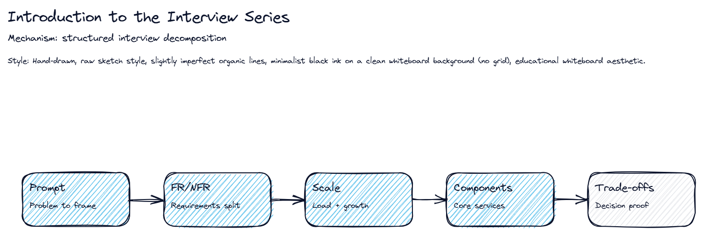

## Real-World Use First
Scenario: A candidate gets a vague prompt like “design Instagram” and needs a repeatable opening instead of random brainstorming.
Why it matters: Use one reusable answer structure so every system-design question starts clear and controlled.

## Process Flow / Steps
1. Clarify the product and user flows.
2. State functional and non-functional requirements.
3. Estimate scale and hotspots.
4. Propose components and storage choices.
5. Explain trade-offs, bottlenecks, and failure handling.

## Key Concepts
- **Functional requirements**: User-visible capabilities the system must provide.
- **Non-functional requirements**: Quality goals like latency, throughput, durability, and availability.
- **Trade-off framing**: Explaining why one option wins under a given constraint set.

## Try This Right Now
- Pick one app you use every day.
- Write 2 functional requirements and 2 NFRs before thinking about technology.
- Say your opening answer out loud in under 45 seconds.

-- Page 3: Choosing the Right Database

## Real-World Anchor
Scenario: A team designs Amazon, Uber, and a metrics platform in the same week and learns that one database cannot optimize every workload.

## What You'll Learn
Choose storage by workload mechanics instead of by popularity or habit.

## Deep Dive Explanation
- Database choice mostly changes non-functional behavior: consistency guarantees, latency, throughput, and operational scaling.
- Structured transactional data fits relational systems; flexible documents fit document stores; text search belongs in Lucene-based engines; append-only metrics favor time-series or wide-column systems.
- Blob storage plus CDN solves media distribution because the hot problem is geographically distributed file serving, not complex querying.
- Real products often combine multiple databases so each subsystem gets the right optimization instead of one compromised global choice.

## Mental Model / Analogy
Think of this like: choosing tools in a workshop — a hammer is great for nails and terrible for screws.

## Visual Summary
```
Data shape matters
Query pattern matters
Scale pattern matters
One product can use many stores
```

## Visual Sketch
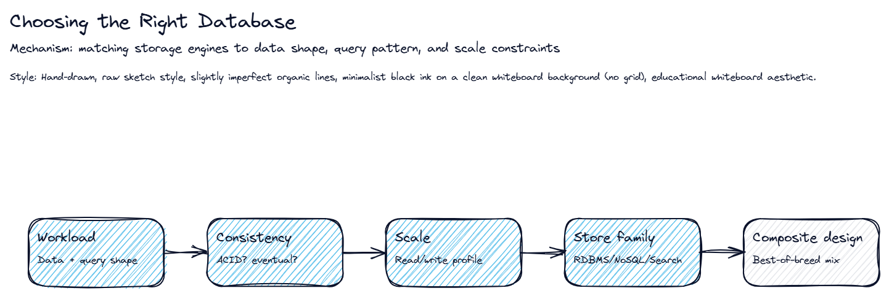

## Real-World Use First
Scenario: A team designs Amazon, Uber, and a metrics platform in the same week and learns that one database cannot optimize every workload.
Why it matters: Choose storage by workload mechanics instead of by popularity or habit.

## Process Flow / Steps
1. Classify the data shape.
2. Check consistency and transaction needs.
3. Examine read/write/query patterns.
4. Estimate growth, hotspots, and retention.
5. Assign one or more storage engines per subsystem.

## Key Concepts
- **RDBMS**: Strong fit for ACID transactions and richly relational data.
- **Document DB**: Flexible schema store for attribute-heavy entities.
- **Search engine**: Lucene-based index optimized for full-text and fuzzy search.
- **Blob storage + CDN**: Pattern for images and videos where distribution beats querying.

## Try This Right Now
- Take one app like Amazon.
- List one primary OLTP store, one cache, one search store, and one media store.
- Explain why each store owns that workload.

-- Page 4: URL Shortener System Design

## Real-World Anchor
Scenario: A social product needs billions of short links that must redirect fast even during traffic spikes.

## What You'll Learn
Design the write path to avoid key collisions and the read path to stay ultra-short.

## Deep Dive Explanation
- The write path shortens a long URL by generating a unique short code and persisting the mapping in a scalable key lookup store.
- Global uniqueness is the central risk, so range allocation or another distributed ID strategy is better than one central mutable bottleneck.
- The redirect path should do the minimum work possible: resolve the short code, fetch the long URL, and return a redirect quickly.
- Click analytics belong off the hot path through buffering or streaming so measurement never slows user redirection.

## Mental Model / Analogy
Think of this like: It behaves like a ticket machine at a transit station: each booth gets its own number range so no two riders receive the same token.

## Visual Summary
```
Long URL -> Shortener -> Token range -> Mapping store
Short URL hit -> Lookup -> Redirect
Clicks -> Stream -> Analytics
```

## Visual Sketch
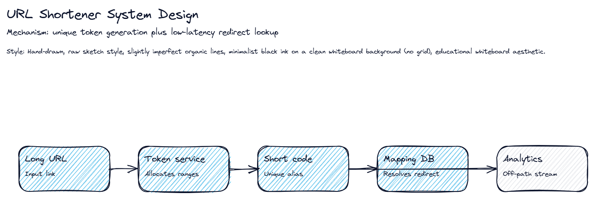

## Real-World Use First
Scenario: A social product needs billions of short links that must redirect fast even during traffic spikes.
Why it matters: Design the write path to avoid key collisions and the read path to stay ultra-short.

## Process Flow / Steps
1. Estimate keyspace and lifetime volume.
2. Generate collision-resistant short codes.
3. Persist short-to-long mapping.
4. Resolve redirects with one fast lookup.
5. Emit click analytics asynchronously.

## Key Concepts
- **Base62 keyspace**: Compact alphabet that packs many unique tokens into short strings.
- **Collision avoidance**: Technique that guarantees two long URLs do not receive the same token.
- **Asynchronous analytics**: Buffered click processing outside the redirect hot path.

## Try This Right Now
- Assume 1,000 writes per second for 10 years.
- Estimate whether 7 characters of base62 are enough.
- State one reason analytics must stay async.

-- Page 5: Airbnb / Booking.com System Design

## Real-World Anchor
Scenario: Two travelers try to book the last room at the same time, so inventory correctness matters more than a pretty UI.

## What You'll Learn
Use strong consistency on room inventory while keeping search and history layers optimized for their own workloads.

## Deep Dive Explanation
- Search requires denormalized hotel metadata and text indexing, but final booking requires transactional inventory updates to prevent double-selling.
- A temporary reservation hold gives the payment flow a bounded time window without blocking stock forever.
- Redis-style TTL storage is useful for expiring abandoned holds, while durable relational storage remains the source of truth for final booking state.
- Historical and analytical data can move to cheaper, scalable stores because the correctness-critical path is the inventory mutation itself.

## Mental Model / Analogy
Think of this like: Imagine a receptionist placing a room key behind the desk for five minutes while you finish payment.

## Visual Summary
```
Search index for discovery
Inventory DB for correctness
TTL hold for payment window
Archive store for long history
```

## Visual Sketch
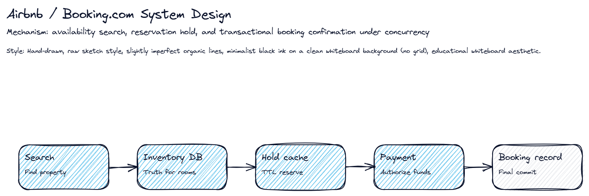

## Real-World Use First
Scenario: Two travelers try to book the last room at the same time, so inventory correctness matters more than a pretty UI.
Why it matters: Use strong consistency on room inventory while keeping search and history layers optimized for their own workloads.

## Process Flow / Steps
1. Search hotels and availability.
2. Lock or hold the selected room.
3. Process payment inside a timeout.
4. Commit booking transaction.
5. Release hold or expire it on failure.

## Key Concepts
- **Reservation hold**: Temporary claim that prevents parallel buyers from taking the same room.
- **Inventory source of truth**: Store that must remain transactionally correct for room counts.
- **TTL expiry**: Automatic release mechanism for stale holds.

## Try This Right Now
- Describe what happens if payment fails after a room hold.
- List which store owns search and which store owns booking correctness.
- Explain why both cannot be the same database optimization.

-- Page 6: Amazon-Style Commerce System

## Real-World Anchor
Scenario: A marketplace serves millions of buyers and sellers, so no single schema or service can own every concern efficiently.

## What You'll Learn
Break a large commerce problem into bounded services with separate storage and scaling profiles.

## Deep Dive Explanation
- Catalog, search, pricing, inventory, cart, orders, payments, and notifications evolve at different speeds and under different access patterns.
- Search benefits from document-style indexing, while orders and payments need transactional guarantees and auditable state changes.
- Product media distribution uses object storage plus CDN because buyers mostly read images and videos globally.
- The interview win is to show why boundaries exist: they isolate scaling hotspots, preserve transactional correctness where needed, and reduce blast radius.

## Mental Model / Analogy
Think of this like: a warehouse campus where each station is specialized and the conveyor belt between stations is the integration contract.

## Visual Summary
```
Catalog -> Search -> Product detail -> Cart -> Order -> Payment
Inventory and pricing feed the hot path
Media sits on CDN-backed blob storage
```

## Visual Sketch
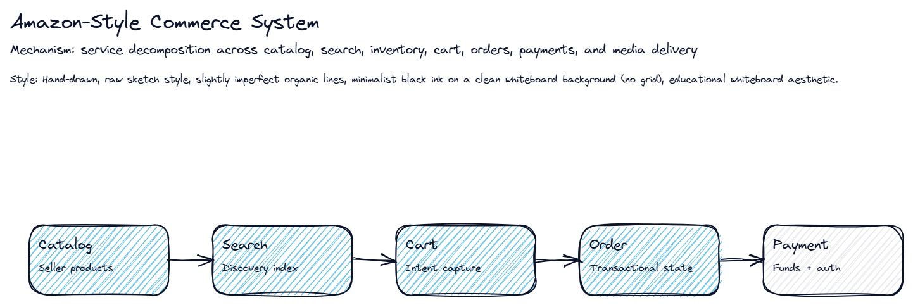

## Real-World Use First
Scenario: A marketplace serves millions of buyers and sellers, so no single schema or service can own every concern efficiently.
Why it matters: Break a large commerce problem into bounded services with separate storage and scaling profiles.

## Process Flow / Steps
1. Define buyer, seller, and admin flows.
2. Separate read-heavy search from write-heavy transactions.
3. Keep inventory and orders transactionally safe.
4. Use async events for downstream notifications and analytics.
5. Explain how each subsystem scales independently.

## Key Concepts
- **Catalog service**: Owns product descriptions and seller-managed attributes.
- **Search index**: Optimized read model for discovery and filtering.
- **Order state machine**: Durable lifecycle from created to paid to shipped to delivered.

## Try This Right Now
- Name three subsystems that should not share the same database design.
- State one reason search is not the system of record.
- Explain where CDN fits in the user journey.

-- Page 7: WhatsApp-Style Chat System

## Real-World Anchor
Scenario: A messenger app must deliver billions of messages quickly while tolerating offline users and mobile reconnections.

## What You'll Learn
Separate real-time delivery from durable persistence so mobile chat feels instant without losing messages.

## Deep Dive Explanation
- A WebSocket or similar persistent session layer keeps low-latency bidirectional communication open to active devices.
- Messages still need durable storage and retry handling because recipients may be offline, on slow networks, or connected on multiple devices.
- Read receipts and presence signals are lightweight state updates that should not block the core message path.
- Media attachments, profile data, and analytics each scale differently from raw message transport and should be decomposed accordingly.

## Mental Model / Analogy
Think of this like: It works like a postal hub with live couriers: send immediately when the courier is present, store safely when they are not.

## Visual Summary
```
Sender socket -> Chat service -> Queue/store -> Recipient socket
Receipts update after delivery
Media and profile flows are side services
```

## Visual Sketch
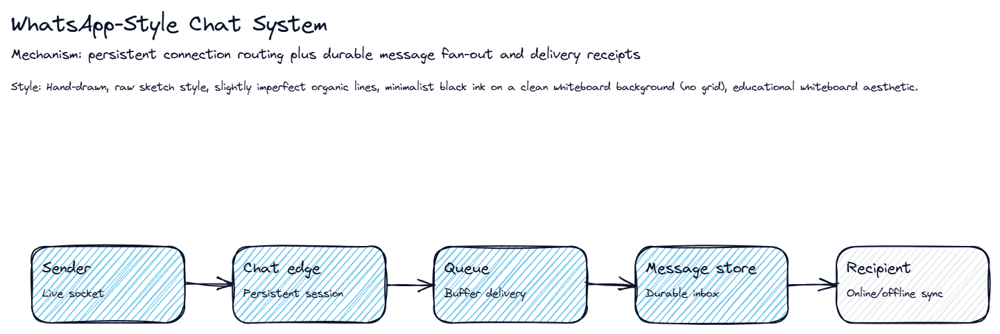

## Real-World Use First
Scenario: A messenger app must deliver billions of messages quickly while tolerating offline users and mobile reconnections.
Why it matters: Separate real-time delivery from durable persistence so mobile chat feels instant without losing messages.

## Process Flow / Steps
1. Accept message on persistent connection.
2. Persist and enqueue the message.
3. Fan out to recipient sessions or offline inbox.
4. Update delivery/read status.
5. Retry or sync on reconnect.

## Key Concepts
- **Persistent connection**: Long-lived channel that reduces per-message handshake overhead.
- **Offline inbox**: Durable store for recipients not currently connected.
- **Delivery receipt**: State marker that tracks sent, delivered, and read progression.

## Try This Right Now
- Explain why persistence still matters when sockets are live.
- Name one component that should stay out of the hot message path.
- Describe how offline delivery resumes after reconnect.

-- Page 8: Notification System at Scale

## Real-World Anchor
Scenario: A product sends order updates, promotions, and alerts across multiple channels without coupling every producer to every delivery provider.

## What You'll Learn
Use one common event model and route it to specialized handlers per channel.

## Deep Dive Explanation
- Producers should emit notification intent once, not duplicate provider-specific logic across many services.
- A queue or stream absorbs bursts and lets each channel handler scale according to its own provider latency and rate limits.
- Retries, backoff, and dead-lettering matter because third-party delivery APIs fail in partial, time-based ways.
- Templates, user preferences, and channel policies should be applied before final provider submission so behavior stays consistent.

## Mental Model / Analogy
Think of this like: Imagine a dispatch center that receives one incident report and then sends the right crews without asking the caller to know every team.

## Visual Summary
```
Producer event -> Notification bus -> Channel handler -> Provider -> Status
Retries and DLQ handle transient failures
```

## Visual Sketch
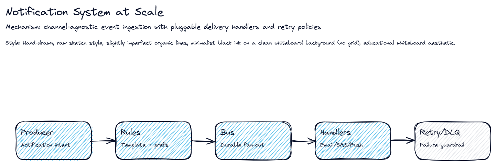

## Real-World Use First
Scenario: A product sends order updates, promotions, and alerts across multiple channels without coupling every producer to every delivery provider.
Why it matters: Use one common event model and route it to specialized handlers per channel.

## Process Flow / Steps
1. Publish a notification intent.
2. Apply template and preference rules.
3. Route by channel.
4. Deliver through provider-specific worker.
5. Retry, backoff, or dead-letter on failure.

## Key Concepts
- **Channel handler**: Worker specialized for one transport such as email, SMS, push, or chat.
- **Dead-letter queue**: Holding area for messages that fail repeated delivery attempts.
- **Preference engine**: Rule set that decides whether and how a user should be contacted.

## Try This Right Now
- Add a hypothetical WhatsApp channel in one sentence.
- Explain why producers should not call providers directly.
- Name one failure mode that needs backoff instead of instant retry.

-- Page 9: Uber-Style Ride Hailing

## Real-World Anchor
Scenario: A rider opens the app, sees nearby drivers, requests a trip, and expects matching in seconds while vehicles keep moving.

## What You'll Learn
Separate fast-changing geospatial state from slower transactional trip and payment state.

## Deep Dive Explanation
- Driver locations update continuously, so the location index must support high write rates and geospatial nearest-neighbor queries.
- Trip creation, acceptance, cancellation, and completion form a transactional state machine that should be durable and auditable.
- Matching logic often combines proximity, surge, vehicle type, and driver availability rather than simple nearest-distance alone.
- Payments and receipts belong after trip completion and should not slow the live matching loop.

## Mental Model / Analogy
Think of this like: It is like a taxi radio dispatcher plus a live city map that never stops updating.

## Visual Summary
```
Location ingest -> Geo index -> Match engine -> Trip state -> Payment
Live map updates are hotter than billing writes
```

## Visual Sketch
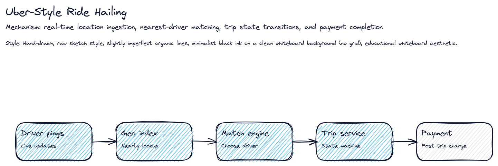

## Real-World Use First
Scenario: A rider opens the app, sees nearby drivers, requests a trip, and expects matching in seconds while vehicles keep moving.
Why it matters: Separate fast-changing geospatial state from slower transactional trip and payment state.

## Process Flow / Steps
1. Ingest driver pings.
2. Index drivers by geo region.
3. Match rider request to candidate drivers.
4. Commit trip state transitions.
5. Charge payment and emit receipts after completion.

## Key Concepts
- **Geo index**: Spatial lookup structure for nearest-driver search.
- **Trip state machine**: Lifecycle from requested to accepted to in-progress to completed/cancelled.
- **Surge-aware matching**: Policy layer that blends proximity with marketplace balancing.

## Try This Right Now
- State why live location storage is different from billing storage.
- Describe one reason the nearest driver may not be selected.
- Name the trip states you would persist.

-- Page 10: Twitter-Style Feed System

## Real-World Anchor
Scenario: One celebrity posts once and millions of followers expect to see the tweet immediately, creating extreme asymmetric load.

## What You'll Learn
Choose feed fan-out strategy by balancing write amplification against read latency.

## Deep Dive Explanation
- The core difficulty is not tweet storage itself but how to materialize personalized feeds for large follower graphs at scale.
- Fan-out on write gives fast reads for ordinary users but explodes write work for celebrity accounts.
- Fan-out on read reduces write amplification but pushes more computation into the read path and caching layer.
- A hybrid strategy is common: precompute many feeds while treating celebrity content with special handling.

## Mental Model / Analogy
Think of this like: a newsroom choosing between home delivery and pickup kiosks depending on audience size.

## Visual Summary
```
Tweet -> Graph -> Fan-out strategy -> Feed store/cache -> Timeline read
Hybrid approach handles celebrity skew
```

## Visual Sketch
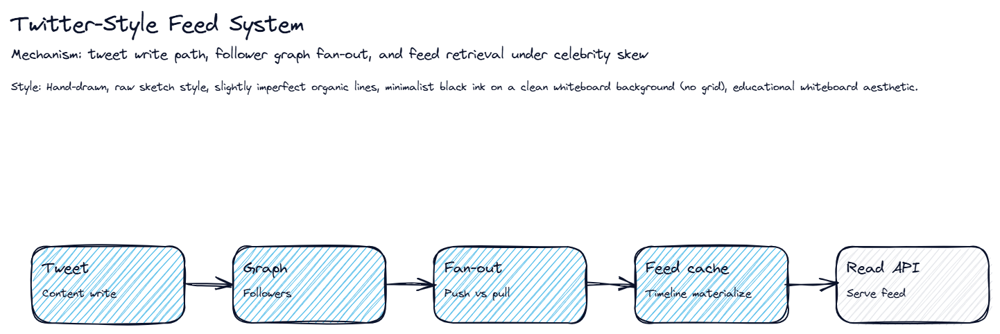

## Real-World Use First
Scenario: One celebrity posts once and millions of followers expect to see the tweet immediately, creating extreme asymmetric load.
Why it matters: Choose feed fan-out strategy by balancing write amplification against read latency.

## Process Flow / Steps
1. Persist tweet and metadata.
2. Resolve follower graph impact.
3. Choose fan-out policy.
4. Store or cache feed entries.
5. Serve timeline with ranking/caching.

## Key Concepts
- **Follower graph**: Relationship map that determines who may receive a tweet in their feed.
- **Fan-out on write**: Push model that updates recipient feeds during tweet creation.
- **Hybrid timeline strategy**: Blend of precomputed feeds and on-demand composition.

## Try This Right Now
- Explain why celebrity accounts break naive fan-out-on-write.
- Name one cache that helps the read path.
- State when on-demand composition is useful.

-- Page 11: Facebook / Instagram Feed & Social Graph

## Real-World Anchor
Scenario: A social app mixes graph relationships, media uploads, feeds, comments, likes, messaging, and notifications in one user journey.

## What You'll Learn
Model the social graph, media pipeline, and feed ranking as separate but cooperating subsystems.

## Deep Dive Explanation
- User identity and relationship edges drive authorization and visibility, while the feed service builds ranked read models from many interaction signals.
- Media requires object storage and CDN distribution because image and video delivery dominate bytes even when graph metadata dominates transaction count.
- Comments, likes, follows, and notifications can be event-driven side effects that update caches, counters, and ranking features asynchronously.
- The architecture should highlight which parts need consistency and which parts tolerate eventual propagation.

## Mental Model / Analogy
Think of this like: Imagine a town square where friendships decide who sees what, while a separate stage manager ranks which posts get attention first.

## Visual Summary
```
Identity + graph are the core model
Media pipeline distributes heavy assets
Feed ranking builds the read experience
Interactions trigger side effects
```

## Visual Sketch
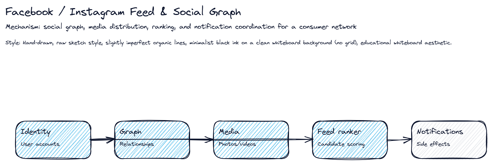

## Real-World Use First
Scenario: A social app mixes graph relationships, media uploads, feeds, comments, likes, messaging, and notifications in one user journey.
Why it matters: Model the social graph, media pipeline, and feed ranking as separate but cooperating subsystems.

## Process Flow / Steps
1. Store user and graph relationships.
2. Upload and distribute media.
3. Generate or rank feed candidates.
4. Process interactions such as likes and comments.
5. Emit notifications and analytics asynchronously.

## Key Concepts
- **Social graph**: Relationship network that controls reach, privacy, and recommendation edges.
- **Feed ranking**: Scoring pipeline that decides which content appears first.
- **Media CDN**: Global edge distribution path for photos and videos.

## Try This Right Now
- Separate one consistency-critical component from one eventually consistent component.
- Explain why media storage differs from graph storage.
- Name one event that can update ranking asynchronously.

-- Page 12: YouTube / Netflix Video Platform

## Real-World Anchor
Scenario: A user uploads a huge video file once, but millions of viewers consume many bitrate versions across the globe.

## What You'll Learn
Decouple heavy offline media processing from low-latency playback delivery.

## Deep Dive Explanation
- Video ingest is a write-heavy batch path that validates uploads, stores originals, and fans out transcoding jobs for multiple resolutions and codecs.
- Playback reads should hit nearby CDN edges whenever possible because the expensive work was already done during preprocessing.
- Recommendation, search, and watch-history analytics are adjacent systems that influence discovery but should not block stream start.
- The architecture must explain why object storage, transcoding workers, manifests, and edge caches are separate stages.

## Mental Model / Analogy
Think of this like: It is like a studio mastering one film into many editions, then sending copies to local theaters before the audience arrives.

## Visual Summary
```
Upload -> Original store -> Transcode farm -> Manifest -> CDN -> Player
Analytics and recommendations stay adjacent, not inline
```

## Visual Sketch
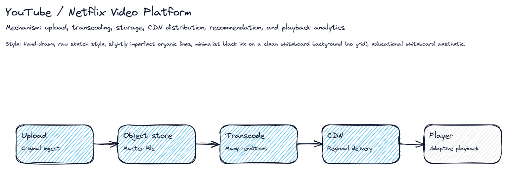

## Real-World Use First
Scenario: A user uploads a huge video file once, but millions of viewers consume many bitrate versions across the globe.
Why it matters: Decouple heavy offline media processing from low-latency playback delivery.

## Process Flow / Steps
1. Receive upload and store original.
2. Fan out transcoding jobs.
3. Publish manifests and metadata.
4. Distribute renditions to CDN.
5. Collect playback telemetry and improve discovery.

## Key Concepts
- **Transcoding**: Conversion of a master file into many playback-friendly formats and bitrates.
- **Manifest**: Playback map that tells the player which chunks and renditions exist.
- **CDN edge cache**: Regional copy layer that cuts buffering and origin load.

## Try This Right Now
- Explain why transcoding should not happen in the user request path.
- Name two outputs produced from one upload.
- Describe why CDN matters more for playback than for upload.

-- Page 13: Zoom / Video Calling System

## Real-World Anchor
Scenario: A meeting starts instantly, participants join from unstable networks, and audio/video must stay smooth enough for conversation.

## What You'll Learn
Design signaling and media transport separately because they solve different latency and state problems.

## Deep Dive Explanation
- Signaling handles identity, room membership, ringing, join/leave events, and capability negotiation.
- Media transport optimizes audio/video packet flow, often through SFU-style forwarding or similar mechanisms that reduce unnecessary server-side mixing.
- Recording and analytics are side flows that should observe media or metadata without destabilizing live conversation.
- The interview emphasis is on latency budgets, participant fan-out, NAT traversal, and graceful degradation under poor network conditions.

## Mental Model / Analogy
Think of this like: Picture a conference moderator who seats participants, hands out microphones, and quietly starts the recorder in the background.

## Visual Summary
```
Signal room -> Negotiate media -> Relay video/audio -> Side-record if needed
Live latency beats heavy server-side processing
```

## Visual Sketch
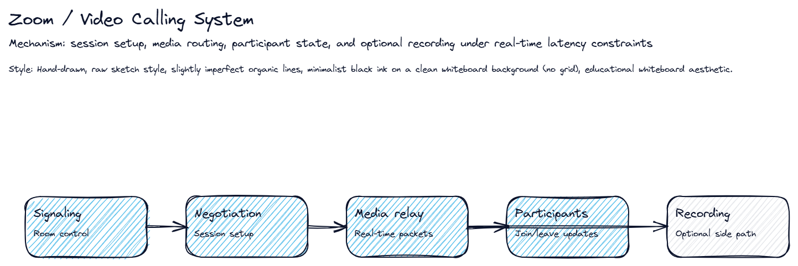

## Real-World Use First
Scenario: A meeting starts instantly, participants join from unstable networks, and audio/video must stay smooth enough for conversation.
Why it matters: Design signaling and media transport separately because they solve different latency and state problems.

## Process Flow / Steps
1. Create or join room through signaling.
2. Negotiate connection details.
3. Route media through relay/forwarding layer.
4. Manage participant events and device changes.
5. Optionally record or analyze side streams.

## Key Concepts
- **Signaling plane**: Control path for session setup and membership events.
- **Media relay/SFU**: Forwarding layer optimized for real-time participant fan-out.
- **Graceful degradation**: Policy for reducing quality before dropping the call entirely.

## Try This Right Now
- Separate one control-plane event from one data-plane action.
- Name one reason recording should be a side branch.
- Explain why latency matters more than perfect consistency here.

-- Page 14: Google Maps / Location Platform

## Real-World Anchor
Scenario: Users pan maps, search places, and request routes while traffic changes continuously underneath the visual layer.

## What You'll Learn
Separate base map serving from dynamic routing and traffic intelligence.

## Deep Dive Explanation
- Static map tiles and place metadata can be heavily cached because they change slowly compared with live traffic and ETA calculations.
- Routing depends on graph algorithms over road networks plus dynamic weights influenced by traffic, closures, and user context.
- Search, geocoding, reverse geocoding, and place detail retrieval are adjacent query systems with different indexing needs.
- A strong answer shows how cached geography and live telemetry cooperate without forcing every request to recompute the entire world state.

## Mental Model / Analogy
Think of this like: It is like a city control room with shelves of atlas pages and live traffic lights feeding the route desk.

## Visual Summary
```
Tiles for base map
Geo search for places
Road graph for routing
Traffic updates adjust path cost
```

## Visual Sketch
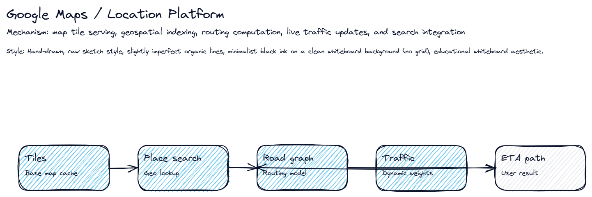

## Real-World Use First
Scenario: Users pan maps, search places, and request routes while traffic changes continuously underneath the visual layer.
Why it matters: Separate base map serving from dynamic routing and traffic intelligence.

## Process Flow / Steps
1. Serve map tiles and place data.
2. Geocode the query.
3. Run route search on road graph.
4. Apply live traffic weights.
5. Return path, ETA, and update on change.

## Key Concepts
- **Map tile cache**: Precomputed geographic rendering slices for fast panning and zooming.
- **Road graph**: Network model of roads and intersections used by routing algorithms.
- **Traffic weighting**: Dynamic cost adjustment that changes the best path and ETA.

## Try This Right Now
- Explain why map tiles and routing should scale differently.
- Name one query that uses geocoding and one that uses route search.
- Describe how live traffic affects cached map behavior.

-- Page 15: Biggest Mistakes to Avoid

## Real-World Anchor
Scenario: Candidates know system components but still fail because they skip scope clarification, ignore scale, or jump straight to technology names.

## What You'll Learn
Avoid predictable interview mistakes by forcing scope, scale, and trade-off checkpoints into every answer.

## Deep Dive Explanation
- The most common failure is answering the wrong problem because requirements and capacity assumptions were never made explicit.
- Jumping to a fashionable database or queue before explaining why it fits makes the design sound memorized instead of reasoned.
- Ignoring bottlenecks, edge cases, or failure handling suggests the architecture is superficial even when the main boxes look correct.
- Strong closings summarize trade-offs, note follow-up improvements, and show awareness of what was intentionally simplified.

## Mental Model / Analogy
Think of this like: Treat the interview like a driving test: knowing the controls is not enough if you skip mirrors, signals, and lane checks.

## Visual Summary
```
Bad path: assume -> jump to tools -> ignore scale
Good path: clarify -> estimate -> design -> justify
```

## Visual Sketch
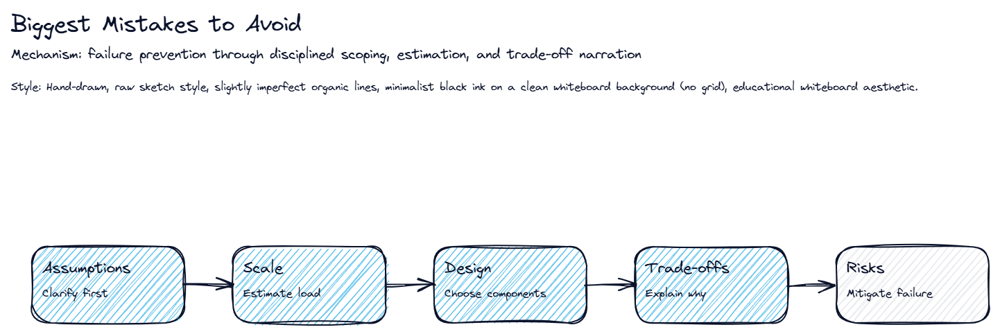

## Real-World Use First
Scenario: Candidates know system components but still fail because they skip scope clarification, ignore scale, or jump straight to technology names.
Why it matters: Avoid predictable interview mistakes by forcing scope, scale, and trade-off checkpoints into every answer.

## Process Flow / Steps
1. Clarify before drawing.
2. Estimate before sizing.
3. Justify every major component.
4. Name bottlenecks and mitigations.
5. Close with trade-offs and future improvements.

## Key Concepts
- **Scope control**: Deliberate narrowing of the question so the design matches the actual prompt.
- **Reasoned choice**: Technology selection tied to workload and constraints.
- **Failure narration**: Calling out what breaks and how you would mitigate it.

## Try This Right Now
- Review one past answer and identify where you skipped requirements.
- Replace one tool-name statement with a constraint-based reason.
- Practice a 20-second trade-off summary.
