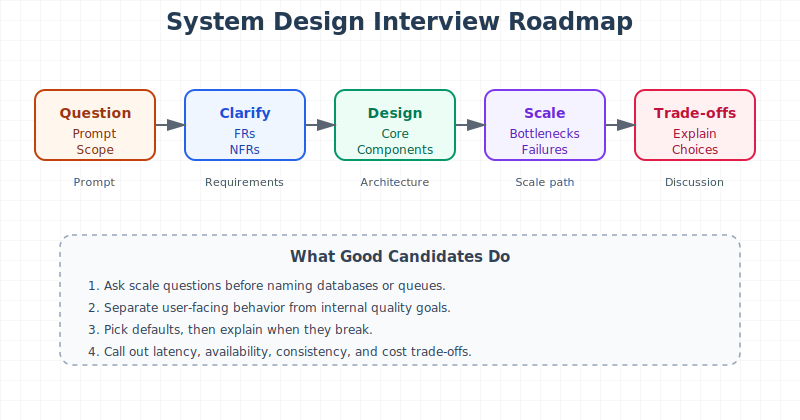
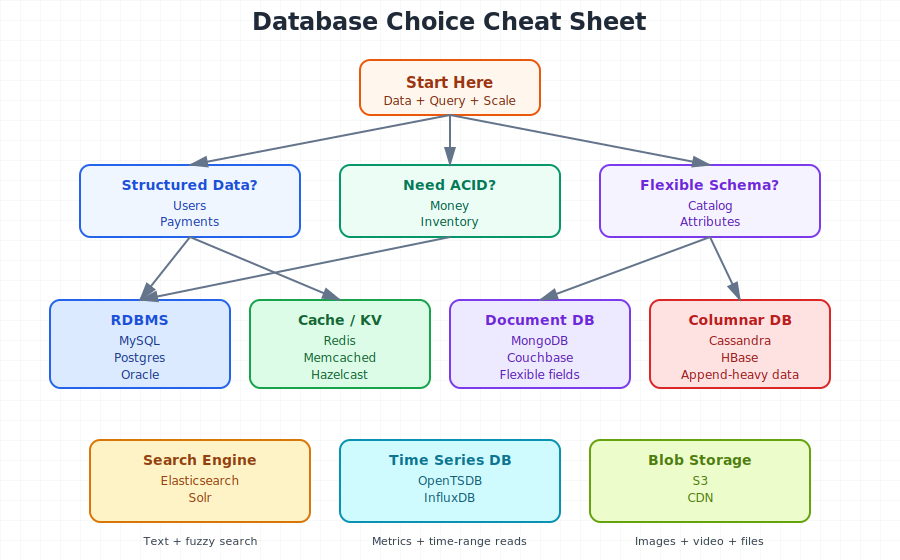
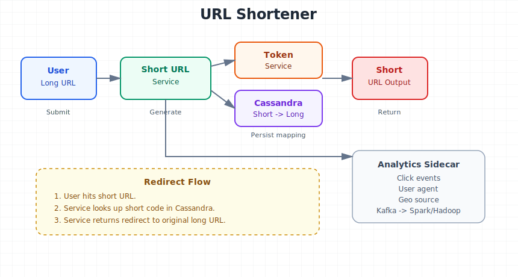
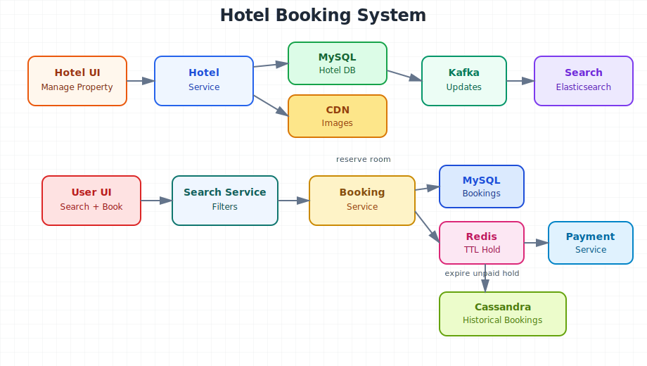
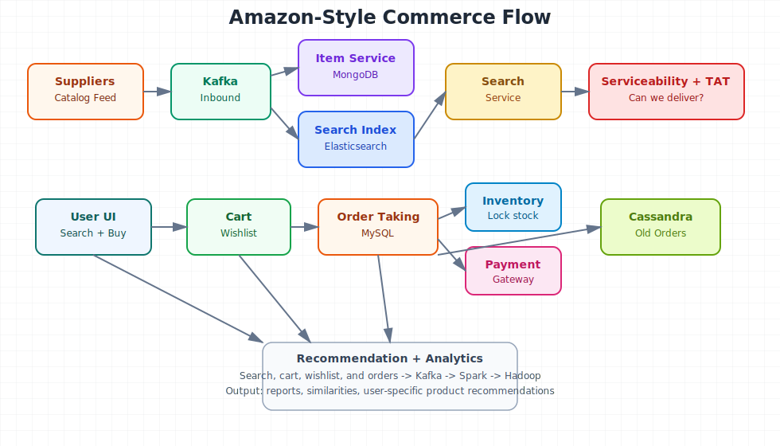
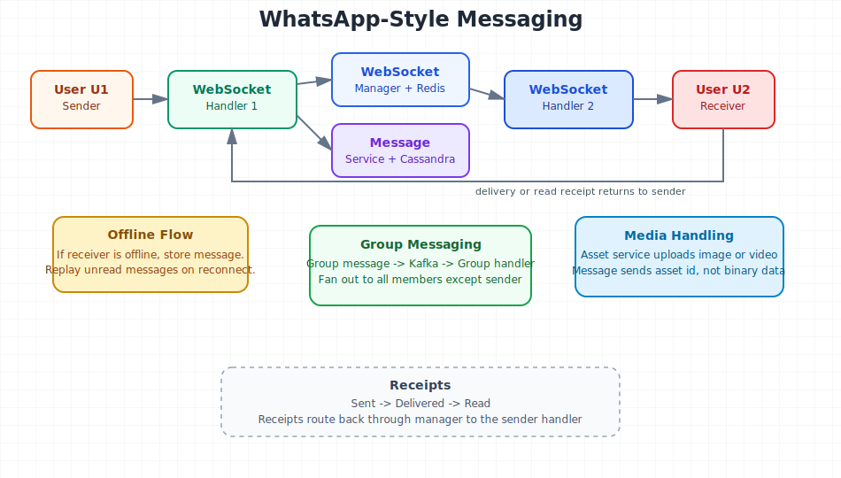

-- Page 1: Introduction to the System Design Interview Series

## Header
⏱️ ~3 min | 📚 Video 1 | ⚡ Easy

## What You'll Learn
Why this series matters and how to use system design prep like a repeatable interview skill, not random memorization.

## Core Idea (60 sec)
- System design prep has two tracks: common interview questions and core architecture topics.
- Strong answers come from reusable patterns, not isolated tricks.

## Visual Summary
Interview Prep -> Learn Patterns -> Practice Trade-offs -> Explain Clearly -> Better Design Answers

## Real-World Use First
Scenario: You enter an interview and get a broad design problem with no obvious starting point.
Why it matters: A reusable framework keeps you from freezing and helps you structure the discussion fast.

## Process Flow / Steps
1. Clarify the problem and scale.
2. Identify functional and non-functional requirements.
3. Pick core components and storage choices.
4. Explain trade-offs and failure points.

## Key Concepts
- **Functional requirements**: what the system must do for users.
- **Non-functional requirements**: quality targets like latency, scale, and availability.

## Quick Facts
Q: What are the two big goals of the series?  A: Common questions and must-know design topics.
Q: What makes a good interview answer?  A: Clear structure plus trade-off reasoning.

## Try This Right Now
- Write one system you use daily.
- List 2 functional and 2 non-functional requirements.

## Common Mistakes
- Jumping into databases before clarifying the problem.
- Naming tools without explaining why they fit.

## Flashcards
| Q | A |
|---|---|
| First design step? | Clarify requirements and scale. |
| Strong interview signal? | Explaining trade-offs clearly. |

## Spaced Repetition
- Day 1: Recall FR vs NFR.
- Day 3: Rehearse a 4-step answer structure.
- Day 7: Apply the structure to a known app.
- Day 14: Explain one trade-off out loud.
- Day 30: Solve one fresh system prompt.

## One-Page Revision
- Start with clarity, not components.
- Separate FRs from NFRs early.
- Use patterns and trade-offs repeatedly.

## Checkpoint
- [ ] I can explain how to open a system design answer.

## 30-Day Memory Bullets
- System design starts with scope.
- Requirements drive architecture.
- Scale changes the design.
- Trade-offs matter more than tool names.
- Patterns are reusable.
- Clear communication is part of the design.
- NFRs shape technology choices.
- Preparation should feel structured.

-- Page 2: Choosing the Right Database

## Header
⏱️ ~5 min | 📚 Video 2 | ⚡ Medium

## What You'll Learn
How to choose a storage system by matching data structure, query pattern, and scale to the right database family.

## Core Idea (60 sec)
- Database choice usually affects non-functional requirements more than functional requirements.
- The best choice depends on data shape, access pattern, and growth pattern.

## Visual Summary
Structured + ACID -> RDBMS
Structured + no strict ACID -> RDBMS or NoSQL
Flexible schema + rich queries -> Document DB
Huge growing data + few query types -> Columnar DB
Search text -> Search Engine
Metrics over time -> Time Series DB

## Real-World Use First
Scenario: You design Amazon, Uber, or a monitoring platform and need storage that scales correctly.
Why it matters: The wrong database can still work functionally but fail badly on scale, latency, or consistency.

## Process Flow / Steps
1. Check if data is structured or unstructured.
2. Check whether ACID guarantees are required.
3. Inspect query variety and query shape.
4. Inspect whether data is steadily or explosively growing.
5. Combine databases when real-world needs differ by subsystem.

## Key Concepts
- **RDBMS**: best when transactions and consistency matter.
- **Document DB**: good for flexible schemas and many attributes.
- **Columnar DB**: good for huge append-heavy datasets with narrow query types.
- **Search engine**: used for text search, not primary source of truth.
- **Time series DB**: optimized for append-only metric streams.
- **Blob storage**: good for images and videos, not regular querying.

## Quick Facts
Q: Best cache default in interviews?  A: Redis is a strong default answer.
Q: Search text with fuzzy matching?  A: Elasticsearch or Solr.
Q: Metrics system storage?  A: Time series DB like OpenTSDB or InfluxDB.

## Try This Right Now
- Take one app you know.
- Write one cache, one primary DB, and one analytics store choice with reasons.

## Common Mistakes
- Treating Elasticsearch as the source of truth.
- Using one database for every subsystem just for simplicity.

## Flashcards
| Q | A |
|---|---|
| Need atomic money transfer? | Use an ACID-capable relational database. |
| Need flexible product attributes? | Use a document database. |
| Need huge append-only event data? | Use Cassandra or HBase style storage. |

## Spaced Repetition
- Day 1: Recall 3 database choice factors.
- Day 3: Rebuild the decision tree from memory.
- Day 7: Map Amazon subsystems to storage types.
- Day 14: Explain why search engines are not source of truth.
- Day 30: Solve one database-choice interview prompt aloud.

## One-Page Revision
- Data shape matters.
- Query pattern matters.
- Scale pattern matters.
- Real systems usually combine multiple databases.

## Checkpoint
- [ ] I can explain when to use RDBMS vs document DB vs Cassandra.

## 30-Day Memory Bullets
- Functional fit is not enough.
- NFRs drive storage decisions.
- Cache defaults are often key-value stores.
- Blob storage handles files.
- Search engines handle text search.
- Time series DBs handle metrics.
- ACID matters for money and counts.
- Real systems often blend multiple stores.

-- Page 3: URL Shortener System Design

## Header
⏱️ ~5 min | 📚 Video 3 | ⚡ Medium

## What You'll Learn
How to design a short URL system with unique key generation, low latency, and room for analytics.

## Core Idea (60 sec)
- A URL shortener mostly needs two functions: shorten and redirect.
- The hard part is generating unique tokens without collisions or a bad single point of failure.

## Visual Summary
Long URL -> Short URL Service -> Token Range -> Cassandra Store -> Short URL
Short URL Hit -> Lookup -> Redirect
Analytics -> Kafka -> Hadoop or Spark

## Real-World Use First
Scenario: Social apps need short links that resolve fast and stay highly available.
Why it matters: Link redirection sits in a user-facing hot path, so latency and reliability matter immediately.

## Process Flow / Steps
1. Estimate scale and choose short-code length.
2. Pick a safe character set such as base62.
3. Allocate token ranges to stateless service instances.
4. Save short-to-long mapping in a scalable store.
5. Emit analytics asynchronously for clicks and geography.

## Key Concepts
- **Base62**: uses digits plus upper and lower case letters.
- **Collision**: two long URLs getting the same short token.
- **Token service**: allocates unique ranges to avoid collisions.
- **Asynchronous analytics**: keeps redirect latency low.

## Quick Facts
Q: Why not one Redis counter for all tokens?  A: It becomes a scaling and failure bottleneck.
Q: Why allocate ranges?  A: Each app instance can generate unique short URLs locally.

## Try This Right Now
- Assume 1,000 new URLs per second for 10 years.
- Write down what scale question you would ask before picking token length.

## Common Mistakes
- Ignoring collision handling.
- Blocking the redirect path on analytics writes.

## Flashcards
| Q | A |
|---|---|
| Main write problem? | Generating globally unique short codes. |
| Good analytics pattern? | Parallel or buffered Kafka writes. |

## Spaced Repetition
- Day 1: Recall FRs and NFRs.
- Day 3: Re-explain token ranges.
- Day 7: Compare Redis counter vs token service.
- Day 14: Rebuild the redirect path.
- Day 30: Sketch the architecture from memory.

## One-Page Revision
- Shorten and redirect are the two core functions.
- Unique token generation is the central design risk.
- Token ranges reduce collisions and hot spots.
- Analytics should not slow redirects.

## Checkpoint
- [ ] I can explain why range allocation beats a single global counter.

## 30-Day Memory Bullets
- Token length comes from scale.
- Base62 expands the key space.
- Collisions must be avoided, not just retried blindly.
- Token service can run at lower scale.
- Cassandra suits massive mapping storage.
- Redirect path should stay lean.
- Analytics can be async.
- Geography metrics can guide data-center choices.

-- Page 4: Hotel Booking System Design

## Header
⏱️ ~5 min | 📚 Video 4 | ⚡ Hard

## What You'll Learn
How to design search, booking, inventory control, and analytics for a large hotel platform like Booking.com or Airbnb.

## Core Idea (60 sec)
- Search and hotel metadata scale differently from booking and inventory writes.
- Booking correctness depends on transactional storage and temporary reservation handling.

## Visual Summary
Hotel Manager -> Hotel Service -> MySQL + CDN
Kafka -> Search Consumer -> Elasticsearch
User Search -> Search Service -> Booking Service -> Payment
Booking TTL -> Redis -> Cancel or Confirm

## Real-World Use First
Scenario: A traveler searches by location and dates, then tries to reserve one of the last rooms.
Why it matters: You need low latency in search and strong correctness in booking at the same time.

## Process Flow / Steps
1. Store hotel metadata in relational tables.
2. Push updates through Kafka to power search indexing.
3. Search via Elasticsearch for text and filters.
4. Reserve inventory in MySQL with transactional updates.
5. Use Redis TTL to expire unpaid reservations.
6. Archive finished bookings into Cassandra.

## Key Concepts
- **Search index**: optimized copy for discovery, not source of truth.
- **Available rooms table**: tracks remaining inventory by room and date.
- **Reservation TTL**: temporary hold before payment succeeds.
- **Archival flow**: moves terminal bookings to cheaper, scalable storage.

## Quick Facts
Q: Why use MySQL in booking flow?  A: Transactions and constraints protect inventory.
Q: Why use Elasticsearch in search?  A: Fuzzy search and filtering perform well there.

## Try This Right Now
- Describe what happens if payment succeeds after the reservation TTL expires.
- Pick one recovery strategy and explain why.

## Common Mistakes
- Using the search index as booking truth.
- Holding rooms forever while waiting for payment.

## Flashcards
| Q | A |
|---|---|
| Booking source of truth? | Relational booking database. |
| Finished bookings stored where? | Cassandra after archival. |

## Spaced Repetition
- Day 1: Recall service split.
- Day 3: Rebuild reservation TTL logic.
- Day 7: Explain search vs booking consistency.
- Day 14: Re-explain archival to Cassandra.
- Day 30: Walk through one booking race condition.

## One-Page Revision
- Search and booking need different storage models.
- Redis TTL handles payment timeout flow.
- Kafka spreads updates to search and analytics.
- Archive old bookings for scale.

## Checkpoint
- [ ] I can explain why booking correctness depends on transactions.

## 30-Day Memory Bullets
- Hotel data is relational.
- Images belong in CDN/blob storage.
- Search indexing is async.
- Booking flow must reserve inventory safely.
- TTL prevents permanent stock blocking.
- Cassandra fits historical booking reads.
- Analytics belongs off the hot path.
- Data centers can split by geography.

-- Page 5: Amazon-Style E-commerce System Design

## Header
⏱️ ~5 min | 📚 Video 5 | ⚡ Hard

## What You'll Learn
How search, serviceability, cart, orders, inventory, and recommendations work together in a large e-commerce platform.

## Core Idea (60 sec)
- Search, cart, order, and inventory are separate systems because their scale and consistency needs differ.
- Inventory and order placement need stronger correctness than search and recommendations.

## Visual Summary
Supplier Feed -> Kafka -> Item Service + Search Consumer
User Search -> Search Service + Serviceability
Cart/Wishlist -> MySQL
Checkout -> Order Service + Inventory + Payment + Kafka

## Real-World Use First
Scenario: A user searches for a TV, checks serviceability, adds it to cart, and checks out while stock is low.
Why it matters: User experience depends on fast search, but revenue depends on correct inventory and order state.

## Process Flow / Steps
1. Ingest supplier catalog through Kafka.
2. Store flexible item attributes in MongoDB.
3. Index searchable product fields in Elasticsearch.
4. Filter by serviceability and delivery time.
5. Create order in MySQL and lock inventory.
6. Confirm or cancel based on payment result.
7. Archive terminal orders to Cassandra.

## Key Concepts
- **MongoDB**: good for flexible product attributes.
- **Serviceability**: checks whether an item can be delivered to a user.
- **Order TTL**: temporary state while payment is pending.
- **Archival service**: moves completed or cancelled orders out of hot storage.
- **Recommendation pipeline**: learns from search, wishlist, cart, and orders.

## Quick Facts
Q: Why not keep all historical orders in MySQL forever?  A: Scale and cost become bottlenecks.
Q: Why use Kafka here?  A: It decouples ingestion, search, order events, and analytics.

## Try This Right Now
- Name one part of the system where availability wins.
- Name one part where consistency wins.

## Common Mistakes
- Mixing search concerns with order correctness.
- Forgetting serviceability before checkout.

## Flashcards
| Q | A |
|---|---|
| Flexible product schema store? | MongoDB. |
| Historical order store? | Cassandra. |
| Search index store? | Elasticsearch. |

## Spaced Repetition
- Day 1: Recall item, search, and order split.
- Day 3: Explain why inventory locking matters.
- Day 7: Rebuild the checkout flow.
- Day 14: Explain archival and recommendations.
- Day 30: Compare search consistency vs order consistency.

## One-Page Revision
- Different subsystems need different stores.
- Search is fast and index-based.
- Orders and inventory need transaction safety.
- Recommendation quality depends on user event streams.

## Checkpoint
- [ ] I can explain why a single database is the wrong answer here.

## 30-Day Memory Bullets
- Catalog data is flexible.
- Search should be filter-friendly.
- Serviceability must appear early.
- Inventory must not oversell.
- Order states need transactional flow.
- Kafka connects the ecosystem.
- Old orders belong in archival storage.
- Recommendations come from behavior signals.

-- Page 6: WhatsApp-Style Chat System Design

## Header
⏱️ ~5 min | 📚 Video 6 | ⚡ Hard

## What You'll Learn
How to design one-to-one chat, group messaging, message persistence, media handling, and read receipts at massive scale.

## Core Idea (60 sec)
- Real-time chat depends on open WebSocket connections plus fast lookup of which server holds which user.
- Message persistence and delivery state need to work even when users go offline.

## Visual Summary
Sender -> WebSocket Handler -> Message Service + WebSocket Manager
If receiver online -> target handler -> receiver
If offline -> store and replay later
Group message -> Kafka -> Group Message Handler -> fan-out

## Real-World Use First
Scenario: You send a chat message, the other person may be online, offline, or reading from another device.
Why it matters: The system must feel instant while still handling persistence, acknowledgements, and retries.

## Process Flow / Steps
1. Maintain active user connections through WebSocket handlers.
2. Track user-to-handler mapping in Redis through a manager service.
3. Persist messages in Cassandra.
4. Route direct messages to the correct handler if the receiver is online.
5. Fetch unread messages when users reconnect.
6. Fan out group messages asynchronously via Kafka.
7. Store media separately in object storage.

## Key Concepts
- **WebSocket handler**: keeps a live bidirectional session with active clients.
- **WebSocket manager**: tells the system where a user is connected.
- **Offline replay**: delivers stored unread messages later.
- **Group fan-out**: handled asynchronously to keep the direct path light.
- **Asset service**: stores images and videos outside the main message path.

## Quick Facts
Q: Why cache user-to-handler mapping?  A: It removes repeated central lookups.
Q: Why separate asset upload from message send?  A: Media is much larger than text and needs different storage.

## Try This Right Now
- Explain one race condition between reconnect and message save.
- Write one mitigation in plain language.

## Common Mistakes
- Doing heavy group fan-out logic inside the WebSocket handler.
- Ignoring offline delivery and read receipt persistence.

## Flashcards
| Q | A |
|---|---|
| Active connection registry? | Redis behind a WebSocket manager. |
| Massive chat message store? | Cassandra. |

## Spaced Repetition
- Day 1: Recall the online delivery path.
- Day 3: Re-explain offline replay.
- Day 7: Explain group fan-out via Kafka.
- Day 14: Explain asset upload flow.
- Day 30: Rebuild the whole chat architecture from memory.

## One-Page Revision
- WebSockets power real-time delivery.
- Redis tracks who is connected where.
- Cassandra stores huge message volume.
- Group messages should fan out asynchronously.

## Checkpoint
- [ ] I can explain how chat works when the receiver is offline.

## 30-Day Memory Bullets
- Real-time chat needs live connections.
- Routing needs a fast user-to-server map.
- Offline messages must persist.
- Read receipts may need storage too.
- Group fan-out is heavier than one-to-one chat.
- Media should use object storage.
- Caching reduces central lookup cost.
- Race conditions need explicit handling.