-- Page 1: Course Roadmap and Study Target

## Header
Time: ~3 min | Video 1 | Difficulty: Easy

## What You'll Learn
How the TOGAF Practitioner course is organized so you can study it as a sequence instead of a wall of theory.

## Core Idea (60 sec)
- The course moves from orientation to core TOGAF concepts, then into ADM phases, governance, security, and exam strategy.
- Example: if you know the map first, every later phase fits into a clear study slot.

## Visual Summary
Course Map -> Core Concepts -> ADM Phases -> Techniques -> Governance -> Security -> Exam Tactics

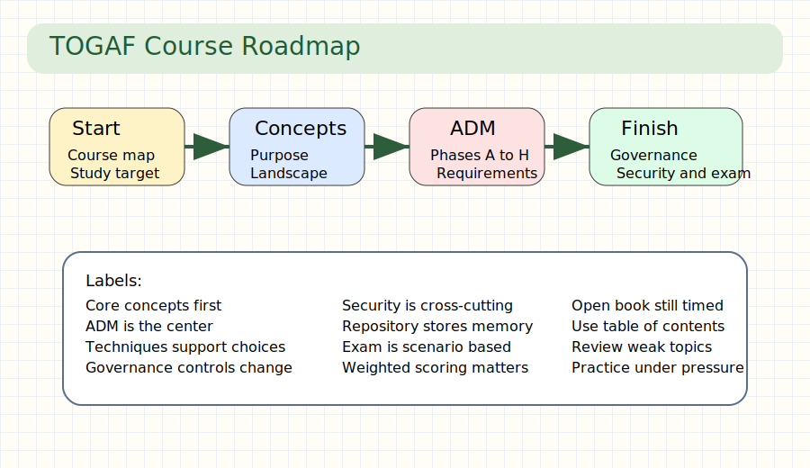

## Real-World Use First
Scenario: You have one week before the exam and need a study order that does not waste time.
Why it matters: A course roadmap lets you review the highest-yield topics first and revisit weak spots with purpose.

## Process Flow / Steps
1. Learn the course structure and exam target.
2. Understand core EA concepts.
3. Master the ADM phases and their outputs.
4. Add techniques, governance, security, and exam tactics.

## Key Concepts
- **Practitioner exam**: the TOGAF Part 2 exam focused on analysis and application.
- **Course structure**: the ordered path from concepts to implementation and exam prep.

## Quick Facts
Q: What is the course trying to achieve?  A: Prepare you for TOGAF Enterprise Architecture Part 2.
Q: What is the main study sequence?  A: Concepts first, then ADM, then governance, security, and exam prep.

## Try This Right Now
- Write the six main study blocks on one sticky note.
- Mark which block already feels familiar and which feels risky.

## Common Mistakes
- Starting with detailed phases before learning the whole map.
- Studying topics in isolation instead of as one architecture story.

## Flashcards
| Q | A |
|---|---|
| Main goal of the course? | Pass TOGAF Practitioner by applying the standard. |
| Best first move? | Learn the roadmap before the details. |

## Spaced Repetition
- Day 1: Recite the six major study blocks from memory.
- Day 3: Explain why ADM is the center of the course.
- Day 7: Map one weak topic to its course section.
- Day 14: Rebuild the full study flow on paper.
- Day 30: Use the roadmap to plan a mock revision day.

## One-Page Revision
- The course is a study path, not a pile of lectures.
- Core concepts make the ADM easier.
- Governance and security appear after the main method.
- Exam prep is a final skill layer, not the first step.

## Checkpoint
- [ ] I can describe the course flow in one sentence.

## 30-Day Memory Bullets
- Practitioner means applied TOGAF, not recall only.
- The course starts broad and then narrows.
- ADM is the heart of the learning path.
- Governance matters after design starts.
- Security is integrated, not separate.
- Exam tactics come last on purpose.
- A roadmap reduces study overload.
- Sequence improves memory.

--

-- Page 2: Certification Program and Exam Rules

## Header
Time: ~4 min | Video 2 | Difficulty: Easy

## What You'll Learn
What the Part 2 exam looks like, how scoring works, and why open-book does not make it easy.

## Core Idea (60 sec)
- The exam is scenario-based single choice with weighted scoring, so answer quality matters more than speed alone.
- Example: the best answer gives 5 points, the second best gives 3, and a distractor gives 0.

## Visual Summary
Scenario -> Compare 4 answers -> Pick best TOGAF-aligned option -> Earn weighted points

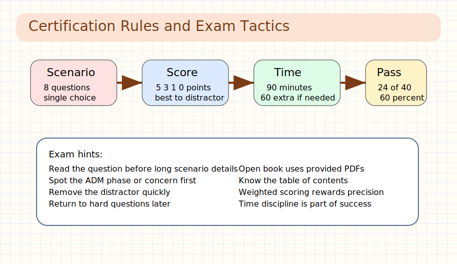

## Real-World Use First
Scenario: You open a long scenario question and need to decide whether to answer now or return later.
Why it matters: Time and scoring strategy are part of passing, not just content knowledge.

## Process Flow / Steps
1. Read the scenario and the actual question.
2. Spot the ADM phase, stakeholder concern, or technique.
3. Remove the distractor and weak options.
4. Choose the most TOGAF-consistent answer.

## Key Concepts
- **Open book**: the exam provides approved reference PDFs electronically.
- **Weighted scoring**: answers can be best, second best, third best, or distractor.

## Quick Facts
Q: How many questions are in Part 2?  A: Eight scenario-based questions.
Q: What is the pass mark?  A: 24 out of 40 points.

## Try This Right Now
- Write `8 questions / 90 minutes / 24 points` from memory.
- Decide your personal skip-and-return rule for hard questions.

## Common Mistakes
- Assuming open-book means no preparation is needed.
- Spending too long searching the reference PDFs for every answer.

## Flashcards
| Q | A |
|---|---|
| Format of Part 2? | Scenario-based single choice with weighted answers. |
| Why practice under time? | Because lookup time can drain the whole exam. |

## Spaced Repetition
- Day 1: Recall the scoring model.
- Day 3: Recall the pass mark and question count.
- Day 7: Practice one scenario under time.
- Day 14: Explain why open-book can still be hard.
- Day 30: Run a full 90-minute mock block.

## One-Page Revision
- Eight questions decide the result.
- Best answer matters more than merely acceptable answer.
- Open-book helps only if you know where to look.
- Time management is part of exam skill.

## Checkpoint
- [ ] I can explain the scoring and pass rule without notes.

## 30-Day Memory Bullets
- Part 2 tests analysis and application.
- There are eight scenario questions.
- Best answer earns 5 points.
- Pass mark is 24 of 40.
- Open-book uses provided PDFs.
- Reference familiarity saves time.
- Weighted scoring rewards precision.
- Time pressure changes strategy.

--

-- Page 3: Enterprise Architecture Purpose

## Header
Time: ~4 min | Video 3 | Difficulty: Easy

## What You'll Learn
Why enterprise architecture exists and how it guides change toward business value.

## Core Idea (60 sec)
- Enterprise architecture compares the current state with a future state and highlights the change needed to close the gap.
- Example: if a company wants faster service delivery, EA defines what must change in process, data, apps, and technology.

## Visual Summary
Baseline State -> Gap -> Target State -> Directed Change -> Better Business Value

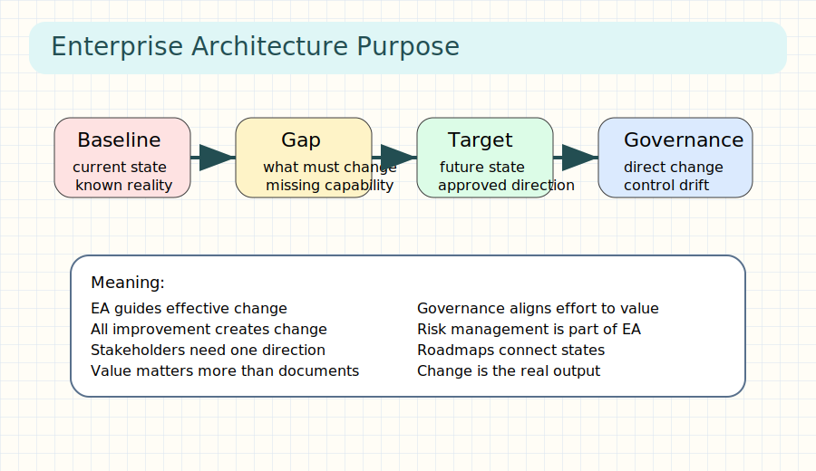

## Real-World Use First
Scenario: A company wants better efficiency but has too many disconnected change projects.
Why it matters: EA gives one direction so teams improve the same enterprise instead of working at cross purposes.

## Process Flow / Steps
1. Describe the current enterprise state.
2. Define the desired future state.
3. Identify the gap between them.
4. Govern change to stay on the best path.

## Key Concepts
- **Baseline architecture**: the current reference state.
- **Target architecture**: the approved future state.

## Quick Facts
Q: What does EA guide?  A: Effective change.
Q: Why is governance attached to EA?  A: Change needs direction and control.

## Try This Right Now
- Pick one problem at work and write its baseline, target, and gap in one line each.
- Ask which stakeholders would approve the change path.

## Common Mistakes
- Treating architecture as documentation only.
- Jumping to tools before defining the target state.

## Flashcards
| Q | A |
|---|---|
| Core purpose of EA? | Guide effective change to improve the enterprise. |
| What reveals the work ahead? | The gap between baseline and target. |

## Spaced Repetition
- Day 1: Recite baseline, target, and gap.
- Day 3: Explain why governance is part of architecture.
- Day 7: Apply the idea to a real business problem.
- Day 14: Explain EA in plain language to someone else.
- Day 30: Review one example of value-driven change.

## One-Page Revision
- EA is about change, not static diagrams.
- Baseline and target define direction.
- Gaps reveal what must change.
- Governance keeps change aligned to value.

## Checkpoint
- [ ] I can describe EA as a business change tool.

## 30-Day Memory Bullets
- EA starts with business improvement.
- Baseline is current truth.
- Target is approved future.
- Gaps drive work.
- Governance directs change.
- Governance also controls drift.
- Value is the real goal.
- Change without architecture wastes effort.

--

-- Page 4: Landscape, Levels, and Continuum

## Header
Time: ~5 min | Video 4 | Difficulty: Medium

## What You'll Learn
How TOGAF organizes a large architecture landscape so complexity stays manageable.

## Core Idea (60 sec)
- TOGAF uses architecture levels and the architecture continuum to organize many connected architectures.
- Example: a strategic architecture sets direction, while segment and capability architectures add detail closer to execution.

## Visual Summary
Strategic -> Segment -> Capability
Generic -> Industry -> Organization Specific

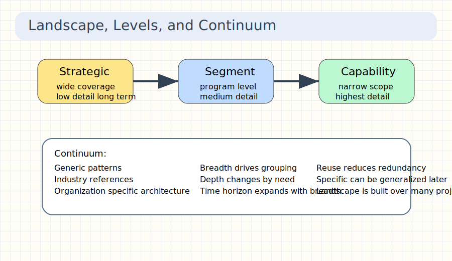

## Real-World Use First
Scenario: A large enterprise has many programs and cannot manage every design at one level of detail.
Why it matters: Levels and continuum prevent one giant, unusable architecture model.

## Process Flow / Steps
1. Group architectures by breadth and detail.
2. Use strategic architecture for executive direction.
3. Use segment architecture for portfolio-level planning.
4. Use capability architecture for detailed change increments.

## Key Concepts
- **Strategic architecture**: broad, low-detail, long-horizon architecture.
- **Architecture continuum**: the range from generic architecture to enterprise-specific architecture.

## Quick Facts
Q: Which level is most detailed?  A: Capability architecture.
Q: What does the continuum classify?  A: Degree of abstraction from generic to specific.

## Try This Right Now
- Take one architecture topic you know and label it strategic, segment, or capability.
- Identify whether its patterns are generic or enterprise-specific.

## Common Mistakes
- Treating all architecture work as the same granularity.
- Ignoring reusable generic material from outside the enterprise.

## Flashcards
| Q | A |
|---|---|
| Three architecture levels? | Strategic, segment, capability. |
| Why use continuum? | To classify architectures from generic to specific. |

## Spaced Repetition
- Day 1: Recall the three levels.
- Day 3: Explain the difference between level and continuum.
- Day 7: Give one real example per level.
- Day 14: Draw the generic-to-specific spectrum.
- Day 30: Explain how reuse fits the continuum.

## One-Page Revision
- Levels manage granularity.
- Continuum manages abstraction.
- Strategic is broad and long-term.
- Capability is narrow and detailed.

## Checkpoint
- [ ] I can tell level and continuum apart quickly.

## 30-Day Memory Bullets
- Landscape is a set of related architectures.
- Strategic covers the broadest scope.
- Segment supports programs and portfolios.
- Capability is the most detailed level.
- Breadth and depth both matter.
- Continuum runs from generic to specific.
- Reuse reduces unnecessary invention.
- Classification improves navigation.

--

-- Page 5: Architecture States and the Digital Enterprise

## Header
Time: ~5 min | Video 5 | Difficulty: Medium

## What You'll Learn
How TOGAF describes architecture over time and how the digital enterprise contexts shape modern EA thinking.

## Core Idea (60 sec)
- Architecture states show where the enterprise is now, where it wants to go, and which transition steps create value on the way.
- Example: a baseline becomes a target through transition architectures, while digital-enterprise context changes how complex the environment is.

## Visual Summary
Baseline -> Candidate -> Target
Baseline -> Transition 1 -> Transition 2 -> Target
Founder -> Team -> Teams of Teams -> Enduring Enterprise

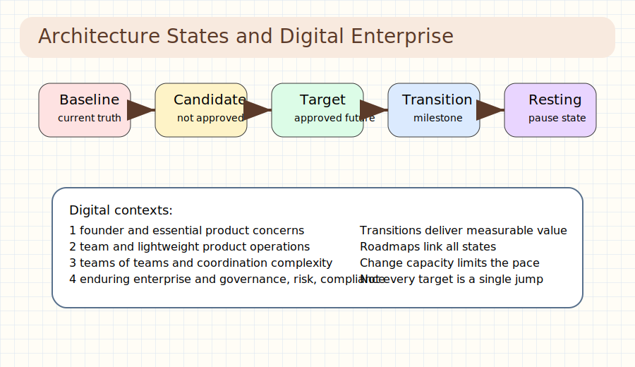

## Real-World Use First
Scenario: Your enterprise cannot jump straight to the target because risk, budget, and change capacity are limited.
Why it matters: Transition architectures turn big strategy into milestones, and digital context tells you how much coordination is needed.

## Process Flow / Steps
1. Confirm the baseline state.
2. Approve the target or keep it as candidate.
3. Insert transition architectures if value must arrive incrementally.
4. Assess the digital-enterprise context to match complexity.

## Key Concepts
- **Transition architecture**: an intermediate state that provides measurable business value.
- **Digital enterprise contexts**: founder, team, teams of teams, and enduring enterprise.

## Quick Facts
Q: Is there always a baseline architecture?  A: Yes.
Q: Which digital context emphasizes governance and compliance most?  A: The enduring enterprise.

## Try This Right Now
- List one example where a transition state is safer than a big-bang target.
- Decide which digital-enterprise context best matches your organization today.

## Common Mistakes
- Treating candidate and target architecture as the same thing.
- Ignoring enterprise change capacity when planning transitions.

## Flashcards
| Q | A |
|---|---|
| What sits between baseline and target? | One or more transition architectures. |
| Four digital contexts? | Founder, team, teams of teams, enduring enterprise. |

## Spaced Repetition
- Day 1: Recall the architecture states.
- Day 3: Explain why transition states matter.
- Day 7: Match a company to one digital context.
- Day 14: Draw a simple milestone roadmap.
- Day 30: Explain state planning in one real transformation.

## One-Page Revision
- Baseline is always present.
- Candidate is not yet approved.
- Transition states deliver value on the path.
- Digital context changes governance needs.

## Checkpoint
- [ ] I can explain architecture states and digital contexts together.

## 30-Day Memory Bullets
- Baseline is the change anchor.
- Target is approved future state.
- Candidate lacks approval.
- Transition states are milestones.
- Resting architecture is an unplanned pause state.
- Digital context 1 is founder.
- Digital context 4 is enduring enterprise.
- Complexity grows with context.

--

-- Page 6: Preliminary Phase and Architecture Capability

## Header
Time: ~4 min | Video 6 | Difficulty: Medium

## What You'll Learn
What the preliminary phase sets up before the ADM starts and why capability comes before heavy architecture work.

## Core Idea (60 sec)
- The preliminary phase establishes how the enterprise will do architecture, not the target architecture itself.
- Example: principles, governance, roles, tools, and framework tailoring are set before deeper phases begin.

## Visual Summary
Define Enterprise -> Set Principles -> Set Governance -> Set Team -> Set Tools -> Enable ADM

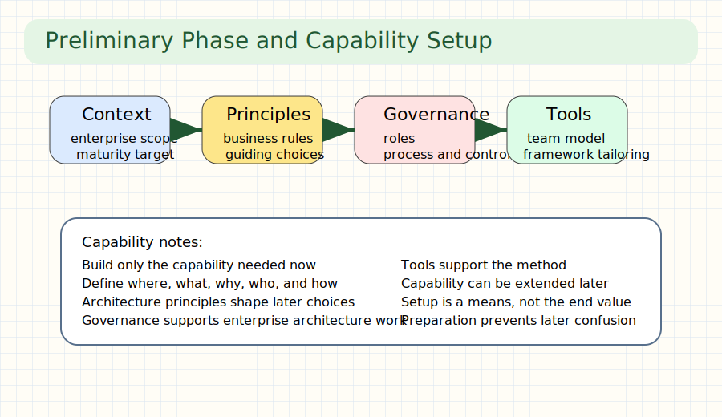

## Real-World Use First
Scenario: A team starts architecture work without agreed principles or governance and keeps arguing about method.
Why it matters: The preliminary phase prevents process confusion before design effort begins.

## Process Flow / Steps
1. Review organizational context.
2. Define the architecture capability needed.
3. Establish governance process and resources.
4. Tailor frameworks, principles, and tools.

## Key Concepts
- **Architecture capability**: the enterprise ability to perform architecture work well.
- **Architecture principles**: rules and guidelines that shape architecture choices.

## Quick Facts
Q: Is preliminary phase part of the formal practitioner curriculum?  A: Not mainly, but it still matters for context.
Q: What is the warning here?  A: Build only the capability you need for the architecture at hand.

## Try This Right Now
- Write three principles you would want before any architecture project starts.
- Identify one governance step your team currently lacks.

## Common Mistakes
- Building a large capability before there is any real architecture demand.
- Forgetting to tailor the framework to the enterprise.

## Flashcards
| Q | A |
|---|---|
| Main output of preliminary phase? | An established architecture capability. |
| Why tailor the framework? | Because each enterprise has its own context and constraints. |

## Spaced Repetition
- Day 1: Recall the purpose of preliminary phase.
- Day 3: List the main setup elements.
- Day 7: Explain why principles matter early.
- Day 14: Relate capability to governance.
- Day 30: Review one example capability gap.

## One-Page Revision
- Preliminary is setup work.
- Capability comes before large-scale architecture effort.
- Principles and governance reduce confusion.
- Tailoring makes TOGAF practical.

## Checkpoint
- [ ] I can explain what the preliminary phase prepares.

## 30-Day Memory Bullets
- Capability includes people, process, and tools.
- Governance belongs in setup.
- Principles guide later design choices.
- Tailoring is required.
- Scope the enterprise early.
- Maturity matters.
- Do not overbuild capability.
- Setup supports later speed.

--

-- Page 7: Phase A Architecture Vision

## Header
Time: ~5 min | Video 7 | Difficulty: Medium

## What You'll Learn
How Phase A starts the architecture project, defines scope, and creates agreement around the vision.

## Core Idea (60 sec)
- Phase A builds a shared summary of the problem, target, and work required before deep design starts.
- Example: the statement of architecture work acts like a contract between sponsor and architecture team.

## Visual Summary
Request for Architecture Work -> Scope -> Stakeholders -> Vision -> Statement of Architecture Work

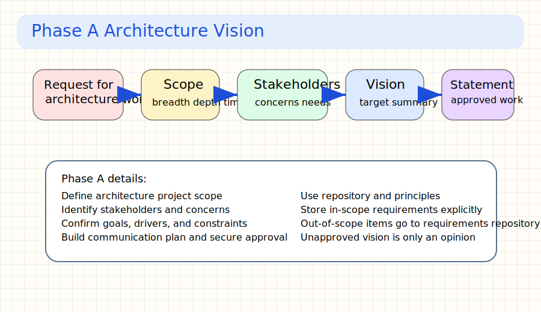

## Real-World Use First
Scenario: A sponsor wants architecture help, but the team has not yet agreed on scope or target outcome.
Why it matters: Phase A prevents expensive design work on the wrong problem.

## Process Flow / Steps
1. Confirm the request for architecture work.
2. Define scope, domains, breadth, and time horizon.
3. Identify stakeholders, concerns, and requirements.
4. Create the architecture vision and secure approval.

## Key Concepts
- **Statement of Architecture Work**: the approved response to the request for architecture work.
- **Communication plan**: the planned way to deliver architecture information to stakeholders.

## Quick Facts
Q: Where do in-scope requirements go?  A: Into the Architecture Requirements Specification.
Q: What must key stakeholders agree on?  A: The target, scope, value, and effort of change.

## Try This Right Now
- Draft one sentence that defines a target architecture problem.
- List three stakeholder concerns you would need to resolve before proceeding.

## Common Mistakes
- Skipping stakeholder mapping.
- Treating scope as fixed before checking enterprise constraints and priorities.

## Flashcards
| Q | A |
|---|---|
| What starts an ADM cycle? | A request for architecture work. |
| Main deliverable of Phase A? | Statement of Architecture Work containing the architecture vision. |

## Spaced Repetition
- Day 1: Recall the main Phase A flow.
- Day 3: Explain statement of architecture work.
- Day 7: Practice identifying scope dimensions.
- Day 14: Recreate the stakeholder-to-vision logic.
- Day 30: Explain Phase A in a mock scenario.

## One-Page Revision
- Phase A secures agreement before detail.
- Scope covers breadth, depth, domains, and time.
- Stakeholders drive requirements.
- Vision becomes a formal work statement.

## Checkpoint
- [ ] I can explain why Phase A happens before domain architectures.

## 30-Day Memory Bullets
- Start with the request for architecture work.
- Scope must be explicit.
- Stakeholders define concerns.
- Requirements need a home.
- Vision is a summary answer.
- Communication plan supports alignment.
- Approval matters before detail.
- Phase A builds permission to proceed.

--

-- Page 8: Phase B Business Architecture

## Header
Time: ~5 min | Video 8 | Difficulty: Hard

## What You'll Learn
Why business architecture comes before the other domain architectures and which techniques make it concrete.

## Core Idea (60 sec)
- Phase B defines how the business creates value so data, application, and technology can align to it.
- Example: business capabilities, value streams, organization maps, and business models reveal what must change.

## Visual Summary
Business Goals -> Baseline Business Architecture -> Target Business Architecture -> Gap Analysis -> Roadmap Components

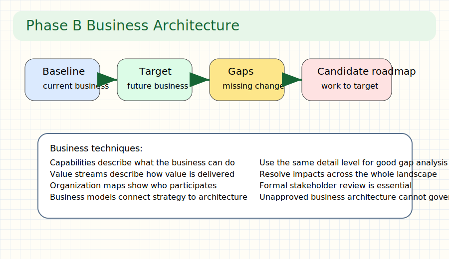

## Real-World Use First
Scenario: A team wants to redesign applications but has not clarified the capabilities and value streams they must support.
Why it matters: Business architecture keeps later technical design tied to real business outcomes.

## Process Flow / Steps
1. Select reference models, viewpoints, and tools.
2. Model the baseline business architecture.
3. Model the target business architecture.
4. Perform gap analysis and candidate roadmap planning.

## Key Concepts
- **Business capability**: an ability the business has or needs to achieve an outcome.
- **Value stream**: the end-to-end flow that creates stakeholder value.

## Quick Facts
Q: Why is Phase B a prerequisite?  A: Other domains should enable the business architecture.
Q: What review is critical here?  A: Formal stakeholder review and approval.

## Try This Right Now
- Name one capability and one value stream from a business you know.
- Ask which organization unit owns or performs them.

## Common Mistakes
- Modeling every process detail before understanding stakeholder value.
- Forgetting to resolve impacts across the wider architecture landscape.

## Flashcards
| Q | A |
|---|---|
| Two common Phase B techniques? | Business capability mapping and value stream analysis. |
| Why do stakeholder reviews matter? | Because unapproved target architectures cannot govern implementation. |

## Spaced Repetition
- Day 1: Recall the baseline-target-gap pattern.
- Day 3: Explain capability versus value stream.
- Day 7: Sketch a simple business capability map.
- Day 14: Relate business architecture to business-IT alignment.
- Day 30: Explain why Phase B comes first.

## One-Page Revision
- Phase B shapes later domains.
- Value streams show how value is delivered.
- Capabilities show what the business must be able to do.
- Approval is required for governance.

## Checkpoint
- [ ] I can explain the role of business architecture in the ADM.

## 30-Day Memory Bullets
- Business architecture is first among the domain phases.
- Use baseline and target with the same detail level.
- Capability maps are stable views.
- Value streams are stakeholder-centered.
- Organization maps are not org charts.
- Business models inform architecture.
- Gap analysis reveals work.
- Approval defines the future path.

--

-- Page 9: Phase C Information Systems Architecture

## Header
Time: ~5 min | Video 9 | Difficulty: Hard

## What You'll Learn
How Phase C develops target data and application architecture to support the agreed business architecture.

## Core Idea (60 sec)
- Phase C has two parts, data architecture and application architecture, and both exist to enable the business architecture.
- Example: data principles guide shared data, while application views show which systems support which services.

## Visual Summary
Business Architecture -> Data Architecture + Application Architecture -> Support Target Vision

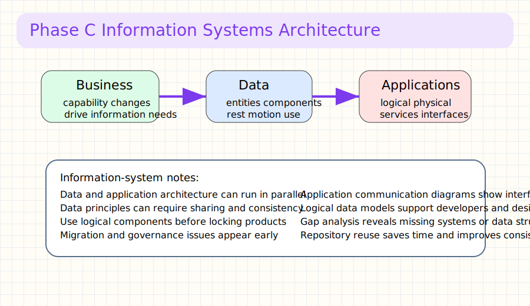

## Real-World Use First
Scenario: You know the business capability changes required, but you still need to define which data and applications must exist.
Why it matters: Phase C turns business intent into information-system structure.

## Process Flow / Steps
1. Reuse relevant repository inputs and principles.
2. Model target data entities and components.
3. Model logical and physical application components.
4. Run gap analysis and identify missing systems or data changes.

## Key Concepts
- **Data architecture**: the structure of enterprise data at rest, in motion, in use, and as open data.
- **Application architecture**: the logical and physical application components and their relationships.

## Quick Facts
Q: Can data and application architecture be developed in parallel?  A: Yes.
Q: What is a common data principle example?  A: Data should be shared across enterprise functions when appropriate.

## Try This Right Now
- Pick one business capability and list the data it depends on.
- Name one application that would logically support that capability.

## Common Mistakes
- Jumping to physical products before clarifying logical components.
- Ignoring data governance and migration considerations.

## Flashcards
| Q | A |
|---|---|
| Two halves of Phase C? | Data architecture and application architecture. |
| Why start with logical components? | They describe function without locking into one implementation too early. |

## Spaced Repetition
- Day 1: Recall the two halves of Phase C.
- Day 3: Explain data at rest, in motion, and in use.
- Day 7: Sketch one logical application communication idea.
- Day 14: Map one data entity to one business function.
- Day 30: Explain how Phase C enables the business architecture.

## One-Page Revision
- Phase C supports business architecture.
- Data and application can run in parallel.
- Logical views come before heavy implementation detail.
- Gap analysis still drives change planning.

## Checkpoint
- [ ] I can distinguish data architecture from application architecture.

## 30-Day Memory Bullets
- Phase C splits into data and application.
- Shared data principles matter.
- Use data entities and components.
- Application catalogs help structure the landscape.
- Communication diagrams show interfaces.
- Keep models only as detailed as needed.
- Repository reuse saves time.
- Phase C still follows baseline-target-gap logic.

--

-- Page 10: Phase D Technology Architecture

## Header
Time: ~4 min | Video 10 | Difficulty: Medium

## What You'll Learn
How technology architecture supports the other domains and why it can also drive business change.

## Core Idea (60 sec)
- Technology architecture is not just a passive responder; emerging technology can also become a change driver.
- Example: a new platform capability can open a better business operating model instead of merely implementing an old one.

## Visual Summary
Business + Data + Application Needs -> Technology Building Blocks
New Technology -> New Business Opportunity

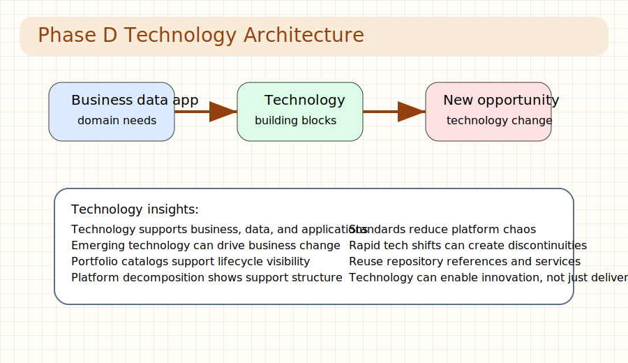

## Real-World Use First
Scenario: A cloud platform or automation tool creates a new option the business had not considered before.
Why it matters: Technology architecture should both support existing needs and reveal new possibilities.

## Process Flow / Steps
1. Reuse standards, services, and repository material.
2. Define the target technology building blocks.
3. Anticipate technology-driven change.
4. Assess impacts and lifecycle implications.

## Key Concepts
- **Technology portfolio catalog**: a structured list of technology components in use.
- **Platform decomposition diagram**: a view that breaks a technology platform into supporting components.

## Quick Facts
Q: Which domains does technology architecture support directly?  A: Business, data, and application architecture.
Q: What extra warning appears here?  A: Fast-changing technology can create discontinuities across the enterprise.

## Try This Right Now
- Pick one application and list the technology platform pieces it relies on.
- Ask whether any new technology could reduce risk or create value.

## Common Mistakes
- Treating technology as a pure implementation afterthought.
- Ignoring lifecycle and standardization concerns.

## Flashcards
| Q | A |
|---|---|
| Can Phase D drive change? | Yes, emerging technologies can create new opportunities. |
| Common Phase D artifact? | Technology portfolio catalog. |

## Spaced Repetition
- Day 1: Recall the main purpose of Phase D.
- Day 3: Explain why tech can be both driver and enabler.
- Day 7: Draw a simple platform decomposition.
- Day 14: Connect one business need to one technology service.
- Day 30: Review one example of technology-led change.

## One-Page Revision
- Technology supports the earlier domains.
- It can also create new business options.
- Standards and lifecycle matter.
- Repository reuse still applies.

## Checkpoint
- [ ] I can explain how technology architecture differs from application architecture.

## 30-Day Memory Bullets
- Phase D defines technology building blocks.
- Technology can be a change driver.
- Repository reuse matters here too.
- Technology standards reduce chaos.
- Platform decomposition explains support structure.
- Environment views can show location usage.
- Change impacts must be assessed.
- Phase D still aligns to business value.

--

-- Page 11: Phases E and F Delivery and Migration

## Header
Time: ~5 min | Video 11 | Difficulty: Hard

## What You'll Learn
How TOGAF moves from target architecture to delivery planning through work packages, transition architectures, and migration logic.

## Core Idea (60 sec)
- Phase E identifies what must be delivered, while Phase F finalizes how and when it will be delivered.
- Example: work packages group change, transition architectures stage value, and migration planning turns them into coordinated projects.

## Visual Summary
Gaps -> Solutions -> Work Packages -> Transition Architectures -> Roadmap -> Implementation and Migration Plan

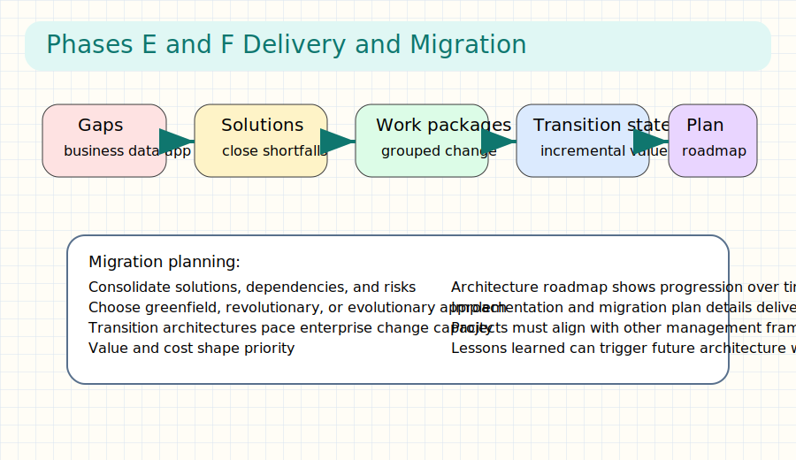

## Real-World Use First
Scenario: You know the target architecture, but you still must sequence projects, estimate value, and respect change capacity.
Why it matters: Good design without migration planning rarely reaches production safely.

## Process Flow / Steps
1. Consolidate gaps, solutions, dependencies, and risks.
2. Group changes into major work packages.
3. Define transition architectures if value must arrive incrementally.
4. Finalize roadmap, migration plan, and prioritization.

## Key Concepts
- **Work package**: a grouped set of changes that helps realize the target architecture.
- **Implementation and migration plan**: the detailed plan that coordinates delivery over time.

## Quick Facts
Q: What does Phase E initialize?  A: The architecture roadmap and draft implementation and migration plan.
Q: What does Phase F finalize?  A: The implementation and migration plan and approved project sequencing.

## Try This Right Now
- Pick one target architecture and list two work packages needed to reach it.
- Decide whether a greenfield, revolutionary, or evolutionary approach fits better.

## Common Mistakes
- Ignoring dependencies between work packages.
- Treating transition architectures as optional when enterprise change capacity is limited.

## Flashcards
| Q | A |
|---|---|
| What links target architecture to projects? | Work packages, roadmap, and migration planning. |
| Why use transition architectures? | To stage value and reduce risk. |

## Spaced Repetition
- Day 1: Recall the E-to-F flow.
- Day 3: Explain work package versus project.
- Day 7: Compare greenfield and evolutionary approaches.
- Day 14: Practice listing dependencies for a small roadmap.
- Day 30: Rebuild the migration logic from memory.

## One-Page Revision
- Phase E identifies delivery vehicles.
- Phase F sharpens and approves the delivery plan.
- Dependencies and value drive sequencing.
- Transition architectures protect realism.

## Checkpoint
- [ ] I can explain how TOGAF moves from design to delivery planning.

## 30-Day Memory Bullets
- Consolidated gaps matter before planning.
- Work packages group change logically.
- Transition states provide milestones.
- Roadmaps show progression over time.
- Migration plans need coordination with business frameworks.
- Value and risk shape priority.
- Change capacity limits sequencing.
- Approved plans enable implementation.

--

-- Page 12: Phases G and H Governance and Change

## Header
Time: ~5 min | Video 12 | Difficulty: Hard

## What You'll Learn
How TOGAF governs implementation and then manages architecture change after deployment.

## Core Idea (60 sec)
- Phase G watches implementation for compliance, while Phase H keeps the architecture alive as change requests appear.
- Example: an architecture contract guides delivery, and change requests later decide whether to update or restart an ADM cycle.

## Visual Summary
Approved Architecture -> Architecture Contract -> Compliance Reviews -> Deployed Solution -> Change Requests -> New ADM if Needed

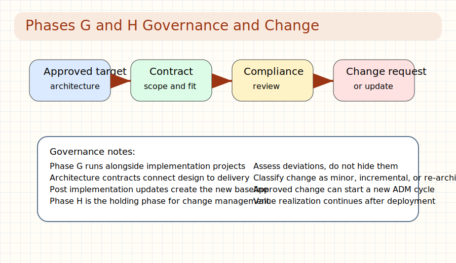

## Real-World Use First
Scenario: An implementation team wants to deviate from the target architecture because of delivery pressure.
Why it matters: Governance keeps changes visible and controlled instead of accidental.

## Process Flow / Steps
1. Confirm scope and priorities for deployment.
2. Guide implementation teams and review compliance.
3. Publish updated baselines after deployment.
4. Assess change requests and trigger new work when needed.

## Key Concepts
- **Architecture contract**: the agreement that links architecture intent to implementation obligations.
- **Change request**: the formal description of a proposed deviation, extension, or update.

## Quick Facts
Q: Which phase runs parallel to implementation projects?  A: Phase G.
Q: Which phase acts as a holding phase after deployment?  A: Phase H.

## Try This Right Now
- Imagine one implementation deviation and write what the change request should describe.
- Decide whether the change is minor maintenance, incremental, or full re-architecting.

## Common Mistakes
- Assuming implementation teams can change architecture silently.
- Forgetting to update the new baseline after deployment.

## Flashcards
| Q | A |
|---|---|
| Main aim of Phase G? | Ensure implementation complies with the architecture. |
| Main aim of Phase H? | Manage architecture change and decide when to restart the ADM. |

## Spaced Repetition
- Day 1: Recall what Phase G governs.
- Day 3: Recall what Phase H manages.
- Day 7: Explain the role of the architecture contract.
- Day 14: Practice classifying one change request.
- Day 30: Explain how a new ADM cycle can begin from Phase H.

## One-Page Revision
- Governance is active during implementation.
- Contracts and compliance reviews enforce direction.
- Change requests keep deviations visible.
- Phase H decides whether change is small or cycle-restarting.

## Checkpoint
- [ ] I can explain how TOGAF governs delivery and later change.

## 30-Day Memory Bullets
- Phase G runs with implementation.
- Architecture contracts guide delivery.
- Compliance reviews test conformance.
- Baselines must be updated after deployment.
- Phase H manages change after delivery.
- Change requests need rationale and impact.
- Some changes are maintenance only.
- Bigger changes restart architecture work.

--

-- Page 13: Requirements, Iteration, and Core Techniques

## Header
Time: ~5 min | Video 13 | Difficulty: Hard

## What You'll Learn
How requirements management stays at the center of the ADM and which supporting techniques appear repeatedly in practitioner scenarios.

## Core Idea (60 sec)
- Requirements management continuously feeds every ADM phase, while iteration and techniques like business scenarios, gap analysis, and trade-offs help refine choices.
- Example: new requirements can trigger another pass through one phase, several phases, or a new cycle.

## Visual Summary
Requirements -> ADM Phases -> New Facts -> Impact Assessment -> Iteration -> Refined Architecture

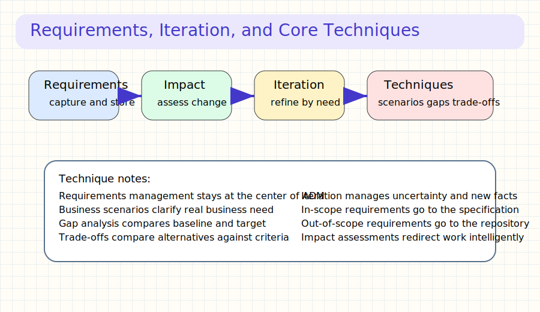

## Real-World Use First
Scenario: During design, a new stakeholder concern appears and changes the target architecture.
Why it matters: You need a controlled way to record, assess, prioritize, and route that requirement.

## Process Flow / Steps
1. Capture requirements in or beyond current scope.
2. Consolidate and baseline them.
3. Assess impact when requirements change.
4. Use business scenarios, gap analysis, and trade-offs to refine the response.

## Key Concepts
- **Requirements Management**: the ongoing process that keeps architecture requirements available and controlled.
- **Architecture trade-off**: a structured comparison of alternatives against criteria and stakeholder preferences.

## Quick Facts
Q: Which phase sits in the middle of the ADM?  A: Requirements Management.
Q: Why iterate?  A: Because architecture development is continuous and information arrives over time.

## Try This Right Now
- Write one requirement and decide whether it is in scope or should go to the repository.
- Compare two architecture alternatives using three criteria.

## Common Mistakes
- Treating requirements as a one-time input.
- Making trade-off decisions without agreed criteria or stakeholder context.

## Flashcards
| Q | A |
|---|---|
| What keeps the ADM fed with current needs? | Requirements Management. |
| What technique compares competing options? | Architecture trade-off. |

## Spaced Repetition
- Day 1: Recall the role of requirements management.
- Day 3: Explain when iteration is useful.
- Day 7: Practice one tiny business scenario.
- Day 14: Explain the two kinds of gaps.
- Day 30: Rebuild the requirement impact flow.

## One-Page Revision
- Requirements stay active through the whole ADM.
- Iteration is normal, not failure.
- Business scenarios clarify real need.
- Trade-offs compare alternatives against value and risk.

## Checkpoint
- [ ] I can explain how requirements and iteration interact.

## 30-Day Memory Bullets
- Requirements management is continuous.
- Requirements can be in-scope or repository-held.
- Impact assessments guide rework.
- Iteration manages uncertainty.
- Business scenarios clarify business need.
- Gap analysis compares baseline and target.
- Trade-offs need criteria.
- Stakeholder preferences shape choices.

--

-- Page 14: Repository, Governance, Security, and Exam Prep

## Header
Time: ~5 min | Video 14 | Difficulty: Hard

## What You'll Learn
How repository content, governance controls, security additions, and exam tactics fit together in the practitioner mindset.

## Core Idea (60 sec)
- A strong practitioner uses the architecture repository as working memory, governance as control, security as a cross-cutting concern, and exam tactics as the final execution skill.
- Example: repository views support compliance reviews, security concerns cut across all domains, and exam answers should follow TOGAF spirit under time pressure.

## Visual Summary
Repository -> Views and Standards -> Governance and Contracts -> Security Across Domains -> Exam Tactics

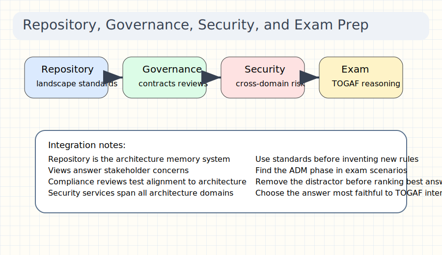

## Real-World Use First
Scenario: You must answer a scenario question about stakeholder concerns, repository reuse, compliance, and security in one decision.
Why it matters: Practitioner success comes from connecting concepts instead of memorizing them separately.

## Process Flow / Steps
1. Reuse architecture landscape, standards, and requirements repositories.
2. Govern with compliance reviews and contracts.
3. Add security concerns across phases and domains.
4. Answer exam scenarios by aligning to TOGAF terms and intent.

## Key Concepts
- **Architecture repository**: the structured store for landscapes, standards, governance data, requirements, and solution information.
- **Enterprise security architecture**: the cross-cutting structure that manages security and risk across the enterprise.

## Quick Facts
Q: What should you do first when you need existing architecture information?  A: Check the repository.
Q: What is one strong exam tactic?  A: Identify the ADM phase and remove the distractor first.

## Try This Right Now
- Name three repository parts you would search before creating new architecture content.
- Practice one answer elimination rule for scenario questions.

## Common Mistakes
- Ignoring repository reuse and reinventing everything.
- Treating security as a separate silo instead of a cross-domain concern.

## Flashcards
| Q | A |
|---|---|
| Two exam tactics that save time? | Spot the ADM phase and remove the distractor. |
| Why does the repository matter? | It preserves integrity and reduces duplicate architecture work. |

## Spaced Repetition
- Day 1: Recall the main repository parts.
- Day 3: Explain why security is cross-cutting.
- Day 7: Practice one compliance-related scenario.
- Day 14: Run one timed question set.
- Day 30: Explain the practitioner mindset in one minute.

## One-Page Revision
- Repository is the single architecture memory system.
- Governance controls compliance and change.
- Security runs through every domain and phase.
- Exam success depends on TOGAF-aligned reasoning under time pressure.

## Checkpoint
- [ ] I can connect repository, governance, security, and exam strategy in one explanation.

## 30-Day Memory Bullets
- Start with the repository.
- Standards support governance.
- Compliance reviews test architecture fit.
- Contracts guide implementation.
- Security is cross-cutting.
- Risk and value stay connected.
- TOGAF terms matter in exam answers.
- Remove distractors quickly.