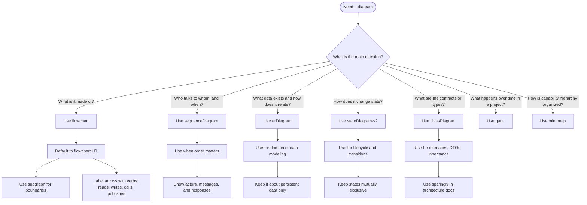

# Mermaid Visual Decision Guide

Use this guide when choosing a Mermaid diagram for architecture, application, and data documentation.

## Default rule

- **`flowchart`** = structure, components, capabilities, data flows, interfaces
- **`sequenceDiagram`** = runtime interactions, API calls, event flow
- **`erDiagram`** = data model, tables, entity relationships
- **`stateDiagram-v2`** = lifecycle, workflow states, transitions
- **`classDiagram`** = contracts, DTOs, interfaces, type relationships
- **`gantt`** = rollout plans, migrations, delivery timelines

## Quick chooser

| If you need to show... | Use this Mermaid diagram | Best for |
|---|---|---|
| System structure, boundaries, capabilities | `flowchart` | architecture context, components, app layout |
| Who talks to whom, and in what order | `sequenceDiagram` | APIs, sync/async calls, event choreography |
| Data entities and relationships | `erDiagram` | domain model, database design |
| State changes over time | `stateDiagram-v2` | approval flows, session state, order lifecycle |
| API/interface/type structure | `classDiagram` | services, contracts, DTOs |
| Project phases or migration steps | `gantt` | delivery plans, cutovers |
| Hierarchy of ideas or capabilities | `mindmap` | capability maps, topic breakdowns |

## Decision tree

## Practical architecture guidance

- Use **one diagram per question**.
- Prefer **`flowchart LR`** as the default backbone for architecture docs.
- Add `sequenceDiagram` only when timing or ordering matters.
- Keep labels verb-focused: `calls`, `reads`, `writes`, `publishes`, `authenticates`.
- Use `subgraph` to show trust boundaries, domains, or deployment zones.
- Avoid mixing data model and runtime flow in the same diagram.

